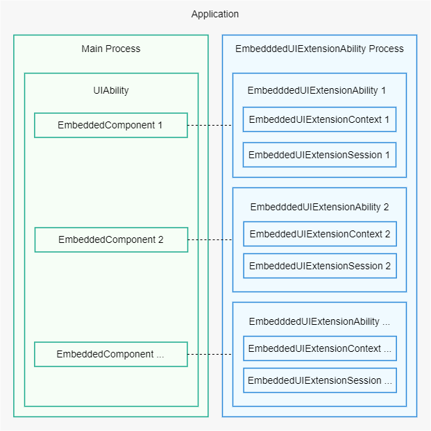

# EmbeddedUIExtensionAbility

## Overview

[EmbeddedUIExtensionAbility](../reference/apis-ability-kit/js-apis-app-ability-embeddedUIExtensionAbility.md) is an [ExtensionAbility](../reference/apis-ability-kit/js-apis-app-ability-extensionAbility.md) component of the EMBEDDED_UI type. It provides the capability of embedded UIs across processes.

The EmbeddedUIExtensionAbility must be used together with the [EmbeddedComponent](../reference/apis-arkui/arkui-ts/ts-container-embedded-component.md). Specifically, with the EmbeddedComponent, you can embed the UI provided by the EmbeddedUIExtensionAbility into a [UIAbility](../reference/apis-ability-kit/js-apis-app-ability-uiAbility.md) of the same application. The EmbeddedUIExtensionAbility runs in a separate process, handling the layout and rendering of its pages independently. It does not share data with the UIAbility, making it suitable for modular development scenarios where process isolation is required.

In the example below, the UIAbility runs in the main process and contains multiple EmbeddedComponents. Each EmbeddedComponent corresponds to an EmbeddedUIExtensionAbility. Multiple EmbeddedUIExtensionAbilities can be used to implement different modules in an office suite, such as documents, spreadsheets, and presentations.

**Figure 1** Diagram of EmbeddedUIExtensionAbility



## Constraints

The EmbeddedUIExtensionAbility and EmbeddedComponent are only supported on devices with multi-process configurations, such as 2-in-1 devices and tablets.

## Lifecycle

The [EmbeddedUIExtensionAbility](../reference/apis-ability-kit/js-apis-app-ability-embeddedUIExtensionAbility.md) class provides the **onCreate**, **onSessionCreate**, **onSessionDestroy**, **onForeground**, **onBackground**, and **onDestroy** lifecycle callbacks. You must override them as required. The following lifecycle callbacks inherit from [UIExtensionAbility](../reference/apis-ability-kit/js-apis-app-ability-uiExtensionAbility.md).

- **onCreate**: called to initialize the service logic when an EmbeddedUIExtensionAbility is created.
- **onSessionCreate**: called when a **UIExtensionContentSession** instance is created for the EmbeddedUIExtensionAbility.
- **onSessionDestroy**: called when a **UIExtensionContentSession** instance is destroyed for the EmbeddedUIExtensionAbility.
- **onForeground**: called when the EmbeddedUIExtensionAbility is switched from the background to the foreground.
- **onBackground**: called when the EmbeddedUIExtensionAbility is switched from the foreground to the background.
- **onDestroy**: called to clear resources when the EmbeddedUIExtensionAbility is destroyed.

> **NOTE**
>
> The **EmbeddedComponent** can be used only in the UIAbility, and the EmbeddedUIExtensionAbility to start must belong to the same application as the UIAbility.
> 
> <!--Del-->The EmbeddedUIExtensionAbility supports the multiton pattern and inherits the process model of the UIExtensionAbility. For details about the multiton pattern and process configuration of the UIExtensionAbility, see [UIExtensionAbility](uiextensionability.md).<!--DelEnd-->

The EmbeddedUIExtensionAbility provides related capabilities through the [UIExtensionContext](../reference/apis-ability-kit/js-apis-inner-application-uiExtensionContext.md) and [UIExtensionContentSession](../reference/apis-ability-kit/js-apis-app-ability-uiExtensionContentSession.md). In this document, the started EmbeddedUIExtensionAbility is called the provider, and the EmbeddedComponent that starts the EmbeddedUIExtensionAbility is called the client.

## Developing the EmbeddedUIExtensionAbility Provider

To implement a provider, create an [EmbeddedUIExtensionAbility](../reference/apis-ability-kit/js-apis-app-ability-embeddedUIExtensionAbility.md) in DevEco Studio as follows:

1. In the **ets** directory of a module in the project, right-click and choose **New > Directory** to create a directory named **EmbeddedUIExtAbility**.

2. Right-click the **EmbeddedUIExtAbility** directory, and choose **New > File** to create a file named **EmbeddedUIExtAbility.ets**.

3. Open the **EmbeddedUIExtAbility.ets** file and import its dependencies. Customize a class that inherits from **EmbeddedUIExtensionAbility** and implement the lifecycle callbacks **onCreate**, **onSessionCreate**, and **onSessionDestroy**, **onForeground**, **onBackground**, and **onDestroy**.

    ```ts
    import { EmbeddedUIExtensionAbility, UIExtensionContentSession, Want } from '@kit.AbilityKit';

    const TAG: string = '[ExampleEmbeddedAbility]';

    export default class ExampleEmbeddedAbility extends EmbeddedUIExtensionAbility {
      onCreate() {
        console.log(TAG, `onCreate`);
      }

      onForeground() {
        console.log(TAG, `onForeground`);
      }

      onBackground() {
        console.log(TAG, `onBackground`);
      }

      onDestroy() {
        console.log(TAG, `onDestroy`);
      }

      onSessionCreate(want: Want, session: UIExtensionContentSession) {
        console.log(TAG, `onSessionCreate, want: ${JSON.stringify(want)}`);
        let param: Record<string, UIExtensionContentSession> = {
          'session': session
        };
        let storage: LocalStorage = new LocalStorage(param);
        session.loadContent('pages/extension', storage);
      }

      onSessionDestroy(session: UIExtensionContentSession) {
        console.log(TAG, `onSessionDestroy`);
      }
    }
    ```

4. Write the entry page file **pages/extension.ets**, which will be loaded in **onSessionCreate** of the EmbeddedUIExtensionAbility.

    ```ts
    import { UIExtensionContentSession } from '@kit.AbilityKit';

    @Entry()
    @Component
    struct Extension {
      @State message: string = 'EmbeddedUIExtensionAbility Index';
      localStorage: LocalStorage | undefined = this.getUIContext().getSharedLocalStorage();
      private session: UIExtensionContentSession | undefined = this.localStorage?.get<UIExtensionContentSession>('session');

      build() {
        Column() {
          Text(this.message)
            .fontSize(20)
            .fontWeight(FontWeight.Bold)
          Button('terminateSelfWithResult').fontSize(20).onClick(() => {
            this.session?.terminateSelfWithResult({
              resultCode: 1,
              want: {
                bundleName: 'com.example.embeddeddemo',
                abilityName: 'ExampleEmbeddedAbility'
              }});
          })
        }.width('100%').height('100%')
      }
    }
    ```

5. Register the EmbeddedUIExtensionAbility in the [module.json5 file](../quick-start/module-configuration-file.md) of the module in the project. Set **type** to **embeddedUI** and **srcEntry** to the code path of the EmbeddedUIExtensionAbility.

    ```json
    {
      "module": {
        "extensionAbilities": [
          {
            "name": "EmbeddedUIExtAbility",
            "icon": "$media:icon",
            "description": "EmbeddedUIExtAbility",
            "type": "embeddedUI",
            "srcEntry": "./ets/EmbeddedUIExtAbility/EmbeddedUIExtAbility.ets"
          },
        ]
      }
    }
    ```


## Developing the EmbeddedUIExtensionAbility Client

You can load the [EmbeddedUIExtensionAbility](../reference/apis-ability-kit/js-apis-app-ability-embeddedUIExtensionAbility.md) in the application through the [EmbeddedComponent](../reference/apis-arkui/arkui-ts/ts-container-embedded-component.md) on the [UIAbility](../reference/apis-ability-kit/js-apis-app-ability-uiAbility.md) page. Two fields are added to [want](../reference/apis-ability-kit/js-apis-app-ability-want.md).parameters for the EmbeddedUIExtensionAbility: **ohos.extension.processMode.hostSpecified** and **ohos.extension.processMode.hostInstance**.
- **ohos.extension.processMode.hostSpecified** specifies the name of the process in which the EmbeddedUIExtensionAbility that is not started for the first time runs. If this field is not configured, the EmbeddedUIExtensionAbility runs in the same process as the [UIExtensionAbility](../reference/apis-ability-kit/js-apis-app-ability-uiExtensionAbility.md). Example configuration: "ohos.extension.processMode.hostSpecified": "com.ohos.inentexecutedemo:share." 
- **ohos.extension.processMode.hostInstance** specifies whether to start the EmbeddedUIExtensionAbility as an independent process. If **false** is passed in, the EmbeddedUIExtensionAbility is started based on the UIExtensionAbility process model. If **true** is passed in, a process is created, regardless of the process model configured for the UIExtensionAbility. Example configuration: "ohos.extension.processMode.hostInstance": "true".

If both fields are configured, **ohos.extension.processMode.hostSpecified** takes precedence, meaning that the EmbeddedUIExtensionAbility runs in the specified process.
For example, add the following content to the home page file **pages/Index.ets**:
```ts
import { Want } from '@kit.AbilityKit';
import { BusinessError } from '@kit.BasicServicesKit';

@Entry
@Component
struct Index {
  @State message: string = 'Message: '
  private want: Want = {
    bundleName: 'com.example.embeddeddemo',
    abilityName: 'EmbeddedUIExtAbility',
    parameters: {
      'ohos.extension.processMode.hostInstance': 'true'
    }
  }

  build() {
    Row() {
      Column() {
        Text(this.message).fontSize(30)
        EmbeddedComponent(this.want, EmbeddedType.EMBEDDED_UI_EXTENSION)
          .width('100%')
          .height('90%')
          .onTerminated((info: TerminationInfo) => {
            this.message = 'Termination: code = ' + info.code + ', want = ' + JSON.stringify(info.want);
          })
          .onError((error: BusinessError) => {
            this.message = 'Error: code = ' + error.code;
          })
      }
      .width('100%')
    }
    .height('100%')
  }
}
```
