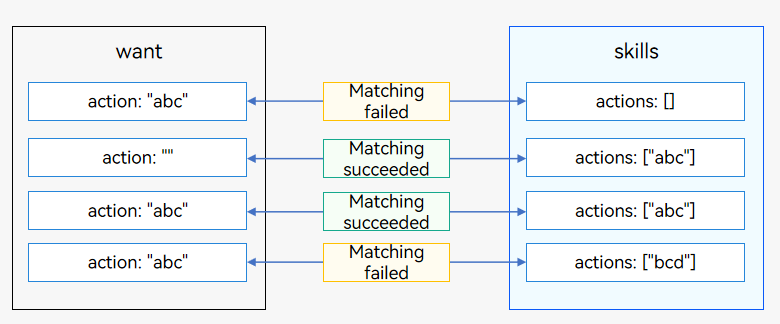
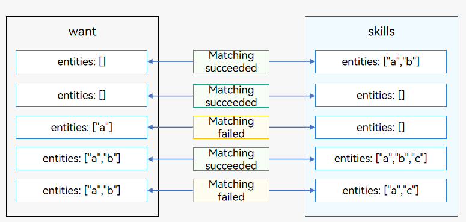
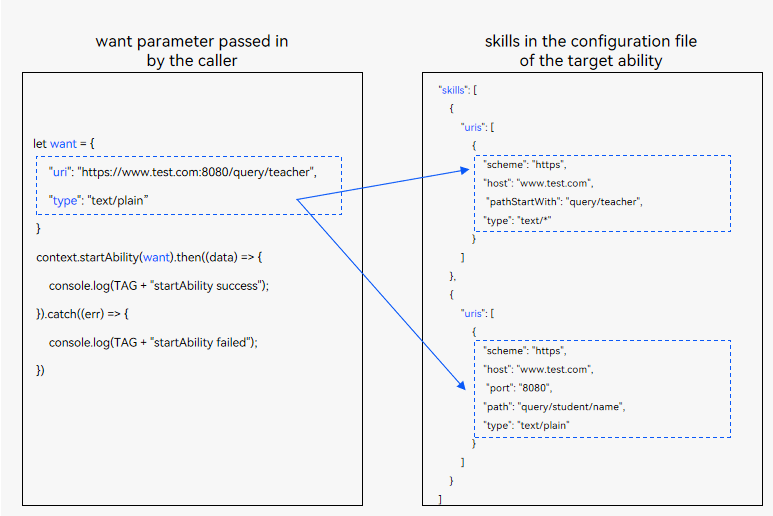
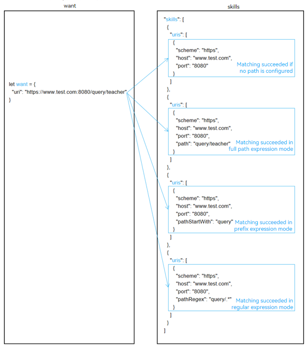
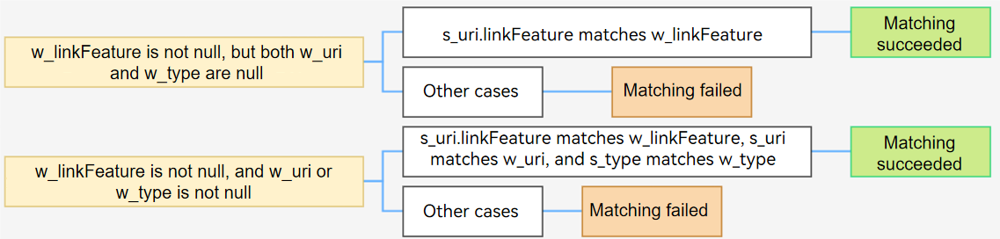
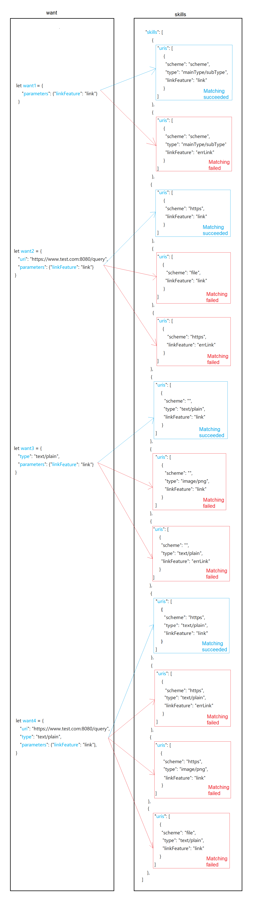

# Matching Rules of Explicit Want and Implicit Want

Both explicit [Want](../reference/apis-ability-kit/js-apis-app-ability-want.md) and implicit [Want](../reference/apis-ability-kit/js-apis-app-ability-want.md) can be used to match an application component to start based on certain rules. These rules determine how the parameters set in [want](../reference/apis-ability-kit/js-apis-app-ability-want.md) match the configuration file declared by the target application component.

## Matching Rules of Explicit Want

The table below describes the matching rules of explicit [Want](../reference/apis-ability-kit/js-apis-app-ability-want.md).

| Name| Type| Matching Item| Mandatory| Rule Description|
| -------- | -------- | -------- | -------- | -------- |
| deviceId | string | Yes| No| If this field is unspecified, only application components on the local device are matched.|
| bundleName | string | Yes| Yes| If **abilityName** is specified but **bundleName** is unspecified, the matching fails.|
| moduleName | string | Yes| No| If this field is unspecified and multiple modules with the same ability name exist in the application, the first application component is matched by default.|
| abilityName | string | Yes| Yes| To use explicit Want, this field must be specified.|
| uri | string | No| No| This field is not used for matching. It is passed to the target application component as a parameter.|
| type | string | No| No| This field is not used for matching. It is passed to the target application component as a parameter.|
| action | string | No| No| This field is not used for matching. It is passed to the target application component as a parameter.|
| entities | Array&lt;string&gt; | No| No| This field is not used for matching. It is passed to the target application component as a parameter.|
| flags | number | No| No| This field is not used for matching and is directly transferred to the system for processing. It is generally used to set runtime information, such as URI data authorization.|
| parameters | {[key:&nbsp;string]:&nbsp;Object} | No| No| This field is not used for matching. It is passed to the target application component as a parameter.|

## Matching Rules of Implicit Want

The table below describes the matching rules of implicit [Want](../reference/apis-ability-kit/js-apis-app-ability-want.md).

| Name       | Type                          | Matching Item| Mandatory| Rule Description                                                        |
| ----------- | ------------------------------ | ------ | ---- | ------------------------------------------------------------ |
| deviceId    | string                         | Yes    | No  | Implicit invoking is not supported across devices.                                  |
| abilityName | string                         | No    | No  | To use implicit Want, this field must be left unspecified.                                |
| bundleName  | string                         | Yes    | No  | This field is used to match the target application component in the given bundle.                             |
| moduleName  | string                         | Yes    | No  | This field is used to match the target application component in the given module.                             |
| uri         | string                         | Yes    | No  | For details, see [Matching Rules of uri and type in the want Parameter](#matching-rules-of-uri-and-type-in-the-want-parameter).                                                            |
| type        | string                         | Yes    | No  | For details, see [Matching Rules of uri and type in the want Parameter](#matching-rules-of-uri-and-type-in-the-want-parameter).                                                            |
| action      | string                         | Yes    | No  | For details, see [Matching Rules of action in the want Parameter](#matching-rules-of-action-in-the-want-parameter).                                                            |
| entities    | Array&lt;string&gt;            | Yes    | No  | For details, see [Matching Rules of entities in the want Parameter](#matching-rules-of-entities-in-the-want-parameter).                                                            |
| flags       | number                         | No    | No  | This field is not used for matching and is directly transferred to the system for processing. It is generally used to set runtime information, such as URI data authorization.|
| parameters  | {[key:&nbsp;string]:&nbsp;Object} | Yes    | No  | This field is used to transfer custom data to the target application component. Currently, only the parameter with the key set to **linkFeature** is used for matching. When **linkFeature** is not null, a matching against **linkFeature** is carried out preferentially.|

Get familiar with the following about implicit Want:

- The **want** parameter passed by the caller indicates the operation to be performed by the caller. It also provides data and application type restrictions.

- The **skills** field declares the capabilities of the target application component. For details, see [the skills tag](../quick-start/module-configuration-file.md#skills) in the [module.json5 file](../quick-start/module-configuration-file.md).

The system matches the **want** parameter (including the **action**, **entities**, **uri**, **type**, and **parameters** attributes) passed by the caller against the **skills** configuration (including the **actions**, **entities**, **uris**, and **type** attributes) of the application components. If none of the five attributes in the **want** parameter is configured, implicit matching fails.
- If the **linkFeature** field in **parameters** is not null, a matching against **linkFeature** is carried out preferentially.
  - If **linkFeature** is matched and **uri** or **type** in the **want** parameter is configured, the system continues to match **uri** or **type**. If they are matched, the implicit matching is successful. Otherwise, the matching fails. If neither **uri** nor **type** in the **want** parameter is configured, the implicit matching is successful.
  - If **linkFeature** is not matched, no matching is performed and the matching fails.
- If the **linkFeature** field in **parameters** is not specified or is null, the matching is successful only when the **action**, **entities**, **uri**, and **type** attributes are all matched.

### Matching Rules of action in the want Parameter

The system matches the **action** attribute in the **want** parameter passed by the caller against **actions** under **skills** of the application components.

- If **action** in the passed **want** parameter is null and **actions** under **skills** of an application component is null, the matching fails.

- If **action** in the passed **want** parameter is not null but **actions** under **skills** of an application component is null, the matching fails.

- If **action** in the passed **want** parameter is null but **actions** under **skills** of an application component is not null, the matching is successful.

- If **action** in the passed **want** parameter is not null, and **actions** under **skills** of an application component is not null and contains **action** in the passed **want** parameter, the matching is successful.

- If **action** in the passed **want** parameter is not null, and **actions** under **skills** of an application component is not null but does not contain **action** in the passed **want** parameter, the matching fails.

**Figure 1** Matching rules of action in the want parameter

### Matching Rules of entities in the want Parameter

The system matches the **entities** attribute in the **want** parameter passed by the caller against **entities** under **skills** of the application components.

- If **entities** in the passed **want** parameter is null but **entities** under **skills** of an application component is not null, the matching is successful.

- If **entities** in the passed **want** parameter is null but **entities** under **skills** of an application component is null, the matching is successful.

- If **entities** in the passed **want** parameter is not null but **entities** under **skills** of an application component is null, the matching fails.

- If **entities** in the passed **want** parameter is not null, and **entities** under **skills** of an application component is not null and contains **entities** in the passed **want** parameter, the matching is successful.

- If **entities** in the passed **want** parameter is not null, and **entities** under **skills** of an application component is not null but does not contain **entities** in the passed **want** parameter, the matching fails.

**Figure 2** Matching rules of entities in the want parameter

### Matching Rules of uri and type in the want Parameter

When the **uri** and **type** parameters are not null in the **want** parameter to initiate an application component startup request, the system traverses the list of installed components and matches the **uris** array under **skills** of the application components one by one. If one of the **uris** arrays under **skills** matches the **uri** and **type** in the passed **want**, the matching is successful.

There are four combinations of **uri** and **type** settings. The matching rules are as follows:

- Both **uri** and **type** are null in the **want** parameter.
  - If the **uris** array under **skills** of an application component is null, the matching is successful.
  - If the **uris** array under **skills** of an application component contains an URI element whose **scheme** and **type** are null, the matching is successful.
  - In other cases, the matching fails.

- Only **uri** is not null in the **want** parameter.
  - If the **uris** array under **skills** of an application component is null, the matching fails.
  - If the **uris** array under **skills** of an application component contains an element whose [uri is matched](#matching-rules-of-uri) and **type** is null, the matching is successful. Otherwise, the matching fails.
  - If the matching fails for the preceding two scenarios and the input URI is a file path URI, the system obtains the MIME type of the file based on the file name extension. If the MIME type matches **type** configured under **skills**, the matching is successful.

- Only **type** is not null in the **want** parameter.
  - If the **uris** array under **skills** of an application component is null, the matching fails.
  - If the **uris** array under **skills** of an application component contains an URI element whose **scheme** is null and [type is matched](#matching-rules-of-type), the matching is successful. Otherwise, the matching fails.

- Both **uri** and **type** are not null in the **want** parameter, as shown below.
  - If the **uris** array under **skills** of an application component is null, the matching fails.
  - If the **uris** array under **skills** of an application component contains an element whose [uri is matched](#matching-rules-of-uri) and [type is matched](#matching-rules-of-type), the matching is successful. Otherwise, the matching fails.

Leftmost URI matching: When only **scheme**, a combination of **scheme** and **host**, or a combination of **scheme**, **host**, and **port** is configured in the **uris** array under **skills** of the application component, the matching is successful only if the leftmost URI in the passed **want** parameter matches **scheme**, the combination of **scheme** and **host**, or the combination of **scheme**, **host**, and **port**.

**Figure 3** Matching rules when uri and type are not null in the want parameter

To simplify the description:

- **uri** in the **want** parameter passed in by the caller is called **w_uri**; each element in the **uris** array under **skills** of the application component to match is called **s_uri**.
- **type** in the **want** parameter passed in by the caller is called **w_type**; the type in the **uris** array under **skills** of the application component to match is called **s_type**.

**Figure 4** Matching rules of uri and type in the want parameter

### Matching Rules of uri

The matching rules are as follows:

- If **scheme** of **s_uri** is null and **w_uri** is null, the matching is successful. Otherwise, the matching fails.

- If **host** of **s_uri** is null and **scheme** of **w_uri** and **scheme** of **s_uri** are the same, the matching is successful. Otherwise, the matching fails.

- If **port** of **s_uri** is null and the combination of **scheme** and **host** of **w_uri** is the same as the combination of **scheme** and **host** of **s_uri**, the matching is successful. Otherwise, the matching fails.

- If **path**, **pathStartWith**, and **pathRegex** of **s_uri** are null and the combination of **scheme**, **host**, and **port** of **w_uri** is the same as the combination of **scheme**, **host**, and **port** of **s_uri**, the matching is successful. Otherwise, the matching fails.

- If **path** of **s_uri** is not null and the **full path expressions** of **w_uri** and **s_uri** are the same, the matching is successful. Otherwise, the matching of **pathStartWith** continues.

- If **pathStartWith** of **s_uri** is not null and **w_uri** contains the prefix expression of **s_uri**, the matching is successful. Otherwise, **pathRegex** matching continues.

- If **pathRegex** of **s_uri** is not null and **w_uri** meets the regular expression of **s_uri**, the matching is successful. Otherwise, the matching fails.

> **NOTE**
>
> The **scheme**, **host**, **port**, **path**, **pathStartWith**, and **pathRegex** attributes of **uris** under **skills** of an application component are concatenated. If **path**, **pathStartWith**, and **pathRegex** are declared in sequence, **uris** can be concatenated into the following expressions:
>
> - **Prefix URI expression**: When only **scheme**, a combination of **scheme** and **host**, or a combination of **scheme**, **host**, and **port** is configured in the configuration file, the matching is successful if a URI prefixed with the configuration file is passed in.
>     * `scheme://`
>     * `scheme://host`
>     * `scheme://host:port`
> - **Full path expression**: `scheme://host:port/path`
> - **Prefix expression**: `scheme://host:port/pathStartWith`
> - **Regular expression**: `scheme://host:port/pathRegex`
>
> For system applications, **scheme** of their URIs starts with **ohos**, for example, **ohosclock://**. The URI of a third-party application cannot be the same as that of a system application. Otherwise, the third-party application cannot be started using the URI.

**Figure 5** Example of the matching rules of uri in the want parameter

### Matching Rules of type

> **NOTE**
>
> The matching rules of **type** described in this section are based on the fact that **type** in the **want** parameter is not null. If **type** is null, follow the [matching rules of uri and type in the want parameter](#matching-rules-of-uri-and-type-in-the-want-parameter).

The matching rules are as follows:

- If **s_type** is null, the matching fails.

- If **s_type** or **w_type** contains the wildcard `*/*`, the matching is successful.

- If the last character of **s_type** is the wildcard `*`, for example, `prefixType/*`, the matching is successful only when **w_type** contains `prefixType/`.

- If the last character of **w_type** is the wildcard `*`, for example, `prefixType/*`, the matching is successful only when **s_type** contains `prefixType/`.

### Matching Rules of linkFeature

> **NOTE**
>
> The linkFeature matching rules described below apply to the scenario where **parameters** in the **want** parameter contains the **linkFeature** key and the value of the key is not null.

The system matches **parameters** in the **want** parameter passed by the caller against **uris** under **skills** of the application components. To simplify the description, **linkFeature** in the **want** parameter passed in by the caller is called **w_linkFeature**. The matching rules are as follows:
- If both **uri** and **type** in the **want** parameter are null, only **linkFeature** is used for matching. If the value of **w_linkFeature** matches that of **s_uri**, the matching is successful. Otherwise, the matching fails.
- If **uri** or **type** in the **want** parameter is not null, the system matches **linkFeature**, **uri**, and **type** in sequence. For details, see [Matching Rules of uri and type in the want Parameter](#matching-rules-of-uri-and-type-in-the-want-parameter). If all the three fields are matched, the matching is successful. Otherwise, the matching fails.

**Figure 6** Matching rules of linkFeature in the want parameter

