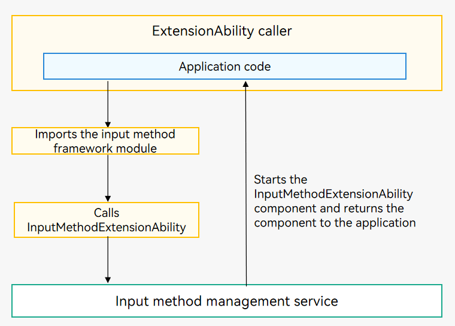
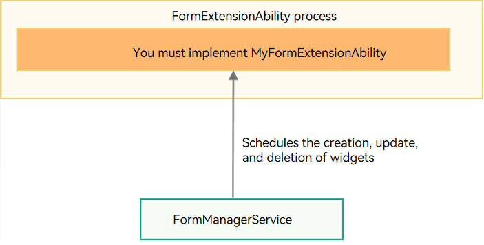

# ExtensionAbility Component

The [ExtensionAbility](../reference/apis-ability-kit/js-apis-app-ability-extensionAbility.md) component is used for specific scenarios such as widget development and input method development.

The system defines an [ExtensionAbility type](../reference/apis-ability-kit/js-apis-bundleManager.md#extensionabilitytype) for every specific scenario. You can use (implement and access) only the types that have been defined. All types of ExtensionAbility components are managed by the corresponding system services in a unified manner. For example, the [InputMethodExtensionAbility](../reference/apis-ime-kit/js-apis-inputmethod-extension-ability.md) component is managed by the input method management service.

The table below lists the ExtensionAbility types defined in the system.

> **NOTE**
> 
> - The column **Allow Third-Party Apps to Implement** specifies whether third-party applications can inherit the **ExtensionAbility** parent class and implement their own service logic for a type of ExtensionAbility. The value **Y** means that third-party applications can implement their own service logic for a type of ExtensionAbility, **N** means the opposite.
> - The column **Allow Third-Party Apps to Access** specifies whether third-party applications can access external services provided by a type of ExtensionAbility. The value **Y** means that third-party applications can access external services provided by a certain type of ExtensionAbility, **N** means that they cannot access external services, and **NA** means that no external services are provided.
> - The column **Allow Independent ExtensionAbility Sandbox** specifies whether an independent sandbox is provided for an ExtensionAbility. In versions earlier than API version 12, an application and its ExtensionAbilities use the same sandbox. Since API version 12, a new ExtensionAbility uses an independent sandbox. Currently, the InputMethodExtensionAbility runs in an independent sandbox for security purposes. The value **Y** means that an independent sandbox is provided for an ExtensionAbility, and **N** means that no independent sandbox is provided for an ExtensionAbility.
> - The column **Allow ExtensionAbilities to Access Sendable Data in Strict Mode** specifies whether an ExtensionAbility can access sendable data in strict mode. Sendable data is implemented by configuring <!--Del-->[<!--DelEnd-->data-group-ids<!--Del-->](../security/app-provision-structure.md#bundle-info)<!--DelEnd--> and [dataGroupIds](../quick-start/module-configuration-file.md#extensionabilities) of the application. Strict access indicates that the sendable data is read-only, and non-strict access indicates that the data can be read and written. The value **Y** means that an ExtensionAbility uses strict mode to access sendable data, that is, it can read sendable data. The value **N** means that an ExtensionAbility uses non-strict mode to access sendable data, that is, it can read and write sendable data.

System applications are not restricted. They can implement all the ExtensionAbility types defined in the system and access external services provided by all the ExtensionAbility types.

| ExtensionAbility Type                | Description| Allow Third-Party Apps to Implement                 | Allow Third-Party Apps to Access                                                | Allow Independent ExtensionAbility Sandbox                 | Allow ExtensionAbilities to Access Sendable Data in Strict Mode                 |
| ------------------------ | -------- | ------------------------------------------------------------ | ------------------------------------------------------------ | ------------------------------------------------------------ | ------------------------------------------------------------ | 
 | [FormExtensionAbility](../reference/apis-form-kit/js-apis-app-form-formExtensionAbility.md)                 | ExtensionAbility component of the FORM type, which provides APIs related to [widgets](../form/formkit-overview.md).     | Y | N | N | N |
| [WorkSchedulerExtensionAbility](../reference/apis-backgroundtasks-kit/js-apis-WorkSchedulerExtensionAbility.md) | ExtensionAbility component of the WORK_SCHEDULER type, which provides callbacks for [deferred tasks](../task-management/work-scheduler.md).     | Y | NA | N | N |
| [InputMethodExtensionAbility](../reference/apis-ime-kit/js-apis-inputmethod-extension-ability.md) | ExtensionAbility component of the INPUT_METHOD type, which is used to develop [input method applications](../inputmethod/ime-kit-intro.md).     | Y | Y | Y | N if you have enabled the full mode in input method management Y if you have not enabled the full mode in input method management|
| [BackupExtensionAbility](../reference/apis-core-file-kit/js-apis-application-backupExtensionAbility.md) | ExtensionAbility component of the BACKUP type, which provides APIs for [backing up and restoring application data](../file-management/app-file-backup-overview.md).     | Y | NA | N | N |
| [DriverExtensionAbility](../reference/apis-driverdevelopment-kit/js-apis-app-ability-driverExtensionAbility.md)            | ExtensionAbility component of the DRIVER type, which provides the [driver-related extension framework](../device/driver/driverextensionability.md).     | Y | Y | N | N |
| [EmbeddedUIExtensionAbility](../reference/apis-ability-kit/js-apis-app-ability-embeddedUIExtensionAbility.md) | ExtensionAbility component of the EMBEDDED_UI type, which provides the [embedded UI across processes](embeddeduiextensionability.md).| Y | Y | N | N |
| [ShareExtensionAbility](../reference/apis-ability-kit/js-apis-app-ability-shareExtensionAbility.md) | ExtensionAbility component of the SHARE type, which is used to extend the sharing template service.| Y | Y | N | N |

## Accessing ExtensionAbility of the Specified Type

Each type of [ExtensionAbility](../reference/apis-ability-kit/js-apis-app-ability-extensionAbility.md) component is started by the corresponding system management service, rather than applications, so that its lifecycle is under system control. The caller of the ExtensionAbility component does not need to care about its lifecycle.

The following uses [InputMethodExtensionAbility](../reference/apis-ime-kit/js-apis-inputmethod-extension-ability.md) as an example. As shown in the figure below, when an application calls the InputMethodExtensionAbility component, the input method management service is called first. The input method management service starts the InputMethodExtensionAbility component, returns the component to the application, and starts to manage its lifecycle.

**Figure 1** Using the InputMethodExtensionAbility component

## Implementing ExtensionAbility of the Specified Type

The following uses [FormExtensionAbility](../reference/apis-form-kit/js-apis-app-form-formExtensionAbility.md) as an example. The widget framework provides the base class **FormExtensionAbility**. You can derive this base class to create your own class (for example, **MyFormExtensionAbility**) and implement the callbacks, such as **onCreate()** and [onUpdateForm()](../reference/apis-form-kit/js-apis-app-form-formExtensionAbility.md#onupdateform), to provide specific widget features. For details, see [Service Widget](../form/formkit-overview.md).

You do not need to care when to add or delete a widget. The lifecycle of the FormExtensionAbility instance and the lifecycle of the [ExtensionAbility](../reference/apis-ability-kit/js-apis-app-ability-extensionAbility.md) process where the FormExtensionAbility instance is located are managed by FormManagerService.

> **NOTE**
>
> For an application, all ExtensionAbility components of the same type run in an independent process, whereas the UIAbility, ServiceExtensionAbility, and DataShareExtensionAbility components run in another independent process. For details, see [Process Model (Stage Model)](process-model-stage.md).
