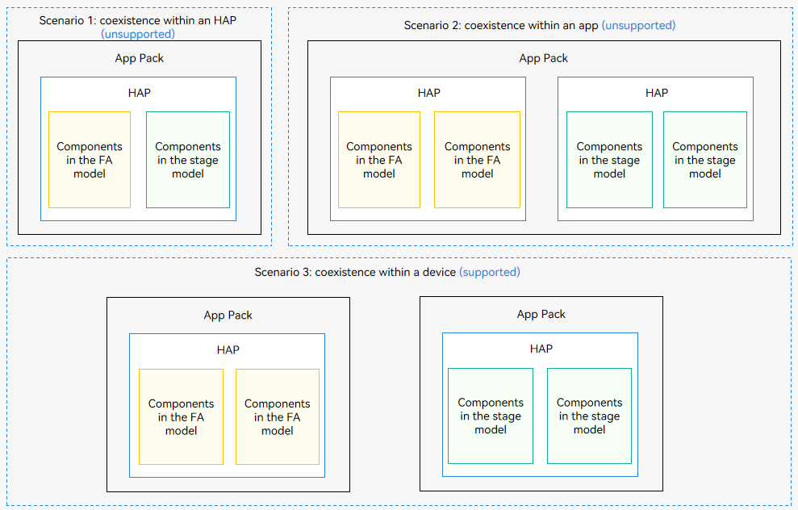

# Component Interaction Between the FA Model and Stage Model

The FA model is supported by API version 8 and earlier versions, and the stage model is recommended since API version 9. The FA model and stage model have their respective components. The FA model provides three types of application components: PageAbility, ServiceAbility, and DataAbility. The stage model provides two types of application components: UIAbility and ExtensionAbility.

You cannot use both models for the development of an application (see the figure below). However, a device (system) can contain applications developed on different models (scenario 3 in the figure below). In this case, their components may interact with each other.

**Figure 1** Coexistent application components of the FA model and stage model

The following table lists the possible interaction scenarios and the concerns of each scenario.

**Table 1** Application component interaction scenarios

| Interaction Scenario| Concerns| 
| -------- | -------- |
| [Starting a UIAbility from the FA Model](start-uiability-from-fa.md)| Set **bundleName** and **abilityName** in the **want** parameter to the bundle name and ability name of the UIAbility in the stage model.| 
| [Connecting to a ServiceExtensionAbility from the FA Model](bind-serviceextensionability-from-fa.md)| Set **bundleName** and **abilityName** in the **want** parameter to the bundle name and ability name of the ServiceExtensionAbility in the stage model.| 
| [Accessing a DataShareExtensionAbility from the FA Model](access-datashareextensionability-from-fa.md)| No code modification is required. However, you need to understand the API compatibility of **DataShareHelper** and **DataAbilityHelper**.| 
| [Starting a PageAbility from the Stage Model](start-pageability-from-stage.md)| Set **bundleName** and **abilityName** in the **want** parameter to the bundle name and ability name of the PageAbility in the FA model.| 
| [Connecting to a ServiceAbility from the Stage Model](bind-serviceability-from-stage.md)| Set **bundleName** and **abilityName** in the **want** parameter to the bundle name and ability name of the ServiceAbility in the FA model.| 
| Accessing a DataAbility from the Stage Model| This type of access is not supported.| 
