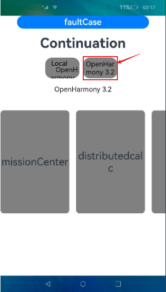

# Cross-Device Migration

## Overview

When the environment changes, for example, when a user goes outdoors or when a more appropriate device is detected, the user can migrate an ongoing task to another device for better experience. The application on the source device can automatically exit, depending on the setting. A typical cross-device migration scenario is as follows: You migrate a video playback task from a tablet to a smart TV. The video application on the tablet exits. From the perspective of application development, cross-device migration enables the UIAbility component running on device A to migrate to and keep running on device B. After the migration is complete, the UIAbility component on device A automatically exits (depending on the setting).

The core task of cross-device migration is to migrate the status (including page components and status variables) of an application to the target device so that users can have continuous application experience on that device. This means that operations performed by a user on one device can be quickly switched and seamlessly connected in the same application on another device.

Cross-device migration supports the following features:

- Saving and restoring custom data

- Saving and restoring page routing information and page component status data

- Checking application compatibility

- Dynamically setting the migration state (**ACTIVE** by default)

  For example, for an editing application, only the text editing page needs to be migrated to the target device. In this case, you can call [setMissionContinueState](../reference/apis/js-apis-inner-application-uiAbilityContext.md#uiabilitycontextsetmissioncontinuestate10) for precise control.

- Determining whether to restore the page stack (restored by default)

  If an application wants to customize the page to be displayed after being migrated to the target device, you can use [SUPPORT_CONTINUE_PAGE_STACK_KEY](../reference/apis/js-apis-app-ability-wantConstant.md#wantconstantparams) for precise control.

- Determining whether to exit the application on the source device after a successful migration (application exit by default)

  You can use [SUPPORT_CONTINUE_SOURCE_EXIT_KEY](../reference/apis/js-apis-app-ability-wantConstant.md#wantconstantparams) for precise control.
  
  > **NOTE**
  >
  > You only need to develop an application with the migration capabilities. System applications will trigger cross-device migration.


## Working Principles


1. On the source device, the UIAbility uses the [onContinue()](../reference/apis/js-apis-app-ability-uiAbility.md#abilityoncontinue) callback to save service data to be continued. For example, to complete cross-device migration, a browser application uses the [onContinue()](../reference/apis/js-apis-app-ability-uiAbility.md#abilityoncontinue) callback to save service data such as the page URL. The system automatically saves the page status, such as the current browsing progress.
2. The distributed framework provides a mechanism for saving and restoring application UI, page stacks, and service data across devices. It sends the data from the source device to the target device.
3. On the target device, the same UIAbility uses the [onCreate()](../reference/apis/js-apis-app-ability-uiAbility.md#uiabilityoncreate) or [onNewWant()](../reference/apis/js-apis-app-ability-uiAbility.md#abilityonnewwant) callback to restore the service data.


## Constraints

- Cross-device migration must be performed between the same UIAbility component. In other words, **bundleName**, **abilityName**, and **signature** of the component on the two devices must be the same.
- For better user experience, the data to be transmitted using the **wantParam** parameter must be less than 100 KB.
- Certain ArkUI components can be restored to a given state on the target device after migration. For details, see [restoreId](../reference/arkui-ts/ts-universal-attributes-restoreId.md).

## How to Develop

1. Request the **ohos.permission.DISTRIBUTED_DATASYNC** permission. For details, see [Declaring Permissions in the Configuration File](../security/accesstoken-guidelines.md#declaring-permissions-in-the-configuration-file).

2. Display a dialog box to ask for authorization from the user when the application is started for the first time. For details, see [Requesting User Authorization](../security/accesstoken-guidelines.md#requesting-user-authorization).

3. Configure the **continuable** tag under **abilities** in the [module.json5 file](../quick-start/module-configuration-file.md).

   ```json
   {
     "module": {
       // ...
       "abilities": [
         {
           // ...
           "continuable": true, // Configure the UIAbility to support migration.
         }
       ]
     }
   }
   ```

   > **NOTE**
   >
   > Configure the application launch type. For details, see [UIAbility Component Launch Type](uiability-launch-type.md).

4. Implement [onContinue()](../reference/apis/js-apis-app-ability-uiAbility.md#abilityoncontinue) in the UIAbility on the source device.

   When a migration is triggered for the UIAbility, [onContinue()](../reference/apis/js-apis-app-ability-uiAbility.md#abilityoncontinue) is called on the source device. You can save the data in this method to implement application compatibility check and migration decision.

   - Saving data to migrate: You can save the data to migrate in key-value pairs in **wantParam**.
   - Checking application compatibility: You can obtain the application version on the target device from **wantParam.version** in the [onContinue()](../reference/apis/js-apis-app-ability-uiAbility.md#abilityoncontinue) callback and compare it with the [application version on the source device](../faqs/faqs-bundle-management.md).
   - Making a migration decision: You can determine whether migration is supported based on the return value of [onContinue()](../reference/apis/js-apis-app-ability-uiAbility.md#abilityoncontinue).

   ```ts
   import UIAbility from '@ohos.app.ability.UIAbility';
   import AbilityConstant from '@ohos.app.ability.AbilityConstant';
   
   export default class EntryAbility extends UIAbility {
     onContinue(wantParam: Record<string, Object>):AbilityConstant.OnContinueResult {
       let version = wantParam.version;
       let targetDevice = wantParam.targetDevice;
       console.info(`onContinue version = ${version}, targetDevice: ${targetDevice}`); // Prepare data to migrate.
   
       // Obtain the application version on the source device.
       let versionSrc: number = -1; // Enter the version number obtained.
   
       // Compatibility verification
       if (version !== versionSrc) {
         // Return MISMATCH when the compatibility check fails.
         return AbilityConstant.OnContinueResult.MISMATCH;
       }
   
       // Save the data to migrate in the custom field (for example, data) of wantParam.
       const continueInput = 'Data to migrate';
       wantParam['data'] = continueInput;
   
       return AbilityConstant.OnContinueResult.AGREE;
     }
   }
   ```

5. On the source device, call APIs to restore data and load the UI. The APIs vary according to the cold or hot start mode in use. For the UIAbility on the target device, implement [onCreate()](../reference/apis/js-apis-app-ability-uiAbility.md#uiabilityoncreate) or [onNewWant()](../reference/apis/js-apis-app-ability-uiAbility.md#abilityonnewwant) to restore the data.
   

   The **launchReason** parameter in the [onCreate()](../reference/apis/js-apis-app-ability-uiAbility.md#uiabilityoncreate) or [onNewWant()](../reference/apis/js-apis-app-ability-uiAbility.md#abilityonnewwant) callback specifies whether the launch is triggered by migration. If the launch is triggered by migration, you must obtain the saved data from **want** and call **restoreWindowStage()** to trigger page restoration, including page stack information, after data restoration.
   
   ```ts
   import UIAbility from '@ohos.app.ability.UIAbility';
   import AbilityConstant from '@ohos.app.ability.AbilityConstant';
   import Want from '@ohos.app.ability.Want';
   
   export default class EntryAbility extends UIAbility {
     storage : LocalStorage = new LocalStorage();
   
     onCreate(want: Want, launchParam: AbilityConstant.LaunchParam): void {
       console.info('EntryAbility onCreate')
       if (launchParam.launchReason == AbilityConstant.LaunchReason.CONTINUATION) {
         // Obtain the data saved.
         let continueInput = '';
         if (want.parameters != undefined) {
           continueInput = JSON.stringify(want.parameters.data);
           console.info(`continue input ${continueInput}`)
         }
         // Display the data on the current page.
         this.context.restoreWindowStage(this.storage);
       }
     }
   
     onNewWant(want: Want, launchParam: AbilityConstant.LaunchParam): void {
        console.info('EntryAbility onNewWant')
        if (launchParam.launchReason == AbilityConstant.LaunchReason.CONTINUATION) {
          // Obtain the user data from the want parameter.
          let continueInput = '';
          if (want.parameters != undefined) {
            continueInput = JSON.stringify(want.parameters.data);
            console.info(`continue input ${continueInput}`);
          }
          this.context.restoreWindowStage(this.storage);
        }
      }
   }
   ```

## Configuring Optional Migration Features

### Dynamically Setting the Migration State

Since API version 10, you can dynamically set the migration state. Specifically, you can enable or disable migration as required by calling [setMissionContinueState()](../reference/apis/js-apis-inner-application-uiAbilityContext.md#uiabilitycontextsetmissioncontinuestate10). By default, **ACTIVE** is set for an application, indicating that migration is enabled.

**Time for Setting the Migration State**

The change of the migration state can be implemented based on service requirements. Typical methods are as follows:

Call the API in the [onCreate()](../reference/apis/js-apis-app-ability-uiAbility.md#uiabilityoncreate) callback of the UIAbility to set the migration state when the application is created.

```ts
// EntryAbility.ets
import UIAbility from '@ohos.app.ability.UIAbility';
import AbilityConstant from '@ohos.app.ability.AbilityConstant';
import Want from '@ohos.app.ability.Want';

export default class EntryAbility extends UIAbility {
  onCreate(want: Want, launchParam: AbilityConstant.LaunchParam): void {
    // ...
    this.context.setMissionContinueState(AbilityConstant.ContinueState.INACTIVE, (result) => {
      console.info(`setMissionContinueState: ${JSON.stringify(result)}`);
    });
    // ...
  }
}
```

Call the API in the **onPageShow()** callback of the page to set the migration state when a single page is displayed.

```ts
// PageName.ets
import AbilityConstant from '@ohos.app.ability.AbilityConstant';
import common from '@ohos.app.ability.common';
@Entry
@Component
struct PageName {
  private context = getContext(this) as common.UIAbilityContext;
  build() {
    // ...
  }
  // ...
  onPageShow(){
  // When the page is displayed, set the migration state to ACTIVE.
    this.context.setMissionContinueState(AbilityConstant.ContinueState.ACTIVE, (result) => {
      console.info(`setMissionContinueState ACTIVE result: ${JSON.stringify(result)}`);
    });
  }
}
```

Set the migration state in the event of a component.

```ts
// PageName.ets
import AbilityConstant from '@ohos.app.ability.AbilityConstant';
import common from '@ohos.app.ability.common';

@Entry
@Component
struct PageName {
  private context = getContext(this) as common.UIAbilityContext;
  build() {
    // ...
    Button() {
      // ...
    }.onClick(()=>{
    // When the button is clicked, set the migration state to ACTIVE.
      this.context.setMissionContinueState(AbilityConstant.ContinueState.ACTIVE, (result) => {
        console.info(`setMissionContinueState ACTIVE result: ${JSON.stringify(result)}`);
      });
    })
  }
}
```

**Ensuring Migration Continuity**

During UI page loading, the application on the target device may have executed the command to set its own migration state (for example, set the state to **INACTIVE** in [onCreate()](../reference/apis/js-apis-app-ability-uiAbility.md#uiabilityoncreate) during cold start or to **INACTIVE** during hot start since the application has opened a page that cannot be migrated). To ensure a migration back to the source device, you must set the migration state to **ACTIVE** in [onCreate()](../reference/apis/js-apis-app-ability-uiAbility.md#uiabilityoncreate) or [onNewWant()](../reference/apis/js-apis-app-ability-uiAbility.md#abilityonnewwant).

```ts
// EntryAbility.ets
import UIAbility from '@ohos.app.ability.UIAbility';
import AbilityConstant from '@ohos.app.ability.AbilityConstant';
import Want from '@ohos.app.ability.Want';

export default class EntryAbility extends UIAbility {
  // ...
  onCreate(want: Want, launchParam: AbilityConstant.LaunchParam): void {
    // ...
    // Set the migration state to ACTIVE when the launch is caused by migration. This setting copes with cold start.
    this.context.setMissionContinueState(AbilityConstant.ContinueState.INACTIVE, (result) => {
        console.info(`setMissionContinueState INACTIVE result: ${JSON.stringify(result)}`);
    });
  }
  
  onNewWant(want: Want, launchParam: AbilityConstant.LaunchParam): void {
    // ...
    // Set the migration state to ACTIVE when the launch is caused by migration. This setting copes with hot start.
    if (launchParam.launchReason == AbilityConstant.LaunchReason.CONTINUATION) {
      this.context.setMissionContinueState(AbilityConstant.ContinueState.ACTIVE, (result) => {
        console.info(`setMissionContinueState ACTIVE result: ${JSON.stringify(result)}`);
      });
    }
  }
  // ...
}
```

### Migrating the Page Stack on Demand

Configure whether to restore the page stack. By default, the page stack is restored. If an application does not want to use the page stack restored by the system, you can set the page to be displayed on the target device in **onWindowStageRestore()**. For details about the configuration, see [SUPPORT_CONTINUE_PAGE_STACK_KEY](../reference/apis/js-apis-app-ability-wantConstant.md#wantconstantparams).

The index and second routes exist in the page stack of the application on the source device. However, the application on the target device wants to display a specified page, rather than that on the source device.

Example: A UIAbility does not want automatically restored page stack information.

```ts
// EntryAbility.ets
import UIAbility from '@ohos.app.ability.UIAbility';
import AbilityConstant from '@ohos.app.ability.AbilityConstant';
import wantConstant from '@ohos.app.ability.wantConstant';
import window from '@ohos.window';

export default class EntryAbility extends UIAbility {
  // ...
  
  onContinue(wantParam: Record<string, Object>) {
    console.info(`onContinue version = ${wantParam.version}, targetDevice: ${wantParam.targetDevice}`);
    wantParam[wantConstant.Params.SUPPORT_CONTINUE_PAGE_STACK_KEY] = false;
    return AbilityConstant.OnContinueResult.AGREE;
  }

  onWindowStageRestore(windowStage: window.WindowStage) {
      // Set the page to be displayed after the migration.
    windowStage.loadContent('pages/Index', (err, data) => {
      if (err.code) {
        return;
      }
    });
  }
}
```

### Exiting the Application on Demand

Configure whether to exit the application on the source device after a successful migration. By default, the application on the source device exits by default. If you do not want the application on the source device to automatically exit after a successful migration, set the [SUPPORT_CONTINUE_SOURCE_EXIT_KEY](../reference/apis/js-apis-app-ability-wantConstant.md#wantconstantparams) parameter.

Example: A UIAbility on the source device does not exit after a successful migration.

```ts
import UIAbility from '@ohos.app.ability.UIAbility';
import AbilityConstant from '@ohos.app.ability.AbilityConstant';
import wantConstant from '@ohos.app.ability.wantConstant';

export default class EntryAbility extends UIAbility {
  // ...
  
  onContinue(wantParam: Record<string, Object>) {
    console.info(`onContinue version = ${wantParam.version}, targetDevice: ${wantParam.targetDevice}`);
    wantParam[wantConstant.Params.SUPPORT_CONTINUE_SOURCE_EXIT_KEY] = false;
    return AbilityConstant.OnContinueResult.AGREE;
  }
}
```

## Verification Guide

A mission center demo is provided for you to verify the migration capability of your application. The following walks you through on how to verify migration by using the demo.

### Compiling and Installing the Demo

#### Environment Configuration

[Switch to the full SDK](../faqs/full-sdk-switch-guide.md) on DevEco Studio. This is because the mission center uses the system API [@ohos.distributedDeviceManager](../reference/apis/js-apis-distributedDeviceManager.md), which is not provided in the public SDK.

> **NOTE**
>
> The screenshots in this section are for reference only. The DevEco Studio and SDK versions in use prevail.

#### Demo Download

Download the mission center demo from [Sample Code](https://gitee.com/openharmony/ability_dmsfwk/tree/master/services/dtbschedmgr/test/missionCenterDemo/dmsDemo/entry/src/main).

#### Building Project Files

a. Create a project and replace the corresponding folders with the downloaded files.


b. Complete the signature, build, and installation.

The default signature permission provided by the automatic signature template of DevEco Studio is normal. The mission center demo requires the **ohos.permission.MANAGE_MISSIONS** permission, which is at the system_core level. Therefore, you must escalate the permission to the system_core level. Specifically, change **"apl":"normal_core"** to **"apl":"system_core"** in the **UnsignedReleasedProfileTemplate.json** file in **openharmony\*apiVersion*\toolchains\lib**. Then sign the files as follows:

1. Choose **File > Project Structure**.

   

2. Click **Signing Configs** and click **OK**.

   

3. Connect to the developer board and run the demo.

### Device Networking

1. Open the calculators of devices A and B.
2. Click the arrow in the upper right corner to select device B.
3. Select a trusted device on device B. The PIN is displayed.
4. Enter the PIN on device A.
5. Verify the networking. Enter a number on device A. If the number is displayed on device B, the networking is successful.

### Initiation Migration

1. Open your application on device B, and open the mission center demo on device A. The name of device A (Local: OpenHarmony 3.2) and the name of device B (OpenHarmony 3.2) are displayed on device A.

   

2. Click the name of device B. The application of device B is displayed.

   

3. Drag the application to the name of device A. The application on device A is started, and the application on device B exits.

   
