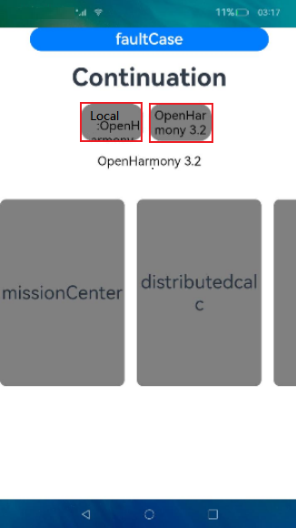
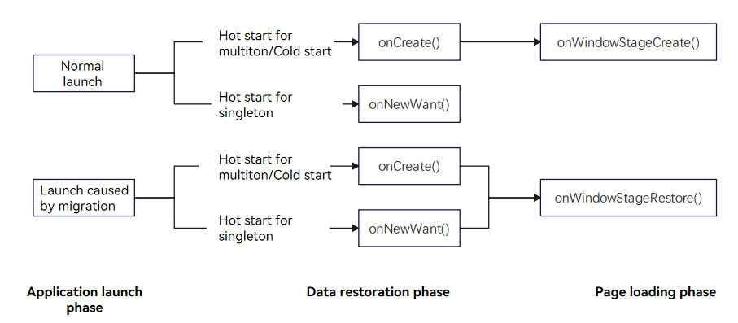
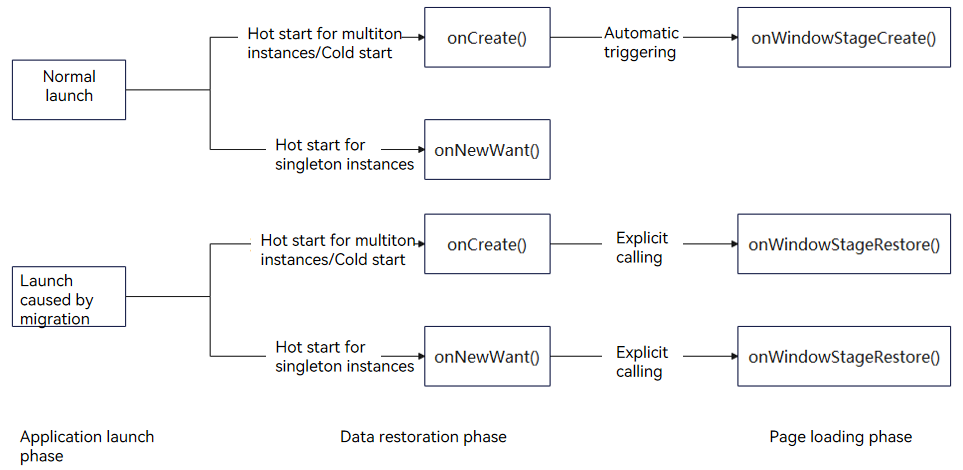
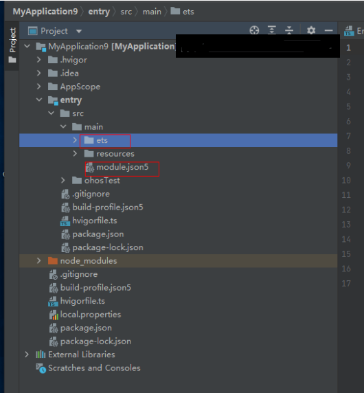

# Cross-Device Migration

## Overview

When the environment changes, for example, when a user goes outdoors or when a more appropriate device is detected, the user can migrate an ongoing task to another device for better experience. The application on the source device can automatically exit, depending on the setting. A typical cross-device migration scenario is as follows: The user migrates a video playback task from a tablet to a smart TV. The video application on the tablet exits. From the perspective of application development, cross-device migration enables the [UIAbility](../reference/apis-ability-kit/js-apis-app-ability-uiAbility.md) component running on device A to migrate to and keep running on device B. After the migration is complete, the UIAbility component on device A automatically exits (depending on the setting).

Cross-device migration supports the following features:

- Saving and restoring custom data

- Saving and restoring page routing information and page component status data

- Checking application compatibility

- Dynamically setting the migration state (**ACTIVE** by default)

  For example, for an editing application, only the text editing page needs to be migrated to the target device. In this case, you can call [setMissionContinueState](../reference/apis-ability-kit/js-apis-inner-application-uiAbilityContext.md#setmissioncontinuestate10) for precise control.

- Determining whether to restore the page stack (restored by default)

  If an application wants to customize the page to be displayed after being migrated to the target device, you can use [SUPPORT_CONTINUE_PAGE_STACK_KEY](../reference/apis-ability-kit/js-apis-app-ability-wantConstant.md#params) for precise control.

- Determining whether to exit the application on the source device after a successful migration (application exit by default)

  You can use [SUPPORT_CONTINUE_SOURCE_EXIT_KEY](../reference/apis-ability-kit/js-apis-app-ability-wantConstant.md#params) for precise control.

  > **NOTE**
  >
  > You only need to develop an application with the migration capabilities. System applications will trigger cross-device migration.

## Working Principles


1. On the source device, the [UIAbility](../reference/apis-ability-kit/js-apis-app-ability-uiAbility.md) uses the [onContinue()](../reference/apis-ability-kit/js-apis-app-ability-uiAbility.md#oncontinue) callback to save service data to be migrated. For example, to complete cross-device migration, a browser application uses the **onContinue()** callback to save service data such as the page URL.
2. The distributed framework provides a mechanism for saving and restoring application page stacks and service data across devices. It sends the data from the source device to the target device.
3. On the target device, the same UIAbility uses the [onCreate()](../reference/apis-ability-kit/js-apis-app-ability-uiAbility.md#oncreate) callback (in the case of cold start) or [onNewWant()](../reference/apis-ability-kit/js-apis-app-ability-uiAbility.md#onnewwant) callback (in the case of hot start) to restore the service data.

## Cross-Device Migration Process

The following figure shows the cross-device migration process when a migration request is initiated from the migration entry of the peer device.



## Constraints

For better user experience, the data to be transmitted via the **wantParam** parameter must be less than 100 KB.

## How to Develop

1. Configure the **continuable** tag under **abilities** in the [module.json5 file](../quick-start/module-configuration-file.md).

   ```json
   {
     "module": {
       // ...
       "abilities": [
         {
           // ...
           "continuable": true, // Configure the UIAbility to support migration.
         }
       ]
     }
   }
   ```

   > **NOTE**
   >
   > Configure the application launch type. For details, see [UIAbility Launch Type](uiability-launch-type.md).

2. Implement **onContinue()** in the UIAbility on the source device.

    When a migration is triggered for the [UIAbility](../reference/apis-ability-kit/js-apis-app-ability-uiAbility.md), [onContinue()](../reference/apis-ability-kit/js-apis-app-ability-uiAbility.md#oncontinue) is called on the source device. You can use either synchronous or asynchronous mode to save the data in this callback to implement application compatibility check and migration decision.

    1. Saving data to migrate: You can save the data to migrate in key-value pairs in **wantParam**.
    
    2. (Optional) Checking application compatibility: You can obtain the application version on the target device from **wantParam.version** in the **onContinue()** callback and compare it with the application version on the source device. If the version compatibility check fails, the application should notify users of the cause of the migration failure.
    
       > **NOTE**
       >
       > If the compatibility issues have little or no impact on migration experience, you can skip this check.
    
    3. Returning the migration result: You can determine whether migration is supported based on the return value of **onContinue()**. For details about the return values, see [AbilityConstant.OnContinueResult](../reference/apis-ability-kit/js-apis-app-ability-abilityConstant.md#oncontinueresult).
    
    &nbsp;
    Certain fields (listed in the table below) in **wantParam** passed in to **onContinue()** are preconfigured in the system. You can use these fields for service processing. When defining custom `wantParam` data, do not use the same keys as the preconfigured ones to prevent data exceptions due to system overwrites.  
    
    | Field|Description|
    | ---- | ---- |
    | version | Version the application on the target device.|
    | targetDevice | Network ID of the target device.|
    
    ```ts
    import { AbilityConstant, UIAbility } from '@kit.AbilityKit';
    import { hilog } from '@kit.PerformanceAnalysisKit';
    import { promptAction } from '@kit.ArkUI';
    
    const TAG: string = '[MigrationAbility]';
    const DOMAIN_NUMBER: number = 0xFF00;
    
    export default class MigrationAbility extends UIAbility {
      // Prepare data to migrate in onContinue.
      onContinue(wantParam: Record<string, Object>):AbilityConstant.OnContinueResult {
        let targetVersion = wantParam.version;
        let targetDevice = wantParam.targetDevice;
        hilog.info(DOMAIN_NUMBER, TAG, `onContinue version = ${targetVersion}, targetDevice: ${targetDevice}`);
    
        // The application can set the minimum compatible version based on the source version, which can be obtained from the versionCode field in the app.json5 file. This is to prevent incompatibility caused because the target version is too earlier.
        let versionThreshold: number = -1; // Use the minimum version supported by the application.
        // Compatibility verification
        if (targetVersion < versionThreshold) {
          // It is recommended that users be notified of the reason why the migration is rejected if the version compatibility check fails.
          promptAction.openToast({
              message: 'The target application version is too early to continue. Update the application and try again.',
              duration: 2000
          })
          // Return MISMATCH when the compatibility check fails.
          return AbilityConstant.OnContinueResult.MISMATCH;
        }
    
        // Save the data to migrate in the custom field (for example, data) of wantParam.
        const continueInput = 'Data to migrate';
        wantParam['data'] = continueInput;
    
        return AbilityConstant.OnContinueResult.AGREE;
      }
    }
    ```
    
3. For the UIAbility on the target device, implement [onCreate()](../reference/apis-ability-kit/js-apis-app-ability-uiAbility.md#oncreate) or [onNewWant()](../reference/apis-ability-kit/js-apis-app-ability-uiAbility.md#onnewwant) to restore the data and load the UI.

    The APIs to call vary according to the launch types, as shown below.

    

    > **NOTE**
    >
    > When an application is launched as a result of a migration, the [onWindowStageRestore()](../reference/apis-ability-kit/js-apis-app-ability-uiAbility.md#onwindowstagerestore) lifecycle callback function, rather than [onWindowStageCreate()](../reference/apis-ability-kit/js-apis-app-ability-uiAbility.md#onwindowstagecreate), is triggered following **onCreate()** or **onNewWant()**. This sequence occurs for both cold and hot starts.
    >
    > If you have performed some necessary initialization operations during application launch in **onWindowStageCreate()**, you must perform the same initialization operations in **onWindowStageRestore()** after the migration to avoid application exceptions.

    - The **launchReason** parameter in the **onCreate()** or **onNewWant()** callback specifies whether the launch is triggered as a result of a migration (whether the value is **CONTINUATION**).
    - You can obtain the saved data from the [want](../reference/apis-ability-kit/js-apis-app-ability-want.md) parameter.
    - To use system-level page stack restoration, you must call [restoreWindowStage()](../reference/apis-ability-kit/js-apis-inner-application-uiAbilityContext.md#restorewindowstage) to trigger page restoration with page stacks before **onCreate()** or **onNewWant()** is complete. For details, see [On-Demand Page Stack Migration](./hop-cross-device-migration.md#migrating-the-page-stack-on-demand).

    ```ts
    import { AbilityConstant, UIAbility, Want } from '@kit.AbilityKit';
    import { hilog } from '@kit.PerformanceAnalysisKit';
    
    const TAG: string = '[MigrationAbility]';
    const DOMAIN_NUMBER: number = 0xFF00;
    
    export default class MigrationAbility extends UIAbility {
      storage : LocalStorage = new LocalStorage();
    
      onCreate(want: Want, launchParam: AbilityConstant.LaunchParam): void {
        hilog.info(DOMAIN_NUMBER, TAG, '%{public}s', 'Ability onCreate');
        if (launchParam.launchReason === AbilityConstant.LaunchReason.CONTINUATION) {
          // Restore the saved data from want.parameters.
          let continueInput = '';
          if (want.parameters !== undefined) {
            continueInput = JSON.stringify(want.parameters.data);
            hilog.info(DOMAIN_NUMBER, TAG, `continue input ${JSON.stringify(continueInput)}`);
          }
          // Trigger page restoration.
          this.context.restoreWindowStage(this.storage);
        }
      }
    
      onNewWant(want: Want, launchParam: AbilityConstant.LaunchParam): void {
        hilog.info(DOMAIN_NUMBER, TAG, 'onNewWant');
        if (launchParam.launchReason === AbilityConstant.LaunchReason.CONTINUATION) {
          // Restore the saved data from want.parameters.
          let continueInput = '';
          if (want.parameters !== undefined) {
            continueInput = JSON.stringify(want.parameters.data);
            hilog.info(DOMAIN_NUMBER, TAG, `continue input ${JSON.stringify(continueInput)}`);
          }
          // Trigger page restoration.
          this.context.restoreWindowStage(this.storage);
        }
      }
    }
    ```

## Configuring Optional Migration Features

### Dynamically Setting the Migration State

Starting from API version 10, you can dynamically set the migration state. Specifically, you can enable or disable migration as required by calling [setMissionContinueState()](../reference/apis-ability-kit/js-apis-inner-application-uiAbilityContext.md#setmissioncontinuestate10). By default, **ACTIVE** is set for an application, indicating that migration is enabled.

**Time for Setting the Migration State**

To implement special scenarios, for example, where migration is required only for a specific page or upon a specific event, perform the following steps:

1. In the [onCreate()](../reference/apis-ability-kit/js-apis-app-ability-uiAbility.md#oncreate) lifecycle callback of the [UIAbility](../reference/apis-ability-kit/js-apis-app-ability-uiAbility.md), disable cross-device migration.

    ```ts
    // MigrationAbility.ets
    import { AbilityConstant, UIAbility, Want } from '@kit.AbilityKit';
    import { hilog } from '@kit.PerformanceAnalysisKit';

    const TAG: string = '[MigrationAbility]';
    const DOMAIN_NUMBER: number = 0xFF00;

    export default class MigrationAbility extends UIAbility {
      onCreate(want: Want, launchParam: AbilityConstant.LaunchParam): void {
        // ...
        this.context.setMissionContinueState(AbilityConstant.ContinueState.INACTIVE, (result) => {
          hilog.info(DOMAIN_NUMBER, TAG, `setMissionContinueState INACTIVE result: ${JSON.stringify(result)}`);
        });
        // ...
      }
    }
    ```

 2. To enable cross-device migration for a specific page, call the migration API in [onPageShow()](../reference/apis-arkui/arkui-ts/ts-custom-component-lifecycle.md#onpageshow) of the page.

    ```ts
    // Page_MigrationAbilityFirst.ets
    import { AbilityConstant, common } from '@kit.AbilityKit';
    import { hilog } from '@kit.PerformanceAnalysisKit';
    
    const TAG: string = '[MigrationAbility]';
    const DOMAIN_NUMBER: number = 0xFF00;
    
    @Entry
    @Component
    struct Page_MigrationAbilityFirst {
      private context = this.getUIContext().getHostContext() as common.UIAbilityContext;
        
      // ...
      onPageShow(){
        // When the page is displayed, set the migration state to ACTIVE.
        this.context.setMissionContinueState(AbilityConstant.ContinueState.ACTIVE, (result) => {
          hilog.info(DOMAIN_NUMBER, TAG, '%{public}s', `setMissionContinueState ACTIVE result: ${JSON.stringify(result)}`);
        });
      }
        
      build() {
        // ...
      }
    }
    ```

3. To enable cross-device migration for a specific event, call the migration API in the event. The following uses the [onClick()](../reference/apis-arkui/arkui-ts/ts-universal-events-click.md#onclick) event of the **Button** component as an example:

    ```ts
    // Page_MigrationAbilityFirst.ets
    import { AbilityConstant, common } from '@kit.AbilityKit';
    import { hilog } from '@kit.PerformanceAnalysisKit';
    import { promptAction } from '@kit.ArkUI';
    
    const TAG: string = '[MigrationAbility]';
    const DOMAIN_NUMBER: number = 0xFF00;
    
    @Entry
    @Component
    struct Page_MigrationAbilityFirst {
      private context = this.getUIContext().getHostContext() as common.UIAbilityContext;
      build() {
        Column() {
          //...
          List({ initialIndex: 0 }) {
            ListItem() {
              Row() {
                //...
              }
              .onClick(() => {
                // When the button is clicked, set the migration state to ACTIVE.
                this.context.setMissionContinueState(AbilityConstant.ContinueState.ACTIVE, (result) => {
                  hilog.info(DOMAIN_NUMBER, TAG, '%{public}s', `setMissionContinueState ACTIVE result: ${JSON.stringify(result)}`);
                  promptAction.openToast({
                    message: 'Success'
                  });
                });
              })
            }
            //...
          }
          //...
        }
        //...
      }
    }
    ```

### Migrating the Page Stack on Demand


> **NOTE**
>
> Currently, only the page stack implemented based on the router module can be automatically restored. The page stack implemented using the **Navigation** component cannot be automatically restored.
>
> If an application uses the **Navigation** component for routing, you can disable default page stack migration by setting [SUPPORT_CONTINUE_PAGE_STACK_KEY](../reference/apis-ability-kit/js-apis-app-ability-wantConstant.md#params) to **false**. In addition, save the page (or page stack) to be migrated in **want**, and manually load the specified page on the target device.

By default, the page stack is restored during the migration of a [UIAbility](../reference/apis-ability-kit/js-apis-app-ability-uiAbility.md). Before [onCreate()](../reference/apis-ability-kit/js-apis-app-ability-uiAbility.md#oncreate) or [onNewWant()](../reference/apis-ability-kit/js-apis-app-ability-uiAbility.md#onnewwant) finishes the execution, call [restoreWindowStage()](../reference/apis-ability-kit/js-apis-inner-application-uiAbilityContext.md#restorewindowstage) to pass in the current window context, which will be used for page stack loading and restoration. The **restoreWindowStage()** API must be executed in a synchronous API. If it is executed during an asynchronous callback, there is a possibility that the page fails to be loaded during application startup.

The following uses **onCreate()** as an example:

```ts
import { AbilityConstant, UIAbility, Want } from '@kit.AbilityKit';

export default class MigrationAbility extends UIAbility {
  storage : LocalStorage = new LocalStorage();

  onCreate(want: Want, launchParam: AbilityConstant.LaunchParam): void {
      // ...
      // Trigger page restoration before the synchronous API finishes the execution.
      this.context.restoreWindowStage(this.storage);
  }
}
```

If the application does not want to use the page stack restored by the system, set [SUPPORT_CONTINUE_PAGE_STACK_KEY](../reference/apis-ability-kit/js-apis-app-ability-wantConstant.md#params) to **false**, and specify the page to be displayed after the migration in [onWindowStageRestore()](../reference/apis-ability-kit/js-apis-app-ability-uiAbility.md#onwindowstagerestore). If the page to be displayed after the migration is not specified, a blank page will be displayed.

For example, a UIAbility does not want to restore the page stack displayed on the source device. Instead, it wants **Page_MigrationAbilityThird** to be restored after the migration.

```ts
// MigrationAbility.ets
import { AbilityConstant, UIAbility, wantConstant } from '@kit.AbilityKit';
import { hilog } from '@kit.PerformanceAnalysisKit';
import { window } from '@kit.ArkUI';

const TAG: string = '[MigrationAbility]';
const DOMAIN_NUMBER: number = 0xFF00;

export default class MigrationAbility extends UIAbility {
  onContinue(wantParam: Record<string, Object>): AbilityConstant.OnContinueResult {
    // ...
    // Configure not to use the system page stack during restoration.
    wantParam[wantConstant.Params.SUPPORT_CONTINUE_PAGE_STACK_KEY] = false;
    return AbilityConstant.OnContinueResult.AGREE;
  }

  onWindowStageRestore(windowStage: window.WindowStage): void {
    // If the system page stack is not used for restoration, specify the page to be displayed after the migration.
    windowStage.loadContent('pages/page_migrationability/Page_MigrationAbilityThird', (err, data) => {
      if (err.code) {
        hilog.error(DOMAIN_NUMBER, TAG, 'Failed to load the content. Cause: %{public}s', JSON.stringify(err) ?? '');
        return;
      }
    });
  }
}
```

### Exiting the Application on Demand

By default, the application on the source device exits after the migration is complete. If you want the application to continue running on the source device after the migration or perform other operations (such as saving drafts and clearing resources) before exiting on the source device, you can set [SUPPORT_CONTINUE_SOURCE_EXIT_KEY](../reference/apis-ability-kit/js-apis-app-ability-wantConstant.md#params) to **false**.

Example: A UIAbility on the source device does not exit after a successful migration.

```ts
import { AbilityConstant, UIAbility, wantConstant } from '@kit.AbilityKit';
import { hilog } from '@kit.PerformanceAnalysisKit';

const TAG: string = '[MigrationAbility]';
const DOMAIN_NUMBER: number = 0xFF00;

export default class MigrationAbility extends UIAbility {
  // ...
  onContinue(wantParam: Record<string, Object>): AbilityConstant.OnContinueResult {
    hilog.info(DOMAIN_NUMBER, TAG, `onContinue version = ${wantParam.version}, targetDevice: ${wantParam.targetDevice}`);
    wantParam[wantConstant.Params.SUPPORT_CONTINUE_SOURCE_EXIT_KEY] = false;
    return AbilityConstant.OnContinueResult.AGREE;
  }
}
```

### Migrating Between Abilities in the Same Application Across Devices
Generally, the same ability is involved during a cross-device migration. However, different ability names may be configured for the same service on different device types, resulting in different abilities. To support migration in this scenario, you can configure the **continueType** flag under **abilities** in the [module.json5](../quick-start/module-configuration-file.md) file for association.

The values of the **continueType** tag of the two abilities must be the same. The following is an example:
   > **NOTE**
   >
   > The value of **continueType** must be unique in an application. The value is a string of a maximum of 127 bytes consisting of letters, digits, and underscores (_).
   >
   > The **continueType** tag is a string array. If multiple fields are configured, only the first field takes effect.

```json
   // Device A
   {
     "module": {
       // ...
       "abilities": [
         {
           // ...
           "name": "Ability-deviceA",
           "continueType": ['continueType1'], // Configuration of the continueType tag.
         }
       ]
     }
   }

   // Device B
   {
     "module": {
       // ...
       "abilities": [
         {
           // ...
           "name": "Ability-deviceB",
           "continueType": ['continueType1'], // Same as the value of continueType on device A.
         }
       ]
     }
   }
```

### Migrating Abilities with Different Bundle Names in the Same Application Across Devices
An application may use different bundle names on different devices. To support migration in this scenario, configure **abilities** in the **module.json5** file of the application as follows:

- **continueBundleName**: bundle name of the application on the peer device.
- **continueType**: The same value must be used.

   > **NOTE**
   >
   > The value of **continueType** must be unique in an application. The value is a string of a maximum of 127 bytes consisting of letters, digits, and underscores (_).
   >
   > The **continueType** tag is a string array. If multiple fields are configured, only the first field takes effect.
   

An example is as follows:

An application with different bundle names is migrated between device A and device B. The bundle name of the application on device A is com.demo.example1, and that on device B is com.demo.example2.

```JSON
// In the configuration file for device A, set continueBundleName to the bundle name of the application on device B.
{
  "module": {
    // ···
    "abilities": [
      {
        "name": "EntryAbility",
        // ···
        "continueType": ["continueType"],
        "continueBundleName": ["com.demo.example2"], // continueBundleName is set to com.demo.example2, which is the bundle name of the application on device B.
       
      }
    ]
    
  }
}
```

```JSON
// In the configuration file for device B, set continueBundleName to the bundle name of the application on device A.
{
  "module": {
    // ···
    "abilities": [
      {
        "name": "EntryAbility",
        // ···
        "continueType": ["continueType"],
        "continueBundleName": ["com.demo.example1"], // continueBundleName is set to com.demo.example1, which is the bundle name of the application on device A.
       
      }
    ]
    
  }
}

```

### Quickly Starting a Target Application
By default, the target application on the peer device is not started immediately when the migration is initiated. It waits until the data to migrate is synchronized from the source device to the peer device. To start the target application immediately upon the initiation of a migration, you can add the **_ContinueQuickStart** suffix to the value of **continueType**. In this way, only the migrated data is restored after the data synchronization, delivering an even better migration experience.

   ```json
   {
     "module": {
       // ...
       "abilities": [
         {
           // ...
           "name": "EntryAbility"
           "continueType": ['EntryAbility_ContinueQuickStart'], // If the continueType tag is configured, add the suffix '_ContinueQuickStart' to its value. If the continueType tag is not configured, you can use AbilityName + '_ContinueQuickStart' as the value of continueType to implement quick startup of the target application.
         }
       ]
     }
   }
   ```
With quick start, the target application starts while waiting for the data to migration, minimizing the duration that users wait for the migration to complete. Note that, for the first migration with quick start enabled, the [onCreate()](../reference/apis-ability-kit/js-apis-app-ability-uiAbility.md#oncreate) or [onNewWant()](../reference/apis-ability-kit/js-apis-app-ability-uiAbility.md#onnewwant) callback is triggered, in which **launchReason** is **PREPARE_CONTINUATION**. The introduction of the **launchReason** parameter solves problems related to redirection and timing. It also provides a loading screen during quick startup.

Starting from API version 18, an application that displays a loading page during quick launch can [obtain the quick startup result during cross-device migration](../reference/apis-ability-kit/js-apis-app-ability-continueManager.md#continuemanageron). Depending on this result, the application can take appropriate actions. For example, if the quick startup is successful, the application can dismiss the loading page and proceed to the continuation page.

The following figure shows the quick start process.


For an application configured with quick startup, two start requests are received for a migration. The differences are as follows:

| Scenario          | Lifecycle Function                               | launchParam.launchReason                          |
| -------------- | ------------------------------------------- | ------------------------------------------------- |
| First start request| onCreate (in the case of cold start)<br>or onNewWant (in the case of hot start)| AbilityConstant.LaunchReason.PREPARE_CONTINUATION |
| Second start request| onNewWant                                   | AbilityConstant.LaunchReason.CONTINUATION         |

If fast start is not configured, only one start request is received.

| Scenario        | Lifecycle Function                               | launchParam.launchReason                  |
| ------------ | ------------------------------------------- | ----------------------------------------- |
| One start request| onCreate (in the case of cold start)<br>or onNewWant (in the case of hot start)| AbilityConstant.LaunchReason.CONTINUATION |

When quick start is configured, you also need to implement [onCreate()](../reference/apis-ability-kit/js-apis-app-ability-uiAbility.md#oncreate) or [onNewWant()](../reference/apis-ability-kit/js-apis-app-ability-uiAbility.md#onnewwant). The following is an example:

```ts
import { AbilityConstant, UIAbility, Want } from '@kit.AbilityKit';
import { hilog } from '@kit.PerformanceAnalysisKit';

const TAG: string = '[MigrationAbility]';
const DOMAIN_NUMBER: number = 0xFF00;

export default class MigrationAbility extends UIAbility {
  storage : LocalStorage = new LocalStorage();

  onCreate(want: Want, launchParam: AbilityConstant.LaunchParam): void {
    hilog.info(DOMAIN_NUMBER, TAG, '%{public}s', 'Ability onCreate');

    // 1. Quick start is configured. Trigger the lifecycle callback when the application is launched immediately.
    if (launchParam.launchReason === AbilityConstant.LaunchReason.PREPARE_CONTINUATION) {
      // If the application data to migrate is large, add a loading screen here (for example, displaying "loading" on the screen).
      // Handle issues related to custom redirection and timing.
      // ...
    }
  }

  onNewWant(want: Want, launchParam: AbilityConstant.LaunchParam): void {
    hilog.info(DOMAIN_NUMBER, TAG, 'onNewWant');
      
    // 1. Quick start is configured. Trigger the lifecycle callback when the application is launched immediately.
    if (launchParam.launchReason === AbilityConstant.LaunchReason.PREPARE_CONTINUATION) {
      // If the application data to migrate is large, add a loading screen here (for example, displaying "loading" on the screen).
      // Handle issues related to custom redirection and timing.
      // ...
    }
      
    // 2. Trigger the lifecycle callback when the migration data is restored.
    if (launchParam.launchReason === AbilityConstant.LaunchReason.CONTINUATION) {
      // Restore the saved data from want.parameters.
      let continueInput = '';
      if (want.parameters !== undefined) {
        continueInput = JSON.stringify(want.parameters.data);
        hilog.info(DOMAIN_NUMBER, TAG, `continue input ${JSON.stringify(continueInput)}`);
      }
      // Trigger page restoration.
      this.context.restoreWindowStage(this.storage);
    }
  }
}
```

When the target application is quickly started, the [onWindowStageCreate()](../reference/apis-ability-kit/js-apis-app-ability-uiAbility.md#onwindowstagecreate) and [onWindowStageRestore()](../reference/apis-ability-kit/js-apis-app-ability-uiAbility.md#onwindowstagerestore) callbacks are triggered in sequence. Generally, in **onWindowStageCreate()**, you call [loadContent()](../reference/apis-arkui/arkts-apis-window-Window.md#loadcontent9) to load the page. This API throws an asynchronous task to load the home page. This asynchronous task is not synchronous with **onWindowStageRestore()**. If UI-related APIs (such as route APIs) are used in **onWindowStageRestore()**, the invoking time may be earlier than the home page loading time. To ensure the normal loading sequence, you can use [setTimeout()](../reference/common/js-apis-timer.md#settimeout) to throw an asynchronous task for related operations.  

The sample code is as follows:

```ts
import { UIAbility } from '@kit.AbilityKit';
import { hilog } from '@kit.PerformanceAnalysisKit';
import { UIContext, window } from '@kit.ArkUI';

export default class EntryAbility extends UIAbility {
  private uiContext: UIContext | undefined = undefined;

  // ...

  onWindowStageCreate(windowStage: window.WindowStage): void {
    hilog.info(0x0000, 'testTag', '%{public}s', 'Ability onWindowStageCreate');

    windowStage.loadContent('pages/Index', (err) => {
      if (err.code) {
        hilog.error(0x0000, 'testTag', 'Failed to load the content. Cause: %{public}s', JSON.stringify(err) ?? '');
        return;
      }
      this.uiContext = windowStage.getMainWindowSync().getUIContext();
      hilog.info(0x0000, 'testTag', 'Succeeded in loading the content.');
    });
  }

  onWindowStageRestore(windowStage: window.WindowStage): void {
    setTimeout(() => {
      // Throw the asynchronous task execution route to ensure that the task is executed after the home page is loaded.
      this.uiContext?.getRouter().pushUrl({
        url: 'pages/examplePage'
      });
    }, 0);
  }

  // ...
}
```

## Cross-Device Data Migration

Two data migration modes are provided. You can select either of them as required.
  > **NOTE**
  >
  > Through the configuration of **restoreId**, certain ArkUI components can be restored to a given state on the target device after migration. For details, see [restoreId](../../application-dev/reference/apis-arkui/arkui-ts/ts-universal-attributes-restoreId.md).
  >
  > If distributed data objects need to be migrated, you must perform the following operations (required only in API version 11 and earlier versions):
  >
  > 1. Declare the ohos.permission.DISTRIBUTED_DATASYNC permission. For details, see [Declaring Permissions](../security/AccessToken/declare-permissions.md).
  >
  > 2. Display a dialog box to ask for authorization from the user when the application is started for the first time. For details, see [Requesting User Authorization](../security/AccessToken/request-user-authorization.md).

### Using wantParam for Data Migration

If the size of the data to migrate is less than 100 KB, you can add fields to **wantParam** to migrate the data. An example is as follows:

```ts
import { AbilityConstant, UIAbility, Want } from '@kit.AbilityKit';
import { hilog } from '@kit.PerformanceAnalysisKit';

const TAG: string = '[MigrationAbility]';
const DOMAIN_NUMBER: number = 0xFF00;

export default class MigrationAbility extends UIAbility {
  storage: LocalStorage = new LocalStorage();

  // Save the data on the source device.
  onContinue(wantParam: Record<string, Object>): AbilityConstant.OnContinueResult {
    // Save the data to migrate in the custom field (for example, data) of wantParam.
    const continueInput = 'Data to migrate';
    wantParam['data'] = continueInput;
    return AbilityConstant.OnContinueResult.AGREE;
  }

  // Restore the data on the target device.
  onCreate(want: Want, launchParam: AbilityConstant.LaunchParam): void {
    if (launchParam.launchReason === AbilityConstant.LaunchReason.CONTINUATION) {
      // Obtain the data saved.
      let continueInput = '';
      if (want.parameters !== undefined) {
        continueInput = JSON.stringify(want.parameters.data);
        hilog.info(DOMAIN_NUMBER, TAG, `continue input ${continueInput}`);
      }
      // Trigger page restoration.
      this.context.restoreWindowStage(this.storage);
    }
  }

  onNewWant(want: Want, launchParam: AbilityConstant.LaunchParam): void {
    if (launchParam.launchReason === AbilityConstant.LaunchReason.CONTINUATION) {
      let continueInput = '';
      if (want.parameters !== undefined) {
        continueInput = JSON.stringify(want.parameters.data);
        hilog.info(DOMAIN_NUMBER, TAG, `continue input ${JSON.stringify(continueInput)}`);
      }
      // Trigger page restoration.
      this.context.restoreWindowStage(this.storage);
    }
  }
}
```

### Using Distributed Data Objects for Data Migration

If the size of the data to migrate is greater than 100 KB or a file needs to be migrated, you can use a [distributed data object](../reference/apis-arkdata/js-apis-data-distributedobject.md) to implement data migration. For details, see [Cross-Device Synchronization of Distributed Data Objects](../database/data-sync-of-distributed-data-object.md).

  > **NOTE**
  >
  > Starting from API version 12, it is difficult to obtain the file synchronization completion time when [cross-device file access](../file-management/file-access-across-devices.md) is used to migrate a file. To ensure a higher success rate, you are advised to use distributed data objects to carry assets. File migration implemented through cross-device file access still takes effect.

#### Basic Data Migration

To use a distributed data object, you must save data in the [onContinue()](../reference/apis-ability-kit/js-apis-app-ability-uiAbility.md#oncontinue) API on the source device and restore data in the [onCreate()](../reference/apis-ability-kit/js-apis-app-ability-uiAbility.md#oncreate) or [onNewWant()](../reference/apis-ability-kit/js-apis-app-ability-uiAbility.md#onnewwant) API of the target device.

On the source device, save the data to migrate to a distributed [data object](../reference/apis-arkdata/js-apis-data-distributedobject.md#dataobject).

- Use [create()](../reference/apis-arkdata/js-apis-data-distributedobject.md#distributeddataobjectcreate9) in **onContinue()** to create a distributed data object and add the data to migrate to the object.
- Use [genSessionId()](../reference/apis-arkdata/js-apis-data-distributedobject.md#distributeddataobjectgensessionid) to generate a data object network ID, use the ID to call [setSessionId()](../reference/apis-arkdata/js-apis-data-distributedobject.md#setsessionid9) to add the data object to the network, and activate the distributed data object.
- Use [save()](../reference/apis-arkdata/js-apis-data-distributedobject.md#save9) to persist the activated distributed data object to ensure that the peer device can still obtain data after the application exits from the source device.
- The generated session ID is transferred to the peer device through **want** for activation and synchronization purposes.

> **NOTE**
>
> Distributed data objects must be activated before being made persistent. Therefore, the **save()** API must be called after **setSessionId()**.
>
> For applications that need to exit from the source device after migration, use **await** to wait until the **save()** API finishes execution. This prevents the application from exiting before data is saved. Starting from API version 12, an asynchronous **onContinue()** API is provided for this scenario.
>
> Currently, the **sessionId** field in **wantParams** is occupied by the system in the migration process. You are advised to define another key in **wantParams** to store the ID to avoid data exceptions.

The sample code is as follows:

```ts
// Import the modules.
import { distributedDataObject } from '@kit.ArkData';
import { UIAbility, AbilityConstant } from '@kit.AbilityKit';
import { BusinessError } from '@kit.BasicServicesKit';
import { hilog } from '@kit.PerformanceAnalysisKit';

const TAG: string = '[MigrationAbility]';
const DOMAIN_NUMBER: number = 0xFF00;

// Define service data.
class ParentObject {
  mother: string
  father: string

  constructor(mother: string, father: string) {
    this.mother = mother
    this.father = father
  }
}

// Strings, digits, Boolean values, and objects can be transferred.
class SourceObject {
  name: string | undefined
  age: number | undefined
  isVis: boolean | undefined
  parent: ParentObject | undefined

  constructor(name: string | undefined, age: number | undefined, isVis: boolean | undefined, parent: ParentObject | undefined) {
    this.name = name
    this.age = age
    this.isVis = isVis
    this.parent = parent
  }
}

export default class MigrationAbility extends UIAbility {
  d_object?: distributedDataObject.DataObject;

  async onContinue(wantParam: Record<string, Object>): Promise<AbilityConstant.OnContinueResult> {
    // ...
    let parentSource: ParentObject = new ParentObject('jack mom', 'jack Dad');
    let source: SourceObject = new SourceObject("jack", 18, false, parentSource);

    // Create a distributed data object.
    this.d_object = distributedDataObject.create(this.context, source);

    // Generate a data object network ID and activate the distributed data object.
    let dataSessionId: string = distributedDataObject.genSessionId();
    this.d_object.setSessionId(dataSessionId);

    // Transfer the network ID to the peer device.
    wantParam['dataSessionId'] = dataSessionId;

    // Persist the data object to ensure that the peer device can restore the data object even if the application exits after the migration.
    // Obtain the network ID of the peer device from wantParam.targetDevice as an input parameter.
    await this.d_object.save(wantParam.targetDevice as string).then((result:
      distributedDataObject.SaveSuccessResponse) => {
      hilog.info(DOMAIN_NUMBER, TAG, `Succeeded in saving. SessionId: ${result.sessionId}`,
        `version:${result.version}, deviceId:${result.deviceId}`);
    }).catch((err: BusinessError) => {
      hilog.error(DOMAIN_NUMBER, TAG, 'Failed to save. Error: ', JSON.stringify(err) ?? '');
    });

    return AbilityConstant.OnContinueResult.AGREE;
  }
}
```

In [onCreate()](../reference/apis-ability-kit/js-apis-app-ability-uiAbility.md#oncreate) or [onNewWant()](../reference/apis-ability-kit/js-apis-app-ability-uiAbility.md#onnewwant), the peer device adds the same distributed data object as the source device for networking, in order to restore data.

- Create an empty distributed data object to receive restored data.
- Read the network ID of the distributed data object from [want](../reference/apis-ability-kit/js-apis-app-ability-want.md).
- Register [on()](../reference/apis-arkdata/js-apis-data-distributedobject.md#onstatus9) to listen for data changes. In the event callback indicating that **status** is **restore**, implement the service operations that need to be performed when the data restoration is complete.
- Call [setSessionId()](../reference/apis-arkdata/js-apis-data-distributedobject.md#setsessionid9) to add the data object to the network, and activate the distributed data object.

> **NOTE**
>
> The distributed data object of the peer device to be added to the network cannot be a temporary variable. This is because the callback of the **on()** API may be executed after **onCreate()** or **onNewWant()** finishes execution. If the temporary variable is released, a null pointer exception may occur. You can use a class member variable to avoid this problem.
>
> The attributes of the object used to create the distributed data object on the peer device must be undefined before the distributed data object is activated. Otherwise, the source data will be overwritten after new data is added to the network, and data restoration will fail.
>
> Before activating the distributed data object, call **on()** to listen for the restore event. This helps prevent data restoration failure caused by event missing.

The sample code is as follows:

```ts
import { AbilityConstant, UIAbility, Want } from '@kit.AbilityKit';
import { distributedDataObject } from '@kit.ArkData';
import { hilog } from '@kit.PerformanceAnalysisKit';

const TAG: string = '[MigrationAbility]';
const DOMAIN_NUMBER: number = 0xFF00;

// The definition of the example data object is the same as above.
export default class MigrationAbility extends UIAbility {
  d_object?: distributedDataObject.DataObject;

  onCreate(want: Want, launchParam: AbilityConstant.LaunchParam): void {
    if (launchParam.launchReason === AbilityConstant.LaunchReason.CONTINUATION) {
      // ...
      // Call the encapsulated distributed data object processing function.
      this.handleDistributedData(want);
    }
  }

  onNewWant(want: Want, launchParam: AbilityConstant.LaunchParam): void {
    if (launchParam.launchReason === AbilityConstant.LaunchReason.CONTINUATION) {
      if (want.parameters !== undefined) {
        // ...
        // Call the encapsulated distributed data object processing function.
        this.handleDistributedData(want);
      }
    }
  }

  handleDistributedData(want: Want) {
    // Create an empty distributed data object.
    let remoteSource: SourceObject = new SourceObject(undefined, undefined, undefined, undefined);
    this.d_object = distributedDataObject.create(this.context, remoteSource);

    // Read the network ID of the distributed data object.
    let dataSessionId = '';
    if (want.parameters !== undefined) {
      dataSessionId = want.parameters.dataSessionId as string;
    }

    // Add a data change listener.
    this.d_object.on("status", (sessionId: string, networkId: string, status: 'online' | 'offline' | 'restored') => {
      hilog.info(DOMAIN_NUMBER, TAG, "status changed " + sessionId + " " + status + " " + networkId);
      if (status == 'restored') {
        if (this.d_object) {
          // Read data from the distributed data object when the restore status is received.
          hilog.info(DOMAIN_NUMBER, TAG, "restored name:" + this.d_object['name']);
          hilog.info(DOMAIN_NUMBER, TAG, "restored parents:" + JSON.stringify(this.d_object['parent']));
        }
      }
    });

    // Activate the distributed data object.
    this.d_object.setSessionId(dataSessionId);
  }
}
```

#### File Migration

A file, such as an image or document, must be converted to the [commonType.Asset](../reference/apis-arkdata/js-apis-data-commonType.md#asset) type before being encapsulated into a distributed data objects for migration. The migration implementation is similar to that of a common distributed data object. The following describes only the differences.

On the source device, save the file asset to migrate to a distributed [data object](../reference/apis-arkdata/js-apis-data-distributedobject.md#dataobject).

- Copy the file asset to the [distributed file directory](application-context-stage.md#obtaining-application-file-paths). For details about related APIs and usage, see [basic file APIs](../file-management/app-file-access.md).
- Use the file in the distributed file directory to create an asset object.
- Save the asset object as the root attribute of the distributed data object.

Then, add the data object to the network and persist it. The procedure is the same as the migration of a common data object on the source device.

An example is as follows:

```ts
// Import the modules.
import { UIAbility, AbilityConstant } from '@kit.AbilityKit';
import { distributedDataObject, commonType } from '@kit.ArkData';
import { fileIo, fileUri } from '@kit.CoreFileKit';
import { hilog } from '@kit.PerformanceAnalysisKit';
import { BusinessError } from '@ohos.base';

const TAG: string = '[MigrationAbility]';
const DOMAIN_NUMBER: number = 0xFF00;

// Define a data object.
class ParentObject {
  mother: string
  father: string

  constructor(mother: string, father: string) {
    this.mother = mother
    this.father = father
  }
}

class SourceObject {
  name: string | undefined
  age: number | undefined
  isVis: boolean | undefined
  parent: ParentObject | undefined
  attachment: commonType.Asset | undefined // New asset attribute.

  constructor(name: string | undefined, age: number | undefined, isVis: boolean | undefined,
              parent: ParentObject | undefined, attachment: commonType.Asset | undefined) {
    this.name = name
    this.age = age
    this.isVis = isVis
    this.parent = parent
    this.attachment = attachment;
  }
}

export default class MigrationAbility extends UIAbility {
  d_object?: distributedDataObject.DataObject;

  async onContinue(wantParam: Record<string, Object>): Promise<AbilityConstant.OnContinueResult> {
    // ...

    // 1. Write the asset to the distributed file directory.
    let distributedDir: string = this.context.distributedFilesDir; // Obtain the distributed file directory.
    let fileName: string = '/test.txt'; // File name.
    let filePath: string = distributedDir + fileName; // File path.

    try {
      // Create a file in the distributed directory.
      let file = fileIo.openSync(filePath, fileIo.OpenMode.READ_WRITE | fileIo.OpenMode.CREATE);
      hilog.info(DOMAIN_NUMBER, TAG, 'Create file success.');
      // Write content to the file. (If the asset is an image, convert the image into a buffer and write the buffer.)
      fileIo.writeSync(file.fd, '[Sample] Insert file content here.');
      // Close the file.
      fileIo.closeSync(file.fd);
    } catch (error) {
      let err: BusinessError = error as BusinessError;
      hilog.error(DOMAIN_NUMBER, TAG, `Failed to openSync / writeSync / closeSync. Code: ${err.code}, message: ${err.message}`);
    }

    // 2. Use the file in the distributed file directory to create an asset object.
    let distributedUri: string = fileUri.getUriFromPath(filePath); // Obtain the URI of the distributed file.

    // Obtain file parameters.
    let ctime: string = '';
    let mtime: string = '';
    let size: string = '';
    await fileIo.stat(filePath).then((stat: fileIo.Stat) => {
      ctime = stat.ctime.toString(); // Creation time
      mtime = stat.mtime.toString(); // Modification time
      size = stat.size.toString(); // File size
    })

    // Create an asset object.
    let attachment: commonType.Asset = {
      name: fileName,
      uri: distributedUri,
      path: filePath,
      createTime: ctime,
      modifyTime: mtime,
      size: size,
    }

    // 3. Use the asset object as the root attribute of the distributed data object to create a distributed data object.
    let parentSource: ParentObject = new ParentObject('jack mom', 'jack Dad');
    let source: SourceObject = new SourceObject("jack", 18, false, parentSource, attachment);
    this.d_object = distributedDataObject.create(this.context, source);

    // Generate a network ID, activate the distributed data object, and save the data persistently.
    // ...

    return AbilityConstant.OnContinueResult.AGREE;
  }
}
```

The target application must create an asset object whose attributes are empty as the root attribute of the distributed data object. When the [on()](../reference/apis-arkdata/js-apis-data-distributedobject.md#onstatus9) event callback in which **status** is **restored** is received, the data synchronization including the asset is complete. The asset object of source application can be obtained in the same way as the basic data.

> **NOTE**
>
> When the target application creates the distributed data object, the assets in the SourceObject object cannot be directly initialized using **undefined**. You need to create an asset object whose initial values of all attributes are empty so that the distributed object can identify the asset type.

```ts
import { UIAbility, Want } from '@kit.AbilityKit';
import { distributedDataObject, commonType } from '@kit.ArkData';
import { hilog } from '@kit.PerformanceAnalysisKit';

const TAG: string = '[MigrationAbility]';
const DOMAIN_NUMBER: number = 0xFF00;

export default class MigrationAbility extends UIAbility {
  d_object?: distributedDataObject.DataObject;

  handleDistributedData(want: Want) {
    // ...
    // Create an asset object whose attributes are empty.
    let attachment: commonType.Asset = {
      name: '',
      uri: '',
      path: '',
      createTime: '',
      modifyTime: '',
      size: '',
    }

    // Use the empty asset object to create a distributed data object. Other basic attributes can be directly set to undefined.
    let source: SourceObject = new SourceObject(undefined, undefined, undefined, undefined, attachment);
    this.d_object = distributedDataObject.create(this.context, source);

    this.d_object.on("status", (sessionId: string, networkId: string, status: 'online' | 'offline' | 'restored') => {
      if (status == 'restored') {
        if (this.d_object) {
          // The restored event callback is received, indicating that the synchronization of the distributed asset object is complete.
          hilog.info(DOMAIN_NUMBER, TAG, "restored attachment:" + JSON.stringify(this.d_object['attachment']));
        }
      }
    });
    // ...
  }
}
```

If you want to synchronize multiple assets, use either of the following methods:

- Method 1: Implement each asset as a root attribute of the distributed data object. This applies to scenarios where the number of assets to migrate is fixed.
- Method 2: Transfer the asset array as an object. This applies to scenarios where the number of assets to migrate changes dynamically (for example, a user selects a variable number of images). Currently, the asset array cannot be directly transferred as the root attribute.

To implement method 1, you can add more assets by referring to the method of adding an asset. To implement method 2, refer to the code snippet below:

```ts
// Import the modules.
import { distributedDataObject, commonType } from '@kit.ArkData';
import { UIAbility } from '@kit.AbilityKit';

// Define a data object.
class SourceObject {
  name: string | undefined
  assets: Object | undefined // Add an object attribute to the distributed data object.

  constructor(name: string | undefined, assets: Object | undefined) {
    this.name = name
    this.assets = assets;
  }
}

export default class MigrationAbility extends UIAbility {
  d_object?: distributedDataObject.DataObject;

  // This API is used to convert an asset array into a record.
  GetAssetsWapper(assets: commonType.Assets): Record<string, commonType.Asset> {
    let wrapper: Record<string, commonType.Asset> = {}
    let num: number = assets.length;
    for (let i: number = 0; i < num; i++) {
      wrapper[`asset${i}`] = assets[i];
    }
    return wrapper;
  }

  async onContinue(wantParam: Record<string, Object>): Promise<AbilityConstant.OnContinueResult> {
    // ...

    // Create multiple asset objects.
    let attachment1: commonType.Asset = {
      name: '',
      uri: '',
      path: '',
      createTime: '',
      modifyTime: '',
      size: '',
    }

    let attachment2: commonType.Asset = {
      name: '',
      uri: '',
      path: '',
      createTime: '',
      modifyTime: '',
      size: '',
    }

    // Insert the asset objects into the asset array.
    let assets: commonType.Assets = [];
    assets.push(attachment1);
    assets.push(attachment2);

    // Convert the asset array into a record object and use it to create a distributed data object.
    let assetsWrapper: Object = this.GetAssetsWapper(assets);
    let source: SourceObject = new SourceObject("jack", assetsWrapper);
    this.d_object = distributedDataObject.create(this.context, source);

    // ...
    return AbilityConstant.OnContinueResult.AGREE;
  }
}
```

## Verification Guide

A mission center demo is provided for you to verify the migration capability of your application. The following walks you through on how to verify migration by using the demo.

> **NOTE**
>
> The screenshots in this section are for reference only. The DevEco Studio and SDK versions in use prevail.

**Compiling and Installing the Demo**

1. [Switch to the full SDK](../faqs/full-sdk-switch-guide.md) to compile and install the mission center.

2. Download the sample code of the [mission center demo](https://gitee.com/openharmony/ability_dmsfwk/tree/master/services/dtbschedmgr/test/missionCenterDemo/dmsDemo/entry/src/main).

3. Build the project file.

    1. Create an empty project and replace the corresponding folders with the downloaded files.

        

    2. Complete the signature, build, and installation.
        ​The default signature permission provided by the automatic signature template of DevEco Studio is normal. The mission center demo requires the ohos.permission.MANAGE_MISSIONS permission, which is at the system_core level. Therefore, you must escalate the permission to the system_core level.
           1. Change **"apl":"normal"** to **"apl":"system_core"** in the **UnsignedReleasedProfileTemplate.json** file in **openharmony\apiVersion\toolchains\lib**, where apiVersion is a digit, for example, **10**. 

           2. Choose **File > Project Structure**.

           

           3. Click **Signing Configs** and click **OK**.

           
    
           4. Connect to the developer board and run the demo.

**Device Networking**

1. Open the calculators of devices A and B.
2. Click the arrow in the upper right corner to select device B.
3. Select a trusted device on device B. The PIN is displayed.
4. Enter the PIN on device A.
5. Verify the networking. Enter a number on device A. If the number is displayed on device B, the networking is successful.

**Initiation Migration**

1. Open your application on device B, and open the mission center demo on device A. The name of device A and the name of device B are displayed on the mission center demo.
2. Touch the name of device B. The application card list of device B is displayed.
3. Drag the application card to be connected to the name of device A. The application on device A is started.

## FAQs

### Q1: What Can I Do If the Application Cannot Be Migrated Back to the Source Device?

The migration state is set at the ability level. The application on the target device may have executed the command to set its own migration state (for example, set the state to **INACTIVE** in [onCreate()](../reference/apis-ability-kit/js-apis-app-ability-uiAbility.md#oncreate) during cold start or to **INACTIVE** during hot start since the application has opened a page that cannot be migrated). To ensure a migration back to the source device, you must set the migration state to **ACTIVE** in onCreate() or [onNewWant()](../reference/apis-ability-kit/js-apis-app-ability-uiAbility.md#onnewwant).

```ts
// MigrationAbility.ets
import { AbilityConstant, UIAbility, Want } from '@kit.AbilityKit';
import { hilog } from '@kit.PerformanceAnalysisKit';

const TAG: string = '[MigrationAbility]';
const DOMAIN_NUMBER: number = 0xFF00;

export default class MigrationAbility extends UIAbility {
  // ...
  onCreate(want: Want, launchParam: AbilityConstant.LaunchParam): void {
    // ...
    if (launchParam.launchReason === AbilityConstant.LaunchReason.CONTINUATION) {
      // ...
      // Set the migration state to ACTIVE when the launch is caused by migration. This setting copes with cold start.
      this.context.setMissionContinueState(AbilityConstant.ContinueState.ACTIVE, (result) => {
        hilog.info(DOMAIN_NUMBER, TAG, `setMissionContinueState ACTIVE result: ${JSON.stringify(result)}`);
      });
    }
    // ...
  }

  onNewWant(want: Want, launchParam: AbilityConstant.LaunchParam): void {
    // ...
    // Set the migration state to ACTIVE when the launch is caused by migration. This setting copes with hot start.
    if (launchParam.launchReason === AbilityConstant.LaunchReason.CONTINUATION) {
      this.context.setMissionContinueState(AbilityConstant.ContinueState.ACTIVE, (result) => {
        hilog.info(DOMAIN_NUMBER, TAG, `setMissionContinueState ACTIVE result: ${JSON.stringify(result)}`);
      });
    }
  }
  // ...
}
```

### Q2: What Can I Do If the Call of loadContent() Does Not Take Effect in onWindowStageRestore()?

If page stack migration is not disabled for an application, the system migrates and loads the page stack of the application by default. In this case, if you use [loadContent()](../reference/apis-arkui/arkts-apis-window-Window.md#loadcontent9) to trigger the loading of a specific page in the [onWindowStageRestore()](../reference/apis-ability-kit/js-apis-app-ability-uiAbility.md#onwindowstagerestore) lifecycle callback function, the loading does not take effect and the page in the page stack is still restored.

