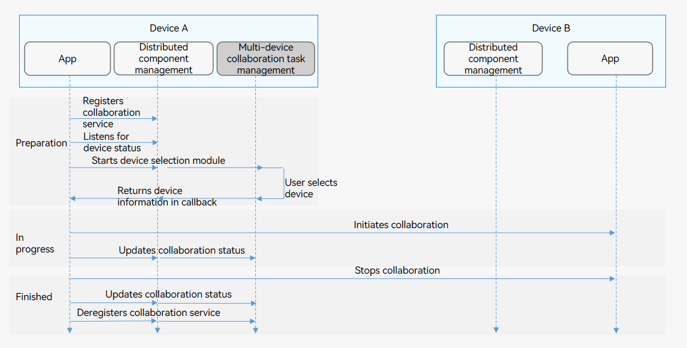

# Multi-device Collaboration (for System Applications Only)


## When to Use

Multi-device coordination involves the following scenarios:

- [Starting UIAbility and ServiceExtensionAbility Across Devices (No Data Returned)](#starting-uiability-and-serviceextensionability-across-devices-no-data-returned)

- [Starting UIAbility Across Devices (Data Returned)](#starting-uiability-across-devices-data-returned)

- [Connecting to ServiceExtensionAbility Across Devices](#connecting-to-serviceextensionability-across-devices)

- [Using Cross-Device Call](#using-cross-device-call)


## Multi-Device Collaboration Process

The figure below shows the multi-device collaboration process.

**Figure 1** Multi-device collaboration process 



## Constraints

- Since multi-device collaboration task management is not available, you can obtain the device list by developing system applications. Access to third-party applications is not supported.

- Multi-device collaboration must comply with [Inter-Device Component Startup Rules](component-startup-rules.md#inter-device-component-startup-rules).

- For better user experience, you are advised to use the **want** parameter to transmit data smaller than 100 KB.


## Starting UIAbility and ServiceExtensionAbility Across Devices (No Data Returned)

On device A, touch the **Start** button provided by the initiator application to start a specified UIAbility on device B.


### Available APIs

**Table 1** Cross-device startup APIs

| **API**| **Description**|
| -------- | -------- |
| startAbility(want: Want, callback: AsyncCallback&lt;void&gt;): void; | Starts UIAbility and ServiceExtensionAbility. This API uses an asynchronous callback to return the result.|


### How to Develop

1. Request the **ohos.permission.DISTRIBUTED_DATASYNC** permission. For details, see [Applying for Permissions](../security/accesstoken-guidelines.md#stage-model).

2. Request the data synchronization permission. The sample code for displaying a dialog box to request the permission is as follows:
   
   ```ts
   requestPermission() {   
       let context = this.context
       let permissions: Array<string> = ['ohos.permission.DISTRIBUTED_DATASYNC']   
       context.requestPermissionsFromUser(permissions).then((data) => {   
           console.info("Succeed to request permission from user with data: "+ JSON.stringify(data))
       }).catch((error) => {       
           console.info("Failed to request permission from user with error: "+ JSON.stringify(error))   
       }) 
   }
   ```

3. Obtain the device ID of the target device.
   
   ```ts
   import deviceManager from '@ohos.distributedHardware.deviceManager';
   
   let dmClass;
   function initDmClass() {
       // createDeviceManager is a system API.
       deviceManager.createDeviceManager('ohos.samples.demo', (err, dm) => {
           if (err) {
               // ...
               return
           }
           dmClass = dm
       })
   }
   function getRemoteDeviceId() {
       if (typeof dmClass === 'object' && dmClass !== null) {
           let list = dmClass.getTrustedDeviceListSync()
           if (typeof (list) === 'undefined' || typeof (list.length) === 'undefined') {
               console.info('EntryAbility onButtonClick getRemoteDeviceId err: list is null')
               return;
           }
           return list[0].deviceId
       } else {
           console.info('EntryAbility onButtonClick getRemoteDeviceId err: dmClass is null')
       }
   }
   ```

4. Set the target component parameters, and call **startAbility()** to start UIAbility or ServiceExtensionAbility.
   
   ```ts
   let want = {
       deviceId: getRemoteDeviceId(), 
       bundleName: 'com.example.myapplication',
       abilityName: 'FuncAbility',
       moduleName: 'module1', // moduleName is optional.
   }
   // context is the AbilityContext of the initiator UIAbility.
   this.context.startAbility(want).then(() => {
       // ...
   }).catch((err) => {
       // ...
   })
   ```


## Starting UIAbility Across Devices (Data Returned)

On device A, touch the **Start** button provided by the initiator application to start a specified UIAbility on device B. When the UIAbility on device B exits, a value is sent back to the initiator application.


### Available APIs

**Table 2** APIs for starting a UIAbility across devices and returning the result data

| API| Description|
| -------- | -------- |
| startAbilityForResult(want: Want, callback: AsyncCallback&lt;AbilityResult&gt;): void; | Starts a UIAbility. This API uses an asynchronous callback to return the result when the UIAbility is terminated.|
| terminateSelfWithResult(parameter: AbilityResult, callback: AsyncCallback&lt;void&gt;): void;| Terminates this UIAbility. This API uses an asynchronous callback to return the ability result information. It is used together with **startAbilityForResult**.|
| terminateSelfWithResult(parameter: AbilityResult): Promise&lt;void&gt;; | Terminates this UIAbility. This API uses a promise to return the ability result information. It is used together with **startAbilityForResult**.|


### How to Develop

1. Request the **ohos.permission.DISTRIBUTED_DATASYNC** permission. For details, see [Applying for Permissions](../security/accesstoken-guidelines.md#stage-model).

2. Request the data synchronization permission. The sample code for displaying a dialog box to request the permission is as follows:
   
   ```ts
   requestPermission() {   
       let context = this.context
       let permissions: Array<string> = ['ohos.permission.DISTRIBUTED_DATASYNC']   
       context.requestPermissionsFromUser(permissions).then((data) => {   
           console.info("Succeed to request permission from user with data: "+ JSON.stringify(data))
       }).catch((error) => {       
           console.info("Failed to request permission from user with error: "+ JSON.stringify(error))   
       }) 
   }
   ```

3. Set the target component parameters on the initiator, and call **startAbilityForResult()** to start the target UIAbility. **data** in the asynchronous callback is used to receive the information returned by the target UIAbility to the initiator UIAbility after the target UIAbility terminates itself. For details about how to implement **getRemoteDeviceId()**, see [Starting UIAbility and ServiceExtensionAbility Across Devices (No Data Returned)](#starting-uiability-and-serviceextensionability-across-devices-no-data-returned).
   
   ```ts
   let want = {
       deviceId: getRemoteDeviceId(), 
       bundleName: 'com.example.myapplication',
       abilityName: 'FuncAbility',
       moduleName: 'module1', // moduleName is optional.
   }
   // context is the AbilityContext of the initiator UIAbility.
   this.context.startAbilityForResult(want).then((data) => {
       // ...
   }).catch((err) => {
       // ...
   })
   ```

4. After the UIAbility task at the target device is complete, call **terminateSelfWithResult()** to return the data to the initiator UIAbility.
   
   ```ts
   const RESULT_CODE: number = 1001;
   let abilityResult = {
       resultCode: RESULT_CODE,
       want: {
           bundleName: 'com.example.myapplication',
           abilityName: 'FuncAbility',
           moduleName: 'module1',
       },
   }
   // context is the AbilityContext of the target UIAbility.
   this.context.terminateSelfWithResult(abilityResult, (err) => {
       // ...
   });
   ```

5. The initiator UIAbility receives the information returned by the target UIAbility and processes the information.
   
   ```ts
   const RESULT_CODE: number = 1001;
   
   // ...
   
   // context is the AbilityContext of the initiator UIAbility.
   this.context.startAbilityForResult(want).then((data) => {
       if (data?.resultCode === RESULT_CODE) {
           // Parse the information returned by the target UIAbility.
           let info = data.want?.parameters?.info
           // ...
       }
   }).catch((err) => {
       // ...
   })
   ```


## Connecting to ServiceExtensionAbility Across Devices

A system application can connect to a service on another device by calling [connectServiceExtensionAbility()](../reference/apis/js-apis-inner-application-uiAbilityContext.md#abilitycontextconnectserviceextensionability). For example, in the distributed game scenario, a tablet is used as the remote control and a smart TV is used as the display.


### Available APIs

**Table 3** APIs for cross-device connection

| API| Description|
| -------- | -------- |
| connectServiceExtensionAbility(want: Want, options: ConnectOptions): number; | Connects to a ServiceExtensionAbility.|
| disconnectServiceExtensionAbility(connection: number, callback: AsyncCallback&lt;void&gt;): void; | Disconnects a connection. This API uses an asynchronous callback to return the result.|
| disconnectServiceExtensionAbility(connection: number): Promise&lt;void&gt;; | Disconnects a connection. This API uses a promise to return the result.|


### How to Develop

1. Configure the data synchronization permission in the **module.json5** file. The sample code is as follows:
   
   ```json
   {
     "module": {
       "requestPermissions":[  
         {  
           "name" : "ohos.permission.DISTRIBUTED_DATASYNC",
         }
       ]
     }
   }
   ```

2. Request the data synchronization permission. The sample code for displaying a dialog box to request the permission is as follows:
   
   ```ts
   requestPermission() {   
       let context = this.context
       let permissions: Array<string> = ['ohos.permission.DISTRIBUTED_DATASYNC']   
       context.requestPermissionsFromUser(permissions).then((data) => {   
           console.info("Succeed to request permission from user with data: "+ JSON.stringify(data))
       }).catch((error) => {       
           console.info("Failed to request permission from user with error: "+ JSON.stringify(error))   
       }) 
   }
   ```

3. (Optional) [Implement a background service](serviceextensionability.md#implementing-a-background-service). Perform this operation only if no background service is available.

4. Connect to the background service.
   - Implement the **IAbilityConnection** class. **IAbilityConnection** provides the following callbacks that you should implement: **onConnect()**, **onDisconnect()**, and **onFailed()**. The **onConnect()** callback is invoked when a service is connected, **onDisconnect()** is invoked when a service is unexpectedly disconnected, and **onFailed()** is invoked when the connection to a service fails.
   - Set the target component parameters, including the target device ID, bundle name, and ability name.
   - Call **connectServiceExtensionAbility** to initiate a connection.
   - Receive the service handle returned by the target device when the connection is successful.
   - Perform cross-device invoking and obtain the result returned by the target service.
     
      ```ts
      import rpc from '@ohos.rpc';
      
      const REQUEST_CODE = 99;
      let want = {
          "deviceId": getRemoteDeviceId(), 
          "bundleName": "com.example.myapplication",
          "abilityName": "ServiceExtAbility"
      };
      let options = {
          onConnect(elementName, remote) {
              console.info('onConnect callback');
              if (remote === null) {
                  console.info(`onConnect remote is null`);
                  return;
              }
              let option = new rpc.MessageOption();
              let data = new rpc.MessageParcel();
              let reply = new rpc.MessageParcel();
              data.writeInt(1);
              data.writeInt(99); // You can send data to the target application for corresponding operations.
      
              // @param code Indicates the service request code sent by the client.
              // @param data Indicates the {@link MessageParcel} object sent by the client.
              // @param reply Indicates the response message object sent by the remote service.
              // @param options Specifies whether the operation is synchronous or asynchronous.
              // 
              // @return Returns {@code true} if the operation is successful; returns {@code false} otherwise.
              remote.sendRequest(REQUEST_CODE, data, reply, option).then((ret) => {
                  let msg = reply.readInt();   // Receive the information (100) returned by the target device if the connection is successful.
                  console.info(`sendRequest ret:${ret} msg:${msg}`);
              }).catch((error) => {
                  console.info('sendRequest failed');
              });
          },
          onDisconnect(elementName) {
              console.info('onDisconnect callback')
          },
          onFailed(code) {
              console.info('onFailed callback')
          }
      }
      // The ID returned after the connection is set up must be saved. The ID will be passed for service disconnection.
      let connectionId = this.context.connectServiceExtensionAbility(want, options);
      ```

      For details about how to implement **getRemoteDeviceId()**, see [Starting UIAbility and ServiceExtensionAbility Across Devices (No Data Returned)](#starting-uiability-and-serviceextensionability-across-devices-no-data-returned).

5. Disconnect the connection. Use **disconnectServiceExtensionAbility()** to disconnect from the background service.
   
   ```ts
   let connectionId = 1 // ID returned when the service is connected through connectServiceExtensionAbility.
   this.context.disconnectServiceExtensionAbility(connectionId).then((data) => {
       console.info('disconnectServiceExtensionAbility success');
   }).catch((error) => {
       console.error('disconnectServiceExtensionAbility failed');
   })
   ```


## Using Cross-Device Call

The basic principle of cross-device call is the same as that of intra-device call. For details, see [Using Call to Implement UIAbility Interaction (for System Applications Only)](uiability-intra-device-interaction.md#using-call-to-implement-uiability-interaction-for-system-applications-only).

The following describes how to implement multi-device collaboration through cross-device call.


### Available APIs

**Table 4** Call APIs

| API| Description|
| -------- | -------- |
| startAbilityByCall(want: Want): Promise&lt;Caller&gt;; | Starts a UIAbility in the foreground or background and obtains the caller object for communicating with the UIAbility.|
| on(method: string, callback: CalleeCallBack): void | Callback invoked when the CalleeAbility registers a method.|
| off(method: string): void | Callback invoked when the CalleeAbility deregisters a method.|
| call(method: string, data: rpc.Parcelable): Promise&lt;void&gt; | Sends agreed parcelable data to the CalleeAbility.|
| callWithResult(method: string, data: rpc.Parcelable): Promise&lt;rpc.MessageSequence&gt; | Sends agreed parcelable data to the CalleeAbility and obtains the agreed parcelable data returned by the CalleeAbility.|
| release(): void | Releases the caller object.|
| on(type: "release", callback: OnReleaseCallback): void | Callback invoked when the caller object is released.|


### How to Develop

1. Configure the data synchronization permission in the **module.json5** file. The sample code is as follows:
   
   ```json
   {
     "module": {
       "requestPermissions":[  
         {  
           "name" : "ohos.permission.DISTRIBUTED_DATASYNC",
         }
       ]
     }
   }
   ```

2. Request the data synchronization permission. The sample code for displaying a dialog box to request the permission is as follows:
   
   ```ts
   requestPermission() {   
       let context = this.context
       let permissions: Array<string> = ['ohos.permission.DISTRIBUTED_DATASYNC']   
       context.requestPermissionsFromUser(permissions).then((data) => {   
           console.info("Succeed to request permission from user with data: "+ JSON.stringify(data))
       }).catch((error) => {       
           console.info("Failed to request permission from user with error: "+ JSON.stringify(error))   
       }) 
   }
   ```

3. Create the CalleeAbility.

   For the CalleeAbility, implement the callback to receive data and the methods to marshal and unmarshal data. When data needs to be received, use **on()** to register a listener. When data does not need to be received, use **off()** to deregister the listener.
   
   1. Configure the launch type of the UIAbility.

      Set **launchType** of the CalleeAbility to **singleton** in the **module.json5** file.

      | JSON Field| Description|
      | -------- | -------- |
      | "launchType"| UIAbility launch type. Set this parameter to **singleton**.|

      An example of the UIAbility configuration is as follows:

       ```json
       "abilities":[{
           "name": ".CalleeAbility",
           "srcEnty": "./ets/CalleeAbility/CalleeAbility.ts",
           "launchType": "singleton",
           "description": "$string:CalleeAbility_desc",
           "icon": "$media:icon",
           "label": "$string:CalleeAbility_label",
           "exported": true
       }]
       ```

   2. Import the **UIAbility** module.
   
       ```ts
       import Ability from '@ohos.app.ability.UIAbility'
       ```

   3. Define the agreed parcelable data.
   
       The data formats sent and received by the CallerAbility and CalleeAbility must be consistent. In the following example, the data formats are number and string.

       ```ts
       export default class MyParcelable {
           num: number = 0
           str: string = ""
       
           constructor(num, string) {
               this.num = num
               this.str = string
           }
       
           marshalling(messageSequence) {
               messageSequence.writeInt(this.num)
               messageSequence.writeString(this.str)
               return true
           }
       
           unmarshalling(messageSequence) {
               this.num = messageSequence.readInt()
               this.str = messageSequence.readString()
               return true
           }
       }
       ```
   
   4. Implement **Callee.on** and **Callee.off**.

       In the following example, the **MSG_SEND_METHOD** listener is registered in **onCreate()** of the ability and deregistered in **onDestroy()**. After receiving parcelable data, the application processes the data and returns the data result. You need to implement processing based on service requirements.

       ```ts
       const TAG: string = '[CalleeAbility]'
       const MSG_SEND_METHOD: string = 'CallSendMsg'
       
       function sendMsgCallback(data) {
           console.info('CalleeSortFunc called')
       
           // Obtain the parcelable data sent by the CallerAbility.
           let receivedData = new MyParcelable(0, '')
           data.readParcelable(receivedData)
           console.info(`receiveData[${receivedData.num}, ${receivedData.str}]`)
       
           // Process the data.
           // Return the parcelable data result to the CallerAbility.
           return new MyParcelable(receivedData.num + 1, `send ${receivedData.str} succeed`)
       }
       
       export default class CalleeAbility extends Ability {
           onCreate(want, launchParam) {
               try {
                   this.callee.on(MSG_SEND_METHOD, sendMsgCallback)
               } catch (error) {
                   console.info(`${MSG_SEND_METHOD} register failed with error ${JSON.stringify(error)}`)
               }
           }
       
           onDestroy() {
               try {
                   this.callee.off(MSG_SEND_METHOD)
               } catch (error) {
                   console.error(TAG, `${MSG_SEND_METHOD} unregister failed with error ${JSON.stringify(error)}`)
               }
           }
       }
       ```

4. Obtain the caller object and access the CalleeAbility.
   1. Import the **UIAbility** module.
      
       ```ts
       import Ability from '@ohos.app.ability.UIAbility'
       ```
       
   2. Obtain the caller object.

       The **context** attribute of the UIAbility implements **startAbilityByCall** to obtain the caller object for communication. The following example uses **this.context** to obtain the **context** attribute of the UIAbility, uses **startAbilityByCall** to start the CalleeAbility, obtain the caller object, and register the **onRelease** listener of the CallerAbility. You need to implement processing based on service requirements.

       ```ts
       async onButtonGetRemoteCaller() {
           var caller = undefined
           var context = this.context
       
           context.startAbilityByCall({
               deviceId: getRemoteDeviceId(),
               bundleName: 'com.samples.CallApplication',
               abilityName: 'CalleeAbility'
           }).then((data) => {
               if (data != null) {
                   caller = data
                   console.info('get remote caller success')
                   // Register the onRelease() listener of the CallerAbility.
                   caller.onRelease((msg) => {
                       console.info(`remote caller onRelease is called ${msg}`)
                   })
                   console.info('remote caller register OnRelease succeed')
               }
           }).catch((error) => {
               console.error(`get remote caller failed with ${error}`)
           })
       }
       ```

       For details about how to implement **getRemoteDeviceId()**, see [Starting UIAbility and ServiceExtensionAbility Across Devices (No Data Returned)](#starting-uiability-and-serviceextensionability-across-devices-no-data-returned).

5. Sends agreed parcelable data to the CalleeAbility.
   1. The parcelable data can be sent to the CalleeAbility with or without a return value. The method and parcelable data must be consistent with those of the CalleeAbility. The following example describes how to send data to the CalleeAbility.
      
       ```ts
       const MSG_SEND_METHOD: string = 'CallSendMsg'
       async onButtonCall() {
           try {
               let msg = new MyParcelable(1, 'origin_Msg')
               await this.caller.call(MSG_SEND_METHOD, msg)
           } catch (error) {
               console.info(`caller call failed with ${error}`)
           }
       }
       ```

   2. In the following, **CallWithResult** is used to send data **originMsg** to the CalleeAbility and assign the data processed by the **CallSendMsg** method to **backMsg**.
      
       ```ts
       const MSG_SEND_METHOD: string = 'CallSendMsg'
       originMsg: string = ''
       backMsg: string = ''
       async onButtonCallWithResult(originMsg, backMsg) {
           try {
               let msg = new MyParcelable(1, originMsg)
               const data = await this.caller.callWithResult(MSG_SEND_METHOD, msg)
               console.info('caller callWithResult succeed')
       
               let result = new MyParcelable(0, '')
               data.readParcelable(result)
               backMsg(result.str)
               console.info(`caller result is [${result.num}, ${result.str}]`)
           } catch (error) {
               console.info(`caller callWithResult failed with ${error}`)
           }
       }
       ```

6. Release the caller object.

   When the caller object is no longer required, use **release()** to release it.

   ```ts
   releaseCall() {
       try {
           this.caller.release()
           this.caller = undefined
           console.info('caller release succeed')
       } catch (error) {
           console.info(`caller release failed with ${error}`)
       }
   }
   ```