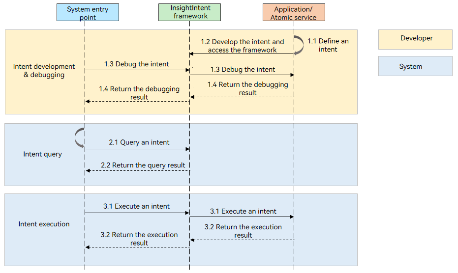

# InsightIntent Framework Overview
## When to Use
The InsightIntent framework empowers you to seamlessly integrate core functionalities of your application into the system's entry points as intents. This integration allows users to conveniently access and use these functionalities through system-wide triggers like voice assistants or auto-select cards.

For example, once a navigation feature is connected to the framework, users can simply issue a natural language command such as "Navigate to the office by bike," and the system will parse the command, invoke the corresponding intent, and initiate the navigation process.

<!--RP1-->
<!--RP1End-->

## Basic Concepts
- Intent: a logical unit representing a system function call, typically encapsulating an application's core functionality. The system entry point triggers the corresponding service logic by parsing the user's natural language input.
- Intent parameter: data passed from the system entry point to the application when an intent is triggered. The parameter format must comply with the intent definition.
- Intent execution result: data returned by the application to the system entry point after the intent is executed.
- Intent entity: a key information object involved in the intent execution process, capable of carrying both intent parameters and execution results.

Taking travel navigation as an example, parameters such as travel mode, departure location, destination, and waypoints are all intent parameters. The navigation result is conveyed through the intent execution result, and both the intent parameters and execution result can be encapsulated within an intent entity.

## Working Principles
The InsightIntent Framework operates through a collaborative workflow between the developer side and the system entry point side:
- Intent development: Define intents, intent parameters, and execution results based on your application's functionalities, using configuration files or decorators.
- Intent debugging: Post-development, use the debugging tools provided by the framework to verify the correctness of intent definitions and execution flows.
- Intent query: The system entry point queries the registered intents and their definitions within the InsightIntent Framework.
- Intent execution: After matching the user's request to the corresponding intent, the system entry point triggers the intent's execution, passing necessary parameters to the application, which then executes the feature and returns the result.

## Intent Development Mode
The InsightIntent framework provides two development modes, as described in the table below.

| Mode| Description| Usage Scenario|
| --- | --- | --- |
| [Developing Intents Using Configuration Files](./insight-intent-config-development.md)| Define intents and parameters via configuration files. The intent parameters must be consistent with those at the system entry.| - Applicable versions: API version 11 and later. - Development implementation: Bind the intent execution to an application component, and add new intent configuration files and intent execution files.|
| [Developing Intents Using Decorators](./insight-intent-decorator-development.md) (Recommended)| Define intents and parameters through code, supporting access to both standard and custom intents.| - Applicable versions: API version 20 and later. - Development implementation: You can directly define existing features as intents, making development more convenient. You can also add new intent execution files.|
