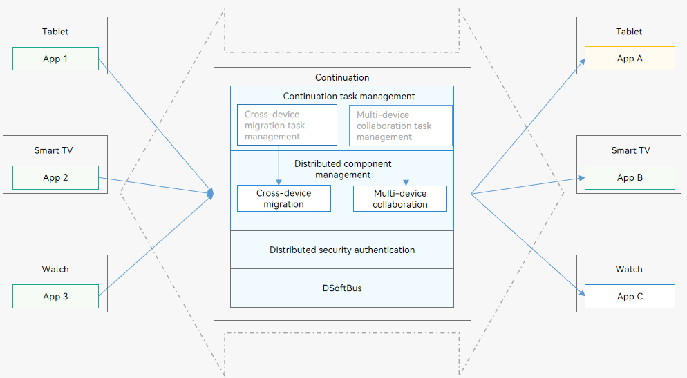

# Hopping Overview

## When to Use

As the all-scenario, multi-device lifestyle becomes popular, users have an increasing number of devices. Each device provides users with what they need in a certain scenario. For example, watches allow users to view information in a timely manner, and smart TVs deliver an immersive watching experience. However, each device has its limitations. For example, typing text on a smart TV is frustrating as it is much more difficult than on a mobile device. If multiple devices can sense each other through a distributed OS and together form a super device, the strengths of each device can be fully exerted, thereby providing a more natural and smoother distributed experience for users.

Distributed operations across devices are called hopping, which is further classified into [cross-device migration](hop-cross-device-migration.md) and [multi-device collaboration](hop-multi-device-collaboration.md).

## Basic Concepts

- **Hopping**
  
  Hopping refers to distributed operations across devices. It breaks device boundaries and makes applications modular. For example, a user can edit the same email, carry out fitness, or play a game across devices. Hopping provides broad application scenarios, innovative product perspectives, enhanced product advantages, and superior experience.  
  
- **Cross-device migration**

  When the environment changes, for example, when a user goes outdoors or when a more appropriate device is detected, the user can migrate an ongoing mission to another device for better experience. The application on the original device can automatically exit, depending on the setting. A typical cross-device migration scenario is as follows: You migrate a video playback task from a tablet to a smart TV. The video application on the tablet exits. From the perspective of application development, cross-device migration enables the UIAbility component running on device A to migrate to device B. After the migration is complete, the UIAbility component on device B continues the mission, whereas that on device A automatically exits (depending on the setting).

- **Multi-device collaboration**

  Multi-device collaboration provides users with more efficient and immersive experience than with a single device. Multi-device collaboration is used in the following typical scenarios:
  
  - Scenario 1: You open the same note on devices A and B. On device A, you select images from the local Gallery, insert them to the note, and edit them. On device B, you edit the text.
  - Scenario 2: : You are chatting with a customer on device A, and the customer asks for a file, which is stored on device B. You can use the chat software to open the file application on device B, select the required file, and send it back to device A. Then, you use the chat software to send it to the customer. From the perspective of application development, multi-device collaboration enables different [UIAbility](../reference/apis-ability-kit/js-apis-app-ability-uiAbility.md) or [ServiceExtensionAbility](../reference/apis-ability-kit/js-apis-app-ability-serviceExtensionAbility-sys.md) components to run simultaneously or alternately on multiple devices to provide a complete service, or enables the same UIAbility and ServiceExtensionAbility component to run simultaneously on multiple devices to provide a complete service.

## Hopping Architecture

The system provides APIs for you to implement application hopping. The hopping architecture has the following advantages:

- Capabilities such as remote service invocation to facilitate service design

- Simultaneous hopping of multiple applications

- Different device forms supported, such as tablets, smart TVs, and watches

The following figure shows the hopping architecture.

  **Figure 1** Hopping architecture

   

- Cross-device migration mission management: The initiator accepts a migration request from the user, provides a migration entry, and displays the migration result.

- Multi-device collaboration mission management: The initiator accepts an application registration request and provides management capabilities such as starting or stopping collaboration and status display.

- Distributed component management: provides capabilities such as remote service startup, remote service connection, and remote migration, and provides applications with cross-device migration or multi-device collaboration based on a combination of these capabilities.

- Distributed security authentication: provides an E2E encrypted channel for cross-device transmission between applications to ensure that the right person uses the right data through the right device.

- DSoftBus: functions as a unified communication base for a wide range of devices, such as tablets, wearables, and smart TVs, and enables unified distributed communication between these devices.
