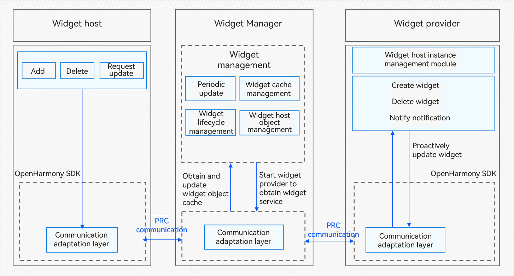

# Developing a JS Widget


The following describes how to develop JS widgets based on the web-like development paradigm.


## Working Principles

Below shows the working principles of the widget framework.

**Figure 1** Widget framework working principles in the stage model



The widget host consists of the following modules:

- Widget usage: provides operations such as creating, deleting, or updating a widget.

- Communication adapter: provided by the OpenHarmony SDK for communication with the Widget Manager. It sends widget-related operations to the Widget Manager.

The Widget Manager consists of the following modules:

- Periodic updater: starts a scheduled task based on the update policy to periodically update a widget after it is added to the Widget Manager.

- Cache manager: caches view information of a widget after it is added to the Widget Manager to directly return the cached data when the widget is obtained next time. This reduces the latency greatly.

- Lifecycle manager: suspends update when a widget is switched to the background or is blocked, and updates and/or clears widget data during upgrade and deletion.

- Object manager: manages RPC objects of the widget host. It is used to verify requests from the widget host and process callbacks after the widget update.

- Communication adapter: communicates with the widget host and provider through RPCs.

The widget provider consists of the following modules:

- Widget service: implemented by the widget provider developer to process requests on widget creation, update, and deletion, and to provide corresponding widget services.

- Instance manager: implemented by the widget provider developer for persistent management of widget instances allocated by the Widget Manager.

- Communication adapter: provided by the OpenHarmony SDK for communication with the Widget Manager. It pushes update data to the Widget Manager.

> **NOTE**
> You only need to develop the widget provider. The system automatically handles the work of the widget host and Widget Manager.


## Available APIs

The **FormExtensionAbility** class has the following APIs. For details, see [FormExtensionAbility](../reference/apis/js-apis-app-form-formExtensionAbility.md).

| Name| Description|
| -------- | -------- |
| onAddForm(want:&nbsp;Want):&nbsp;formBindingData.FormBindingData | Called to notify the widget provider that a widget has been created.|
| onCastToNormalForm(formId:&nbsp;string):&nbsp;void | Called to notify the widget provider that a temporary widget has been converted to a normal one.|
| onUpdateForm(formId:&nbsp;string):&nbsp;void | Called to notify the widget provider that a widget has been updated.|
| onChangeFormVisibility(newStatus:&nbsp;{&nbsp;[key:&nbsp;string]:&nbsp;number&nbsp;}):&nbsp;void | Called to notify the widget provider of the change in widget visibility.|
| onFormEvent(formId:&nbsp;string,&nbsp;message:&nbsp;string):&nbsp;void | Called to instruct the widget provider to receive and process a widget event.|
| onRemoveForm(formId:&nbsp;string):&nbsp;void | Called to notify the widget provider that a widget has been destroyed.|
| onConfigurationUpdate(config:&nbsp;Configuration):&nbsp;void | Called when the configuration of the environment where the widget is running is updated.|
| onShareForm?(formId:&nbsp;string):&nbsp;{&nbsp;[key:&nbsp;string]:&nbsp;any&nbsp;} | Called by the widget provider to receive shared widget data.|

The **FormProvider** class has the following APIs. For details, see [FormProvider](../reference/apis/js-apis-app-form-formProvider.md).

| Name| Description|
| -------- | -------- |
| setFormNextRefreshTime(formId:&nbsp;string,&nbsp;minute:&nbsp;number,&nbsp;callback:&nbsp;AsyncCallback&lt;void&gt;):&nbsp;void; | Sets the next refresh time for a widget. This API uses an asynchronous callback to return the result.|
| setFormNextRefreshTime(formId:&nbsp;string,&nbsp;minute:&nbsp;number):&nbsp;Promise&lt;void&gt;; | Sets the next refresh time for a widget. This API uses a promise to return the result.|
| updateForm(formId:&nbsp;string,&nbsp;formBindingData:&nbsp;FormBindingData,&nbsp;callback:&nbsp;AsyncCallback&lt;void&gt;):&nbsp;void; | Updates a widget. This API uses an asynchronous callback to return the result.|
| updateForm(formId:&nbsp;string,&nbsp;formBindingData:&nbsp;FormBindingData):&nbsp;Promise&lt;void&gt;; | Updates a widget. This API uses a promise to return the result.|

The **FormBindingData** class has the following APIs. For details, see [FormBindingData](../reference/apis/js-apis-app-form-formBindingData.md).

| Name| Description|
| -------- | -------- |
| createFormBindingData(obj?:&nbsp;Object&nbsp;\|&nbsp;string):&nbsp;FormBindingData | Creates a **FormBindingData** object.|


## How to Develop

The widget provider development based on the [stage model](stage-model-development-overview.md) involves the following key steps:

- [Creating a FormExtensionAbility Instance](#creating-a-formextensionability-instance): Develop the lifecycle callback functions of FormExtensionAbility.

- [Configuring the Widget Configuration Files](#configuring-the-widget-configuration-files): Configure the application configuration file **module.json5** and profile configuration file.

- [Persistently Storing Widget Data](#persistently-storing-widget-data): This operation is a form of widget data exchange.

- [Updating Widget Data](#updating-widget-data): Call **updateForm()** to update the information displayed on a widget.

- [Developing the Widget UI Page](#developing-the-widget-ui-page): Use HML+CSS+JSON to develop a JS widget UI page.

- [Developing Widget Events](#developing-widget-events): Add the router and message events for a widget.


### Creating a FormExtensionAbility Instance

To create a widget in the stage model, implement the lifecycle callbacks of **FormExtensionAbility**. Generate a widget template by referring to [Developing a Service Widget](https://developer.harmonyos.com/en/docs/documentation/doc-guides/ohos-development-service-widget-0000001263280425).

1. Import related modules to **EntryFormAbility.ts**.

   
   ```ts
   import FormExtensionAbility from '@ohos.app.form.FormExtensionAbility';
   import formBindingData from '@ohos.app.form.formBindingData';
   import formInfo from '@ohos.app.form.formInfo';
   import formProvider from '@ohos.app.form.formProvider';
   import dataStorage from '@ohos.data.storage';
   ```

2. Implement the FormExtension lifecycle callbacks in **EntryFormAbility.ts**.

   
   ```ts
   export default class EntryFormAbility extends FormExtensionAbility {
       onAddForm(want) {
           console.info('[EntryFormAbility] onAddForm');
           // Called when the widget is created. The widget provider should return the widget data binding class.
           let obj = {
               "title": "titleOnCreate",
               "detail": "detailOnCreate"
           };
           let formData = formBindingData.createFormBindingData(obj);
           return formData;
       }
       onCastToNormalForm(formId) {
           // Called when the widget host converts the temporary widget into a normal one. The widget provider should do something to respond to the conversion.
           console.info('[EntryFormAbility] onCastToNormalForm');
       }
       onUpdateForm(formId) {
           // Override this method to support scheduled updates, periodic updates, or updates requested by the widget host.
           console.info('[EntryFormAbility] onUpdateForm');
           let obj = {
               "title": "titleOnUpdate",
               "detail": "detailOnUpdate"
           };
           let formData = formBindingData.createFormBindingData(obj);
           formProvider.updateForm(formId, formData).catch((error) => {
               console.info('[EntryFormAbility] updateForm, error:' + JSON.stringify(error));
           });
       }
       onChangeFormVisibility(newStatus) {
           // Called when the widget host initiates an event about visibility changes. The widget provider should do something to respond to the notification. This callback takes effect only for system applications.
           console.info('[EntryFormAbility] onChangeFormVisibility');
       }
       onFormEvent(formId, message) {
           // If the widget supports event triggering, override this method and implement the trigger.
           console.info('[EntryFormAbility] onFormEvent');
       }
       onRemoveForm(formId) {
           // Delete widget data.
           console.info('[EntryFormAbility] onRemoveForm');
       }
       onConfigurationUpdate(config) {
           console.info('[EntryFormAbility] nConfigurationUpdate, config:' + JSON.stringify(config));
       }
       onAcquireFormState(want) {
           return formInfo.FormState.READY;
       }
   }
   ```

> **NOTE**
> FormExtensionAbility cannot reside in the background. Therefore, continuous tasks cannot be processed in the widget lifecycle callbacks.


### Configuring the Widget Configuration Files

1. Configure ExtensionAbility information under **extensionAbilities** in the [module.json5 file](../quick-start/module-configuration-file.md). For a FormExtensionAbility, you must specify **metadata**. Specifically, set **name** to **ohos.extension.form** (fixed), and set **resource** to the index of the widget configuration information.
   Example configuration:

   
   ```json
   {
     "module": {
       ...
       "extensionAbilities": [
         {
           "name": "EntryFormAbility",
           "srcEntry": "./ets/entryformability/EntryFormAbility.ts",
           "label": "$string:EntryFormAbility_label",
           "description": "$string:EntryFormAbility_desc",
           "type": "form",
           "metadata": [
             {
               "name": "ohos.extension.form",
               "resource": "$profile:form_config"
             }
           ]
         }
       ]
     }
   }
   ```

2. Configure the widget configuration information. In the **metadata** configuration item of FormExtensionAbility, you can specify the resource index of specific configuration information of the widget. For example, if resource is set to **$profile:form_config**, **form_config.json** in the **resources/base/profile/** directory of the development view is used as the profile configuration file of the widget. The following table describes the internal field structure.

   **Table 1** Widget profile configuration file

   | Field| Description| Data Type| Default Value Allowed|
   | -------- | -------- | -------- | -------- |
   | name | Class name of the widget. The value is a string with a maximum of 127 bytes.| String| No|
   | description | Description of the widget. The value can be a string or a resource index to descriptions in multiple languages. The value is a string with a maximum of 255 bytes.| String| Yes (initial value: left empty)|
   | src | Full path of the UI code corresponding to the widget.| String| No|
   | window | Window-related configurations.| Object| Yes|
   | isDefault | Whether the widget is a default one. Each UIAbility has only one default widget.<br>- **true**: The widget is the default one.<br>- **false**: The widget is not the default one.| Boolean| No|
   | colorMode | Color mode of the widget.<br>- **auto**: auto-adaptive color mode<br>- **dark**: dark color mode<br>- **light**: light color mode| String| Yes (initial value: **auto**)|
   | supportDimensions | Grid styles supported by the widget.<br>- **1 * 2**: indicates a grid with one row and two columns.<br>- **2 * 2**: indicates a grid with two rows and two columns.<br>- **2 * 4**: indicates a grid with two rows and four columns.<br>- **4 * 4**: indicates a grid with four rows and four columns.| String array| No|
   | defaultDimension | Default grid style of the widget. The value must be available in the **supportDimensions** array of the widget.| String| No|
   | updateEnabled | Whether the widget can be updated periodically.<br>- **true**: The widget can be updated at a specified interval (**updateDuration**) or at the scheduled time (**scheduledUpdateTime**). **updateDuration** takes precedence over **scheduledUpdateTime**.<br>- **false**: The widget cannot be updated periodically.| Boolean| No|
   | scheduledUpdateTime | Scheduled time to update the widget. The value is in 24-hour format and accurate to minute.<br>**updateDuration** takes precedence over **scheduledUpdateTime**. If both are specified, the value specified by **updateDuration** is used.| String| Yes (initial value: **0:0**)|
   | updateDuration | Interval to update the widget. The value is a natural number, in the unit of 30 minutes.<br>If the value is **0**, this field does not take effect.<br>If the value is a positive integer *N*, the interval is calculated by multiplying *N* and 30 minutes.<br>**updateDuration** takes precedence over **scheduledUpdateTime**. If both are specified, the value specified by **updateDuration** is used.| Number| Yes (initial value: **0**)|
   | formConfigAbility | Link to a specific page of the application. The value is a URI.| String| Yes (initial value: left empty)|
   | formVisibleNotify | Whether the widget is allowed to use the widget visibility notification.| String| Yes (initial value: left empty)|
   | metaData | Metadata of the widget. This field contains the array of the **customizeData** field.| Object| Yes (initial value: left empty)|

   Example configuration:

   
   ```json
   {
     "forms": [
       {
         "name": "widget",
         "description": "This is a service widget.",
         "src": "./js/widget/pages/index/index",
         "window": {
           "designWidth": 720,
           "autoDesignWidth": true
         },
         "colorMode": "auto",
         "isDefault": true,
         "updateEnabled": true,
         "scheduledUpdateTime": "10:30",
         "updateDuration": 1,
         "defaultDimension": "2*2",
         "supportDimensions": [
           "2*2"
         ]
       }
     ]
   }
   ```


### Persistently Storing Widget Data

A widget provider is usually started when it is needed to provide information about a widget. The Widget Manager supports multi-instance management and uses the widget ID to identify an instance. If the widget provider supports widget data modification, it must persistently store the data based on the widget ID, so that it can access the data of the target widget when obtaining, updating, or starting a widget.


```ts
const DATA_STORAGE_PATH = "/data/storage/el2/base/haps/form_store";
async function storeFormInfo(formId: string, formName: string, tempFlag: boolean) {
    // Only the widget ID (formId), widget name (formName), and whether the widget is a temporary one (tempFlag) are persistently stored.
    let formInfo = {
        "formName": formName,
        "tempFlag": tempFlag,
        "updateCount": 0
    };
    try {
        const storage = await dataStorage.getStorage(DATA_STORAGE_PATH);
        // put form info
        await storage.put(formId, JSON.stringify(formInfo));
        console.info(`[EntryFormAbility] storeFormInfo, put form info successfully, formId: ${formId}`);
        await storage.flush();
    } catch (err) {
        console.error(`[EntryFormAbility] failed to storeFormInfo, err: ${JSON.stringify(err)}`);
    }
}

export default class EntryFormAbility extends FormExtension {
    ...
    onAddForm(want) {
        console.info('[EntryFormAbility] onAddForm');

        let formId = want.parameters["ohos.extra.param.key.form_identity"];
        let formName = want.parameters["ohos.extra.param.key.form_name"];
        let tempFlag = want.parameters["ohos.extra.param.key.form_temporary"];
        // Persistently store widget data for subsequent use, such as instance acquisition and update.
        // Implement this API based on project requirements.
        storeFormInfo(formId, formName, tempFlag);

        let obj = {
            "title": "titleOnCreate",
            "detail": "detailOnCreate"
        };
        let formData = formBindingData.createFormBindingData(obj);
        return formData;
    }
}
```

You should override **onRemoveForm** to implement widget data deletion.


```ts
const DATA_STORAGE_PATH = "/data/storage/el2/base/haps/form_store";
async function deleteFormInfo(formId: string) {
    try {
        const storage = await dataStorage.getStorage(DATA_STORAGE_PATH);
        // del form info
        await storage.delete(formId);
        console.info(`[EntryFormAbility] deleteFormInfo, del form info successfully, formId: ${formId}`);
        await storage.flush();
    } catch (err) {
        console.error(`[EntryFormAbility] failed to deleteFormInfo, err: ${JSON.stringify(err)}`);
    }
}

...

export default class EntryFormAbility extends FormExtension {
    ...
    onRemoveForm(formId) {
        console.info('[EntryFormAbility] onRemoveForm');
        // Delete the persistent widget instance data.
        // Implement this API based on project requirements.
        deleteFormInfo(formId);
    }
}
```

For details about persistence, see [Application Data Persistence Overview](../database/app-data-persistence-overview.md).

The **Want** object passed in by the widget host to the widget provider contains a flag that specifies whether the requested widget is normal or temporary.

- Normal widget: a widget persistently used by the widget host

- Temporary widget: a widget temporarily used by the widget host

Data of a temporary widget will be deleted on the Widget Manager if the widget framework is killed and restarted. The widget provider, however, is not notified of the deletion and still keeps the data. Therefore, the widget provider needs to clear the data of temporary widgets proactively if the data has been kept for a long period of time. If the widget host has converted a temporary widget into a normal one, the widget provider should change the widget data from temporary storage to persistent storage. Otherwise, the widget data may be deleted by mistake.


### Updating Widget Data

When an application initiates a scheduled or periodic update, the application obtains the latest data and calls **updateForm()** to update the widget.


```ts
onUpdateForm(formId) {
    // Override this method to support scheduled updates, periodic updates, or updates requested by the widget host.
    console.info('[EntryFormAbility] onUpdateForm');
    let obj = {
        "title": "titleOnUpdate",
        "detail": "detailOnUpdate"
    };
    let formData = formBindingData.createFormBindingData(obj);
    // Call the updateForm() method to update the widget. Only the data passed through the input parameter is updated. Other information remains unchanged.
    formProvider.updateForm(formId, formData).catch((error) => {
        console.info('[EntryFormAbility] updateForm, error:' + JSON.stringify(error));
    });
}
```


### Developing the Widget UI Page

You can use the web-like paradigm (HML+CSS+JSON) to develop JS widget pages. This section describes how to develop a page shown below.


- HML: uses web-like paradigm components to describe the widget page information.

  
  ```html
  <div class="container">
    <stack>
      <div class="container-img">
        <image src="/common/widget.png" class="bg-img"></image>
      </div>
      <div class="container-inner">
        <text class="title">{{title}}</text>
        <text class="detail_text" onclick="routerEvent">{{detail}}</text>
      </div>
    </stack>
  </div>
  ```

- CSS: defines style information about the web-like paradigm components in HML.

  
  ```css
  .container {
    flex-direction: column;
    justify-content: center;
    align-items: center;
  }
  
  .bg-img {
    flex-shrink: 0;
    height: 100%;
  }
  
  .container-inner {
    flex-direction: column;
    justify-content: flex-end;
    align-items: flex-start;
    height: 100%;
    width: 100%;
    padding: 12px;
  }
  
  .title {
    font-size: 19px;
    font-weight: bold;
    color: white;
    text-overflow: ellipsis;
    max-lines: 1;
  }
  
  .detail_text {
    font-size: 16px;
    color: white;
    opacity: 0.66;
    text-overflow: ellipsis;
    max-lines: 1;
    margin-top: 6px;
  }
  ```

- JSON: defines data and event interaction on the widget UI page.

  
  ```json
  {
    "data": {
      "title": "TitleDefault",
      "detail": "TextDefault"
    },
    "actions": {
      "routerEvent": {
        "action": "router",
        "abilityName": "EntryAbility",
        "params": {
          "message": "add detail"
        }
      }
    }
  }
  ```


### Developing Widget Events

You can set router and message events for components on a widget. The router event applies to UIAbility redirection, and the message event applies to custom click events.

The key steps are as follows:

1. Set the **onclick** field in the HML file to **routerEvent** or **messageEvent**, depending on the **actions** settings in the JSON file.

2. Set the router event.

   - **action**: **"router"**, which indicates a router event.
   - **abilityName**: name of the UIAbility to redirect to (PageAbility component in the FA model and UIAbility component in the stage model). For example, the default UIAbility name of the stage model created by DevEco Studio is EntryAbility.
   - **params**: custom parameters passed to the target UIAbility. Set them as required. The value can be obtained from **parameters** in **want** used for starting the target UIAbility. For example, in the lifecycle function **onCreate** of the main ability in the stage model, you can obtain **want** and its **parameters** field.

3. Set the message event.

   - **action**: **"message"**, which indicates a message event.
   - **params**: custom parameters of the message event. Set them as required. The value can be obtained from **message** in the widget lifecycle function **onFormEvent()**.

The following is an example:

- HML file:

  
  ```html
  <div class="container">
    <stack>
      <div class="container-img">
        <image src="/common/widget.png" class="bg-img"></image>
      </div>
      <div class="container-inner">
        <text class="title" onclick="routerEvent">{{title}}</text>
        <text class="detail_text" onclick="messageEvent">{{detail}}</text>
      </div>
    </stack>
  </div>
  ```

- CSS file:

  
  ```css
  .container {
    flex-direction: column;
    justify-content: center;
    align-items: center;
  }
  
  .bg-img {
    flex-shrink: 0;
    height: 100%;
  }
  
  .container-inner {
    flex-direction: column;
    justify-content: flex-end;
    align-items: flex-start;
    height: 100%;
    width: 100%;
    padding: 12px;
  }
  
  .title {
    font-size: 19px;
    font-weight: bold;
    color: white;
    text-overflow: ellipsis;
    max-lines: 1;
  }
  
  .detail_text {
    font-size: 16px;
    color: white;
    opacity: 0.66;
    text-overflow: ellipsis;
    max-lines: 1;
    margin-top: 6px;
  }
  ```

- JSON file

  
  ```json
  {
    "data": {
      "title": "TitleDefault",
      "detail": "TextDefault"
    },
    "actions": {
      "routerEvent": {
        "action": "router",
        "abilityName": "EntryAbility",
        "params": {
          "info": "router info",
          "message": "router message"
        }
      },
      "messageEvent": {
        "action": "message",
        "params": {
          "detail": "message detail"
        }
      }
    }
  }
  ```

- Receive the router event and obtain parameters in UIAbility.


  ```ts
  import UIAbility from '@ohos.app.ability.UIAbility'
  
  export default class EntryAbility extends UIAbility {
      onCreate(want, launchParam) {
          let params = JSON.parse(want.parameters.params);
          // Obtain the info parameter passed in the router event.
          if (params.info === "router info") {
              // do something
              // console.info("router info:" + params.info)
          }
          // Obtain the message parameter passed in the router event.
          if (params.message === "router message") {
              // do something
              // console.info("router message:" + params.message)
          }
      }
      ...
  };
  ```

- Receive the message event in FormExtensionAbility and obtain parameters.

  
  ```ts
  import FormExtension from '@ohos.app.form.FormExtensionAbility';
  
  export default class FormAbility extends FormExtension {
      ...
      onFormEvent(formId, message) {
          // Obtain the detail parameter passed in the message event.
          let msg = JSON.parse(message)
          if (msg.detail === "message detail") {
              // do something
              // console.info("message info:" + msg.detail)
          }
      }
      ...
  };
  ```
