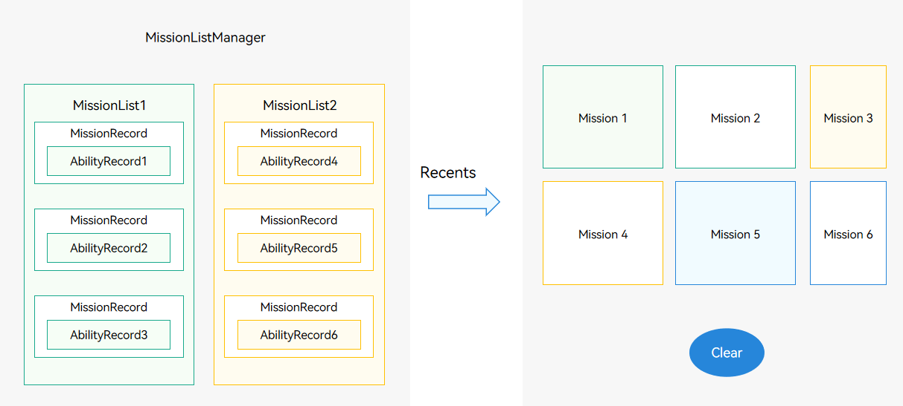

# Mission Management Scenarios


Before getting started with the development of mission management, be familiar with the following concepts related to mission management:


- AbilityRecord: minimum unit for the system service to manage a UIAbility instance. It corresponds to a UIAbility component instance of an application. A maximum of 512 UIAbility instances can be managed on the system service side.

- MissionRecord: minimum unit for mission management. One MissionRecord has only one AbilityRecord. In other words, a UIAbility component instance corresponds to a mission.

- MissionList: a list of missions started from the home screen. It records the startup relationship between missions. In a MissionList, a mission is started by the mission above it, and the mission at the bottom is started by the home screen.

- MissionListManager: system mission management module that maintains all the MissionLists and is consistent with the list in **Recents**.
  
  **Figure 1** Mission management
  
  


Missions are managed by system applications (such as home screen), rather than third-party applications. Users interact with missions through **Recents**. After creating a mission, users can perform the following operations on **Recents**:


- Delete a mission.

- Lock or unlock a mission. (Locked missions are not cleared when users attempt to clear all missions in **Recents**.)

- Clear all missions in **Recents**.

- Switch a mission to the foreground.


A UIAbility instance corresponds to an independent mission. Therefore, when an application calls [startAbility()](../reference/apis-ability-kit/js-apis-inner-application-uiAbilityContext.md#uiabilitycontextstartability) to start a UIAbility, a mission is created.

1. To call [missionManager](../reference/apis-ability-kit/js-apis-application-missionManager-sys.md) to manage missions, the home screen application must request the **ohos.permission.MANAGE_MISSIONS** permission. For details, see [Requesting Permissions for system_basic Applications](../security/AccessToken/determine-application-mode.md#requesting-permissions-for-system_basic-applications).

2. You can use **missionManager** to manage missions, for example, listening for mission changes, obtaining mission information or snapshots, and clearing, locking, or unlocking missions.

    ```ts
    import { missionManager } from '@kit.AbilityKit';
    import { BusinessError } from '@kit.BasicServicesKit';
    import { image } from '@kit.ImageKit';
    import { promptAction } from '@kit.ArkUI';
    import { hilog } from '@kit.PerformanceAnalysisKit';

    const TAG: string = 'TaskManager';
    const DOMAIN_NUMBER: number = 0xFF00;
    ```
    ```ts
    private listenerId: number = 0;
    private missionId: number = 0;
    private listener: missionManager.MissionListener = {
      // Listen for mission creation.
      onMissionCreated: (mission: number) => {
        hilog.info(DOMAIN_NUMBER, TAG, '--------onMissionCreated-------');
      },
      // Listen for mission destruction.
      onMissionDestroyed: (mission: number) => {
        hilog.info(DOMAIN_NUMBER, TAG, '--------onMissionDestroyed-------');
      },
      // Listen for mission snapshot changes.
      onMissionSnapshotChanged: (mission: number) => {
        hilog.info(DOMAIN_NUMBER, TAG, '--------onMissionMovedToFront-------');
      },
      // Listen for switching the mission to the foreground.
      onMissionMovedToFront: (mission: number) => {
        hilog.info(DOMAIN_NUMBER, TAG, '--------onMissionClosed-------');
      },
      // Listen for mission icon changes.
      onMissionIconUpdated: (mission: number, icon: image.PixelMap) => {
        hilog.info(DOMAIN_NUMBER, TAG, '--------onMissionIconUpdated-------');
      },
      // Listen for mission name changes.
      onMissionLabelUpdated: (mission: number) => {
        hilog.info(DOMAIN_NUMBER, TAG, '--------onMissionLabelUpdated-------');
      },
      // Listen for mission closure events.
      onMissionClosed: (mission: number) => {
        hilog.info(DOMAIN_NUMBER, TAG, '--------onMissionClosed-------');
      }
    };
    ```
    ```ts
    // 1. Register a mission change listener.
    this.listenerId = missionManager.on('mission', this.listener);
    promptAction.showToast({
      message: 'register_success_toast'
    });
    hilog.info(DOMAIN_NUMBER, TAG, `missionManager.on success, listenerId = ${this.listenerId}`);
    ```
    ```ts
    // 2. Obtain the latest 20 missions in the system.
    missionManager.getMissionInfos('', 20, (error: BusinessError, missions: Array<missionManager.MissionInfo>) => {
      if (error.code) {
        hilog.error(DOMAIN_NUMBER, TAG, `getMissionInfos is called, error code: ${error.code}, err msg: ${error.message}.`);
        return;
      }
      hilog.info(DOMAIN_NUMBER, TAG, `size = ${missions.length}.`);
      hilog.info(DOMAIN_NUMBER, TAG, `missions = ${JSON.stringify(missions)}.`);
      
      //Check whether Recents in the system contains etsclock.
      for (let i = 0;i < missions.length; i++) {
        if (missions[i].want.bundleName === 'ohos.samples.etsclock') {
          promptAction.showToast({
            message: 'obtain_success_toast'
          });
          hilog.info(DOMAIN_NUMBER, TAG, `getMissionInfos.find etsclock, missionId  = ${missions[i].missionId}`);
          this.missionId = missions[i].missionId;
          return;
        }
      }
      promptAction.showToast({
        message: 'obtain_failed_toast'
      });
    });
    ```
    ```ts
    // 3. Obtain the detailed information about a mission.
    missionManager.getMissionInfo('', this.missionId).then((data: missionManager.MissionInfo) => {
      promptAction.showToast({
        message: JSON.stringify(data.want.bundleName)
      });
      hilog.info(DOMAIN_NUMBER, TAG, `getMissionInfo successfully. Data: ${JSON.stringify(data)}`);
    }).catch((error: BusinessError) => {
      hilog.info(DOMAIN_NUMBER, TAG, `getMissionInfo failed. Cause: ${error.message}`);
    });
    ```
    ```ts
    // 4. Obtain the mission snapshot.
    missionManager.getMissionSnapShot('', this.missionId, (error: BusinessError, snapshot: missionManager.MissionSnapshot) => {
      if (error === null) {
        promptAction.showToast({
          message: 'obtain_snapshot_success_toast'
        });
      }
      hilog.info(DOMAIN_NUMBER, TAG, `getMissionSnapShot is called, error code: ${error.code}, error msg: ${error.message}.`);
      hilog.info(DOMAIN_NUMBER, TAG, `bundleName = ${snapshot.ability.bundleName}.`);
    })
    ```
    ```ts
    // 5. Obtain the low-resolution mission snapshot.
    missionManager.getLowResolutionMissionSnapShot('', this.missionId, (error: BusinessError, snapshot: missionManager.MissionSnapshot) => {
      if (error === null) {
        promptAction.showToast({
          message: 'obtain_low_snapshot_success_toast'
        });
      }
      hilog.info(DOMAIN_NUMBER, TAG, `getLowResolutionMissionSnapShot is called, error code: ${error.code}, error msg: ${error.message}.`);
      hilog.info(DOMAIN_NUMBER, TAG, `bundleName = ${snapshot.ability.bundleName}.`);
    })
    ```
    ```ts
    // 6-1. Lock the mission.
    missionManager.lockMission(this.missionId).then(() => {
      promptAction.showToast({
        message: 'lock_success_toast'
      });
      hilog.info(DOMAIN_NUMBER, TAG, 'lockMission is called ');
    });
    ```
    ```ts
    // 6-2. Unlock the mission.
    missionManager.unlockMission(this.missionId).then(() => {
      promptAction.showToast({
        message: 'unlock_success_toast'
      });
      hilog.info(DOMAIN_NUMBER, TAG, 'unlockMission is called ');
    });
    ```
    ```ts
    // 7. Switch the mission to the foreground.
    missionManager.moveMissionToFront(this.missionId).then(() => {
      hilog.info(DOMAIN_NUMBER, TAG, 'moveMissionToFront is called ');
    });
    ```
    ```ts
    // 8. Clear a single mission.
    missionManager.clearMission(this.missionId).then(() => {
      promptAction.showToast({
        message: 'delete_success_toast'
      });
      hilog.info(DOMAIN_NUMBER, TAG, 'clearMission is called ');
    });
    ```
    ```ts
    // 9. Clear all missions.
    missionManager.clearAllMissions().catch((err: BusinessError) => {
      hilog.info(DOMAIN_NUMBER, TAG, `${err.code}`);
    });
    ```
    ```ts
    // 10. Deregister the mission change listener.
    missionManager.off('mission', this.listenerId, (error: BusinessError) => {
      if (error === null) {
        promptAction.showToast({
          message: 'unregister_success_toast'
        });
      }
      hilog.info(DOMAIN_NUMBER, TAG, 'unregisterMissionListener');
    })
    ```

   
