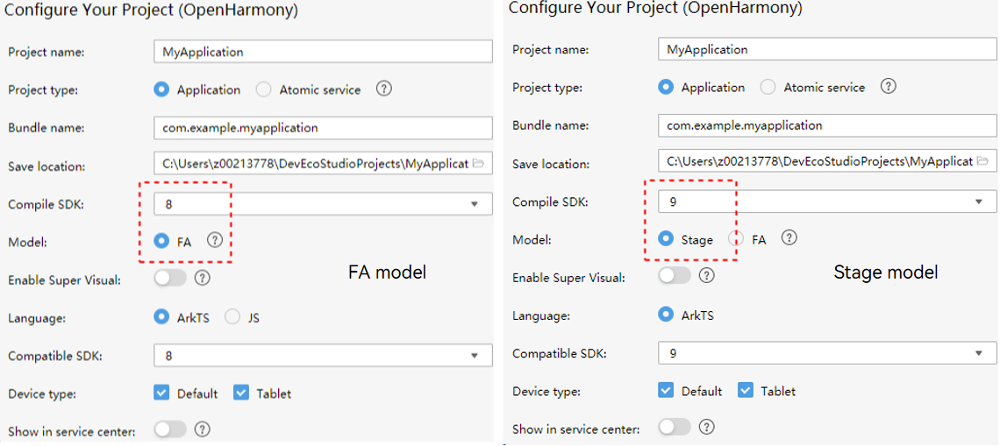
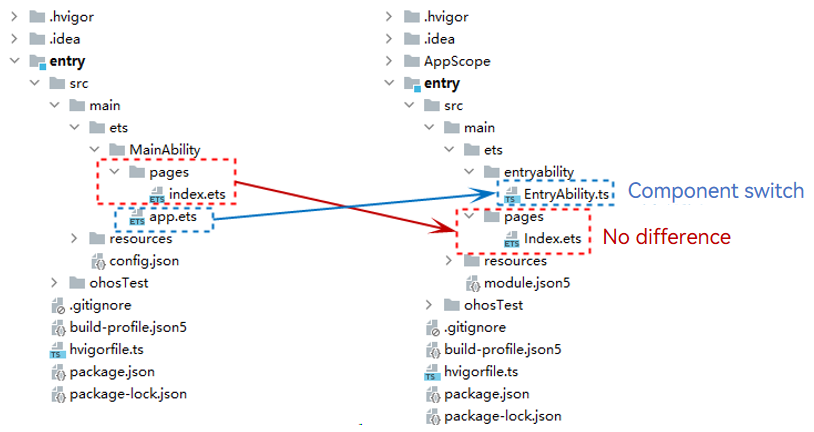
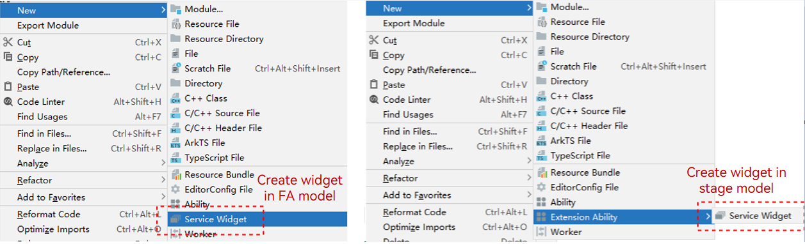
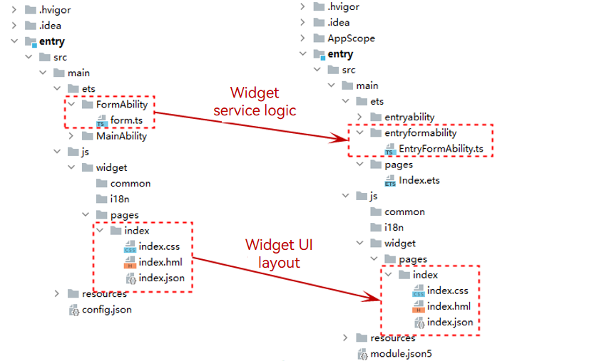

# Model Switching Overview

Perform the following operations to switch a declarative paradigm-based application developed based on the FA model to the stage model.

- Project switch: Create an application project of the stage model.

  

- [Configuration file switch](configuration-file-diff.md): Switch **config.json** to **app.json5** and **module.json5**.

  

- [Component switch](pageability-switch.md): Switch the PageAbility, ServiceAbility, and DataAbility components of the FA model to the UIAbility and ExtensionAbility components of the stage model. The figure below shows only the switching from PageAbility to UIAbility. The left part is the FA model, and **app.ets** is the PageAbility component. The right part is the stage model, and **EntryAbility.ets** is the UIAbility component.

  

- [Widget switch](widget-switch.md): Switch the FormAbility component of the FA model to the FormExtensionAbility component of the stage model. In the figure below, **Service Widget** is FormAbility in the FA model and FormExtensionAbility in the stage model.

  

  

- [API switch](api-switch-overview.md): Switch the APIs with the **FAModelOnly** tag used in the FA model to the recommended APIs in the stage model.

  
