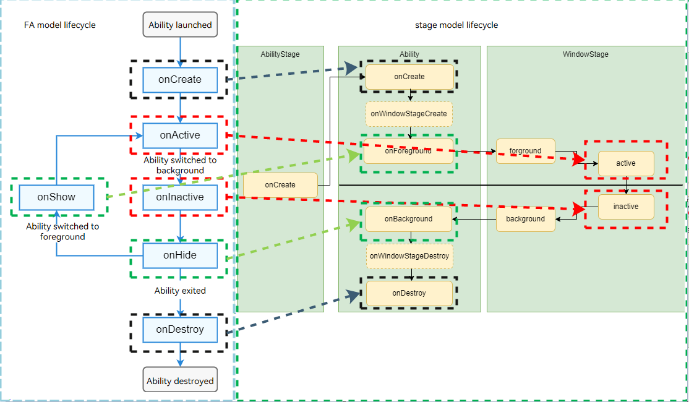

# PageAbility Switching


The PageAbility component in the FA model corresponds to the UIAbility component in the stage model. To switch a PageAbility to a UIAbility, perform the following operations:


1. [Create a UIAbility](uiability-usage.md) in the stage model.

2. Migrate the PageAbility code to the UIAbility.

   The PageAbility lifecycle is basically the same as the UIAbility lifecycle. The table below describes the details.

   | PageAbility| UIAbility| Mapping Description|
   | -------- | -------- | -------- |
   | onCreate(): void| onCreate(want: Want, launchParam: AbilityConstant.LaunchParam): void | The two methods have the same meaning and invoking time. In the stage model, parameters are added to the callback so that you can obtain startup-related data during creation.|
   | NA | onWindowStageCreate(windowStage: window.WindowStage): void| This method is available only in the stage model. The callback is invoked when a window is created.|
   | onActive(): void | on(eventType: 'windowStageEvent', callback: Callback&lt;WindowStageEventType&gt;): void;<br>WindowStageEventType.ACTIVE | The two methods have the same meaning and invoking time. In the stage model, this method is moved to the window object.|
   | onShow(): void | onForeground(): void | The two methods have the same meaning, invoking time, and parameters.|
   | onNewWant(want: Want): void| onNewWant(want: Want, launchParam: AbilityConstant.LaunchParam): void | The two methods have the same meaning and invoking time. In the stage model, the **LaunchParam** parameter is added to notify the application of the startup cause.|
   | onInactive(): void| on(eventType: 'windowStageEvent', callback: Callback&lt;WindowStageEventType&gt;): void;<br>WindowStageEventType.INACTIVE | The two methods have the same meaning and invoking time. In the stage model, this method is moved to the window object.|
   | onHide(): void | onBackground(): void | The two methods have the same meaning, invoking time, and parameters.|
   | NA | onWindowStageDestroy(): void | This method is available only in the stage model. The callback is invoked when a window is destroyed.|
   | onDestroy(): void | onDestroy(): void | The two methods have the same meaning, invoking time, and parameters.|

   

3. Adjust the migrated code, since the methods of loading pages are different.

   - In the FA model, page loading is configured by setting page information in **config.json**.
   - In the stage model, page loading is triggered through **windowStage.loadContent** in the **onWindowStageCreate** callback.

   The following uses the task of displaying the **pages/Index** page after the ability is started as an example. In the FA model, add the following code in the **config.json** file:
   
   
      ```json
      "pages" : [
          "pages/Index"
      ]
      ```
   
   In the stage model, implement the following API in **MainAbility**:
   
   
     ```ts
     import { UIAbility } from '@kit.AbilityKit';
     import { hilog } from '@kit.PerformanceAnalysisKit';
     import { window } from '@kit.ArkUI';
   
     export default class TestAbility extends UIAbility {
       // ...
       onWindowStageCreate(windowStage: window.WindowStage) {
         hilog.info(0x0000, 'testTag', '%{public}s', 'TestAbility onWindowStageCreate');
         windowStage.loadContent('testability/pages/Index', (err, data) => {
           if (err.code) {
             hilog.error(0x0000, 'testTag', 'Failed to load the content. Cause: %{public}s', JSON.stringify(err) ?? '');
             return;
           }
           hilog.info(0x0000, 'testTag', 'Succeeded in loading the content. Data: %{public}s',
             JSON.stringify(data) ?? '');
         });
       }
       // ...
     }
     ```
   
   Then configure the page to load in the **resources/base/profile/main_pages.json** file.
   
     ```json
     {
       "src": [
         "pages/Index"
       ]
     }
     ```