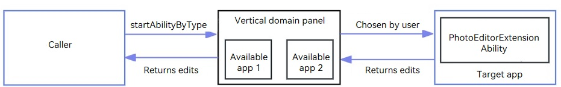

# Starting an Image Editing Application
## When to Use
If an application does not have the image editing capability but needs to edit an image, it can call **startAbilityByType** to start the vertical domain panel that displays available image editing applications, which can be used to edit the image. An image editing application can use the PhotoEditorExtensionAbility to implement an image editing page and register the page with the image editing panel. In this way, its image editing capability is opened to other applications.

The following figure shows the process.



For example, when a user chooses to edit an image in Gallery, the Gallery application can call **startAbilityByType** to start the image editing application panel. The user can choose an application that has implemented the PhotoEditorExtensionAbility to edit the image.

## Available APIs

For details about the APIs, see [PhotoEditorExtensionAbility](../reference/apis-ability-kit/js-apis-app-ability-photoEditorExtensionAbility.md) and [PhotoEditorExtensionContext](../reference/apis-ability-kit/js-apis-app-ability-photoEditorExtensionContext.md).

| **API** | **Description**|
| -------- | -------- |
| onStartContentEditing(uri: string, want:Want, session: UIExtensionContentSession):void       | Called when content editing starts. Operations such as reading original images and loading pages can be performed in the callback.|
| saveEditedContentWithImage(pixelMap: image.PixelMap, option: image.PackingOption): Promise\<AbilityResult\>  | Saves the passed-in **PixelMap** object, which is an edited image.  |

## Target Application (Image Editing Application): Implementing an Image Editing Page

1. Manually create a PhotoEditorExtensionAbility in the DevEco Studio project.
    1. In the **ets** directory of the target module, right-click and choose **New > Directory** to create a directory named **PhotoEditorExtensionAbility**.
    2. In the **PhotoEditorExtensionAbility** directory, right-click and choose **New > File** to create an .ets file, for example, **ExamplePhotoEditorAbility.ets**.
2. Override the lifecycle callbacks of **onCreate**, **onForeground**, **onBackground**, **onDestroy**, and **onStartContentEditing** in the **ExamplePhotoEditorAbility.ets** file.

    Load the entry page file **pages/Index.ets** in **onStartContentEditing**, and save the session, URI, and instance objects in the LocalStorage, which passes them to the page.

    ```ts
    import { PhotoEditorExtensionAbility,UIExtensionContentSession,Want } from '@kit.AbilityKit';
    import { hilog } from '@kit.PerformanceAnalysisKit';

    const TAG = '[ExamplePhotoEditorAbility]';
    export default class ExamplePhotoEditorAbility extends PhotoEditorExtensionAbility {
      onCreate() {
        hilog.info(0x0000, TAG, 'onCreate');
      }

      // Obtain an image, load the page, and pass the required parameters to the page.
      onStartContentEditing(uri: string, want: Want, session: UIExtensionContentSession): void {
        hilog.info(0x0000, TAG, `onStartContentEditing want: ${JSON.stringify(want)}, uri: ${uri}`);

        const storage: LocalStorage = new LocalStorage({
          "session": session,
          "uri": uri
        } as Record<string, Object>);

        session.loadContent('pages/Index', storage);
      }

      onForeground() {
        hilog.info(0x0000, TAG, 'onForeground');
      }

      onBackground() {
        hilog.info(0x0000, TAG, 'onBackground');
      }

      onDestroy() {
        hilog.info(0x0000, TAG, 'onDestroy');
      }
    }

    ```
3. Implement image editing in the page.

    After image editing is complete, call **saveEditedContentWithImage** to save the image and return the callback result to the caller through **terminateSelfWithResult**.

    ```ts
    import { common } from '@kit.AbilityKit';
    import { UIExtensionContentSession, Want } from '@kit.AbilityKit';
    import { hilog } from '@kit.PerformanceAnalysisKit';
    import { fileIo } from '@kit.CoreFileKit';
    import { image } from '@kit.ImageKit';

    const storage = LocalStorage.getShared()
    const TAG = '[ExamplePhotoEditorAbility]';

    @Entry
    @Component
    struct Index {
      @State message: string = 'editImg';
      @State originalImage: PixelMap | null = null;
      @State editedImage: PixelMap | null = null;
      private newWant ?: Want;

      aboutToAppear(): void {
        let originalImageUri = storage?.get<string>("uri") ?? "";
        hilog.info(0x0000, TAG, `OriginalImageUri: ${originalImageUri}.`);

        this.readImageByUri(originalImageUri).then(imagePixMap => {
          this.originalImage = imagePixMap;
        })
      }

      // Read the image based on the URI.
      async readImageByUri(uri: string): Promise < PixelMap | null > {
        hilog.info(0x0000, TAG, "uri: " + uri);
        let file: fileIo.File | undefined;
        try {
          file = await fileIo.open(uri, fileIo.OpenMode.READ_ONLY);
          hilog.info(0x0000, TAG, "Original image file id: " + file.fd);

          let imageSourceApi: image.ImageSource = image.createImageSource(file.fd);
          if(!imageSourceApi) {
            hilog.info(0x0000, TAG, "ImageSourceApi failed");
            return null;
          }
          let pixmap: image.PixelMap = await imageSourceApi.createPixelMap();
          if(!pixmap) {
            hilog.info(0x0000, TAG, "createPixelMap failed");
            return null;
          }
          this.originalImage = pixmap;
          fileIo.closeSync(file);
          return pixmap;
        } catch(e) {
          hilog.info(0x0000, TAG, `ReadImage failed:${e}`);
        } finally {
          fileIo.close(file);
        }
        return null;
      }

      build() {
        Row() {
          Column() {
            Text(this.message)
              .fontSize(50)
              .fontWeight(FontWeight.Bold)

            Button("RotateAndSaveImg").onClick(event => {
              hilog.info(0x0000, TAG, `Start to edit image and save.`);
              // Implement image editing.
              this.originalImage?.rotate(90).then(() => {
                let packOpts: image.PackingOption = { format: "image/jpeg", quality: 98 };
                try {
                  // Call saveEditedContentWithImage to save the image.
                  (getContext(this) as common.PhotoEditorExtensionContext).saveEditedContentWithImage(this.originalImage as image.PixelMap,
                    packOpts).then(data => {
                    if (data.resultCode == 0) {
                      hilog.info(0x0000, TAG, `Save succeed.`);
                    }
                    hilog.info(0x0000, TAG,
                        `saveContentEditingWithImage result: ${JSON.stringify(data)}`);
                    this.newWant = data.want;
                    // data.want.uri: URI of the edited image
                    this.readImageByUri(this.newWant?.uri ?? "").then(imagePixMap => {
                      this.editedImage = imagePixMap;
                    })
                  })
                } catch (e) {
                  hilog.error(0x0000, TAG, `saveContentEditingWithImage failed:${e}`);
                  return;
                }
              })
            }).margin({ top: 10 })

            Button("terminateSelfWithResult").onClick((event => {
              hilog.info(0x0000, TAG, `Finish the current editing.`);

              let session = storage.get('session') as UIExtensionContentSession;
              // Terminate the ability and return the modification result to the caller.
              session.terminateSelfWithResult({ resultCode: 0, want: this.newWant });

            })).margin({ top: 10 })

            Image(this.originalImage).width("100%").height(200).margin({ top: 10 }).objectFit(ImageFit.Contain)

            Image(this.editedImage).width("100%").height(200).margin({ top: 10 }).objectFit(ImageFit.Contain)
          }
          .width('100%')
        }
        .height('100%')
        .backgroundColor(Color.Pink)
        .expandSafeArea([SafeAreaType.SYSTEM], [SafeAreaEdge.BOTTOM])
      }
    }

    ```
4. Register the PhotoEditorExtensionAbility in the **module.json5** file corresponding to the module.

    Set **type** to **photoEditor** and **srcEntry** to the code path of the PhotoEditorExtensionAbility.

    ```json
    {
      "module": {
        "extensionAbilities": [
          {
            "name": "ExamplePhotoEditorAbility",
            "icon": "$media:icon",
            "description": "ExamplePhotoEditorAbility",
            "type": "photoEditor",
            "exported": true,
            "srcEntry": "./ets/PhotoEditorExtensionAbility/ExamplePhotoEditorAbility.ets",
            "label": "$string:EntryAbility_label",
            "extensionProcessMode": "bundle"
          },
        ]
      }
    }
    ```
## Caller Application: Starting an Image Editing Application to Edit an Image
On the UIAbility or UIExtensionAbility page, you can use **startAbilityByType** to start the vertical domain panel of image editing applications. The system automatically searches for and displays the image editing applications that have implemented the [PhotoEditorExtensionAbility](../reference/apis-ability-kit/js-apis-app-ability-photoEditorExtensionAbility.md) on the panel. Then the user can choose an application to edit the image, and the editing result is returned to the caller. The procedure is as follows:
1. Import the modules.
    ```ts
    import { common, wantConstant } from '@kit.AbilityKit';
    import { fileUri, picker } from '@kit.CoreFileKit';
    ```
2. (Optional) Select an image from Gallery.
    ```ts
    async photoPickerGetUri(): Promise < string > {
      try {
        let PhotoSelectOptions = new picker.PhotoSelectOptions();
        PhotoSelectOptions.MIMEType = picker.PhotoViewMIMETypes.IMAGE_TYPE;
        PhotoSelectOptions.maxSelectNumber = 1;
        let photoPicker = new picker.PhotoViewPicker();
        let photoSelectResult: picker.PhotoSelectResult = await photoPicker.select(PhotoSelectOptions);
        return photoSelectResult.photoUris[0];
      } catch(error) {
        let err: BusinessError = error as BusinessError;
        hilog.info(0x0000, TAG, 'PhotoViewPicker failed with err: ' + JSON.stringify(err));
      }
      return "";
    }
    ```
3. Copy the image to the local sandbox path.
   ```ts
    let context = getContext(this) as common.UIAbilityContext;
    let file: fileIo.File | undefined;
    try {
      file = fileIo.openSync(uri, fileIo.OpenMode.READ_ONLY);
      hilog.info(0x0000, TAG, "file: " + file.fd);

      let timeStamp = Date.now();
      // Copy the image to the application sandbox path.
      fileIo.copyFileSync(file.fd, context.filesDir + `/original-${timeStamp}.jpg`);
      fileIo.closeSync(file);

      this.filePath = context.filesDir + `/original-${timeStamp}.jpg`;
      this.originalImage = fileUri.getUriFromPath(this.filePath);
    } catch (e) {
      hilog.info(0x0000, TAG, `readImage failed:${e}`);
    } finally {
      fileIo.close(file);
    }
   ```
4. In the callback function of **startAbilityByType**, use **want.uri** to obtain the URI of the edited image and perform corresponding processing.
    ```ts
      let context = getContext(this) as common.UIAbilityContext;
      let abilityStartCallback: common.AbilityStartCallback = {
        onError: (code, name, message) => {
          const tip: string = `code:` + code + ` name:` + name + ` message:` + message;
          hilog.error(0x0000, TAG, "startAbilityByType:", tip);
        },
        onResult: (result) => {
          // Obtain the URI of the edited image in the callback result and perform corresponding processing.
          let uri = result.want?.uri ?? "";
          hilog.info(0x0000, TAG, "PhotoEditorCaller result: " + JSON.stringify(result));
          this.readImage(uri).then(imagePixMap => {
            this.editedImage = imagePixMap;
          });
        }
      }
    ```
5. Convert the image to an image URI and call **startAbilityByType** to start the image editing application panel.
   ```ts
    let uri = fileUri.getUriFromPath(this.filePath);
    context.startAbilityByType("photoEditor", {
      "ability.params.stream": [uri], // URI of the original image. Only one URI can be passed in.
      "ability.want.params.uriPermissionFlag": wantConstant.Flags.FLAG_AUTH_READ_URI_PERMISSION // At least the read permission should be shared to the image editing application panel.
    } as Record<string, Object>, abilityStartCallback, (err) => {
      let tip: string;
      if (err) {
        tip = `Start error: ${JSON.stringify(err)}`;
        hilog.error(0x0000, TAG, `startAbilityByType: fail, err: ${JSON.stringify(err)}`);
      } else {
        tip = `Start success`;
        hilog.info(0x0000, TAG, "startAbilityByType: ", `success`);
      }
    });
   ```

Example 
```ts
import { common, wantConstant } from '@kit.AbilityKit';
import { fileUri, picker } from '@kit.CoreFileKit';
import { hilog } from '@kit.PerformanceAnalysisKit';
import { fileIo } from '@kit.CoreFileKit';
import { image } from '@kit.ImageKit';
import { BusinessError } from '@kit.BasicServicesKit';
import { JSON } from '@kit.ArkTS';

const TAG = 'PhotoEditorCaller';

@Entry
@Component
struct Index {
  @State message: string = 'selectImg';
  @State originalImage: ResourceStr = "";
  @State editedImage: PixelMap | null = null;
  private filePath: string = "";

  // Read the image based on the URI.
  async readImage(uri: string): Promise < PixelMap | null > {
    hilog.info(0x0000, TAG, "image uri: " + uri);
    let file: fileIo.File | undefined;
    try {
      file = await fileIo.open(uri, fileIo.OpenMode.READ_ONLY);
      hilog.info(0x0000, TAG, "file: " + file.fd);

      let imageSourceApi: image.ImageSource = image.createImageSource(file.fd);
      if(!imageSourceApi) {
        hilog.info(0x0000, TAG, "imageSourceApi failed");
        return null;
      }
      let pixmap: image.PixelMap = await imageSourceApi.createPixelMap();
      if(!pixmap) {
        hilog.info(0x0000, TAG, "createPixelMap failed");
        return null;
      }
      this.editedImage = pixmap;
      fileIo.closeSync(file);
      return pixmap;
    } catch(e) {
      hilog.info(0x0000, TAG, `readImage failed:${e}`);
    } finally {
      fileIo.close(file);
    }
    return null;
  }

  // Select an image from Gallery.
  async photoPickerGetUri(): Promise < string > {
    try {
      let PhotoSelectOptions = new picker.PhotoSelectOptions();
      PhotoSelectOptions.MIMEType = picker.PhotoViewMIMETypes.IMAGE_TYPE;
      PhotoSelectOptions.maxSelectNumber = 1;
      let photoPicker = new picker.PhotoViewPicker();
      let photoSelectResult: picker.PhotoSelectResult = await photoPicker.select(PhotoSelectOptions);
      hilog.info(0x0000, TAG,
        'PhotoViewPicker.select successfully, PhotoSelectResult uri: ' + JSON.stringify(photoSelectResult));
      return photoSelectResult.photoUris[0];
    } catch(error) {
      let err: BusinessError = error as BusinessError;
      hilog.info(0x0000, TAG, 'PhotoViewPicker failed with err: ' + JSON.stringify(err));
    }
    return "";
  }

  build() {
    Row() {
      Column() {
        Text(this.message)
          .fontSize(50)
          .fontWeight(FontWeight.Bold)

        Button("selectImg").onClick(event => {
          // Select an image from Gallery.
          this.photoPickerGetUri().then(uri => {
            hilog.info(0x0000, TAG, "uri: " + uri);

            let context = getContext(this) as common.UIAbilityContext;
            let file: fileIo.File | undefined;
            try {
              file = fileIo.openSync(uri, fileIo.OpenMode.READ_ONLY);
              hilog.info(0x0000, TAG, "file: " + file.fd);

              let timeStamp = Date.now();
              // Copy the image to the application sandbox path.
              fileIo.copyFileSync(file.fd, context.filesDir + `/original-${timeStamp}.jpg`);
              fileIo.closeSync(file);

              this.filePath = context.filesDir + `/original-${timeStamp}.jpg`;
              this.originalImage = fileUri.getUriFromPath(this.filePath);
            } catch (e) {
              hilog.info(0x0000, TAG, `readImage failed:${e}`);
            } finally {
              fileIo.close(file);
            }
          })

        }).width('200').margin({ top: 20 })

        Button("editImg").onClick(event => {
          let context = getContext(this) as common.UIAbilityContext;
          let abilityStartCallback: common.AbilityStartCallback = {
            onError: (code, name, message) => {
              const tip: string = `code:` + code + ` name:` + name + ` message:` + message;
              hilog.error(0x0000, TAG, "startAbilityByType:", tip);
            },
            onResult: (result) => {
              // Obtain the URI of the edited image in the callback result and perform corresponding processing.
              let uri = result.want?.uri ?? "";
              hilog.info(0x0000, TAG, "PhotoEditorCaller result: " + JSON.stringify(result));
              this.readImage(uri).then(imagePixMap => {
                this.editedImage = imagePixMap;
              });
            }
          }
          // Convert the image to an image URI and call startAbilityByType to start the image editing application panel.
          let uri = fileUri.getUriFromPath(this.filePath);
          context.startAbilityByType("photoEditor", {
            "ability.params.stream": [uri], // URI of the original image. Only one URI can be passed in.
            "ability.want.params.uriPermissionFlag": wantConstant.Flags.FLAG_AUTH_READ_URI_PERMISSION // At least the read permission should be shared to the image editing application panel.
          } as Record<string, Object>, abilityStartCallback, (err) => {
            let tip: string;
            if (err) {
              tip = `Start error: ${JSON.stringify(err)}`;
              hilog.error(0x0000, TAG, `startAbilityByType: fail, err: ${JSON.stringify(err)}`);
            } else {
              tip = `Start success`;
              hilog.info(0x0000, TAG, "startAbilityByType: ", `success`);
            }
          });

        }).width('200').margin({ top: 20 })

        Image(this.originalImage).width("100%").height(200).margin({ top: 20 }).objectFit(ImageFit.Contain)

        Image(this.editedImage).width("100%").height(200).margin({ top: 20 }).objectFit(ImageFit.Contain)
      }
      .width('100%')
    }
    .height('100%')
    .backgroundColor(Color.Orange)
    .expandSafeArea([SafeAreaType.SYSTEM], [SafeAreaEdge.BOTTOM])
  }
}

```
