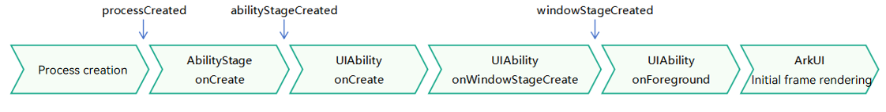

# Application Preloading

## Overview

Starting from API version 20, the application preloading feature is provided. This feature preloads applications to a specific stage when system resources are sufficient, based on user usage patterns. When a user launches an application, the startup time is reduced because part of the application has already been loaded, which helps enhance user experience and the competitiveness of the application.

This feature is particularly suitable for applications that take a long time to start due to the loading of large amounts of resources, such as large gaming applications and large office applications.

## Constraints

- Currently, this feature is supported only on 2-in-1 devices.

- Preloading is supported only for the AbilityStage and UIAbility of the entry module. Regardless of the preloading stage, the entry module must be configured with an entry UIAbility. For details, see step 2 in [How to Develop](#how-to-develop).

- After an application is configured for preloading, whether preloading actually occurs and the specific timing of preloading are determined by the system based on user habits and other information. You cannot intervene in this process.

## Working Principles

When system resources are sufficient, the system preloads the application to a specific stage to improve startup speed. Currently, three preloading stages are supported. You can choose one based on the time-consuming stages of the application's cold start.

> **NOTE**
>
> During application preloading, no UI is displayed. Therefore, no operations related to UI display, interaction, or user visibility should be included at any preloading stage. It is also essential to ensure that all functions operate normally and user experience is not affected when the user officially launches the application.

- **processCreated**: preloads the application to the stage where the process is created. When this stage is configured, the preloading feature creates an empty process and initializes the application, but no lifecycle callbacks are triggered.

- **abilityStageCreated**: preloads the application to the stage where the [AbilityStage](../reference/apis-ability-kit/js-apis-app-ability-abilityStage.md) is created. When this stage is configured, the preloading feature creates an empty process and initializes the application, and then triggers the [onCreate](../reference/apis-ability-kit/js-apis-app-ability-abilityStage.md#oncreate) callback of the [AbilityStage](../reference/apis-ability-kit/js-apis-app-ability-abilityStage.md) of the entry module.

- **windowStageCreated**: preloads the application to the stage where the [WindowStage](../reference/apis-arkui/arkts-apis-window-WindowStage.md) is created. When this stage is configured, the preloading feature creates an empty process and initializes the application, and then triggers the [onCreate](../reference/apis-ability-kit/js-apis-app-ability-abilityStage.md#oncreate) callback of the [AbilityStage](../reference/apis-ability-kit/js-apis-app-ability-abilityStage.md) of the entry module. It then launches the entry UIAbility of the entry module and triggers its [onCreate](../reference/apis-ability-kit/js-apis-app-ability-uiAbility.md#oncreate) and [onWindowStageCreate](../reference/apis-ability-kit/js-apis-app-ability-uiAbility.md#onwindowstagecreate) callbacks. You can obtain the launch reason in the [onCreate](../reference/apis-ability-kit/js-apis-app-ability-uiAbility.md#oncreate) callback of the UIAbility through the enum [launchParam.launchReason](../reference/apis-ability-kit/js-apis-app-ability-abilityConstant.md#launchreason). The enumerated value **PRELOAD** indicates that the current UIAbility is launched by preloading.



## How to Develop

1. Declare the preloading stage supported by the application.

    For example, to preload the application to the **windowStageCreated** stage, configure the [appPreloadPhase](../quick-start/app-configuration-file.md#tags-in-the-configuration-file) tag in the [app.json5](../quick-start/app-configuration-file.md) file.

    ```json
    {
      "app": {
        "bundleName": "com.demo.preloadtest",
        "vendor": "example",
        "versionCode": 1000000,
        "versionName": "1.0.0",
        "icon": "$media:layered_image",
        "label": "$string:app_name",
        "appPreloadPhase": "windowStageCreated"
      }
    }
    ```

2. Configure the entry UIAbility (automatically configured by default when you create a project).

    For example, for an EntryAbility, in the [module.json5](../quick-start/module-configuration-file.md) file of the entry module, set **mainElement** to **EntryAbility**, and add **"entity.system.home"** to **entities** and **"ohos.want.action.home"** to **actions** in the **skills** tag of **EntryAbility**.

    ```json
    {
      "module": {
        "name": "entry",
        "type": "entry",
        "description": "$string:module_desc",
        "mainElement": "EntryAbility",
        "deviceTypes": [
          "2in1"
        ],
        "deliveryWithInstall": true,
        "installationFree": false,
        "pages": "$profile:main_pages",
        "abilities": [
          {
            "name": "EntryAbility",
            "srcEntry": "./ets/entryability/EntryAbility.ets",
            "description": "$string:EntryAbility_desc",
            "icon": "$media:layered_image",
            "label": "$string:EntryAbility_label",
            "startWindowIcon": "$media:startIcon",
            "startWindowBackground": "$color:start_window_background",
            "exported": true,
            "skills": [
              {
                "entities": [
                  "entity.system.home"
                ],
                "actions": [
                  "ohos.want.action.home"
                ]
              }
            ]
          }
        ]
      }
    }
    ```

3. (Optional) Obtain the launch reason of the UIAbility.

    When **appPreloadPhase** is set to **windowStageCreated**, you can obtain the launch reason in the [onCreate](../reference/apis-ability-kit/js-apis-app-ability-uiAbility.md#oncreate) lifecycle callback of the UIAbility through the enumerated value of [launchParam.launchReason](../reference/apis-ability-kit/js-apis-app-ability-abilityConstant.md#launchreason). The enumerated value **PRELOAD** indicates that the current UIAbility is launched by preloading.

    ```ts
    import { AbilityConstant, UIAbility, Want } from '@kit.AbilityKit';

    export default class EntryAbility extends UIAbility {
      onCreate(want: Want, launchParam: AbilityConstant.LaunchParam): void {
        console.info(`EntryAbility onCreate, LaunchReason:${launchParam.launchReason}`);
        // Check whether the UIAbility is started by preloading.
        let isPreloadStart = launchParam.launchReason === AbilityConstant.LaunchReason.PRELOAD;
        // ...
      }
    }
    ```
