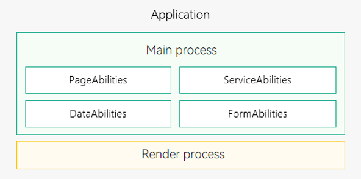

# Process Model (FA Model)

The process model is shown below.

- All PageAbility, ServiceAbility, DataAbility, and FormAbility components of an application (with the same bundle name) run in the same process, which is **Main process** in green in the figure.

- WebView has an independent render process, which is **Render process** in yellow in the figure.

**Figure 1** Process model

The system provides the following inter-process communication (IPC) mechanism:

Common events: This mechanism is used in one-to-many communication scenarios. Multiple subscribers may receive events at the same time.
