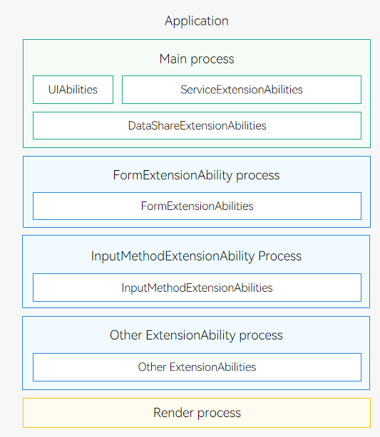
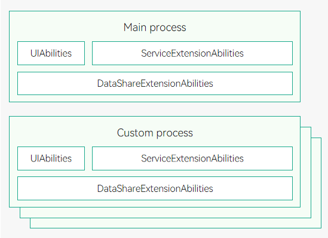

# Process Model (Stage Model)

A process is the basic unit for a system to allocate resources, and is the basis of an operating system structure. The process model is shown below.

- Generally, all UIAbility<!--Del-->, ServiceExtensionAbility, and DataShareExtensionAbility<!--DelEnd--> components of an application (with the same bundle name) run in an independent process, which is **Main process** in green in the figure.
- All ExtensionAbility components of the same type<!--Del--> (except ServiceExtensionAbility and DataShareExtensionAbility)<!--DelEnd--> of an application (with the same bundle name) run in an independent process, such as **FormExtensionAbility process**, **InputMethodExtensionAbility process**, and other **ExtensionAbility process** in blue in the figure.
- WebView has an independent render process, which is **Render process** in yellow in the figure.

> **NOTE**
>
> For 2-in-1 devices and tablets, you can set a specific HAP or UIAbility to run in an independent process.
> - To enable a HAP to run in an independent process, set the **isolationMode** field in the [module.json5 file](../quick-start/module-configuration-file.md#tags-in-the-configuration-file) to **isolationOnly** (running only in an independent process) or **isolationFirst** (running in an independent process preferentially).
> - To enable a UIAbility to run in an independent process, set the **isolationProcess** field in the **module.json5** file to **true** and return a unique process ID in the [onNewProcessRequest](../reference/apis-ability-kit/js-apis-app-ability-abilityStage.md#abilitystageonnewprocessrequest11) callback.

**Figure 1** Process model

> **NOTE**
>
> - You can create ServiceExtensionAbility and DataShareExtensionAbility only for system applications.
> - To view information about all running processes, run the **hdc shell** command to enter the shell CLI of the device, and run the **ps -ef** command.

A system application can apply for multi-process permissions (as shown in the following figure) and configure a custom process for an HAP. In this way, the UIAbilities<!--Del-->, DataShareExtensionAbilities, and ServiceExtensionAbilities<!--DelEnd--> in the HAP run in the custom process.<!--Del--> For details about how to request the permissions, see [Application Privilege Configuration](../../device-dev/subsystems/subsys-app-privilege-config-guide.md).<!--DelEnd--> To configure a custom process for an HAP, use **process** in [module.json5](../quick-start/module-configuration-file.md#tags-in-the-configuration-file).

**Figure 2** Multi-process

The system provides the following inter-process communication (IPC) mechanism:

[Common Events](../basic-services/common-event/common-event-overview.md): This mechanism is used in one-to-many communication scenarios. Multiple subscribers may receive events at the same time.
