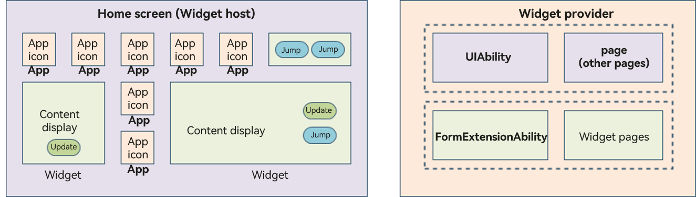
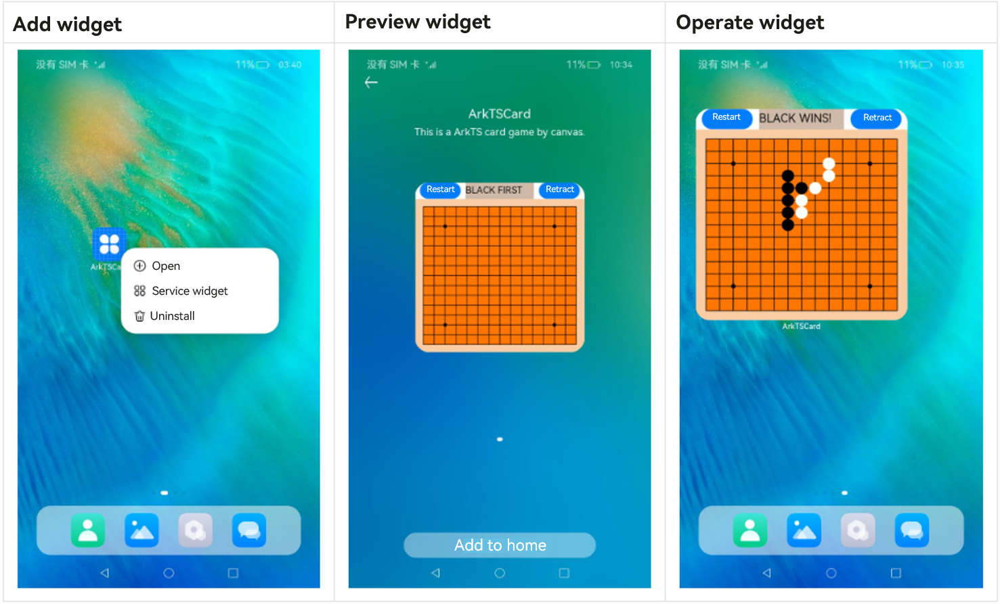

# Service Widget Overview

A service widget (also called widget) is a set of UI components that display important information or operations specific to an application. It provides users with direct access to a desired application service, without the need to open the application first. A widget usually appears as a part of the UI of another application (which currently can only be a system application, such as the home screen) and provides basic interactive features such as opening a UI page or sending a message.

## Service Widget Architecture

**Figure 1** Service widget architecture

Before you get started, it would be helpful if you have a basic understanding of the following concepts:

- Widget host: an application that displays the widget content and controls the widget location. An example is the home screen in the preceding figure.

  - Application icon: an application entry icon, clicking which starts the application process. The icon content does not support interactions.
  - Widget: an interactive UI in various sizes. It may provide buttons to implement different functions, such as the button to [update the widget content](arkts-ui-widget-event-formextensionability.md) or [switch to an application](arkts-ui-widget-event-router.md).

- Card provider: an application that provides service widget content to be displayed. It controls the display content, display logic, and component click events triggered on a service widget.

  - FormExtensionAbility: widget service logic module, which provides lifecycle callbacks invoked when a widget is created, destroyed, or updated.
  - Widget page: widget UI module, which contains display and interaction information such as components, layouts, and events.

Below is the typical procedure of using the widget:

**Figure 2** Typical procedure of using the widget

1. Touch and hold an application icon on the home screen to display the shortcut menu.

2. Touch **Service widget** to access the preview screen.

3. Touch the **Add to home** button. The widget is then added to the home screen.

## Widget UI Development Mode

In the stage model, the UI of a widget can be developed in [ArkTS](arkts-ui-widget-working-principles.md) or [JS](js-ui-widget-development.md).

- A widget developed in the ArkTS-based declarative development paradigm is called ArkTS widget.

- A widget developed in the JS-compatible web-like development paradigm is called JS widget.

ArkTS widgets and JS widgets have different implementation principles and features. The following table lists the differences in capabilities.

| Category| JS widget| ArkTS widget|
| -------- | -------- | -------- |
| Development paradigm| Web-like paradigm| Declarative paradigm|
| Component capability| Supported| Supported|
| Layout capability| Supported| Supported|
| Event capability| Supported| Supported|
| Custom animation| Not supported| Supported|
| Custom drawing| Not supported| Supported|
| Logic code execution (excluding the import capability)| Not supported| Supported|

As can be seen above, ArkTS widgets provide more capabilities and use cases than JS widgets. Therefore, ArkTS widgets are always recommended, except for the case where the widget consists of only static pages.
