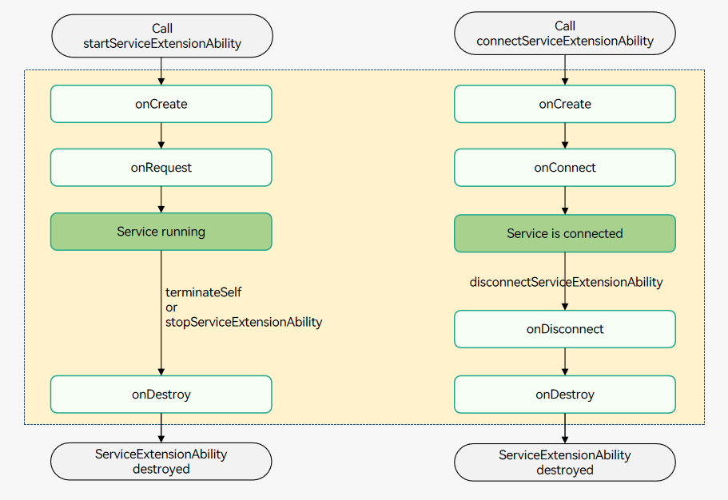

# ServiceExtensionAbility

## Overview

[ServiceExtensionAbility](../reference/apis-ability-kit/js-apis-app-ability-serviceExtensionAbility-sys.md) is an [ExtensionAbility](../reference/apis-ability-kit/js-apis-app-ability-extensionAbility.md) component of the SERVICE type that provides capabilities related to background services. It holds an internal [ServiceExtensionContext](../reference/apis-ability-kit/js-apis-inner-application-serviceExtensionContext-sys.md), which provides a variety of APIs for external systems.

In this document, the component that starts or connects to a ServiceExtensionAbility is called the client, and the ServiceExtensionAbility is called the server.

A ServiceExtensionAbility can be started or connected by other components to process transactions in the background based on the request of the caller. System applications can call the [startServiceExtensionAbility()](../reference/apis-ability-kit/js-apis-inner-application-uiAbilityContext-sys.md#uiabilitycontextstartserviceextensionability) method to start background services or call the [connectServiceExtensionAbility()](../reference/apis-ability-kit/js-apis-inner-application-uiAbilityContext.md#uiabilitycontextconnectserviceextensionability) method to connect to background services. Third-party applications can call only **connectServiceExtensionAbility()** to connect to background services. The differences between starting and connecting to a ServiceExtensionAbility are as follows:

- **Starting**: In the case that AbilityA starts ServiceB, they are weakly associated. After AbilityA exits, ServiceB remains running.

- **Connecting**: In the case that AbilityA connects to ServiceB, they are strongly associated. After AbilityA exits, ServiceB also exits.

Note the following:

- If a ServiceExtensionAbility is started only by means of connecting, its lifecycle is controlled by the client. A new connection is set up each time the client calls the **connectServiceExtensionAbility()** method. When the client exits or calls the [disconnectServiceExtensionAbility()](../reference/apis-ability-kit/js-apis-inner-application-uiAbilityContext.md#uiabilitycontextdisconnectserviceextensionability) method, the connection is interrupted. After all connections are interrupted, the ServiceExtensionAbility automatically exits.

- Once a ServiceExtensionAbility is started by means of starting, it will not exit automatically. System applications can call the [stopServiceExtensionAbility()](../reference/apis-ability-kit/js-apis-inner-application-uiAbilityContext-sys.md#uiabilitycontextstopserviceextensionability) method to stop it.

- The connection or disconnection operation can be performed only in the main thread, but not in the **Worker** and **TaskPool** threads.

> **NOTE**
>
> Currently, third-party applications cannot implement a ServiceExtensionAbility. To implement transaction processing in the background, they can use [background tasks](../task-management/background-task-overview.md).
>
> A UIAbility of a third-party application can connect to a ServiceExtensionAbility provided by a system application through the context.
>
> Third-party applications can connect to a ServiceExtensionAbility provided by a system application only when they gain focus in the foreground.

## Lifecycle

The [ServiceExtensionAbility](../reference/apis-ability-kit/js-apis-app-ability-serviceExtensionAbility-sys.md) class provides the lifecycle callbacks [onCreate()](../reference/apis-ability-kit/js-apis-app-ability-serviceExtensionAbility-sys.md#serviceextensionabilityoncreate), [onRequest()](../reference/apis-ability-kit/js-apis-app-ability-serviceExtensionAbility-sys.md#serviceextensionabilityonrequest), [onConnect()](../reference/apis-ability-kit/js-apis-app-ability-serviceExtensionAbility-sys.md#serviceextensionabilityonconnect), [onDisconnect()](../reference/apis-ability-kit/js-apis-app-ability-serviceExtensionAbility-sys.md#serviceextensionabilityondisconnect), and [onDestroy()](../reference/apis-ability-kit/js-apis-app-ability-serviceExtensionAbility-sys.md#serviceextensionabilityondestroy). Override them as required. The following figure shows the ServiceExtensionAbility lifecycle.

**Figure 1** ServiceExtensionAbility lifecycle



- **onCreate**

  This callback is triggered when a ServiceExtensionAbility is created for the first time. You can perform initialization operations, for example, registering a common event listener.

  > **NOTE**
  >
  > If a ServiceExtensionAbility has been created, starting it again does not trigger the **onCreate()** callback.

- **onRequest**

  This callback is triggered when another component calls the [startServiceExtensionAbility()](../reference/apis-ability-kit/js-apis-inner-application-uiAbilityContext-sys.md#uiabilitycontextstartserviceextensionability) method to start a ServiceExtensionAbility. After being started, the ServiceExtensionAbility runs in the background. This callback is triggered each time the **startServiceExtensionAbility()** method is called.

- **onConnect**

  This callback is triggered when another component calls the [connectServiceExtensionAbility()](../reference/apis-ability-kit/js-apis-inner-application-uiAbilityContext.md#uiabilitycontextconnectserviceextensionability) method to connect to a ServiceExtensionAbility. In this method, a remote proxy object, namely, [IRemoteObject](../reference/apis-ipc-kit/js-apis-rpc.md#iremoteobject), is returned, through which the client communicates with the server by means of RPC. At the same time, the system stores the IRemoteObject. If another component calls the **connectServiceExtensionAbility()** method to connect to this ServiceExtensionAbility, the system returns the saved IRemoteObject, without triggering the callback.

- **onDisconnect**

  This callback is triggered when the last connection is interrupted. A connection is interrupted when the client exits or the [disconnectServiceExtensionAbility()](../reference/apis-ability-kit/js-apis-inner-application-uiAbilityContext.md#uiabilitycontextdisconnectserviceextensionability) method is called.

- **onDestroy**

  This callback is triggered when a ServiceExtensionAbility is no longer used and the instance is ready for destruction. You can clear resources in this callback, for example, deregistering the listener.

## Implementing a Background Service (for System Applications Only)

### Preparations

Only system applications can implement a [ServiceExtensionAbility](../reference/apis-ability-kit/js-apis-app-ability-serviceExtensionAbility-sys.md). You must make the following preparations before development:

- **Switching to the full SDK**: All the APIs provided by the **ServiceExtensionAbility** class are marked as system APIs and hidden by default. Therefore, you must manually obtain the full SDK from the mirror and switch to it in DevEco Studio. For details, see [Switching to Full SDK](../faqs/full-sdk-switch-guide.md).

- **Requesting the AllowAppUsePrivilegeExtension privilege**: Only applications with the **AllowAppUsePrivilegeExtension** privilege can implement a ServiceExtensionAbility. For details about how to request the privilege, see [Application Privilege Configuration](../../device-dev/subsystems/subsys-app-privilege-config-guide.md).

### Defining IDL APIs

As a background service, a ServiceExtensionAbility needs to provide APIs that can be called by external systems. You can define the APIs in IDL files and use the [IDL tool](../IDL/idl-guidelines.md) to generate proxy and stub files. The following demonstrates how to define a file named **IIdlServiceExt.idl**:

```cpp
interface OHOS.IIdlServiceExt {
  int ProcessData([in] int data);
  void InsertDataToMap([in] String key, [in] int val);
}
```

Create the **IdlServiceExt** directory in the **ets** directory of a module in a DevEco Studio project, and copy the files generated by the [IDL tool](../IDL/idl-guidelines.md) to this directory. Then create a file named **idl_service_ext_impl.ts** to implement the IDL APIs.

```
├── ets
│ ├── IdlServiceExt
│ │   ├── i_idl_service_ext.ts      # File generated by the IDL tool.
│ │   ├── idl_service_ext_proxy.ts  # File generated by the IDL tool.
│ │   ├── idl_service_ext_stub.ts   # File generated by the IDL tool.
│ │   ├── idl_service_ext_impl.ts   # Customize this file to implement IDL APIs.
│ └
└
```

An example of **idl_service_ext_impl.ts** is as follows:

```ts
import IdlServiceExtStub from './idl_service_ext_stub';
import hilog from '@ohos.hilog';
import type { insertDataToMapCallback } from './i_idl_service_ext';
import type { processDataCallback } from './i_idl_service_ext';

const ERR_OK = 0;
const TAG: string = "[IdlServiceExtImpl]";
const DOMAIN_NUMBER: number = 0xFF00;

// You need to implement APIs in this type.
export default class ServiceExtImpl extends IdlServiceExtStub {
  processData(data: number, callback: processDataCallback): void {
    // Implement service logic.
    hilog.info(DOMAIN_NUMBER, TAG, `processData: ${data}`);
    callback(ERR_OK, data + 1); // The verification is successful, and service logic is executed normally.
  }

  insertDataToMap(key: string, val: number, callback: insertDataToMapCallback): void {
    // Implement service logic.
    hilog.info(DOMAIN_NUMBER, TAG, `insertDataToMap, key: ${key}  val: ${val}`);
    callback(ERR_OK);
  }
}
```

### Creating a ServiceExtensionAbility

To manually create a ServiceExtensionAbility in the DevEco Studio project, perform the following steps:

1. In the **ets** directory of a module in the project, right-click and choose **New > Directory** to create a directory named **ServiceExtAbility**.

2. In the **ServiceExtAbility** directory, right-click and choose **New > ArkTS File** to create a file named **ServiceExtAbility.ets**.

    ```
    ├── ets
    │ ├── IdlServiceExt
    │ │   ├── i_idl_service_ext.ets      # File generated by the IDL tool.
    │ │   ├── idl_service_ext_proxy.ets  # File generated by the IDL tool.
    │ │   ├── idl_service_ext_stub.ets   # File generated by the IDL tool.
    │ │   ├── idl_service_ext_impl.ets   # Customize this file to implement IDL APIs.
    │ ├── ServiceExtAbility
    │ │   ├── ServiceExtAbility.ets
    └
    ```

3. In the **ServiceExtAbility.ets** file, import the [ServiceExtensionAbility](../reference/apis-ability-kit/js-apis-app-ability-serviceExtensionAbility-sys.md) module. Customize a class that inherits from ServiceExtensionAbility and implement the lifecycle callbacks. Return the previously defined **ServiceExtImpl** object in the [onConnect](../reference/apis-ability-kit/js-apis-app-ability-serviceExtensionAbility-sys.md#serviceextensionabilityoncreate) lifecycle callback.

    ```ts
    import { ServiceExtensionAbility, Want } from '@kit.AbilityKit';
    import { rpc } from '@kit.IPCKit';
    import { hilog } from '@kit.PerformanceAnalysisKit';
    import ServiceExtImpl from '../IdlServiceExt/idl_service_ext_impl';
    
    const TAG: string = '[ServiceExtAbility]';
    const DOMAIN_NUMBER: number = 0xFF00;
    
    export default class ServiceExtAbility extends ServiceExtensionAbility {
      serviceExtImpl: ServiceExtImpl = new ServiceExtImpl('ExtImpl');
    
      onCreate(want: Want): void {
        let serviceExtensionContext = this.context;
        hilog.info(DOMAIN_NUMBER, TAG, `onCreate, want: ${want.abilityName}`);
      };
    
      onRequest(want: Want, startId: number): void {
        hilog.info(DOMAIN_NUMBER, TAG, `onRequest, want: ${want.abilityName}`);
      };
    
      onConnect(want: Want): rpc.RemoteObject {
        hilog.info(DOMAIN_NUMBER, TAG, `onConnect, want: ${want.abilityName}`);
        // Return the ServiceExtImpl object, through which the client can communicate with the ServiceExtensionAbility.
        return this.serviceExtImpl as rpc.RemoteObject;
      };
    
      onDisconnect(want: Want): void {
        hilog.info(DOMAIN_NUMBER, TAG, `onDisconnect, want: ${want.abilityName}`);
      };
    
      onDestroy(): void {
        hilog.info(DOMAIN_NUMBER, TAG, 'onDestroy');
      };
    };
    ```

4. Register the ServiceExtensionAbility in the [module.json5 file](../quick-start/module-configuration-file.md) of the module in the project. Set **type** to **"service"** and **srcEntry** to the code path of the ServiceExtensionAbility component.

    ```json
    {
      "module": {
        // ...
        "extensionAbilities": [
          {
            "name": "ServiceExtAbility",
            "icon": "$media:icon",
            "description": "service",
            "type": "service",
            "exported": true,
            "srcEntry": "./ets/ServiceExtAbility/ServiceExtAbility.ets"
          }
        ]
      }
    }
    ```

## Starting a Background Service (for System Applications Only)

A system application uses the [startServiceExtensionAbility()](../reference/apis-ability-kit/js-apis-inner-application-uiAbilityContext-sys.md#uiabilitycontextstartserviceextensionability) method to start a background service. The [onRequest()](../reference/apis-ability-kit/js-apis-app-ability-serviceExtensionAbility-sys.md#serviceextensionabilityonrequest) callback is invoked, through which the background service receives the [Want](../reference/apis-ability-kit/js-apis-app-ability-want.md) object passed by the caller. After the background service is started, its lifecycle is independent of the client. In other words, even if the client is destroyed, the background service remains alive. Therefore, the background service must be stopped by calling [terminateSelf()](../reference/apis-ability-kit/js-apis-inner-application-serviceExtensionContext-sys.md#serviceextensioncontextterminateself) when its work is complete. Alternatively, another component can call [stopServiceExtensionAbility()](../reference/apis-ability-kit/js-apis-inner-application-uiAbilityContext-sys.md#abilitycontextstopserviceextensionability) to stop the background service.

> **NOTE**
>
> **startServiceExtensionAbility()**, **stopServiceExtensionAbility()**, and **terminateSelf()** provided by the **ServiceExtensionContext** class are system APIs and cannot be called by third-party applications.

1. Start a new [ServiceExtensionAbility](../reference/apis-ability-kit/js-apis-app-ability-serviceExtensionAbility-sys.md) in a system application. For details about how to obtain the context, see [Obtaining the Context of UIAbility](uiability-usage.md#obtaining-the-context-of-uiability).

    ```ts
    import { common, Want } from '@kit.AbilityKit';
    import { hilog } from '@kit.PerformanceAnalysisKit';
    import { BusinessError } from '@kit.BasicServicesKit';

    const TAG: string = '[Page_ServiceExtensionAbility]';
    const DOMAIN_NUMBER: number = 0xFF00;

    @Entry
    @Component
    struct Page_ServiceExtensionAbility {
      build() {
        Column() {
          //...
          List({ initialIndex: 0 }) {
            ListItem() {
              Row() {
                //...
              }
              .onClick(() => {
                let context = this.getUIContext().getHostContext() as common.UIAbilityContext; // UIAbilityContext
                let want: Want = {
                  deviceId: '',
                  bundleName: 'com.samples.stagemodelabilitydevelop',
                  abilityName: 'ServiceExtAbility'
                };
                context.startServiceExtensionAbility(want).then(() => {
                  hilog.info(DOMAIN_NUMBER, TAG, 'Succeeded in starting ServiceExtensionAbility.');
                  // The background service is started.
                  this.getUIContext().getPromptAction().showToast({
                    message: 'SuccessfullyStartBackendService'
                  });
                }).catch((err: BusinessError) => {
                  hilog.error(DOMAIN_NUMBER, TAG, `Failed to start ServiceExtensionAbility. Code is ${err.code}, message is ${err.message}`);
                });
              })
            }
            //...
          }
          //...
        }
        //...
      }
    }
    ```

2. Stop the [ServiceExtensionAbility](../reference/apis-ability-kit/js-apis-app-ability-serviceExtensionAbility-sys.md) in the system application.

    ```ts
    import { common, Want } from '@kit.AbilityKit';
    import { hilog } from '@kit.PerformanceAnalysisKit';
    import { BusinessError } from '@kit.BasicServicesKit';

    const TAG: string = '[Page_ServiceExtensionAbility]';
    const DOMAIN_NUMBER: number = 0xFF00;

    @Entry
    @Component
    struct Page_ServiceExtensionAbility {
      build() {
        Column() {
          //...
          List({ initialIndex: 0 }) {
            ListItem() {
              Row() {
                //...
              }
              .onClick(() => {
                let context = this.getUIContext().getHostContext() as common.UIAbilityContext; // UIAbilityContext
                let want: Want = {
                  deviceId: '',
                  bundleName: 'com.samples.stagemodelabilitydevelop',
                  abilityName: 'ServiceExtAbility'
                };
                context.stopServiceExtensionAbility(want).then(() => {
                  hilog.info(DOMAIN_NUMBER, TAG, 'Succeeded in stopping ServiceExtensionAbility.');
                  this.getUIContext().getPromptAction().showToast({
                    message: 'SuccessfullyStoppedAStartedBackendService'
                  });
                }).catch((err: BusinessError) => {
                  hilog.error(DOMAIN_NUMBER, TAG, `Failed to stop ServiceExtensionAbility. Code is ${err.code}, message is ${err.message}`);
                });
              })
            }
            //...
          }
          //...
        }
        //...
      }
    }
    ```

3. Enable the [ServiceExtensionAbility](../reference/apis-ability-kit/js-apis-app-ability-serviceExtensionAbility-sys.md) to stop itself.

    ```ts
    import { common } from '@kit.AbilityKit';
    import { hilog } from '@kit.PerformanceAnalysisKit';
    import { BusinessError } from '@kit.BasicServicesKit';

    const TAG: string = '[Page_ServiceExtensionAbility]';
    const DOMAIN_NUMBER: number = 0xFF00;

    @Entry
    @Component
    struct Page_ServiceExtensionAbility {
      build() {
        Column() {
          //...
          List({ initialIndex: 0 }) {
            ListItem() {
              Row() {
                //...
              }
              .onClick(() => {
                let context = this.getUIContext().getHostContext() as common.UIAbilityContext; // UIAbilityContext
                context.terminateSelf().then(() => {
                  hilog.info(DOMAIN_NUMBER, TAG, 'Succeeded in terminating self.');
                  // The background service is stopped.
                  this.getUIContext().getPromptAction().showToast({
                    message: 'SuccessfullyStopStartedBackendService'
                  });
                }).catch((err: BusinessError) => {
                  hilog.error(DOMAIN_NUMBER, TAG, `Failed to terminate self. Code is ${err.code}, message is ${err.message}`);
                });
              })
            }
            //...
          }
          //...
        }
        //...
      }
    }
    ```

> **NOTE**
>
> Background services remain alive in the background for a long time. To minimize resource usage, destroy a background service in time in either of the following ways when it finishes the requested task:
>
> - The background service calls the [terminateSelf()](../reference/apis-ability-kit/js-apis-inner-application-serviceExtensionContext-sys.md#serviceextensioncontextterminateself) method to automatically stop itself.
> - Another component calls the [stopServiceExtensionAbility()](../reference/apis-ability-kit/js-apis-inner-application-uiAbilityContext-sys.md#abilitycontextstopserviceextensionability) method to stop the background service.
> After either method is called, the system destroys the background service.

## Connecting to a Background Service

Either a system application or a third-party application can connect to a background service (specified in the **Want** object) through [connectServiceExtensionAbility()](../reference/apis-ability-kit/js-apis-inner-application-uiAbilityContext.md#uiabilitycontextconnectserviceextensionability). The [onConnect()](../reference/apis-ability-kit/js-apis-app-ability-serviceExtensionAbility-sys.md#serviceextensionabilityonconnect) callback is invoked, through which the background service receives the [Want](../reference/apis-ability-kit/js-apis-app-ability-want.md) object passed by the caller. In this way, a persistent connection is established.

The ServiceExtensionAbility returns an [IRemoteObject](../reference/apis-ipc-kit/js-apis-rpc.md#iremoteobject) in the **onConnect()** callback. Through this IRemoteObject, you can define communication interfaces for RPC interaction between the client and server. Multiple clients can simultaneously connect to the same background service. After a client finishes the interaction, it must call [disconnectServiceExtensionAbility()](../reference/apis-ability-kit/js-apis-inner-application-uiAbilityContext.md#uiabilitycontextdisconnectserviceextensionability) to disconnect from the service. If all clients connected to a background service are disconnected, the system destroys the service.

- Call [connectServiceExtensionAbility()](../reference/apis-ability-kit/js-apis-inner-application-uiAbilityContext.md#uiabilitycontextconnectserviceextensionability) to establish a connection to a background service. For details about how to obtain the context, see [Obtaining the Context of UIAbility](uiability-usage.md#obtaining-the-context-of-uiability).
  
  ```ts
  import { common, Want } from '@kit.AbilityKit';
  import { rpc } from '@kit.IPCKit';
  import { hilog } from '@kit.PerformanceAnalysisKit';
  // The client needs to import idl_service_ext_proxy.ts provided by the server to the local project.
  import IdlServiceExtProxy from '../IdlServiceExt/idl_service_ext_proxy';
  
  const TAG: string = '[Page_ServiceExtensionAbility]';
  const DOMAIN_NUMBER: number = 0xFF00;
  
  let connectionId: number;
  let want: Want = {
    deviceId: '',
    bundleName: 'com.samples.stagemodelabilitydevelop',
    abilityName: 'ServiceExtAbility'
  };
  
  let options: common.ConnectOptions = {
    onConnect(elementName, remote: rpc.IRemoteObject): void {
      hilog.info(DOMAIN_NUMBER, TAG, 'onConnect callback');
      if (remote === null) {
        hilog.info(DOMAIN_NUMBER, TAG, `onConnect remote is null`);
        return;
      }
      let serviceExtProxy: IdlServiceExtProxy = new IdlServiceExtProxy(remote);
      // Communication is carried out by API calling, without exposing RPC details.
      serviceExtProxy.processData(1, (errorCode: number, retVal: number) => {
        hilog.info(DOMAIN_NUMBER, TAG, `processData, errorCode: ${errorCode}, retVal: ${retVal}`);
      });
      serviceExtProxy.insertDataToMap('theKey', 1, (errorCode: number) => {
        hilog.info(DOMAIN_NUMBER, TAG, `insertDataToMap, errorCode: ${errorCode}`);
      })
    },
    onDisconnect(elementName): void {
      hilog.info(DOMAIN_NUMBER, TAG, 'onDisconnect callback');
    },
    onFailed(code: number): void {
      hilog.info(DOMAIN_NUMBER, TAG, 'onFailed callback', JSON.stringify(code));
    }
  };
  @Entry
  @Component
  struct Page_ServiceExtensionAbility {
    build() {
      Column() {
        //...
        List({ initialIndex: 0 }) {
          ListItem() {
            Row() {
              //...
            }
            .onClick(() => {
              let context = this.getUIContext().getHostContext() as common.UIAbilityContext; // UIAbilityContext
              // The ID returned after the connection is set up must be saved. The ID will be used for disconnection.
              connectionId = context.connectServiceExtensionAbility(want, options);
              // The background service is connected.
              this.getUIContext().getPromptAction().showToast({
                message: 'SuccessfullyConnectBackendService'
              });
              // connectionId = context.connectAbility(want, options);
              hilog.info(DOMAIN_NUMBER, TAG, `connectionId is : ${connectionId}`);
            })
          }
          //...
        }
        //...
      }
      //...
    }
  }
  ```

- Call [disconnectServiceExtensionAbility()](../reference/apis-ability-kit/js-apis-inner-application-uiAbilityContext.md#uiabilitycontextdisconnectserviceextensionability) to disconnect from the background service.
  
  ```ts
  import { common } from '@kit.AbilityKit';
  import { hilog } from '@kit.PerformanceAnalysisKit';
  import { BusinessError } from '@kit.BasicServicesKit';

  const TAG: string = '[Page_ServiceExtensionAbility]';
  const DOMAIN_NUMBER: number = 0xFF00;

  let connectionId: number;
  @Entry
  @Component
  struct Page_ServiceExtensionAbility {
    build() {
      Column() {
        //...
        List({ initialIndex: 0 }) {
          ListItem() {
            Row() {
              //...
            }
            .onClick(() => {
              let context = this.getUIContext().getHostContext() as common.UIAbilityContext; // UIAbilityContext
              // connectionId is returned when connectServiceExtensionAbility is called and needs to be manually maintained.
              context.disconnectServiceExtensionAbility(connectionId).then(() => {
                hilog.info(DOMAIN_NUMBER, TAG, 'disconnectServiceExtensionAbility success');
                // The background service is disconnected.
                this.getUIContext().getPromptAction().showToast({
                  message: 'SuccessfullyDisconnectBackendService'
                });
              }).catch((error: BusinessError) => {
                hilog.error(DOMAIN_NUMBER, TAG, 'disconnectServiceExtensionAbility failed');
              });
            })
          }
          //...
        }
        //...
      }
      //...
    }
  }
  ```

## Communication Between the Client and Server

After obtaining the [rpc.IRemoteObject](../reference/apis-ipc-kit/js-apis-rpc.md#iremoteobject) from the [onConnect()](../reference/apis-ability-kit/js-apis-inner-ability-connectOptions.md#onconnect) lifecycle callback, the client can communicate with the ServiceExtensionAbility in either of the following ways:

- Using the IDL APIs provided by the server for communication (recommended)

  ```ts
  // The client needs to import idl_service_ext_proxy.ts provided by the server to the local project.
  import { common } from '@kit.AbilityKit';
  import { rpc } from '@kit.IPCKit';
  import { hilog } from '@kit.PerformanceAnalysisKit';
  import IdlServiceExtProxy from '../IdlServiceExt/idl_service_ext_proxy';
  
  const TAG: string = '[Page_ServiceExtensionAbility]';
  const DOMAIN_NUMBER: number = 0xFF00;
  
  let options: common.ConnectOptions = {
    onConnect(elementName, remote: rpc.IRemoteObject): void {
      hilog.info(DOMAIN_NUMBER, TAG, 'onConnect callback');
      if (remote === null) {
        hilog.info(DOMAIN_NUMBER, TAG, `onConnect remote is null`);
        return;
      }
      let serviceExtProxy: IdlServiceExtProxy = new IdlServiceExtProxy(remote);
      // Communication is carried out by API calling, without exposing RPC details.
      serviceExtProxy.processData(1, (errorCode: number, retVal: number) => {
        hilog.info(DOMAIN_NUMBER, TAG, `processData, errorCode: ${errorCode}, retVal: ${retVal}`);
      });
      serviceExtProxy.insertDataToMap('theKey', 1, (errorCode: number) => {
        hilog.info(DOMAIN_NUMBER, TAG, `insertDataToMap, errorCode: ${errorCode}`);
      })
    },
    onDisconnect(elementName): void {
      hilog.info(DOMAIN_NUMBER, TAG, 'onDisconnect callback');
    },
    onFailed(code: number): void {
      hilog.info(DOMAIN_NUMBER, TAG, 'onFailed callback', JSON.stringify(code));
    }
  };
  ```

- Calling [sendMessageRequest](../reference/apis-ipc-kit/js-apis-rpc.md#sendmessagerequest9) to send messages to the server (not recommended)

  ```ts
  import { common } from '@kit.AbilityKit';
  import { promptAction } from '@kit.ArkUI';
  import { rpc } from '@kit.IPCKit';
  import { hilog } from '@kit.PerformanceAnalysisKit';
  import { BusinessError } from '@kit.BasicServicesKit';

  const TAG: string = '[Page_CollaborateAbility]';
  const DOMAIN_NUMBER: number = 0xFF00;
  const REQUEST_CODE = 1;
  let options: common.ConnectOptions = {
    onConnect(elementName, remote): void {
      hilog.info(DOMAIN_NUMBER, TAG, 'onConnect callback');
      if (remote === null) {
        hilog.info(DOMAIN_NUMBER, TAG, `onConnect remote is null`);
        return;
      }
      let option = new rpc.MessageOption();
      let data = new rpc.MessageSequence();
      let reply = new rpc.MessageSequence();

      data.writeInt(99);
      // You can send data to the target application for corresponding operations.
      // @param code Indicates the service request code sent by the client.
      // @param data Indicates the {@link MessageSequence} object sent by the client.
      // @param reply Indicates the response message object sent by the remote service.
      // @param options Specifies whether the operation is synchronous or asynchronous.
      // @return Returns {@code true} if the operation is successful; returns {@code false} otherwise.

      remote.sendMessageRequest(REQUEST_CODE, data, reply, option).then((ret: rpc.RequestResult) => {
        let errCode = reply.readInt(); // Receive the information (100) returned by the target device if the connection is successful.
        let msg: number = 0;
        if (errCode === 0) {
          msg = reply.readInt();
        }
        hilog.info(DOMAIN_NUMBER, TAG, `sendRequest msg:${msg}`);
        // The background service is connected.
        promptAction.showToast({
          message: `sendRequest msg:${msg}`
        });
      }).catch((error: BusinessError) => {
        hilog.info(DOMAIN_NUMBER, TAG, `sendRequest failed, ${JSON.stringify(error)}`);
      });
    },
    onDisconnect(elementName): void {
      hilog.info(DOMAIN_NUMBER, TAG, 'onDisconnect callback');
    },
    onFailed(code): void {
      hilog.info(DOMAIN_NUMBER, TAG, 'onFailed callback');
    }
  };
  //...
  ```

## Client Identity Verification by the Server

When a ServiceExtensionAbility is used to provide sensitive services, the client identity must be verified. You can implement the verification on the IDL stub. For details about the IDL API implementation, see [Defining IDL APIs](#defining-idl-apis). Two verification modes are recommended:

- **Verifying the client identity based on callerUid**

  Call the [getCallingUid()](../reference/apis-ipc-kit/js-apis-rpc.md#getcallinguid) method to obtain the UID of the client, and then call the [getBundleNameByUid()](../reference/apis-ability-kit/js-apis-bundleManager-sys.md#bundlemanagergetbundlenamebyuid) method to obtain the corresponding bundle name. In this way, the client identity is verified. Note that [getBundleNameByUid()](../reference/apis-ability-kit/js-apis-bundleManager-sys.md#bundlemanagergetbundlenamebyuid) is asynchronous, and therefore the server cannot return the verification result to the client. This verification mode applies when the client sends an asynchronous task request to the server. The sample code is as follows:

  ```ts
  import { bundleManager } from '@kit.AbilityKit';
  import { rpc } from '@kit.IPCKit';
  import { hilog } from '@kit.PerformanceAnalysisKit';
  import { BusinessError } from '@kit.BasicServicesKit';
  import IdlServiceExtStub from './idl_service_ext_stub';
  import type { InsertDataToMapCallback } from './i_idl_service_ext';
  import type { ProcessDataCallback } from './i_idl_service_ext';
  
  const ERR_OK = 0;
  const ERR_DENY = -1;
  const TAG: string = "[IdlServiceExtImpl]";
  const DOMAIN_NUMBER: number = 0xFF00;
  
  // You need to implement APIs in this type.
  export default class ServiceExtImpl extends IdlServiceExtStub {
    processData(data: number, callback: ProcessDataCallback): void {
      // Implement service logic.
      hilog.info(DOMAIN_NUMBER, TAG, `processData: ${data}`);
      let callerUid = rpc.IPCSkeleton.getCallingUid();
      bundleManager.getBundleNameByUid(callerUid).then((callerBundleName) => {
        hilog.info(DOMAIN_NUMBER, TAG, 'getBundleNameByUid: ' + callerBundleName);
        // Identify the bundle name of the client.
        if (callerBundleName !== 'com.samples.stagemodelabilitydevelop') { // The verification fails.
          hilog.info(DOMAIN_NUMBER, TAG, 'The caller bundle is not in trustlist, reject');
          return;
        }
        // The verification is successful, and service logic is executed normally.
      }).catch((err: BusinessError) => {
        hilog.info(DOMAIN_NUMBER, TAG, 'getBundleNameByUid failed: ' + err.message);
      });
      //...
    };
  
    insertDataToMap(key: string, val: number, callback: InsertDataToMapCallback): void {
      // Implement service logic.
      hilog.info(DOMAIN_NUMBER, TAG, `insertDataToMap, key: ${key}  val: ${val}`);
      callback(ERR_OK);
    };
  };
  ```

- **Verifying the client identity based on callerTokenId**

  Call the [getCallingTokenId()](../reference/apis-ipc-kit/js-apis-rpc.md#getcallingtokenid) method to obtain the token ID of the client, and then call the [verifyAccessTokenSync()](../reference/apis-ability-kit/js-apis-abilityAccessCtrl.md#verifyaccesstokensync) method to check whether the client has the required permission. Currently, the system does not support permission customization. Therefore, only [system-defined permissions](../security/AccessToken/app-permissions.md) can be verified. The sample code is as follows:

  ```ts
  import { abilityAccessCtrl, bundleManager } from '@kit.AbilityKit';
  import { rpc } from '@kit.IPCKit';
  import { hilog } from '@kit.PerformanceAnalysisKit';
  import { BusinessError } from '@kit.BasicServicesKit';
  import IdlServiceExtStub from './idl_service_ext_stub';
  import type { InsertDataToMapCallback } from './i_idl_service_ext';
  import type { ProcessDataCallback } from './i_idl_service_ext';
  
  const ERR_OK = 0;
  const ERR_DENY = -1;
  const TAG: string = '[IdlServiceExtImpl]';
  const DOMAIN_NUMBER: number = 0xFF00;
  
  // You need to implement APIs in this type.
  export default class ServiceExtImpl extends IdlServiceExtStub {
    processData(data: number, callback: ProcessDataCallback): void {
      // Implement service logic.
      hilog.info(DOMAIN_NUMBER, TAG, `processData: ${data}`);
  
      let callerUid = rpc.IPCSkeleton.getCallingUid();
      bundleManager.getBundleNameByUid(callerUid).then((callerBundleName) => {
        hilog.info(DOMAIN_NUMBER, TAG, 'getBundleNameByUid: ' + callerBundleName);
        // Identify the bundle name of the client.
        if (callerBundleName !== 'com.samples.stagemodelabilitydevelop') { // The verification fails.
          hilog.info(DOMAIN_NUMBER, TAG, 'The caller bundle is not in trustlist, reject');
          return;
        }
        // The verification is successful, and service logic is executed normally.
      }).catch((err: BusinessError) => {
        hilog.info(DOMAIN_NUMBER, TAG, 'getBundleNameByUid failed: ' + err.message);
      });
  
      let callerTokenId = rpc.IPCSkeleton.getCallingTokenId();
      let accessManger = abilityAccessCtrl.createAtManager();
      // The permission to be verified varies depending on the service requirements. ohos.permission.GET_BUNDLE_INFO_PRIVILEGED is only an example.
      let grantStatus = accessManger.verifyAccessTokenSync(callerTokenId, 'ohos.permission.GET_BUNDLE_INFO_PRIVILEGED');
      if (grantStatus === abilityAccessCtrl.GrantStatus.PERMISSION_DENIED) {
        hilog.info(DOMAIN_NUMBER, TAG, 'PERMISSION_DENIED');
        callback(ERR_DENY, data); // The verification fails and an error is returned.
        return;
      }
      hilog.info(DOMAIN_NUMBER, TAG, 'verify access token success.');
      callback(ERR_OK, data + 1); // The verification is successful, and service logic is executed normally.
    };
  
    insertDataToMap(key: string, val: number, callback: InsertDataToMapCallback): void {
      // Implement service logic.
      hilog.info(DOMAIN_NUMBER, TAG, `insertDataToMap, key: ${key}  val: ${val}`);
      callback(ERR_OK);
    };
  };
  ```

