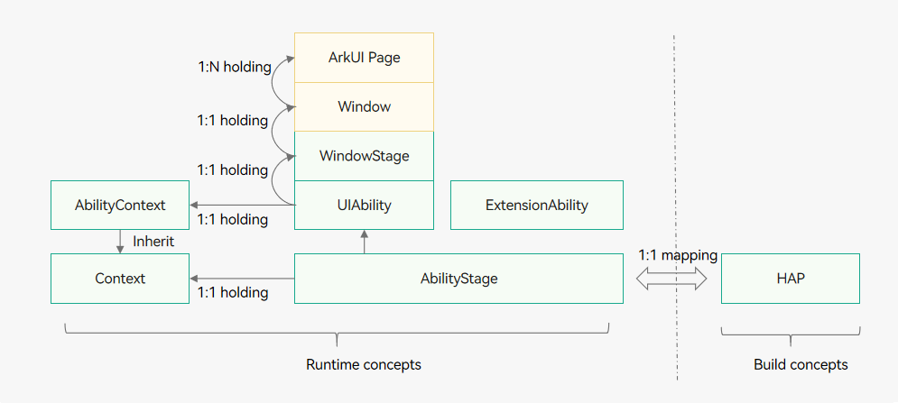
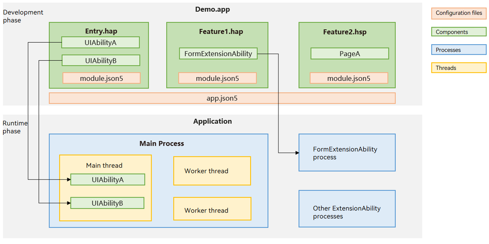

# Stage Model Development Overview

## Basic Concepts

The following figure illustrates the stage model.

**Figure 1** Stage model

- [AbilityStage](abilitystage.md)

  Each [HAP](../quick-start/hap-package.md) of the Entry or Feature type has an instance of the AbilityStage class at runtime. When the code in the [HAP](../quick-start/hap-package.md) is loaded to a process for the first time, the system creates an AbilityStage instance first.
  
- [UIAbility](uiability-overview.md) and [ExtensionAbility](extensionability-overview.md) components
  
  The stage model provides two types of application components: UIAbility and ExtensionAbility. Both have specific classes and support object-oriented development.
  
  - UIAbility is a type of application component that provides the UI for user interaction. For example, with a UIAbility component, the Gallery application can display images in the liquid layout. After a user selects an image, it uses a new UI to display the image details. The user can touch the **Back** button to return to the liquid layout. The lifecycle of the UIAbility component contains the **Create**, **Destroy**, **Foreground**, and **Background** states. Display-related states are exposed through WindowStage events.
  
  - ExtensionAbility is used for specific scenarios. You cannot derive directly from ExtensionAbility. Instead, use the derived classes of ExtensionAbility for your scenarios, such as FormExtensionAbility for widget scenarios, InputMethodExtensionAbility for input method scenarios, and WorkSchedulerExtensionAbility for deferred task scenarios. For example, to enable a user to create a widget on the home screen, you must derive a class from FormExtensionAbility, implement callbacks, and configure the capability in the configuration file. The derived class instances are created by applications and their lifecycles are managed by the system. In the stage model, you must use the derived classes of ExtensionAbility to develop custom services of third-party applications based on your service scenarios.

    A HAP can contain one or more UIAbility or ExtensionAbility components, which share the same AbilityStage instance at runtime. When the code (whether it is a UIAbility or an ExtensionAbility component) in the [HAP](../quick-start/hap-package.md) is first loaded into the process, the system creates the corresponding AbilityStage instance.
- [WindowStage](../windowmanager/application-window-stage.md)

  Each UIAbility instance is bound to a WindowStage instance, which functions as the window manager in the application process. The WindowStage class instance contains a main window. In other words, a UIAbility instance holds a main window through WindowStage, which provides a drawing area for ArkUI and can load different ArkUI pages.

- [Context](application-context-stage.md)

  In the stage model, Context and its derived classes provide a variety of resources and capabilities that can be called during the runtime. The UIAbility component and ExtensionAbility derived classes have different Context classes. These classes, which all inherit from the base class Context, provide different capabilities.

## Elements

The [Application Models](application-models.md) topic introduces the elements of the application model, which mainly include application components, configuration files, process models, thread models, and mission management models. Below, we use the Demo.app application as an example to introduce the elements of the stage model from both the development and runtime phases.

The Demo.app application mainly implements the following features:
- Implements two independent windows with UIs (UIAbilityA and UIAbilityB) for user interaction.
- Implements widget functionality to allow users to add the application's widgets to the home screen.

**Figure 2** Elements of the stage model

**Development phase**: You need to use the application components provided by the stage model (UIAbility and ExtensionAbility components) to develop application functionalities and register relevant application information in the configuration files (**app.json5** and **module.json5**).

- Application components: In this example, UIAbility components are used to develop modules with UIs for interaction, and FormExtensionAbility components are used to develop the widget module, implementing widget addition, deletion, and updates. To reduce dependencies and coupling between different modules, UIAbility and FormExtensionAbility implementations are placed in separate HAP files, whereas common functionalities shared by both are placed in an HSP file.

- Configuration files: You can configure the application name, version number, and application icon in **app.json5**, and component lists and permissions of the HAP in **module.json5**. These configuration details are registered with the system during application installation, facilitating system and other modules to obtain detailed information about the application and interact with it.

**Runtime phase**: When the application is installed and running on the device, the system uses a set of application process and thread management mechanisms to ensure orderly operation. <!--Del-->Additionally, a mission management mechanism is provided to manage mission creation, destruction, and foreground/background switching.<!--DelEnd-->

- Process model: UIAbility components run in the main process by default, whereas FormExtensionAbility components run in separate processes. UIAbility and FormExtensionAbility components are process-isolated from each other.

- Thread model: The stage model provides mechanisms such as Worker and TaskPool to support multithreaded development scenarios. If the application has complex, time-consuming logic to handle, it can create Worker threads to offload the processing.

<!--Del-->
- Mission management model: When a UIAbility is running, the system creates a corresponding mission. For example, when UIAbilityA in the figure is running, the mission for the Demo.app application can be seen in the recent task list. When the user taps this mission, the system brings UIAbilityA to the foreground.
<!--DelEnd-->

## How to Develop

During application development based on the stage model, the following tasks are involved in the application model.

**Table 1** Stage model development process

| Task| Description| Guide|
| -------- | -------- | -------- |
| Application component development| Use the UIAbility and ExtensionAbility components of the stage model to develop your application.| - [Application- or Component-Level Configuration](application-component-configuration-stage.md) - [UIAbility Component](uiability-overview.md) - [ExtensionAbility Component](extensionability-overview.md) - [AbilityStage Container Component](abilitystage.md) - [Context](application-context-stage.md) - [Component Startup Rules](component-startup-rules.md)|
| Process model development| Learn the process model and common IPC modes of the stage model.| [Process Model Overview](process-model-stage.md)|
| Thread model development| Learn the thread model and common inter-thread communication modes of the stage model.| [Thread Model Overview](thread-model-stage.md)|
| Configuration file development| Learn the requirements for developing application configuration files in the stage model.| [Application Configuration File](config-file-stage.md)|
