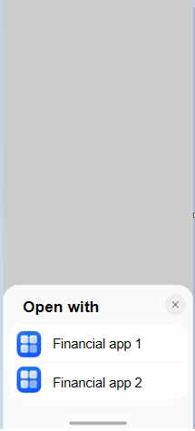

# Using startAbilityByType to Start a Financial Application

This topic describes how to open the vertical domain panel of financial applications.

## Parameters on the Financial Application Panel

If the **type** field in **startAbilityByType** is set to **finance**, **wantParam** contains the following properties.

| Name           | Type                                                        | Mandatory| Description|
| -------------------- | ------------------------------------------------------------ | -------- | -------- |
| sceneType            | number                          | No| Intent scene, which indicates the purpose of the current request. The options are as follows: 1: transfer; 2: credit card repayment. The default value is **1**.|
| bankCardNo      | string                                               | No | Bank card number.|

## Developing a Caller Application
1. Import the module.
    ```ts
    import { common } from '@kit.AbilityKit';
    ```
2. Construct parameters and call the **startAbilityByType** API.

    ```ts
    let context = getContext(this) as common.UIAbilityContext;
    let wantParam: Record<string, Object> = {
      'sceneType': 1,
      "bankCardNo": '123456789'
    };
    let abilityStartCallback: common.AbilityStartCallback = {
      onError: (code: number, name: string, message: string) => {
        console.log(`onError code ${code} name: ${name} message: ${message}`);
      },
      onResult: (result)=>{
        console.log(`onResult result: ${JSON.stringify(result)}`);
      }
    }
    
    context.startAbilityByType("finance", wantParam, abilityStartCallback, 
        (err) => {
            if (err) {
                console.error(`startAbilityByType fail, err: ${JSON.stringify(err)}`);
            } else {
                console.log(`success`);
            }
    });
    ```
    Effect
    
    

## Developing a Target Application

1. Configure [uris](../quick-start/module-configuration-file.md#skills) in the **module.json5** file.
   1. Set the **linkFeature** field to declare the features supported by the application so that the system can match the application against all the installed applications on the device. The options are as follows:

        | Value          | Description                        |
        | -------------- | ---------------------------- |
        | Transfer     | The application supports transfer.		|
        | CreditCardRepayment      | The application supports credit card repayment.	|
   2. Set **scheme**, **host**, **port**, and **path** or **pathStartWith** to match the URIs in Want to distinguish different features.

    ```json
    {
      "abilities": [
          {
          "skills": [
              {
              "uris": [
                  {
                  "scheme": "finance", // It is for reference only. Ensure that the declared URI can be started by external systems.
                  "host": "transfer",
                  "path": "",
                  "linkFeature": "Transfer" // Declare that the application supports transfer.
                  },
                  {
                  "scheme": "finance", // It is for reference only. Ensure that the declared URI can be started by external systems.
                  "host": "credit_card_repayment",
                  "path": "",
                  "linkFeature": "CreditCardRepayment" // Declare that the application supports credit card repayment.
                  }
              ]
              }
          ]
          }
      ]
    }
    ```
   
2. Parse and process the parameters transferred from the panel.

    ```ts
    UIAbility.onCreate(want: Want, launchParam: AbilityConstant.LaunchParam): void
    ```

    The **want.uri** parameter carries the URI corresponding to **linkFeature** configured by the target application.

    The **want.parameters** parameter carries the parameters transferred by the caller application, as described in the table below.

    | Name         | Type                                                        | Mandatory| Description|
    | -------------------- | ------------------------------------------------------------ | -------- | -------- |
    | bankCardNo  | string | No | Bank card number.|

    The application can develop different style pages based on the features defined in [linkFeature](../quick-start/module-configuration-file.md#skills), such as transfer and credit card repayment, as well as the received URI.

**Sample Code**

```ts
import { AbilityConstant, UIAbility, Want } from '@kit.AbilityKit';
import { hilog } from '@kit.PerformanceAnalysisKit';
import { window } from '@kit.ArkUI';

const TAG = 'EntryAbility'

export default class EntryAbility extends UIAbility {
    windowStage: window.WindowStage | null = null;

    uri?: string;
    bankCardNo?: string;

    onCreate(want: Want, launchParam: AbilityConstant.LaunchParam): void {
        hilog.info(0x0000, TAG, `onCreate, want=${JSON.stringify(want)}`);
        super.onCreate(want, launchParam);
        this.parseWant(want);
    }

    onNewWant(want: Want, launchParam: AbilityConstant.LaunchParam): void {
        hilog.info(0x0000, TAG, `onNewWant, want=${JSON.stringify(want)}`);
        super.onNewWant(want, launchParam);
        this.parseWant(want);
        if (!this.windowStage) {
            hilog.error(0x0000, TAG, 'windowStage is null');
            this.context.terminateSelf();
            return;
        }
        this.loadPage(this.windowStage);
    }

    private parseWant(want: Want): void {
        this.uri = want.uri as string | undefined;
        this.bankCardNo = want.parameters?.bankCardNo as string | undefined;
    }

    private loadPage(windowStage: window.WindowStage): void {
        hilog.info(0x0000, TAG, `loadPage, uri=${this.uri}`);
        if (this.uri === 'finance://transfer') {
            // Construct parameters for the transfer scenario.
            const storage: LocalStorage = new LocalStorage({
                "bankCardNo": this.bankCardNo
            } as Record<string, Object>);
            // Open the transfer page.
            windowStage.loadContent('pages/TransferPage', storage)
        } else if (this.uri === 'finance://credit_card_repayment') {
            // Construct parameters for the credit card repayment scenario.
            const storage: LocalStorage = new LocalStorage({
                "bankCardNo": this.bankCardNo
            } as Record<string, Object>);
            // Open the credit card repayment page.
            windowStage.loadContent('pages/CreditCardRepaymentPage', storage)
        } else {
            // Display the home page by default.
            windowStage.loadContent('pages/Index', (err) => {
                if (err.code) {
                    hilog.error(0x0000, TAG, 'Failed to load the content. Cause: %{public}s',
                        JSON.stringify(err) ?? '');
                    return;
                }
                hilog.info(0x0000, TAG, 'Succeeded in loading the content.');
            });
        }
    }

    onDestroy(): void {
        hilog.info(0x0000, TAG, `onDestroy`);
    }

    onWindowStageCreate(windowStage: window.WindowStage): void {
        hilog.info(0x0000, TAG, `onWindowStageCreate`);
        this.windowStage = windowStage;
        this.loadPage(this.windowStage);
    }

    onWindowStageDestroy(): void {
        hilog.info(0x0000, TAG, '%{public}s', 'Ability onWindowStageDestroy');
    }

    onForeground(): void {
        hilog.info(0x0000, TAG, '%{public}s', 'Ability onForeground');
    }

    onBackground(): void {
        hilog.info(0x0000, TAG, '%{public}s', 'Ability onBackground');
    }
}
```
