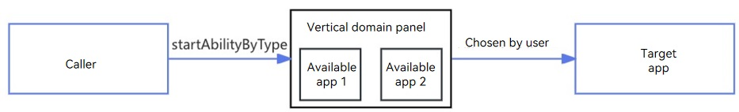

# Overview of Starting an Application of the Specified Type

This topic describes how to implement application redirection by specifying an application type instead of a specific application. The following methods are available:

- [Using startAbilityByType to Start a Vertical Domain Panel](#using-startabilitybytype-to-start-a-vertical-domain-panel): You can call the **startAbilityByType** API to start a vertical domain panel based on a specific business category, such as navigation, finance, email, flight, and express. The panel displays all the vertical applications available on the device, and users can choose to open one of them.
- [Using mailto to Redirect to an Email Application](#using-mailto-to-redirect-to-an-email-application): The mailto protocol allows for the creation of hyperlinks linked to email addresses, enabling users to swiftly navigate to their email applications from hyperlinks present within websites or applications.
- [Using startAbility to Open a File](#using-startability-to-open-a-file): You can call the **startAbility** API to open a file of a specific type.

## Using startAbilityByType to Start a Vertical Domain Panel

### Working Principles
You can call the **startAbilityByType** API to start a vertical domain panel based on a specific business category, such as navigation, finance, and email. The panel displays all the vertical applications available on the device, and users can choose to open one of them.

The vertical domain panel provides secure and trusted applications available on the device, while reducing the access cost of the caller. 

### Matching Rules

The [UIAbilityContext.startAbilityByType](../reference/apis-ability-kit/js-apis-inner-application-uiAbilityContext.md#uiabilitycontextstartabilitybytype11) and [UIExtensionContentSession.startAbilityByType](../reference/apis-ability-kit/js-apis-app-ability-uiExtensionContentSession.md#uiextensioncontentsessionstartabilitybytype11) APIs can be used to start a vertical domain panel based on the business category specified by the caller. The vertical applications available on the device are displayed on the panel.

Based on the **type** and **wantParams.sceneType** values passed in the **startAbilityByType** API, the system matches the target application that declares the corresponding [linkFeature](../quick-start/module-configuration-file.md#skills) in the **module.json5** file based on the following mappings.

| Function| Caller Application (Input Parameter of startAbilityByType) |  Target Application (Value of linkFeature in the Configuration File)| 
| ------------ | ------------ |   ------------ |
| Route planning|- type: navigation  - wantParams.sceneType: 1| RoutePlan |
|Navigation|- type: navigation  - wantParams.sceneType: 2| Navigation|
|Place search|- type: navigation  - wantParams.sceneType: 3| PlaceSearch|
|Transfer|- type: finance  - wantParams.sceneType: 1|Transfer|
|Credit card repayment|- type: finance  - wantParams.sceneType: 2|CreditCardRepayment|
|Email writing|- type: mail  - wantParams.sceneType: 1|ComposeMail|
|Query flights by flight number|- type: flight  - wantParams.sceneType: 1|QueryByFlightNo|
|Query flights based on origin and destination|- type: flight  - wantParams.sceneType: 2|QueryByLocation|
|Express delivery query|- type: express  - wantParams.sceneType: 1|QueryExpress|

## Using mailto to Redirect to an Email Application

You can create hyperlinks that link to email addresses through mailto, so that users can easily access email clients by touching the hyperlinks present within websites or applications. For details, see [Using mailto to Start an Email Application](start-email-apps-by-mailto.md).

## Using startAbility to Open a File

You can call the **startAbility** API to search for an installed application that meets the requirements to open a specific type of file. For details, see [Using startAbility to Start a File Application](file-processing-apps-startup.md).
