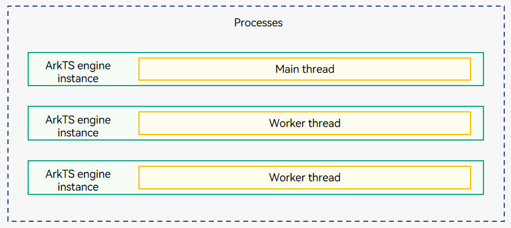

# Thread Model (Stage Model)

## Thread Type
There are three types of threads in the stage model:
- Main thread
  - Draws the UI.
  - Manages the [ArkTS engine](../arkts-utils/arkts-runtime-overview.md) instance of the main thread so that multiple UIAbility components can run on it.
  - Manages [ArkTS engine](../arkts-utils/arkts-runtime-overview.md) instances of other threads, for example, using **TaskPool** to create or cancel tasks, and starting and terminating **Worker** threads.
  - Distributes interaction events.
  - Processes application code callbacks (event processing and lifecycle management).
  - Receives messages sent by the **TaskPool** and **Worker** threads.
- [TaskPool Worker Thread](../reference/apis-arkts/js-apis-taskpool.md)

  Used for time-consuming operations and provides APIs for setting the scheduling priority and load balancing. It is recommended.
- [Worker Thread](../reference/apis-arkts/js-apis-worker.md)

  Used for time-consuming operations and supports inter-thread communication.
For details about the operation mechanism, communication method, and usage of **TaskPool** and **Worker**, see [Comparison Between TaskPool and Worker](../arkts-utils/taskpool-vs-worker.md).

> **NOTE**
>
> - **TaskPool** manages the number of threads that can be created and their lifecycle. However, you need to maintain the lifecycle of [Worker](../arkts-utils/worker-introduction.md) threads.
> - Multiple components can exist in the same thread. For example, both UIAbility and UI components exist in the main thread. In the stage model, [EventHub](#using-eventhub-for-intra-thread-communication) is used for data communication.
> - To view thread information about an application process, run the **hdc shell** command to enter the shell CLI of the device, and then run the **ps -p *\<pid>* -T command**, where *\<pid>* indicates the [process ID](process-model-stage.md) of the application.

## Using EventHub for Intra-Thread Communication

[EventHub](../reference/apis-ability-kit/js-apis-inner-application-eventHub.md) provides APIs for sending and processing events in threads, including subscribing to, unsubscribing from, and triggering events. [Using EventHub for Data Synchronization](uiability-data-sync-with-ui.md#using-eventhub-for-data-synchronization) describes the development procedure by using data synchronization between the UIAbility component and the UI as an example.
