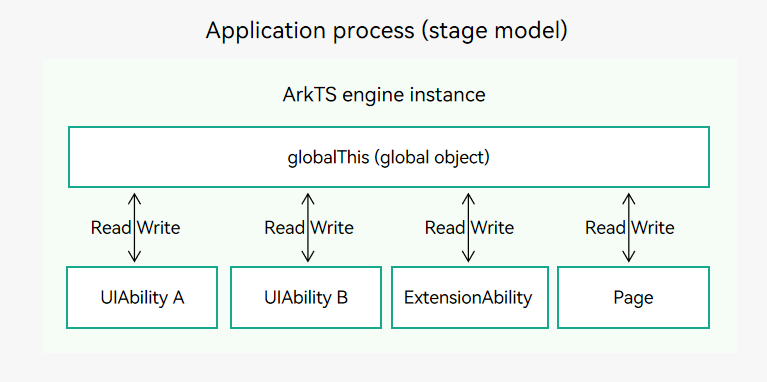
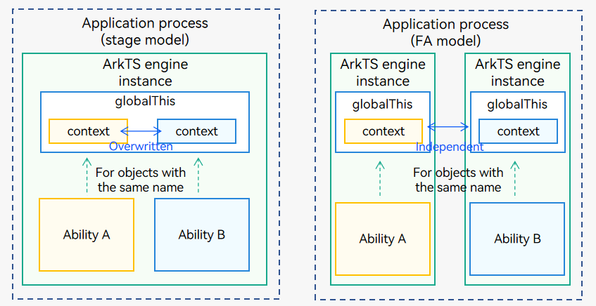

# Data Synchronization Between UIAbility and UI


Based on the OpenHarmony application model, you can use any of the following ways to implement data synchronization between the UIAbility component and UI:

- [Using EventHub for Data Synchronization](#using-eventhub-for-data-synchronization): The **EventHub** object is provided by the base class **Context**. Events are transferred using the publish/subscribe (pub/sub) pattern. Specifically, after subscribing to an event, your application will receive the event and process it accordingly when the event is published.
- [Using globalThis for Data Synchronization](#using-globalthis-for-data-synchronization): **globalThis** is a global object inside the ArkTS engine instance and can be accessed by components such as UIAbility, ExtensionAbility, and Page.
- [Using AppStorage or LocalStorage for Data Synchronization](#using-appstorage-or-localstorage-for-data-synchronization): ArkUI provides two application-level state management solutions: AppStorage and LocalStorage, which implement application- and UIAbility-level data synchronization, respectively.


## Using EventHub for Data Synchronization

[EventHub](../reference/apis/js-apis-inner-application-eventHub.md) provides an event mechanism for the UIAbility or ExtensionAbility component so that they can subscribe to, unsubscribe from, and trigger events.

Before using the APIs provided by **EventHub**, you must obtain an **EventHub** object, which is provided by the [base class Context](application-context-stage.md). This section uses EventHub as an example to describe how to implement data synchronization between the UIAbility component and the UI.

1. Call [eventHub.on()](../reference/apis/js-apis-inner-application-eventHub.md#eventhubon) in the UIAbility in either of the following ways to register a custom event **event1**.

   ```ts
   import UIAbility from '@ohos.app.ability.UIAbility';

   const TAG: string = '[Example].[Entry].[EntryAbility]';

   export default class EntryAbility extends UIAbility {
       func1(...data) {
           // Trigger the event to complete the service operation.
           console.info(TAG, '1. ' + JSON.stringify(data));
       }

       onCreate(want, launch) {
           // Obtain an eventHub object.
           let eventhub = this.context.eventHub;
           // Subscribe to the event.
           eventhub.on('event1', this.func1);
           eventhub.on('event1', (...data) => {
               // Trigger the event to complete the service operation.
               console.info(TAG, '2. ' + JSON.stringify(data));
           });
       }
   }
   ```

2. Call [eventHub.emit()](../reference/apis/js-apis-inner-application-eventHub.md#eventhubemit) on the UI to trigger the event, and pass the parameters as required.

   ```ts
   import common from '@ohos.app.ability.common';

   @Entry
   @Component
   struct Index {
     private context = getContext(this) as common.UIAbilityContext;

     eventHubFunc() {
       // Trigger the event without parameters.
       this.context.eventHub.emit('event1');
       // Trigger the event with one parameter.
       this.context.eventHub.emit('event1', 1);
       // Trigger the event with two parameters.
       this.context.eventHub.emit('event1', 2, 'test');
       // You can design the parameters based on your service requirements.
     }

     // Page display.
     build() {
       // ...
     }
   }
   ```

3. Obtain the event trigger result from the subscription callback of UIAbility. The run log result is as follows:

   ```ts
   []

   [1]

   [2,'test']
   ```

4. After **event1** is used, you can call [eventHub.off()](../reference/apis/js-apis-inner-application-eventHub.md#eventhuboff) to unsubscribe from the event.

   ```ts
   // context is the AbilityContext of the UIAbility instance.
   this.context.eventHub.off('event1');
   ```


## Using globalThis for Data Synchronization

**globalThis** is a global object inside the [ArkTS engine instance](thread-model-stage.md) and can be used by UIAbility, ExtensionAbility, and Page inside the engine. Therefore, you can use **globalThis** for data synchronization.

**Figure 1** Using globalThis for data synchronization

  


The following describes how to use **globalThis** in three scenarios. Precautions are provided as well.

- [Using globalThis Between UIAbility and Page](#using-globalthis-between-uiability-and-page)
- [Using globalThis Between UIAbility and UIAbility](#using-globalthis-between-uiability-and-uiability)
- [Use globalThis Between UIAbility and ExtensionAbility](#using-globalthis-between-uiability-and-extensionability)
- [Precautions for Using globalThis](#precautions-for-using-globalthis)

### Using globalThis Between UIAbility and Page

By binding attributes or methods to **globalThis**, you can implement data synchronization between the UIAbility component and UI. For example, if you bind the **want** parameter in the UIAbility component, you can use the **want** parameter information on the UI corresponding to the UIAbility component.

1. When [startAbility()](../reference/apis/js-apis-inner-application-uiAbilityContext.md#uiabilitycontextstartability) is called to start a UIAbility instance, the **onCreate()** callback is invoked, and the **want** parameter can be passed in the callback. Therefore, you can bind the **want** parameter to **globalThis**.

   ```ts
   import UIAbility from '@ohos.app.ability.UIAbility';

   export default class EntryAbility extends UIAbility {
       onCreate(want, launch) {
           globalThis.entryAbilityWant = want;
           // ...
       }

       // ...
   }
   ```

2. Use **globalThis** on the UI to obtain the **want** parameter information.

   ```ts
   let entryAbilityWant;

   @Entry
   @Component
   struct Index {
     aboutToAppear() {
       entryAbilityWant = globalThis.entryAbilityWant;
     }

     // Page display.
     build() {
       // ...
     }
   }
   ```


### Using globalThis Between UIAbility and UIAbility

To implement data synchronization between two UIAbility components in the same application, you can bind data to **globalThis**. For example, you can save data in **globalThis** in UIAbilityA and obtain the data from UIAbilityB.

1. UIAbilityA stores a string and binds it to globalThis.

   ```ts
   import UIAbility from '@ohos.app.ability.UIAbility'

   export default class UIAbilityA extends UIAbility {
       onCreate(want, launch) {
           globalThis.entryAbilityStr = 'UIAbilityA'; // UIAbilityA stores the string "UIAbilityA" to globalThis.
           // ...
       }
   }
   ```

2. Obtain the data from UIAbilityB.

   ```ts
   import UIAbility from '@ohos.app.ability.UIAbility'

   export default class UIAbilityB extends UIAbility {
       onCreate(want, launch) {
           // UIAbilityB reads name from globalThis and outputs it.
           console.info('name from entryAbilityStr: ' + globalThis.entryAbilityStr);
           // ...
       }
   }
   ```


### Using globalThis Between UIAbility and ExtensionAbility

To implement data synchronization between the UIAbility and ExtensionAbility components in the same application, you can bind data to **globalThis**. For example, you can save data in **globalThis** in UIAbilityA and obtain the data from ServiceExtensionAbility.

1. UIAbilityA stores a string and binds it to globalThis.

   ```ts
   import UIAbility from '@ohos.app.ability.UIAbility'

   export default class UIAbilityA extends UIAbility {
       onCreate(want, launch) {
           // UIAbilityA stores the string "UIAbilityA" to globalThis.
           globalThis.entryAbilityStr = 'UIAbilityA';
           // ...
       }
   }
   ```

2. Obtain the data from ExtensionAbility.

   ```ts
   import Extension from '@ohos.app.ability.ServiceExtensionAbility'

   export default class ServiceExtAbility extends Extension {
       onCreate(want) {
           / / ServiceExtAbility reads name from globalThis and outputs it.
           console.info('name from entryAbilityStr: ' + globalThis.entryAbilityStr);
           // ...
       }
   }
   ```


### Precautions for Using globalThis

**Figure 2** Precautions for globalThis



- In the stage model, all the UIAbility components in a process share one ArkTS engine instance. When using **globalThis**, do not store objects with the same name. For example, if UIAbilityA and UIAbilityB use **globalThis** to store two objects with the same name, the object stored earlier will be overwritten.

- This problem does not occur in the FA model because each UIAbility component uses an independent engine.

- The lifecycle of an object bound to **globalThis** is the same as that of the ArkTS engine instance. You are advised to assign the value **null** after using the object to minimize memory usage.

The following provides an example to describe the object overwritten problem in the stage model.

1. In the UIAbilityA file, [UIAbilityContext](../reference/apis/js-apis-inner-application-uiAbilityContext.md) is stored in **globalThis**.

   ```ts
   import UIAbility from '@ohos.app.ability.UIAbility'

   export default class UIAbilityA extends UIAbility {
       onCreate(want, launch) {
           globalThis.context = this.context; // UIAbilityA stores the context in globalThis.
           // ...
       }
   }
   ```

2. Obtain and use [UIAbilityContext](../reference/apis/js-apis-inner-application-uiAbilityContext.md) on the page of UIAbilityA. After the UIAbilityA instance is used, switch it to the background.

   ```ts
   @Entry
   @Component
   struct Index {
     onPageShow() {
       let ctx = globalThis.context; // Obtain the context from globalThis and use it.
     }
     // Page display.
     build() {
       // ...
     }
   }
   ```

3. In the UIAbilityB file, [UIAbilityContext](../reference/apis/js-apis-inner-application-uiAbilityContext.md) is stored in **globalThis** and has the same name as that in the UIAbilityA file.

   ```ts
   import UIAbility from '@ohos.app.ability.UIAbility'

   export default class UIAbilityB extends UIAbility {
       onCreate(want, launch) {
           // UIAbilityB overwrites the context stored by UIAbilityA in globalThis.
           globalThis.context = this.context;
           // ...
       }
   }
   ```

4. Obtain and use [UIAbilityContext](../reference/apis/js-apis-inner-application-uiAbilityContext.md) on the page of UIAbilityB. The obtained **globalThis.context** is the value of [UIAbilityContext](../reference/apis/js-apis-inner-application-uiAbilityContext.md) in UIAbilityB.

   ```ts
   @Entry
   @Component
   struct Index {
     onPageShow() {
       let ctx = globalThis.context; // Obtain the context from globalThis and use it.
     }
     // Page display.
     build() {
       // ...
     }
   }
   ```

5. Switch the UIAbilityB instance to the background and switch the UIAbilityA instance to the foreground. In this case, UIAbilityA will not enter the **onCreate()** lifecycle again.

   ```ts
   import UIAbility from '@ohos.app.ability.UIAbility'

   export default class UIAbilityA extends UIAbility {
       onCreate(want, launch) { // UIAbilityA will not enter this lifecycle.
           globalThis.context = this.context;
           // ...
       }
   }
   ```

6. When the page of UIAbilityA is displayed, the obtained **globalThis.context** is [UIAbilityContext](../reference/apis/js-apis-inner-application-uiAbilityContext.md) of UIAbilityB instead of UIAbilityA. An error occurs.

   ```ts
   @Entry
   @Component
   struct Index {
     onPageShow() {
       let ctx = globalThis.context; // The context in globalThis is the context of UIAbilityB.
     }
     // Page display.
     build() {
       // ...
     }
   }
   ```

## Using AppStorage or LocalStorage for Data Synchronization

ArkUI provides AppStorage and LocalStorage to implement application- and UIAbility-level data synchronization, respectively. Both solutions can be used to manage the application state, enhance application performance, and improve user experience. The AppStorage is a global state manager and is applicable when multiple UIAbilities share the same state data. The LocalStorage is a local state manager that manages state data used inside a single UIAbility. They help you control the application state more flexibly and improve the maintainability and scalability of applications. For details, see [State Management of Application-Level Variables](../quick-start/arkts-application-state-management-overview.md).

 <!--no_check--> 