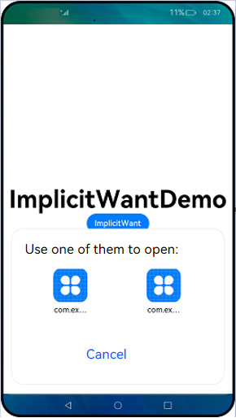
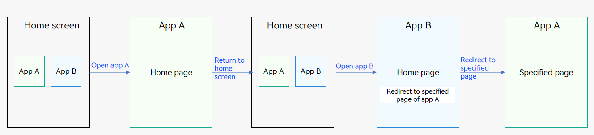

# Intra-Device Interaction Between UIAbility Components


UIAbility is the minimum unit that can be scheduled by the system. Jumping between functional modules in a device involves starting of specific UIAbility components, which belong to the same or a different application (for example, starting UIAbility of a third-party payment application).


This topic describes the UIAbility interaction modes in the following scenarios. For details about cross-device application component interaction, see [Inter-Device Application Component Interaction (Continuation)](inter-device-interaction-hop-overview.md).


- [Starting UIAbility in the Same Application](#starting-uiability-in-the-same-application)

- [Starting UIAbility in the Same Application and Obtaining the Return Result](#starting-uiability-in-the-same-application-and-obtaining-the-return-result)

- [Starting UIAbility of Another Application](#starting-uiability-of-another-application)

- [Starting UIAbility of Another Application and Obtaining the Return Result](#starting-uiability-of-another-application-and-obtaining-the-return-result)

- [Starting UIAbility with Window Mode Specified (for System Applications Only)](#starting-uiability-with-window-mode-specified-for-system-applications-only)

- [Starting a Specified Page of UIAbility](#starting-a-specified-page-of-uiability)

- [Using Call to Implement UIAbility Interaction (for System Applications Only)](#using-call-to-implement-uiability-interaction-for-system-applications-only)


## Starting UIAbility in the Same Application

This scenario is possible when an application contains multiple UIAbility components. For example, in a payment application, you may need to start the payment UIAbility from the entry UIAbility.

Assume that your application has two UIAbility components: EntryAbility and FuncAbility, either in the same module or different modules. You are required to start FuncAbility from EntryAbility.

1. In EntryAbility, call [startAbility()](../reference/apis/js-apis-inner-application-uiAbilityContext.md#uiabilitycontextstartability) to start UIAbility. The [want](../reference/apis/js-apis-app-ability-want.md) parameter is the entry parameter for starting the UIAbility instance. In the **want** parameter, **bundleName** indicates the bundle name of the application to start; **abilityName** indicates the name of the UIAbility to start; **moduleName** is required only when the target UIAbility belongs to a different module; **parameters** is used to carry custom information. For details about how to obtain the context, see [Obtaining the Context of UIAbility](uiability-usage.md#obtaining-the-context-of-uiability).
   
   ```ts
   let context = ...; // UIAbilityContext
   let want = {
     deviceId: '', // An empty deviceId indicates the local device.
     bundleName: 'com.example.myapplication',
     abilityName: 'FuncAbility',
     moduleName: 'func', // moduleName is optional.
     parameters: {// Custom information.
       info: 'From the Index page of EntryAbility',
     },
   }
   // context is the UIAbilityContext of the initiator UIAbility.
   context.startAbility(want).then(() => {
     console.info('Succeeded in starting ability.');
   }).catch((err) => {
     console.error(`Failed to start ability. Code is ${err.code}, message is ${err.message}`);
   })
   ```
   
2. In FuncAbility, use [onCreate()](../reference/apis/js-apis-app-ability-uiAbility.md#uiabilityoncreate) or [onNewWant()](../reference/apis/js-apis-app-ability-uiAbility.md#uiabilityonnewwant) to receive the parameters passed in by EntryAbility.
   
   ```ts
   import UIAbility from '@ohos.app.ability.UIAbility';
   
   export default class FuncAbility extends UIAbility {
     onCreate(want, launchParam) {
       // Receive the parameters passed by the initiator UIAbility.
       let funcAbilityWant = want;
       let info = funcAbilityWant?.parameters?.info;
       ...
     }
   }
   ```
   
   > **NOTE**
   >
   > In FuncAbility started, you can obtain the PID and bundle name of the UIAbility through **parameters** in the passed **want** parameter.
   
3. To stop the **UIAbility** instance after the FuncAbility service is complete, call [terminateSelf()](../reference/apis/js-apis-inner-application-uiAbilityContext.md#uiabilitycontextterminateself) in FuncAbility.
   
   ```ts
   let context = ...; // UIAbilityContext
   
   // context is the UIAbilityContext of the UIAbility instance to stop.
   context.terminateSelf((err) => {
     if (err.code) {
       console.error(`Failed to terminate Self. Code is ${err.code}, message is ${err.message}`);
       return;
     }
   });
   ```
   
   > **NOTE**
   >
   > When [terminateSelf()](../reference/apis/js-apis-inner-application-uiAbilityContext.md#uiabilitycontextterminateself) is called to stop the **UIAbility** instance, the snapshot of the instance is retained by default. That is, the mission corresponding to the instance is still displayed in Recents. If you do not want to retain the snapshot, set **removeMissionAfterTerminate** under the [abilities](../quick-start/module-configuration-file.md#abilities) tag to **true** in the [module.json5 file](../quick-start/module-configuration-file.md) of the corresponding UIAbility.
   
4. To stop all UIAbility instances of the application, call **killProcessBySelf()** of [ApplicationContext](../reference/apis/js-apis-inner-application-applicationContext.md) to stop all processes of the application.


## Starting UIAbility in the Same Application and Obtaining the Return Result

When starting FuncAbility from EntryAbility, you want the result to be returned after the FuncAbility service is finished. For example, your application uses two independent UIAbility components to carry the entry and sign-in functionalities. After the sign-in operation is finished in the sign-in UIAbility, the sign-in result needs to be returned to the entry UIAbility.

1. In EntryAbility, call [startAbilityForResult()](../reference/apis/js-apis-inner-application-uiAbilityContext.md#uiabilitycontextterminateselfwithresult) to start FuncAbility. Use **data** in the asynchronous callback to receive information returned after FuncAbility stops itself. For details about how to obtain the context, see [Obtaining the Context of UIAbility](uiability-usage.md#obtaining-the-context-of-uiability).
   
   ```ts
   let context = ...; // UIAbilityContext
   let want = {
     deviceId: '', // An empty deviceId indicates the local device.
     bundleName: 'com.example.myapplication',
     abilityName: 'FuncAbility',
     moduleName: 'func', // moduleName is optional.
     parameters: {// Custom information.
       info: 'From the Index page of EntryAbility',
     },
   }
   // context is the UIAbilityContext of the initiator UIAbility.
   context.startAbilityForResult(want).then((data) => {
     ...
   }).catch((err) => {
     console.error(`Failed to start ability for result. Code is ${err.code}, message is ${err.message}`);
   })
   ```
   
2. Call [terminateSelfWithResult()](../reference/apis/js-apis-inner-application-uiAbilityContext.md#uiabilitycontextterminateselfwithresult) to stop FuncAbility. Use the input parameter **abilityResult** to carry the information that FuncAbility needs to return to EntryAbility.
   
   ```ts
   let context = ...; // UIAbilityContext
   const RESULT_CODE: number = 1001;
   let abilityResult = {
     resultCode: RESULT_CODE,
     want: {
       bundleName: 'com.example.myapplication',
       abilityName: 'FuncAbility',
       moduleName: 'func',
       parameters: {
         info: 'From the Index page of FuncAbility',
       },
     },
   }
   // context is the AbilityContext of the target UIAbility.
   context.terminateSelfWithResult(abilityResult, (err) => {
     if (err.code) {
       console.error(`Failed to terminate self with result. Code is ${err.code}, message is ${err.message}`);
       return;
     }
   });
   ```
   
3. After FuncAbility stops itself, EntryAbility uses [startAbilityForResult()](../reference/apis/js-apis-inner-application-uiAbilityContext.md#uiabilitycontextterminateselfwithresult) to receive the information returned by FuncAbility. The value of **RESULT_CODE** must be the same as the preceding value.
   
   ```ts
   let context = ...; // UIAbilityContext
   const RESULT_CODE: number = 1001;
   
   ...
   
   // context is the UIAbilityContext of the initiator UIAbility.
   context.startAbilityForResult(want).then((data) => {
     if (data?.resultCode === RESULT_CODE) {
       // Parse the information returned by the target UIAbility.
       let info = data.want?.parameters?.info;
       ...
     }
   }).catch((err) => {
     console.error(`Failed to start ability for result. Code is ${err.code}, message is ${err.message}`);
   })
   ```


## Starting UIAbility of Another Application

Generally, the user only needs to do a common operation (for example, selecting a document application to view the document content) to start the UIAbility of another application. The [implicit Want launch mode](want-overview.md#types-of-want) is recommended. The system identifies a matched UIAbility and starts it based on the **want** parameter of the initiator UIAbility.

There are two ways to start **UIAbility**: [explicit and implicit](want-overview.md).

- Explicit Want launch: This mode is used to start a determined UIAbility component of an application. You need to set **bundleName** and **abilityName** of the target application in the **want** parameter.

- Implicit Want launch: The user selects a UIAbility to start based on the matching conditions. That is, the UIAbility to start is not determined (the **abilityName** parameter is not specified). When [startAbility()](../reference/apis/js-apis-inner-application-uiAbilityContext.md#uiabilitycontextstartability) is called, the want parameter specifies a series of parameters such as **entities** and **actions**. **entities** provides category information of the target UIAbility, such as the browser or video player. **actions** specifies the common operations to perform, such as viewing, sharing, and application details. Then the system analyzes the **want** parameter to find the right UIAbility to start. You usually do not know whether the target application is installed and what **bundleName** and **abilityName** of the target application are. Therefore, implicit Want launch is usually used to start the UIAbility of another application.

This section describes how to start the UIAbility of another application through implicit Want.

1. Install multiple document applications on your device. In the [module.json5 file](../quick-start/module-configuration-file.md) of each UIAbility component, configure **entities** and **actions** under **skills**.
   
   ```json
   {
     "module": {
       "abilities": [
         {
           ...
           "skills": [
             {
               "entities": [
                 ...
                 "entity.system.default"
               ],
               "actions": [
                 ...
                 "ohos.want.action.viewData"
               ]
             }
           ]
         }
       ]
     }
   }
   ```

2. Include **entities** and **actions** of the initiator UIAbility's **want** parameter into **entities** and **actions** under **skills** of the target UIAbility. After the system matches the UIAbility that meets the **entities** and **actions** information, a dialog box is displayed, showing the list of matched UIAbility instances for users to select. For details about how to obtain the context, see [Obtaining the Context of UIAbility](uiability-usage.md#obtaining-the-context-of-uiability).
   
   ```ts
   let context = ...; // UIAbilityContext
   let want = {
     deviceId: '', // An empty deviceId indicates the local device.
     // Uncomment the line below if you want to implicitly query data only in the specific bundle.
     // bundleName: 'com.example.myapplication',
     action: 'ohos.want.action.viewData',
     // entities can be omitted.
     entities: ['entity.system.default'],
   }
   
   // context is the UIAbilityContext of the initiator UIAbility.
   context.startAbility(want).then(() => {
     console.info('Succeeded in starting ability.');
   }).catch((err) => {
     console.error(`Failed to start ability. Code is ${err.code}, message is ${err.message}`);
   })
   ```
   
   The following figure shows the effect. When you click **Open PDF**, a dialog box is displayed for you to select. 
   
   
3. To stop the **UIAbility** instance after the document application is used, call [terminateSelf()](../reference/apis/js-apis-inner-application-uiAbilityContext.md#uiabilitycontextterminateself).
   
   ```ts
   let context = ...; // UIAbilityContext
   
   // context is the UIAbilityContext of the UIAbility instance to stop.
   context.terminateSelf((err) => {
     if (err.code) {
       console.error(`Failed to terminate self. Code is ${err.code}, message is ${err.message}`);
       return;
     }
   });
   ```


## Starting UIAbility of Another Application and Obtaining the Return Result

If you want to obtain the return result when using implicit Want to start the UIAbility of another application, use [startAbilityForResult()](../reference/apis/js-apis-inner-application-uiAbilityContext.md#uiabilitycontextterminateselfwithresult). An example scenario is that the main application needs to start a third-party payment application and obtain the payment result.

1. In the [module.json5 file](../quick-start/module-configuration-file.md) of the UIAbility corresponding to the payment application, set **entities** and **actions** under **skills**.
   
   ```json
   {
     "module": {
       "abilities": [
         {
           ...
           "skills": [
             {
               "entities": [
                 ...
                 "entity.system.default"
               ],
               "actions": [
                 ...
                 "ohos.want.action.editData"
               ]
             }
           ]
         }
       ]
     }
   }
   ```

2. Call [startAbilityForResult()](../reference/apis/js-apis-inner-application-uiAbilityContext.md#uiabilitycontextterminateselfwithresult) to start the UIAbility of the payment application. Include **entities** and **actions** of the initiator UIAbility's **want** parameter into **entities** and **actions** under **skills** of the target UIAbility. Use **data** in the asynchronous callback to receive the information returned to the initiator UIAbility after the payment UIAbility stops itself. After the system matches the UIAbility that meets the **entities** and **actions** information, a dialog box is displayed, showing the list of matched UIAbility instances for users to select.
   
   ```ts
   let context = ...; // UIAbilityContext
   let want = {
     deviceId: '', // An empty deviceId indicates the local device.
     // Uncomment the line below if you want to implicitly query data only in the specific bundle.
     // bundleName: 'com.example.myapplication',
     action: 'ohos.want.action.editData',
     // entities can be omitted.
     entities: ['entity.system.default']
   }
   
   // context is the UIAbilityContext of the initiator UIAbility.
   context.startAbilityForResult(want).then((data) => {
     ...
   }).catch((err) => {
     console.error(`Failed to start ability for result. Code is ${err.code}, message is ${err.message}`);
   })
   ```
   
3. After the payment is finished, call [terminateSelfWithResult()](../reference/apis/js-apis-inner-application-uiAbilityContext.md#uiabilitycontextterminateselfwithresult) to stop the payment UIAbility and return the **abilityResult** parameter.
   
   ```ts
   let context = ...; // UIAbilityContext
   const RESULT_CODE: number = 1001;
   let abilityResult = {
     resultCode: RESULT_CODE,
     want: {
       bundleName: 'com.example.myapplication',
       abilityName: 'EntryAbility',
       moduleName: 'entry',
       parameters: {
         payResult: 'OKay',
       },
     },
   }
   // context is the AbilityContext of the target UIAbility.
   context.terminateSelfWithResult(abilityResult, (err) => {
     if (err.code) {
       console.error(`Failed to terminate self with result. Code is ${err.code}, message is ${err.message}`);
       return;
     }
   });
   ```
   
4. Receive the information returned by the payment application in the callback of the [startAbilityForResult()](../reference/apis/js-apis-inner-application-uiAbilityContext.md#uiabilitycontextterminateselfwithresult) method. The value of **RESULT_CODE** must be the same as that returned by [terminateSelfWithResult()](../reference/apis/js-apis-inner-application-uiAbilityContext.md#uiabilitycontextterminateselfwithresult).
   
   ```ts
   let context = ...; // UIAbilityContext
   const RESULT_CODE: number = 1001;
   
   let want = {
     // Want parameter information.
   };
   
   // context is the UIAbilityContext of the initiator UIAbility.
   context.startAbilityForResult(want).then((data) => {
     if (data?.resultCode === RESULT_CODE) {
       // Parse the information returned by the target UIAbility.
       let payResult = data.want?.parameters?.payResult;
       ...
     }
   }).catch((err) => {
     console.error(`Failed to start ability for result. Code is ${err.code}, message is ${err.message}`);
   })
   ```

## Starting UIAbility with Window Mode Specified (for System Applications Only)

By specifying the window mode when starting the UIAbility of an application, the application can be displayed in different window modes, which can be full-screen, floating window, or split-screen.

In full-screen mode, an application occupies the entire screen after being started. Users cannot view other windows or applications. This mode is suitable for an application that requires users to focus on a specific task or UI.

In floating window mode, an application is displayed on the screen as a floating window after being started. Users can easily switch to other windows or applications. The mode is suitable for an application that requires users to process multiple tasks at the same time.

In split-screen mode, two applications occupy the entire screen, with one on the left or in the upper part of the screen and the other on the right or in the lower part. This mode helps users improve multi-task processing efficiency.

The window mode is specified by the **windowMode** field in the [StartOptions](../reference/apis/js-apis-app-ability-startOptions.md) parameter of [startAbility()](../reference/apis/js-apis-inner-application-uiAbilityContext.md#uiabilitycontextstartability).

> **NOTE**
>
> 1. If the **windowMode** field is not specified, the UIAbility is started in the default window mode.
> 2. To ensure that the application can be displayed in the required window mode, check the **supportWindowMode** field in the [abilities](../quick-start/module-configuration-file.md#abilities) tag in the [module.json5 file](../quick-start/module-configuration-file.md) of the UIAbility and make sure the specified window mode is supported.

The following uses the floating window mode as an example to describe how to start the FuncAbility from the EntryAbility page.

1. Add the [StartOptions](../reference/apis/js-apis-app-ability-startOptions.md) parameter in [startAbility()](../reference/apis/js-apis-inner-application-uiAbilityContext.md#uiabilitycontextstartability).
2. Set the **windowMode** field in the [StartOptions](../reference/apis/js-apis-app-ability-startOptions.md) parameter to **WINDOW_MODE_FLOATING**, indicating that the UIAbility will be displayed in a floating window.

For details about how to obtain the context, see [Obtaining the Context of UIAbility](uiability-usage.md#obtaining-the-context-of-uiability).

```ts
import AbilityConstant from '@ohos.app.ability.AbilityConstant';

let context = ...; // UIAbilityContext
let want = {
  deviceId: '', // An empty deviceId indicates the local device.
  bundleName: 'com.example.myapplication',
  abilityName: 'FuncAbility',
  moduleName: 'func', // moduleName is optional.
  parameters: {// Custom information.
    info: 'From the Index page of EntryAbility',
  },
}
let options = {
  windowMode: AbilityConstant.WindowMode.WINDOW_MODE_FLOATING
};
// context is the UIAbilityContext of the initiator UIAbility.
context.startAbility(want, options).then(() => {
  console.info('Succeeded in starting ability.');
}).catch((err) => {
  console.error(`Failed to start ability. Code is ${err.code}, message is ${err.message}`);
})
```

The display effect is shown below.


## Starting a Specified Page of UIAbility

A UIAbility component can have multiple pages. When it is started in different scenarios, different pages can be displayed. For example, when a user jumps from a page of a UIAbility component to another UIAbility, you want to start a specified page of the target UIAbility. This section describes how to specify a startup page and start the specified page when the target UIAbility is started for the first time or when the target UIAbility is not started for the first time.


### Specifying a Startup Page

When the initiator UIAbility starts another UIAbility, it usually needs to redirect to a specified page. For example, FuncAbility contains two pages: Index (corresponding to the home page) and Second (corresponding to function A page). You can configure the specified page URL in the **want** parameter by adding a custom parameter to **parameters** in **want**. For details about how to obtain the context, see [Obtaining the Context of UIAbility](uiability-usage.md#obtaining-the-context-of-uiability).


```ts
let context = ...; // UIAbilityContext
let want = {
    deviceId: '', // An empty deviceId indicates the local device.
    bundleName: 'com.example.myapplication',
    abilityName: 'FuncAbility',
    moduleName: 'func', // moduleName is optional.
    parameters: {// Custom parameter used to pass the page information.
        router: 'funcA',
    },
}
// context is the UIAbilityContext of the initiator UIAbility.
context.startAbility(want).then(() => {
  console.info('Succeeded in starting ability.');
}).catch((err) => {
  console.error(`Failed to start ability. Code is ${err.code}, message is ${err.message}`);
})
```


### Starting a Page When the Target UIAbility Is Started for the First Time

When the target UIAbility is started for the first time, in the **onWindowStageCreate()** callback of the target UIAbility, parse the **want** parameter passed by EntryAbility to obtain the URL of the page to be loaded, and pass the URL to the **windowStage.loadContent()** method.


```ts
import UIAbility from '@ohos.app.ability.UIAbility'
import Window from '@ohos.window'

export default class FuncAbility extends UIAbility {
  funcAbilityWant;

  onCreate(want, launchParam) {
    // Receive the parameters passed by the initiator UIAbility.
    this.funcAbilityWant = want;
  }

  onWindowStageCreate(windowStage: Window.WindowStage) {
    // Main window is created. Set a main page for this UIAbility.
    let url = 'pages/Index';
    if (this.funcAbilityWant?.parameters?.router) {
      if (this.funcAbilityWant.parameters.router === 'funA') {
        url = 'pages/Second';
      }
    }
    windowStage.loadContent(url, (err, data) => {
      ...
    });
  }
}
```


### Starting a Page When the Target UIAbility Is Not Started for the First Time

You start application A, and its home page is displayed. Then you return to the home screen and start application B. Now you need to start application A again from application B and have a specified page of application A displayed. An example scenario is as follows: When you open the home page of the SMS application and return to the home screen, the SMS application is in the opened state and its home page is displayed. Then you open the home page of the Contacts application, access user A's details page, and touch the SMS icon to send an SMS message to user A. The SMS application is started again and the sending page is displayed.



In summary, when a UIAbility instance of application A has been created and the main page of the UIAbility instance is displayed, you need to start the UIAbility of application A from application B and have a different page displayed.

1. In the target UIAbility, the **Index** page is loaded by default. The UIAbility instance has been created, and the **onNewWant()** callback rather than **onCreate()** and **onWindowStageCreate()** will be invoked. In the **onNewWant()** callback, parse the **want** parameter and bind it to the global variable **globalThis**.
   
   ```ts
   import UIAbility from '@ohos.app.ability.UIAbility'
   
   export default class FuncAbility extends UIAbility {
     onNewWant(want, launchParam) {
       // Receive the parameters passed by the initiator UIAbility.
       globalThis.funcAbilityWant = want;
       ...
     }
   }
   ```

2. In FuncAbility, use the router module to implement redirection to the specified page on the **Index** page. Because the **Index** page of FuncAbility is active, the variable will not be declared again and the **aboutToAppear()** callback will not be triggered. Therefore, the page routing functionality can be implemented in the **onPageShow()** callback of the **Index** page.
   
   ```ts
   import router from '@ohos.router';
   
   @Entry
   @Component
   struct Index {
     onPageShow() {
       let funcAbilityWant = globalThis.funcAbilityWant;
       let url2 = funcAbilityWant?.parameters?.router;
       if (url2 && url2 === 'funcA') {
         router.replaceUrl({
           url: 'pages/Second',
         })
       }
     }
   
     // Page display.
     build() {
       ...
     }
   }
   ```

> **NOTE**
>
> When the [launch type of the target UIAbility](uiability-launch-type.md) is set to **multiton**, a new instance is created each time the target UIAbility is started. In this case, the [onNewWant()](../reference/apis/js-apis-app-ability-uiAbility.md#abilityonnewwant) callback will not be invoked.


## Using Call to Implement UIAbility Interaction (for System Applications Only)

Call is an extension of the UIAbility capability. It enables the UIAbility to be invoked by and communicate with external systems. The UIAbility invoked can be either started in the foreground or created and run in the background. You can use the call to implement data sharing between two UIAbility instances (CallerAbility and CalleeAbility) through IPC.

The core API used for the call is **startAbilityByCall()**, which differs from **startAbility()** in the following ways:

- **startAbilityByCall()** supports UIAbility launch in the foreground and background, whereas **startAbility()** supports UIAbility launch in the foreground only.

- The CallerAbility can use the caller object returned by **startAbilityByCall()** to communicate with the CalleeAbility, but **startAbility()** does not provide the communication capability.

Call is usually used in the following scenarios:

- Communicating with the CalleeAbility

- Starting the CalleeAbility in the background


**Table 1** Terms used in the call

| **Term**| Description|
| -------- | -------- |
| CallerAbility| UIAbility that triggers the call.|
| CalleeAbility | UIAbility invoked by the call.|
| Caller | Object returned by **startAbilityByCall** and used by the CallerAbility to communicate with the CalleeAbility.|
| Callee | Object held by the CalleeAbility to communicate with the CallerAbility.|

The following figure shows the call process.

Figure 1 Call process

  

- The CallerAbility uses **startAbilityByCall** to obtain a caller object and uses **call()** of the caller object to send data to the CalleeAbility.

- The CalleeAbility, which holds a **Callee** object, uses **on()** of the **Callee** object to register a callback. This callback is invoked when the CalleeAbility receives data from the CallerAbility.

> **NOTE**
> 1. Currently, only system applications can use the call.
> 
> 2. The launch type of the CalleeAbility must be **singleton**.
> 
> 3. Both local (intra-device) and cross-device calls are supported. The following describes how to initiate a local call. For details about how to initiate a cross-device call, see [Using Cross-Device Call](hop-multi-device-collaboration.md#using-cross-device-call).


### Available APIs

The following table describes the main APIs used for the call. For details, see [AbilityContext](../reference/apis/js-apis-app-ability-uiAbility.md#caller).

**Table 2** Call APIs

| API| Description|
| -------- | -------- |
| startAbilityByCall(want: Want): Promise&lt;Caller&gt; | Starts a UIAbility in the foreground (through the **want** configuration) or background (default) and obtains the caller object for communication with the UIAbility. For details, see [AbilityContext](../reference/apis/js-apis-inner-application-uiAbilityContext.md#abilitycontextstartabilitybycall) or [ServiceExtensionContext](../reference/apis/js-apis-inner-application-serviceExtensionContext.md#serviceextensioncontextstartabilitybycall).|
| on(method: string, callback: CalleeCallBack): void | Callback invoked when the CalleeAbility registers a method.|
| off(method: string): void | Callback invoked when the CalleeAbility deregisters a method.|
| call(method: string, data: rpc.Parcelable): Promise&lt;void&gt; | Sends agreed parcelable data to the CalleeAbility.|
| callWithResult(method: string, data: rpc.Parcelable): Promise&lt;rpc.MessageSequence&gt; | Sends agreed parcelable data to the CalleeAbility and obtains the agreed parcelable data returned by the CalleeAbility.|
| release(): void | Releases the caller object.|
| on(type: "release", callback: OnReleaseCallback): void | Callback invoked when the caller object is released.|

The implementation of using the call for UIAbility interaction involves two parts.

- [Creating a CalleeAbility](#creating-a-calleeability)

- [Accessing the CalleeAbility](#accessing-the-calleeability)


### Creating a CalleeAbility

For the CalleeAbility, implement the callback to receive data and the methods to marshal and unmarshal data. When data needs to be received, use **on()** to register a listener. When data does not need to be received, use **off()** to deregister the listener.

1. Configure the launch type of the UIAbility.
   
   For example, set the launch type of the CalleeAbility to **singleton**. For details, see [UIAbility Component Launch Type](uiability-launch-type.md).
   
2. Import the **UIAbility** module.
   
   ```ts
   import UIAbility from '@ohos.app.ability.UIAbility';
   ```

3. Define the agreed parcelable data.

   The data formats sent and received by the CallerAbility and CalleeAbility must be consistent. In the following example, the data formats are number and string.

   
   ```ts
   export default class MyParcelable {
     num: number = 0;
     str: string = '';
   
     constructor(num, string) {
       this.num = num;
       this.str = string;
     }
   
     marshalling(messageSequence) {
       messageSequence.writeInt(this.num);
       messageSequence.writeString(this.str);
       return true;
     }
   
     unmarshalling(messageSequence) {
       this.num = messageSequence.readInt();
       this.str = messageSequence.readString();
       return true;
     }
   }
   ```

4. Implement **Callee.on** and **Callee.off**.
   
   The time to register a listener for the CalleeAbility depends on your application. The data sent and received before the listener is registered and that after the listener is deregistered are not processed. In the following example, the **MSG_SEND_METHOD** listener is registered in **onCreate** of the UIAbility and deregistered in **onDestroy**. After receiving parcelable data, the application processes the data and returns the data result. You need to implement processing based on service requirements. The sample code is as follows:
   
   
   ```ts
   const TAG: string = '[CalleeAbility]';
   const MSG_SEND_METHOD: string = 'CallSendMsg';
   
   function sendMsgCallback(data) {
     console.info('CalleeSortFunc called');
   
     // Obtain the parcelable data sent by the CallerAbility.
     let receivedData = new MyParcelable(0, '');
     data.readParcelable(receivedData);
     console.info(`receiveData[${receivedData.num}, ${receivedData.str}]`);
   
     // Process the data.
     // Return the parcelable data result to the CallerAbility.
     return new MyParcelable(receivedData.num + 1, `send ${receivedData.str} succeed`);
   }
   
   export default class CalleeAbility extends UIAbility {
     onCreate(want, launchParam) {
       try {
         this.callee.on(MSG_SEND_METHOD, sendMsgCallback);
       } catch (err) {
         console.error(`Failed to register. Code is ${err.code}, message is ${err.message}`);
       }
     }
   
     onDestroy() {
       try {
         this.callee.off(MSG_SEND_METHOD);
       } catch (err) {
         console.error(`Failed to unregister. Code is ${err.code}, message is ${err.message}`);
       }
     }
   }
   ```


### Accessing the CalleeAbility

1. Import the **UIAbility** module.
   
   ```ts
   import UIAbility from '@ohos.app.ability.UIAbility';
   ```

2. Obtain the caller interface.

   The **UIAbilityContext** attribute implements **startAbilityByCall** to obtain the caller object for communication. The following example uses **this.context** to obtain the **UIAbilityContext**, uses **startAbilityByCall** to start the CalleeAbility, obtain the caller object, and register the **onRelease** listener of the CallerAbility. You need to implement processing based on service requirements.

   
   ```ts
   // Register the onRelease() listener of the CallerAbility.
   private regOnRelease(caller) {
     try {
       caller.on('release', (msg) => {
         console.info(`caller onRelease is called ${msg}`);
       })
       console.info('Succeeded in registering on release.');
     } catch (err) {
       console.err(`Failed to caller register on release. Code is ${err.code}, message is ${err.message}`);
     }
   }
   
   async onButtonGetCaller() {
     try {
       this.caller = await context.startAbilityByCall({
         bundleName: 'com.samples.CallApplication',
         abilityName: 'CalleeAbility'
       });
       if (this.caller === undefined) {
         console.info('get caller failed')
         return;
       }
       console.info('get caller success')
       this.regOnRelease(this.caller)
     } (err) {
       console.err(`Failed to get caller. Code is ${err.code}, message is ${err.message}`);
     }
   }
   ```
