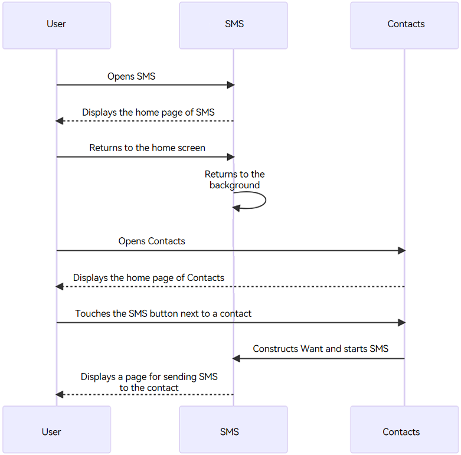
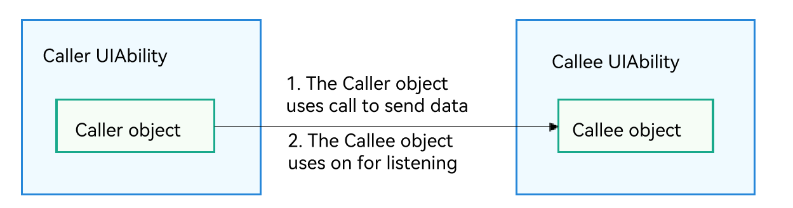

# Starting UIAbility in the Same Application

<!--Kit: Ability Kit-->
<!--Subsystem: Ability-->
<!--Owner: @altay-->
<!--Designer: @altay-->
<!--Tester: @lixueqing513-->
<!--Adviser: @huipeizi-->

[UIAbility](../reference/apis-ability-kit/js-apis-app-ability-uiAbility.md) is the minimum unit that can be scheduled by the system. Redirection between functional modules in a device involves starting of specific UIAbility components, which belong to the same or a different application (for example, starting the UIAbility of a third-party payment application).


This topic describes how to start the UIAbility component that belongs to the same application. For details about component redirection between applications, see [Application Redirection](link-between-apps-overview.md). <!--Del-->For details about cross-device application component interaction, see [Inter-Device Application Component Interaction (Hopping)](inter-device-interaction-hop-overview.md).<!--DelEnd-->


- [Starting UIAbility in the Same Application](#starting-uiability-in-the-same-application)
- [Starting UIAbility in the Same Application and Obtaining the Return Result](#starting-uiability-in-the-same-application-and-obtaining-the-return-result)
- [Starting a Specified Page of UIAbility](#starting-a-specified-page-of-uiability)
<!--Del-->
- [Starting UIAbility with Window Mode Specified (for System Applications Only)](#starting-uiability-with-window-mode-specified-for-system-applications-only)
- [Using Call to Implement UIAbility Interaction (for System Applications Only)](#using-call-to-implement-uiability-interaction-for-system-applications-only)
<!--DelEnd-->


## Starting UIAbility in the Same Application

This scenario is possible when an application contains multiple [UIAbility](../reference/apis-ability-kit/js-apis-app-ability-uiAbility.md) components. For example, in a payment application, you may need to start the payment UIAbility from the entry UIAbility.

Assume that your application has two UIAbility components: EntryAbility and FuncAbility, either in the same module or different modules. To start FuncAbility from EntryAbility, proceed as follows:

1. In EntryAbility, call [startAbility()](../reference/apis-ability-kit/js-apis-inner-application-uiAbilityContext.md#startability) and pass the [want](../reference/apis-ability-kit/js-apis-app-ability-want.md) parameter to start the UIAbility instance. In the **want** parameter, **bundleName** indicates the bundle name of the application to start; **abilityName** indicates the name of the UIAbility to start; **moduleName** is required only when the target UIAbility belongs to a different module from EntryAbility; **parameters** is used to carry custom information. For details about how to obtain the context in the example, see [Obtaining the Context of UIAbility](uiability-usage.md#obtaining-the-context-of-uiability).

    ```ts
    import { common, Want } from '@kit.AbilityKit';
    import { hilog } from '@kit.PerformanceAnalysisKit';
    import { BusinessError } from '@kit.BasicServicesKit';

    const TAG: string = '[Page_UIAbilityComponentsInteractive]';
    const DOMAIN_NUMBER: number = 0xFF00;

    @Entry
    @Component
    struct Page_UIAbilityComponentsInteractive {
      private context = this.getUIContext().getHostContext() as common.UIAbilityContext;

      build() {
        Column() {
          //...
          List({ initialIndex: 0 }) {
            ListItem() {
              Row() {
                //...
              }
              .onClick(() => {
                // Context is a member of the ability object and is required for invoking inside a non-ability object.
                // Pass in the Context object.
                let wantInfo: Want = {
                  deviceId: '', // An empty deviceId indicates the local device.
                  bundleName: 'com.samples.stagemodelabilitydevelop',
                  moduleName: 'entry', // moduleName is optional.
                  abilityName: 'FuncAbilityA',
                  parameters: {
                    // Custom information.
                    info: 'From Page_UIAbilityComponentsInteractive of EntryAbility'
                  },
                };
                // context is the UIAbilityContext of the initiator UIAbility.
                this.context.startAbility(wantInfo).then(() => {
                  hilog.info(DOMAIN_NUMBER, TAG, 'startAbility success.');
                }).catch((error: BusinessError) => {
                  hilog.error(DOMAIN_NUMBER, TAG, 'startAbility failed.');
                });
              })
            }
            //...
          }
          //...
        }
        //...
      }
    }
    ```

2. In FuncAbility, use [onCreate()](../reference/apis-ability-kit/js-apis-app-ability-uiAbility.md#oncreate) or [onNewWant()](../reference/apis-ability-kit/js-apis-app-ability-uiAbility.md#onnewwant) to receive the parameters passed in by EntryAbility.

    ```ts
    import { AbilityConstant, UIAbility, Want } from '@kit.AbilityKit';

    export default class FuncAbilityA extends UIAbility {
      onCreate(want: Want, launchParam: AbilityConstant.LaunchParam): void {
        // Receive the parameters passed by the initiator UIAbility.
        let funcAbilityWant = want;
        let info = funcAbilityWant?.parameters?.info;
      }
      //...
    }
    ```

    > **NOTE**
    >
    > In FuncAbility started, you can obtain the PID and bundle name of the [UIAbility](../reference/apis-ability-kit/js-apis-app-ability-uiAbility.md) through **parameters** in the passed [want](../reference/apis-ability-kit/js-apis-app-ability-want.md) parameter.

3. To stop the [UIAbility](../reference/apis-ability-kit/js-apis-app-ability-uiAbility.md) instance after the FuncAbility service is not needed, call [terminateSelf()](../reference/apis-ability-kit/js-apis-inner-application-uiAbilityContext.md#terminateself) in FuncAbility.

    ```ts
    import { common } from '@kit.AbilityKit';
    import { hilog } from '@kit.PerformanceAnalysisKit';

    const TAG: string = '[Page_FromStageModel]';
    const DOMAIN_NUMBER: number = 0xFF00;

    @Entry
    @Component
    struct Page_FromStageModel {
      build() {
        Column() {
          //...
          Button('FuncAbilityB')
            .onClick(() => {
              let context = this.getUIContext().getHostContext() as common.UIAbilityContext; // UIAbilityContext
              // context is the UIAbilityContext of the UIAbility instance to stop.
              context.terminateSelf((err) => {
                if (err.code) {
                  hilog.error(DOMAIN_NUMBER, TAG, `Failed to terminate self. Code is ${err.code}, message is ${err.message}`);
                  return;
                }
              });
            })
        }
        //...
      }
    }
    ```

    > **NOTE**
    >
    > When **terminateSelf()** is called to stop the UIAbility instance, the snapshot of the instance is retained by default. That is, the mission corresponding to the instance is still displayed in the recent task list. If you do not want to retain the snapshot, set **removeMissionAfterTerminate** under the [abilities](../quick-start/module-configuration-file.md#abilities) tag to **true** in the [module.json5 file](../quick-start/module-configuration-file.md) of the corresponding UIAbility.

4. To stop all [UIAbility](../reference/apis-ability-kit/js-apis-app-ability-uiAbility.md) instances of the application, call [killAllProcesses()](../reference/apis-ability-kit/js-apis-inner-application-applicationContext.md#applicationcontextkillallprocesses) of [ApplicationContext](../reference/apis-ability-kit/js-apis-inner-application-applicationContext.md).


## Starting UIAbility in the Same Application and Obtaining the Return Result

When starting FuncAbility from EntryAbility, you may want the result to be returned after the FuncAbility service is finished. For example, after the sign-in operation is finished in the sign-in [UIAbility](../reference/apis-ability-kit/js-apis-app-ability-uiAbility.md) of your application, you want the sign-in result to be returned to the entry UIAbility.

1. In EntryAbility, call [startAbilityForResult()](../reference/apis-ability-kit/js-apis-inner-application-uiAbilityContext.md#startabilityforresult-2) to start FuncAbility. Use **data** in the asynchronous callback to receive information returned after FuncAbility stops itself. For details about how to obtain the context in the example, see [Obtaining the Context of UIAbility](uiability-usage.md#obtaining-the-context-of-uiability).

    ```ts
    import { common, Want } from '@kit.AbilityKit';
    import { hilog } from '@kit.PerformanceAnalysisKit';
    import { BusinessError } from '@kit.BasicServicesKit';

    const TAG: string = '[Page_UIAbilityComponentsInteractive]';
    const DOMAIN_NUMBER: number = 0xFF00;

    @Entry
    @Component
    struct Page_UIAbilityComponentsInteractive {
      build() {
        Column() {
          //...
          List({ initialIndex: 0 }) {
            ListItem() {
              Row() {
                //...
              }
              .onClick(() => {
                let context = this.getUIContext().getHostContext() as common.UIAbilityContext; // UIAbilityContext
                const RESULT_CODE: number = 1001;
                let want: Want = {
                  deviceId: '', // An empty deviceId indicates the local device.
                  bundleName: 'com.samples.stagemodelabilitydevelop',
                  moduleName: 'entry', // moduleName is optional.
                  abilityName: 'FuncAbilityA',
                  parameters: {
                    // Custom information.
                    info: 'From UIAbilityComponentsInteractive of EntryAbility'
                  }
                };
                context.startAbilityForResult(want).then((data) => {
                  if (data?.resultCode === RESULT_CODE) {
                    // Parse the information returned by the target UIAbility.
                    let info = data.want?.parameters?.info;
                    hilog.info(DOMAIN_NUMBER, TAG, JSON.stringify(info) ?? '');
                    if (info !== null) {
                      this.getUIContext().getPromptAction().showToast({
                        message: JSON.stringify(info)
                      });
                    }
                  }
                  hilog.info(DOMAIN_NUMBER, TAG, JSON.stringify(data.resultCode) ?? '');
                }).catch((err: BusinessError) => {
                  hilog.error(DOMAIN_NUMBER, TAG, `Failed to start ability for result. Code is ${err.code}, message is ${err.message}`);
                });
              })
            }
            //...
          }
          //...
        }
        //...
      }
    }
    ```

2. Call [terminateSelfWithResult()](../reference/apis-ability-kit/js-apis-inner-application-uiAbilityContext.md#terminateselfwithresult) to stop FuncAbility. Use the input parameter [abilityResult](../reference/apis-ability-kit/js-apis-inner-ability-abilityResult.md) to carry the information that FuncAbility needs to return to EntryAbility.

    ```ts
    import { common } from '@kit.AbilityKit';
    import { hilog } from '@kit.PerformanceAnalysisKit';

    const TAG: string = '[Page_FuncAbilityA]';
    const DOMAIN_NUMBER: number = 0xFF00;

    @Entry
    @Component
    struct Page_FuncAbilityA {
      build() {
        Column() {
          //...
          List({ initialIndex: 0 }) {
            ListItem() {
              Row() {
                //...
              }
              .onClick(() => {
                let context = this.getUIContext().getHostContext() as common.UIAbilityContext; // UIAbilityContext
                const RESULT_CODE: number = 1001;
                let abilityResult: common.AbilityResult = {
                  resultCode: RESULT_CODE,
                  want: {
                    bundleName: 'com.samples.stagemodelabilitydevelop',
                    moduleName: 'entry', // moduleName is optional.
                    abilityName: 'FuncAbilityB',
                    parameters: {
                      info: 'From the Index page of FuncAbility'
                    },
                  },
                };
                context.terminateSelfWithResult(abilityResult, (err) => {
                  if (err.code) {
                    hilog.error(DOMAIN_NUMBER, TAG, `Failed to terminate self with result. Code is ${err.code}, message is ${err.message}`);
                    return;
                  }
                });
              })
            }
            //...
          }
          //...
        }
        //...
      }
    }
    ```

3. After FuncAbility stops itself, EntryAbility uses [startAbilityForResult()](../reference/apis-ability-kit/js-apis-inner-application-uiAbilityContext.md#startabilityforresult-2) to receive the information returned by FuncAbility. The value of **RESULT_CODE** must be the same as that specified in the preceding step.

    ```ts
    import { common, Want } from '@kit.AbilityKit';
    import { hilog } from '@kit.PerformanceAnalysisKit';
    import { BusinessError } from '@kit.BasicServicesKit';

    const TAG: string = '[Page_UIAbilityComponentsInteractive]';
    const DOMAIN_NUMBER: number = 0xFF00;

    @Entry
    @Component
    struct Page_UIAbilityComponentsInteractive {
      build() {
        Column() {
          //...
          List({ initialIndex: 0 }) {
            ListItem() {
              Row() {
                //...
              }
              .onClick(() => {
                let context = this.getUIContext().getHostContext() as common.UIAbilityContext; // UIAbilityContext
                const RESULT_CODE: number = 1001;

                let want: Want = {
                  deviceId: '', // An empty deviceId indicates the local device.
                  bundleName: 'com.samples.stagemodelabilitydevelop',
                  moduleName: 'entry', // moduleName is optional.
                  abilityName: 'FuncAbilityA',
                  parameters: {
                    // Custom information.
                    info: 'From UIAbilityComponentsInteractive of EntryAbility'
                  }
                };
                context.startAbilityForResult(want).then((data) => {
                  if (data?.resultCode === RESULT_CODE) {
                    // Parse the information returned by the target UIAbility.
                    let info = data.want?.parameters?.info;
                    hilog.info(DOMAIN_NUMBER, TAG, JSON.stringify(info) ?? '');
                    if (info !== null) {
                      this.getUIContext().getPromptAction().showToast({
                        message: JSON.stringify(info)
                      });
                    }
                  }
                  hilog.info(DOMAIN_NUMBER, TAG, JSON.stringify(data.resultCode) ?? '');
                }).catch((err: BusinessError) => {
                  hilog.error(DOMAIN_NUMBER, TAG, `Failed to start ability for result. Code is ${err.code}, message is ${err.message}`);
                });
              })
            }
            //...
          }
          //...
        }
        //...
      }
    }
    ```


## Starting a Specified Page of UIAbility

### Overview

A [UIAbility](../reference/apis-ability-kit/js-apis-app-ability-uiAbility.md) component can have multiple pages that each display in specific scenarios.

A UIAbility component can be started in two modes:

- Cold start: The UIAbility instance is totally closed before being started. This requires that the code and resources of the UIAbility instance be completely loaded and initialized.
- Hot start: The UIAbility instance has been started, running in the foreground, and then switched to the background before being started again. In this case, the status of the UIAbility instance can be quickly restored.

This section describes how to start a specified page in both modes: [cold start](#cold-starting-uiability) and [hot start](#hot-starting-uiability). Before starting a specified page, you will learn how to specify a startup page on the initiator UIAbility.


### Specifying a Startup Page

When the initiator [UIAbility](../reference/apis-ability-kit/js-apis-app-ability-uiAbility.md) starts another UIAbility, it usually needs to redirect to a specified page of the target UIAbility. For example, with FuncAbility, which contains two pages, starting FuncAbility means to redirect to either of the pages: Index (corresponding to the home page) and Second (corresponding to feature A page). You can configure the specified page URL in the want parameter by adding a custom parameter to parameters in [want](../reference/apis-ability-kit/js-apis-app-ability-want.md). For details about how to obtain the context in the example, see [Obtaining the Context of UIAbility](uiability-usage.md#obtaining-the-context-of-uiability).

```ts
import { common, Want } from '@kit.AbilityKit';
import { hilog } from '@kit.PerformanceAnalysisKit';
import { BusinessError } from '@kit.BasicServicesKit';

const TAG: string = '[Page_UIAbilityComponentsInteractive]';
const DOMAIN_NUMBER: number = 0xFF00;

@Entry
@Component
struct Page_UIAbilityComponentsInteractive {
  build() {
    Column() {
      //...
      List({ initialIndex: 0 }) {
        ListItem() {
          Row() {
            //...
          }
          .onClick(() => {
            let context = this.getUIContext().getHostContext() as common.UIAbilityContext; // UIAbilityContext
            let want: Want = {
              deviceId: '', // An empty deviceId indicates the local device.
              bundleName: 'com.samples.stagemodelabilityinteraction',
              moduleName: 'entry', // moduleName is optional.
              abilityName: 'FuncAbility',
              parameters: { // Custom parameter used to pass the page information.
                router: 'funcA'
              }
            };
            // context is the UIAbilityContext of the initiator UIAbility.
            context.startAbility(want).then(() => {
              hilog.info(DOMAIN_NUMBER, TAG, 'Succeeded in starting ability.');
            }).catch((err: BusinessError) => {
              hilog.error(DOMAIN_NUMBER, TAG, `Failed to start ability. Code is ${err.code}, message is ${err.message}`);
            });
          })
        }
        //...
      }
      //...
    }
    //...
  }
}
```


### Cold Starting UIAbility

In cold start mode, obtain the parameters from the initiator [UIAbility](../reference/apis-ability-kit/js-apis-app-ability-uiAbility.md) through the [onCreate()](../reference/apis-ability-kit/js-apis-app-ability-uiAbility.md#oncreate) callback of the target UIAbility. Then, in the [onWindowStageCreate()](../reference/apis-ability-kit/js-apis-app-ability-uiAbility.md#onwindowstagecreate) callback of the target UIAbility, parse the [want](../reference/apis-ability-kit/js-apis-app-ability-want.md) parameter passed by the EntryAbility to obtain the URL of the page to be loaded, and pass the URL to the [windowStage.loadContent()](../reference/apis-arkui/arkts-apis-window-Window.md#loadcontent9) method.

```ts
import { AbilityConstant, Want, UIAbility } from '@kit.AbilityKit';
import { hilog } from '@kit.PerformanceAnalysisKit';
import { window, UIContext } from '@kit.ArkUI';

const DOMAIN_NUMBER: number = 0xFF00;
const TAG: string = '[EntryAbility]';

export default class EntryAbility extends UIAbility {
  funcAbilityWant: Want | undefined = undefined;
  uiContext: UIContext | undefined = undefined;

  onCreate(want: Want, launchParam: AbilityConstant.LaunchParam): void {
    // Receive the parameters passed by the initiator UIAbility.
    this.funcAbilityWant = want;
  }

  onWindowStageCreate(windowStage: window.WindowStage): void {
    // Main window is created. Set a main page for this UIAbility.
    hilog.info(DOMAIN_NUMBER, TAG, '%{public}s', 'Ability onWindowStageCreate');
    // Main window is created. Set a main page for this UIAbility.
    let url = 'pages/Index';
    if (this.funcAbilityWant?.parameters?.router && this.funcAbilityWant.parameters.router === 'funcA') {
      url = 'pages/Page_ColdStartUp';
    }
    windowStage.loadContent(url, (err, data) => {
      // ...
    });
  }
}
```

### Hot Starting UIAbility

If the target [UIAbility](../reference/apis-ability-kit/js-apis-app-ability-uiAbility.md) has been started, the initialization logic is not executed again. Instead, the [onNewWant()](../reference/apis-ability-kit/js-apis-app-ability-uiAbility.md#onnewwant) lifecycle callback is directly triggered. To implement redirection, parse the required parameters in **onNewWant()**.

An example scenario is as follows:

1. A user opens the SMS application. The UIAbility instance of the SMS application is started, and the home page of the application is displayed.
2. The user returns to the home screen, and the SMS application switches to the background.
3. The user opens the Contacts application and finds a contact.
4. The user touches the SMS button next to the contact. The UIAbility instance of the SMS application is restarted.
5. Since the UIAbility instance of the SMS application has been started, the onNewWant() callback of the UIAbility is triggered, and the initialization logic such as [onCreate()](../reference/apis-ability-kit/js-apis-app-ability-uiAbility.md#oncreate) and [onWindowStageCreate()](../reference/apis-ability-kit/js-apis-app-ability-uiAbility.md#onwindowstagecreate) is skipped.

**Figure 1** Hot starting the target UIAbility



The development procedure is as follows:

1. When the UIAbility instance of the SMS application is cold started, call [getUIContext()](../reference/apis-arkui/arkts-apis-window-Window.md#getuicontext10) in the [onWindowStageCreate()](../reference/apis-ability-kit/js-apis-app-ability-uiAbility.md#onwindowstagecreate) lifecycle callback to obtain the [UIContext](../reference/apis-arkui/arkts-apis-uicontext-uicontext.md).

    ```ts
    import { hilog } from '@kit.PerformanceAnalysisKit';
    import { Want, UIAbility } from '@kit.AbilityKit';
    import { window, UIContext } from '@kit.ArkUI';

    const DOMAIN_NUMBER: number = 0xFF00;
    const TAG: string = '[EntryAbility]';

    export default class EntryAbility extends UIAbility {
      funcAbilityWant: Want | undefined = undefined;
      uiContext: UIContext | undefined = undefined;

      // ...

      onWindowStageCreate(windowStage: window.WindowStage): void {
        // Main window is created. Set a main page for this UIAbility.
        hilog.info(DOMAIN_NUMBER, TAG, '%{public}s', 'Ability onWindowStageCreate');
        let url = 'pages/Index';
        if (this.funcAbilityWant?.parameters?.router && this.funcAbilityWant.parameters.router === 'funcA') {
          url = 'pages/Page_ColdStartUp';
        }

        windowStage.loadContent(url, (err, data) => {
          if (err.code) {
            return;
          }

          let windowClass: window.Window;
          windowStage.getMainWindow((err, data) => {
            if (err.code) {
              hilog.error(DOMAIN_NUMBER, TAG, `Failed to obtain the main window. Code is ${err.code}, message is ${err.message}`);
              return;
            }
            windowClass = data;
            this.uiContext = windowClass.getUIContext();
          });
          hilog.info(DOMAIN_NUMBER, TAG, 'Succeeded in loading the content. Data: %{public}s', JSON.stringify(data) ?? '');
        });
      }
    }
    ```

2. In the [onNewWant()](../reference/apis-ability-kit/js-apis-app-ability-uiAbility.md#onnewwant) callback of the UIAbility instance of the SMS application, set the value of the global variable **nameForNavi** through AppStorage, and perform the specified page navigation. When the UIAbility instance of the SMS application is started again, the specified page of the UIAbility instance of the SMS application is displayed.

    1. Import the required modules, and set the global variable **nameForNavi** in the **onNewWant()** lifecycle callback.

        ```ts
        import { AbilityConstant, Want, UIAbility } from '@kit.AbilityKit';
        import { hilog } from '@kit.PerformanceAnalysisKit';

        const DOMAIN_NUMBER: number = 0xFF00;
        const TAG: string = '[EntryAbility]';

        export default class EntryAbility extends UIAbility {
          // ...
          onNewWant(want: Want, launchParam: AbilityConstant.   LaunchParam): void {
            hilog.info(DOMAIN_NUMBER, TAG, '%{public}s', 'onNewWant');
            AppStorage.setOrCreate<string>('nameForNavi', 'pageOne'); 
          }
        }
        ```

    2. When the Index page is displayed, trigger the **onPageShow** callback to obtain the value of **nameForNavi**, and execute the page navigation.

        ```ts
        // Index.ets
        @Entry
        @Component
        struct Index {
          @State message: string = 'Index';
          pathStack: NavPathStack = new NavPathStack();

          onPageShow(): void {
            let somePage = AppStorage.get<string>('nameForNavi')
            if (somePage) {
              this.pathStack.pushPath({ name: somePage }, false);
              AppStorage.delete('nameForNavi');
            }
          }

          build() {
            Navigation(this.pathStack) {
              Text(this.message)
                .id('Index')
                .fontSize($r('app.float.page_text_font_size'))
                .fontWeight(FontWeight.Bold)
                .alignRules({
                  center: { anchor: '__container__', align: VerticalAlign.Center },
                  middle: { anchor: '__container__', align: HorizontalAlign.Center }
                })
            }
            .mode(NavigationMode.Stack)
            .height('100%')
            .width('100%')
          }
        }
        ```

    3. Implement the **Navigation** subpage.

        ```ts
        // PageOne.ets
        @Builder
        export function PageOneBuilder() {
          PageOne();
        }

        @Component
        export struct PageOne {
          @State message: string = 'PageOne';
          pathStack: NavPathStack = new NavPathStack();

          build() {
            NavDestination() {
              Text(this.message)
                .id('PageOne')
                .fontSize($r('app.float.page_text_font_size'))
                .fontWeight(FontWeight.Bold)
                .alignRules({
                  center: { anchor: '__container__', align: VerticalAlign.Center },
                  middle: { anchor: '__container__', align: HorizontalAlign.Center }
                })
            }
            .onReady((context: NavDestinationContext) => {
              this.pathStack = context.pathStack;
            })
            .height('100%')
            .width('100%')
          }
        }
        ```

    4. Configure subpages in the system configuration file **route_map.json**. For details, see [System Routing Table](../ui/arkts-navigation-navigation.md#system-routing-table).

        ```ts
        // route_map.json
        {
          "routerMap": [
            {
              "name": "pageOne",
              "pageSourceFile": "src/main/ets/pages/PageOne.ets",
              "buildFunction": "PageOneBuilder",
              "data": {
                "description": "this is pageOne"
              }
            }
          ]
        }
        ```

    5. Configure **routerMap** in the [module.json5](../quick-start/module-configuration-file.md#routermap) file.

        ```ts
        // module.json5
        {
          "module":{
            // ...
            "routerMap": "$profile:route_map",
          }
        }
        ```

> **NOTE**
>
> When the [launch type of the target UIAbility](uiability-launch-type.md) is set to **multiton**, a new instance is created each time the target UIAbility is started. In this case, the **onNewWant()** callback will not be invoked.

<!--Del-->
## Starting UIAbility with Window Mode Specified (for System Applications Only)

By specifying the window mode when starting the [UIAbility](../reference/apis-ability-kit/js-apis-app-ability-uiAbility.md) of an application, you can have the application displayed in the specified window mode, which can be full-screen, floating window, or split-screen.

In full-screen mode, an application occupies the entire screen after being started. Users cannot view other windows or applications. This mode is suitable for an application that requires users to focus on a specific task or UI.

In floating window mode, an application is displayed on the screen as a floating window after being started. Users can easily switch to other windows or applications. This mode is suitable for an application that allows users to process multiple tasks at the same time.

In split-screen mode, two applications occupy the entire screen, side by side, horizontally or vertically. This mode helps users improve multi-task processing efficiency.

The window mode is specified by the **windowMode** field in the [StartOptions](../reference/apis-ability-kit/js-apis-app-ability-startOptions.md) parameter of [startAbility()](../reference/apis-ability-kit/js-apis-inner-application-uiAbilityContext.md#startability).

> **NOTE**
>
> - If the **windowMode** field is not specified, the UIAbility is started in the default window mode.
> - To ensure that the application can be displayed in the required window mode, check the **supportWindowMode** field under [abilities](../quick-start/module-configuration-file.md#abilities) in the [module.json5 file](../quick-start/module-configuration-file.md) of the UIAbility and make sure the specified window mode is supported.

The following describes how to start the FuncAbility from the EntryAbility page and display it in floating window mode.

1. Add the **StartOptions** parameter in **startAbility()**.
2. Set the **windowMode** field in the **StartOptions** parameter to **WINDOW_MODE_FLOATING**. This setting applies only to a system application.
3. In the case of a third-party application, set the **displayId** field instead.

For details about how to obtain the context in the example, see [Obtaining the Context of UIAbility](uiability-usage.md#obtaining-the-context-of-uiability).

```ts
import { AbilityConstant, common, Want, StartOptions } from '@kit.AbilityKit';
import { hilog } from '@kit.PerformanceAnalysisKit';
import { BusinessError } from '@kit.BasicServicesKit';

const TAG: string = '[Page_UIAbilityComponentsInteractive]';
const DOMAIN_NUMBER: number = 0xFF00;

@Entry
@Component
struct Page_UIAbilityComponentsInteractive {
  build() {
    Column() {
      //...
      List({ initialIndex: 0 }) {
        ListItem() {
          Row() {
            //...
          }
          .onClick(() => {
            let context = this.getUIContext().getHostContext() as common.UIAbilityContext; // UIAbilityContext
            let want: Want = {
              deviceId: '', // An empty deviceId indicates the local device.
              bundleName: 'com.samples.stagemodelabilitydevelop',
              moduleName: 'entry', // moduleName is optional.
              abilityName: 'FuncAbilityB',
              parameters: {
                // Custom information.
                info: 'From the Index page of EntryAbility'
              }
            };
            let options: StartOptions = {
              windowMode: AbilityConstant.WindowMode.WINDOW_MODE_FLOATING
            };
            // context is the UIAbilityContext of the initiator UIAbility.
            context.startAbility(want, options).then(() => {
              hilog.info(DOMAIN_NUMBER, TAG, 'Succeeded in starting ability.');
            }).catch((err: BusinessError) => {
              hilog.error(DOMAIN_NUMBER, TAG, `Failed to start ability. Code is ${err.code}, message is ${err.message}`);
            });
          })
        }
        //...
      }
      //...
    }
    //...
  }
}
```

The display effect is shown below.


## Using Call to Implement UIAbility Interaction (for System Applications Only)

Call is an extension of the [UIAbility](../reference/apis-ability-kit/js-apis-app-ability-uiAbility.md) capability. It enables the UIAbility to be invoked by and communicate with external systems. The UIAbility invoked can be either started in the foreground or created and run in the background. You can use the call to implement data sharing between two UIAbility instances (CallerAbility and CalleeAbility) through IPC.

The core API used for the call is [startAbilityByCall()](../reference/apis-ability-kit/js-apis-inner-application-uiAbilityContext.md#startabilitybycall), which differs from [startAbility()](../reference/apis-ability-kit/js-apis-inner-application-uiAbilityContext.md#startability) in the following ways:

- **startAbilityByCall()** supports UIAbility launch in the foreground and background, whereas **startAbility()** supports UIAbility launch in the foreground only.

- The CallerAbility can use the [Caller](../reference/apis-ability-kit/js-apis-app-ability-uiAbility.md#caller) object returned by **startAbilityByCall()** to communicate with the CalleeAbility, but **startAbility()** does not provide the communication capability.

Call is usually used in the following scenarios:

- Communicating with the CalleeAbility

- Starting the CalleeAbility in the background


**Table 1** Terms used in the call

| **Term**| Description|
| -------- | -------- |
| CallerAbility| UIAbility that triggers the call.|
| CalleeAbility | UIAbility invoked by the call.|
| Caller | Object returned by **startAbilityByCall** and used by the CallerAbility to communicate with the CalleeAbility.|
| Callee | Object held by the CalleeAbility to communicate with the CallerAbility.|

The following figure shows the call process.

**Figure 1** Call process



- The CallerAbility uses [startAbilityByCall()](../reference/apis-ability-kit/js-apis-inner-application-uiAbilityContext.md#startabilitybycall) to obtain a [Caller](../reference/apis-ability-kit/js-apis-app-ability-uiAbility.md#caller) object and uses [call](../reference/apis-ability-kit/js-apis-app-ability-uiAbility.md#call) of the Caller object to send data to the CalleeAbility.

- The CalleeAbility, which holds a [Callee](../reference/apis-ability-kit/js-apis-app-ability-uiAbility.md#callee) object, uses [on](../reference/apis-ability-kit/js-apis-app-ability-uiAbility.md#on) of the Callee object to register a callback. This callback is invoked when the CalleeAbility receives data from the CallerAbility.

> **NOTE**
>
> Currently, only system applications can use the call.
>
> The launch type of the CalleeAbility must be **singleton**.
>
> Both local (intra-device) and cross-device calls are supported. The following describes how to initiate a local call. For details about how to initiate a cross-device call, see [Using Cross-Device Call](hop-multi-device-collaboration.md#using-cross-device-call).


### Available APIs

The following table describes the main APIs used for the call. For details, see [AbilityContext](../reference/apis-ability-kit/js-apis-app-ability-uiAbility.md#caller).

**Table 2** Call APIs

| API| Description|
| -------- | -------- |
| startAbilityByCall(want: Want): Promise&lt;Caller&gt; | Starts a UIAbility in the foreground (through the **want** configuration) or background (default) and obtains the caller object for communication with the UIAbility. For details, see [AbilityContext](../reference/apis-ability-kit/js-apis-inner-application-uiAbilityContext.md#startabilitybycall) or **ServiceExtensionContext**.|
| on(method: string, callback: CalleeCallBack): void | Callback invoked when the CalleeAbility registers a method.|
| off(method: string): void | Callback invoked when the CalleeAbility deregisters a method.|
| call(method: string, data: rpc.Parcelable): Promise&lt;void&gt; | Sends agreed parcelable data to the CalleeAbility.|
| callWithResult(method: string, data: rpc.Parcelable): Promise&lt;rpc.MessageSequence&gt; | Sends agreed parcelable data to the CalleeAbility and obtains the agreed parcelable data returned by the CalleeAbility.|
| release(): void | Releases the caller object.|
| on(type: "release", callback: OnReleaseCallback): void| Callback invoked when the caller object is released.|

The implementation of using the call for [UIAbility](../reference/apis-ability-kit/js-apis-app-ability-uiAbility.md) interaction involves two parts:

- [Creating a CalleeAbility](#creating-a-calleeability)

- [Accessing the CalleeAbility](#accessing-the-calleeability)


### Creating a CalleeAbility

For the CalleeAbility, implement the callback to receive data and the methods to marshal and unmarshal data. When data needs to be received, use [on](../reference/apis-ability-kit/js-apis-app-ability-uiAbility.md#on) to register a listener. When data does not need to be received, use [off](../reference/apis-ability-kit/js-apis-app-ability-uiAbility.md#off) to deregister the listener.

1. Configure the launch type of the [UIAbility](../reference/apis-ability-kit/js-apis-app-ability-uiAbility.md).

   For example, set the launch type of the CalleeAbility to **singleton**. For details, see [UIAbility Component Launch Type](uiability-launch-type.md).

2. Import the **UIAbility** module.

   ```ts
   import { UIAbility } from '@kit.AbilityKit';
   ```

3. Define the agreed parcelable data.

   The data formats sent and received by the CallerAbility and CalleeAbility must be consistent. In the following example, the data formats are number and string.

    ```ts
    import { rpc } from '@kit.IPCKit';

    class MyParcelable {
      num: number = 0;
      str: string = '';

      constructor(num: number, string: string) {
        this.num = num;
        this.str = string;
      }

      mySequenceable(num: number, string: string): void {
        this.num = num;
        this.str = string;
      }

      marshalling(messageSequence: rpc.MessageSequence): boolean {
        messageSequence.writeInt(this.num);
        messageSequence.writeString(this.str);
        return true;
      }

      unmarshalling(messageSequence: rpc.MessageSequence): boolean {
        this.num = messageSequence.readInt();
        this.str = messageSequence.readString();
        return true;
      }
    }
    ```

4. Implement [Callee.on](../reference/apis-ability-kit/js-apis-app-ability-uiAbility.md#on) and [Callee.off](../reference/apis-ability-kit/js-apis-app-ability-uiAbility.md#off).

   The time to register a listener for the CalleeAbility depends on your application. The data sent and received before the listener is registered and that after the listener is deregistered are not processed. In the following example, the 'MSG_SEND_METHOD' listener is registered in [onCreate](../reference/apis-ability-kit/js-apis-app-ability-uiAbility.md#oncreate) of the [UIAbility](../reference/apis-ability-kit/js-apis-app-ability-uiAbility.md) and deregistered in [onDestroy](../reference/apis-ability-kit/js-apis-app-ability-uiAbility.md#ondestroy). After receiving parcelable data, the application processes the data and returns the data result. You need to implement processing based on service requirements. The sample code is as follows:

    ```ts
    import { AbilityConstant, UIAbility, Want, Caller } from '@kit.AbilityKit';
    import { hilog } from '@kit.PerformanceAnalysisKit';
    import { rpc } from '@kit.IPCKit';

    const MSG_SEND_METHOD: string = 'CallSendMsg';
    const DOMAIN_NUMBER: number = 0xFF00;
    const TAG: string = '[CalleeAbility]';

    class MyParcelable {
      num: number = 0;
      str: string = '';

      constructor(num: number, string: string) {
        this.num = num;
        this.str = string;
      }

      mySequenceable(num: number, string: string): void {
        this.num = num;
        this.str = string;
      }

      marshalling(messageSequence: rpc.MessageSequence): boolean {
        messageSequence.writeInt(this.num);
        messageSequence.writeString(this.str);
        return true;
      }

      unmarshalling(messageSequence: rpc.MessageSequence): boolean {
        this.num = messageSequence.readInt();
        this.str = messageSequence.readString();
        return true;
      }
    }

    function sendMsgCallback(data: rpc.MessageSequence): rpc.Parcelable {
      hilog.info(DOMAIN_NUMBER, TAG, '%{public}s', 'CalleeSortFunc called');

      // Obtain the parcelable data sent by the CallerAbility.
      let receivedData: MyParcelable = new MyParcelable(0, '');
      data.readParcelable(receivedData);
      hilog.info(DOMAIN_NUMBER, TAG, '%{public}s', `receiveData[${receivedData.num}, ${receivedData.str}]`);
      let num: number = receivedData.num;

      // Process the data.
      // Return the parcelable data result to the CallerAbility.
      return new MyParcelable(num + 1, `send ${receivedData.str} succeed`) as rpc.Parcelable;
    }

    export default class CalleeAbility extends UIAbility {
      caller: Caller | undefined;

      onCreate(want: Want, launchParam: AbilityConstant.LaunchParam): void {
        try {
          this.callee.on(MSG_SEND_METHOD, sendMsgCallback);
        } catch (error) {
          hilog.error(DOMAIN_NUMBER, TAG, '%{public}s', `Failed to register. Error is ${error}`);
        }
      }

      releaseCall(): void {
        try {
          if (this.caller) {
            this.caller.release();
            this.caller = undefined;
          }
          hilog.info(DOMAIN_NUMBER, TAG, '%{public}s', 'caller release succeed');
        } catch (error) {
          hilog.info(DOMAIN_NUMBER, TAG, '%{public}s', `caller release failed with ${error}`);
        }
      }

      onDestroy(): void {
        try {
          this.callee.off(MSG_SEND_METHOD);
          hilog.info(DOMAIN_NUMBER, TAG, '%{public}s', 'Callee OnDestroy');
          this.releaseCall();
        } catch (error) {
          hilog.error(DOMAIN_NUMBER, TAG, '%{public}s', `Failed to register. Error is ${error}`);
        }
      }
    }
    ```


### Accessing the CalleeAbility

1. Import the [UIAbility](../reference/apis-ability-kit/js-apis-app-ability-uiAbility.md) module.

    ```ts
    import { UIAbility } from '@kit.AbilityKit';
    ```

2. Obtain the [Caller](../reference/apis-ability-kit/js-apis-app-ability-uiAbility.md#caller) object.

   The [UIAbilityContext](../reference/apis-ability-kit/js-apis-inner-application-uiAbilityContext.md) attribute implements [startAbilityByCall](../reference/apis-ability-kit/js-apis-inner-application-uiAbilityContext.md#startabilitybycall) to obtain the Caller object for communication. The following example uses **this.context** to obtain the UIAbilityContext, uses **startAbilityByCall** to start the CalleeAbility, obtain the Caller object, and register the [onRelease](../reference/apis-ability-kit/js-apis-app-ability-uiAbility.md#onrelease) listener of the CallerAbility. You need to implement processing based on service requirements.

    ```ts
    import { common, Want, Caller } from '@kit.AbilityKit';
    import { hilog } from '@kit.PerformanceAnalysisKit';
    import { BusinessError } from '@kit.BasicServicesKit';

    const TAG: string = '[Page_UIAbilityComponentsInteractive]';
    const DOMAIN_NUMBER: number = 0xFF00;

    @Entry
    @Component
    struct Page_UIAbilityComponentsInteractive {
      caller: Caller | undefined = undefined;

      // Register the onRelease() listener of the CallerAbility.
      private regOnRelease(caller: Caller): void {
        hilog.info(DOMAIN_NUMBER, TAG, `caller is ${caller}`);
        try {
          caller.on('release', (msg: string) => {
            hilog.info(DOMAIN_NUMBER, TAG, `caller onRelease is called ${msg}`);
          })
          hilog.info(DOMAIN_NUMBER, TAG, 'succeeded in registering on release.');
        } catch (err) {
          let code = (err as BusinessError).code;
          let message = (err as BusinessError).message;
          hilog.error(DOMAIN_NUMBER, TAG, `Failed to caller register on release. Code is ${code}, message is ${message}`);
        }
      };

      build() {
        Column() {
          // ...
          List({ initialIndex: 0 }) {
            // ...
            ListItem() {
              Row() {
                // ...
              }
              .onClick(() => {
                let context = this.getUIContext().getHostContext() as common.UIAbilityContext; // UIAbilityContext
                let want: Want = {
                  bundleName: 'com.samples.stagemodelabilityinteraction',
                  abilityName: 'CalleeAbility',
                  parameters: {
                    // Custom information.
                    info: 'CallSendMsg'
                  }
                };
                context.startAbilityByCall(want).then((caller: Caller) => {
                  hilog.info(DOMAIN_NUMBER, TAG, `Succeeded in starting ability.Code is ${caller}`);
                  if (caller === undefined) {
                    hilog.info(DOMAIN_NUMBER, TAG, 'get caller failed');
                    return;
                  }
                  else {
                    hilog.info(DOMAIN_NUMBER, TAG, 'get caller success');
                    this.regOnRelease(caller);
                    this.getUIContext().getPromptAction().showToast({
                      message: 'CallerSuccess'
                    });
                    try {
                      caller.release();
                    } catch (releaseErr) {
                      console.log('Caller.release catch error, error.code: ' + JSON.stringify(releaseErr.code) +
                        ' error.message: ' + JSON.stringify(releaseErr.message));
                    }
                  }
                }).catch((err: BusinessError) => {
                  hilog.error(DOMAIN_NUMBER, TAG, `Failed to start ability. Code is ${err.code}, message is ${err.message}`);
                });
              })
            }
            // ...
          }
          // ...
        }
        // ...
      }
    }
    ```
<!--DelEnd-->

