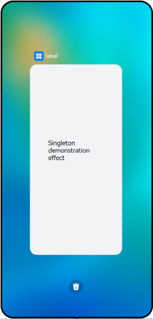
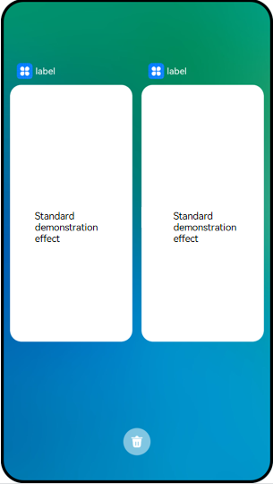
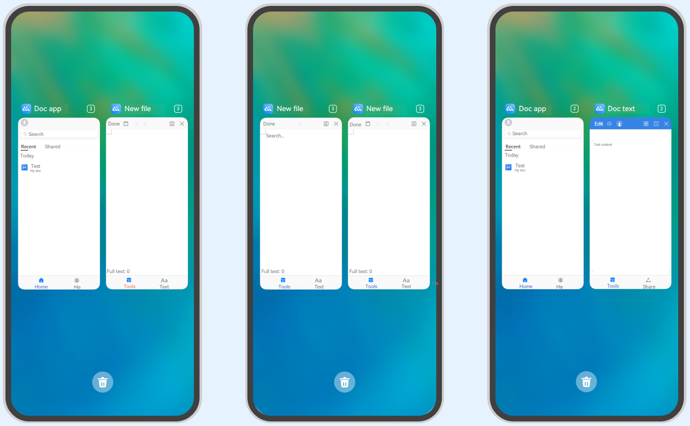

# UIAbility Component Launch Type


The launch type of the UIAbility component refers to the state of the UIAbility instance at startup. The system provides three launch types:


- [Singleton](#singleton)

- [Standard](#standard)

- [Specified](#specified)


## Singleton

**singleton** is the default launch type.

Each time **startAbility()** is called, if a UIAbility instance of this type already exists in the application process, the instance is reused. Therefore, only one UIAbility instance of this type exists in the system, that is, displayed in **Recents**.

**Figure 1** Demonstration effect in singleton mode 



> **NOTE**
>
> Assume that the application already has a UIAbility instance created, and the launch type of the UIAbility instance is set to **singleton**. If **startAbility()** is called again to start the UIAbility instance, the [onNewWant()](../reference/apis/js-apis-app-ability-uiAbility.md#abilityonnewwant) callback is invoked, but the **onCreate()** and **onWindowStageCreate()** callbacks are not. 

To use the singleton mode, set **launchType** in the [module.json5 configuration file](../quick-start/module-configuration-file.md) to **singleton**.


```json
{
  "module": {
    // ...
    "abilities": [
      {
        "launchType": "singleton",
        // ...
      }
    ]
  }
}
```


## Standard

In standard mode, each time **startAbility()** is called, a new UIAbility instance of this type is created in the application process. Multiple UIAbility instances of this type are displayed in **Recents**.  

**Figure 2** Demonstration effect in standard mode 



To use the standard mode, set **launchType** in the [module.json5 configuration file](../quick-start/module-configuration-file.md) to **standard**.


```json
{
  "module": {
    // ...
    "abilities": [
      {
        "launchType": "standard",
        // ...
      }
    ]
  }
}
```


## Specified

The **specified** mode is used in some special scenarios. For example, in a document application, you want a document instance to be created each time you create a document, but you want to use the same document instance when you repeatedly open an existing document.

Before a UIAbility instance is created, you can create a unique string key for the instance. The key is bound to the UIAbility instance when it is created. Each time **startAbility()** is called, the application is asked which UIAbility instance is used to respond to the **startAbility()** request. During running, the internal service of UIAbility determines whether to create multiple instances. If the key is matched, the UIAbility instance bound to the key is started. Otherwise, a new UIAbility instance is created. 

**Figure 3** Demonstration effect in specified mode 


> **NOTE**
>
> Assume that the application already has a UIAbility instance created, and the launch type of the UIAbility instance is set to **specified**. If **startAbility()** is called again to start the UIAbility instance, and the [onAcceptWant()](../reference/apis/js-apis-app-ability-abilityStage.md#abilitystageonacceptwant) callback of [AbilityStage](abilitystage.md) matches a created UIAbility instance, the [onNewWant()](../reference/apis/js-apis-app-ability-uiAbility.md#abilityonnewwant) callback of the UIAbility instance is invoked, but the b**onCreate()**b and b**onWindowStageCreate()**b callbacks are not.

For example, there are EntryAbility and FuncAbility, and the launch type of FuncAbility is set to **specified**. You are required to start FuncAbility from EntryAbility.
1. In FuncAbility, set the **launchType** field in the [module.json5 configuration file](../quick-start/module-configuration-file.md) to **specified**.
   
   ```json
   {
     "module": {
       // ...
       "abilities": [
         {
           "launchType": "specified",
           // ...
         }
       ]
     }
   }
   ```

2. Before a UIAbility instance is created, you can create a unique string key for the instance. The key is bound to the UIAbility instance when it is created. Each time [startAbility()](../reference/apis/js-apis-inner-application-uiAbilityContext.md#uiabilitycontextstartability) is called, the application is asked which UIAbility instance is used to respond to the [startAbility()](../reference/apis/js-apis-inner-application-uiAbilityContext.md#uiabilitycontextstartability) request.
   In EntryAbility, add a custom parameter, for example, **instanceKey**, to the **want** parameter in [startAbility()](../reference/apis/js-apis-inner-application-uiAbilityContext.md#uiabilitycontextstartability) to distinguish the UIAbility instances.
   
   ```ts
   // Configure an independent key for each UIAbility instance.
   // For example, in the document usage scenario, use the document path as the key.
   function getInstance() {
       // ...
   }
   
   let want = {
       deviceId: '', // An empty deviceId indicates the local device.
       bundleName: 'com.example.myapplication',
       abilityName: 'FuncAbility',
       moduleName: 'module1', // moduleName is optional.
       parameters: {// Custom information.
           instanceKey: getInstance(),
       },
   }
   // context is the ability-level context of the initiator UIAbility.
   this.context.startAbility(want).then(() => {
       // ...
   }).catch((err) => {
       // ...
   })
   ```

3. The launch type of FuncAbility is set to **specified**. Before FuncAbility is started, the [onAcceptWant()](../reference/apis/js-apis-app-ability-abilityStage.md#abilitystageonacceptwant) callback of the corresponding AbilityStage instance is invoked to parse the input **want** parameter and obtain the custom parameter **instanceKey**. A string key identifier is returned through the [onAcceptWant()](../reference/apis/js-apis-app-ability-abilityStage.md#abilitystageonacceptwant) callback of the AbilityStage instance. [If the returned key corresponds to a started UIAbility instance](mission-management-launch-type.md#fig14520125175314), that UIAbility instance is switched to the foreground and gains focus again. Otherwise, a new instance is created and started. 
   
   ```ts
   import AbilityStage from '@ohos.app.ability.AbilityStage';
   
   export default class MyAbilityStage extends AbilityStage {
       onAcceptWant(want): string {
           // In the AbilityStage instance of the callee, a key value corresponding to a UIAbility instance is returned for UIAbility whose launch type is specified.
           // In this example, FuncAbility of module1 is returned.
           if (want.abilityName === 'FuncAbility') {
               // The returned string key is a custom string.
               return `ControlModule_EntryAbilityInstance_${want.parameters.instanceKey}`;
           }
   
           return '';
       }
   }
   ```

   For example, in the document application, different key values are bound to different document instances. Each time a document is created, a new key value (for example, file path) is passed, and a new UIAbility instance is created when UIAbility is started in AbilityStage. However, when you open an existing document, the same UIAbility instance is started again in AbilityStage.

The following steps are used as an example.
   1. Open file A. A UIAbility instance, for example, UIAbility instance 1, is started.
   
   2. Close the process of file A in **Recents**. UIAbility instance 1 is destroyed. Return to the home screen and open file A again. A new UIAbility instance is started, for example, UIAbility instance 2.
   
   3. Return to the home screen and open file B. A new UIAbility instance is started, for example, UIAbility instance 3.
   
   4. Return to the home screen and open file A again. UIAbility instance 2 is started.
