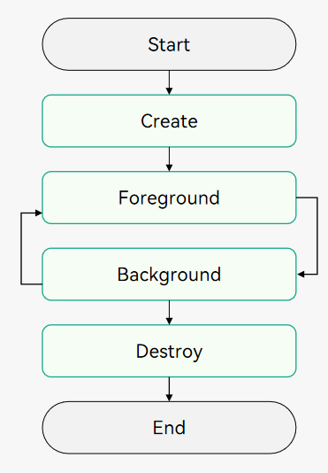
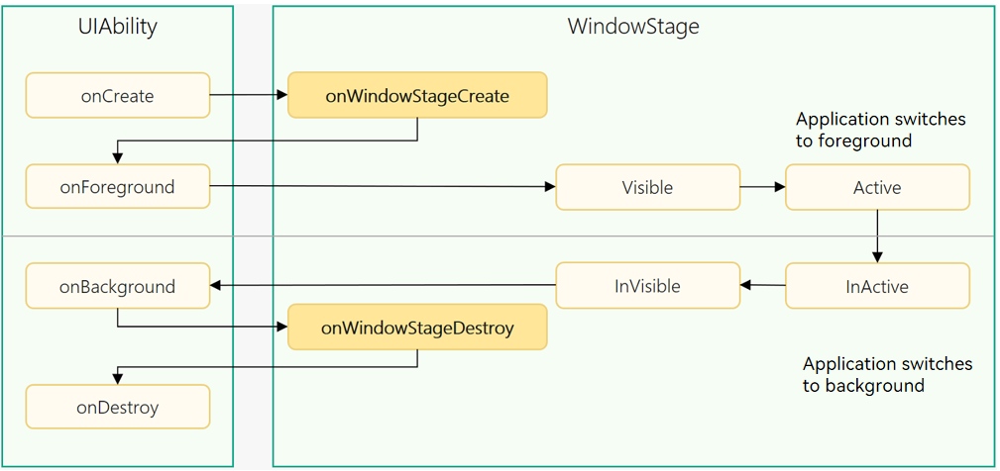

# UIAbility Lifecycle


## Overview

When a user opens or switches to and from an application, the [UIAbility](../reference/apis-ability-kit/js-apis-app-ability-uiAbility.md) instances in the application transit in their different states. The UIAbility class provides a series of callbacks. Through these callbacks, you can know the state changes of the UIAbility instance.

The lifecycle of UIAbility has four states: **Create**, **Foreground**, **Background**, and **Destroy**, as shown in the figure below.

**Figure 1** UIAbility lifecycle states

  


## Description of Lifecycle States


### Create

The **Create** state is triggered when the [UIAbility](../reference/apis-ability-kit/js-apis-app-ability-uiAbility.md) instance is created during application loading. It corresponds to the [onCreate()](../reference/apis-ability-kit/js-apis-app-ability-uiAbility.md#uiabilityoncreate) callback. In this callback, you can perform page initialization operations, for example, defining variables or loading resources.


```ts
import { AbilityConstant, UIAbility, Want } from '@kit.AbilityKit';

export default class EntryAbility extends UIAbility {
  onCreate(want: Want, launchParam: AbilityConstant.LaunchParam): void {
    // Initialize the page.
  }
  // ...
}
```

> **NOTE**
>
> [Want](../reference/apis-ability-kit/js-apis-app-ability-want.md) is used as the carrier to transfer information between application components. For details, see [Want](want-overview.md).

### WindowStageCreate and WindowStageDestroy

After the [UIAbility](../reference/apis-ability-kit/js-apis-app-ability-uiAbility.md) instance is created but before it enters the Foreground state, the system creates a WindowStage instance and triggers the [onWindowStageCreate()](../reference/apis-ability-kit/js-apis-app-ability-uiAbility.md#uiabilityonwindowstagecreate) callback. You can set UI loading and WindowStage event subscription in the callback.

**Figure 2** WindowStageCreate and WindowStageDestroy 

  

In the **onWindowStageCreate()** callback, use [loadContent()](../reference/apis-arkui/js-apis-window.md#loadcontent9) to set the page to be loaded, and call [on('windowStageEvent')](../reference/apis-arkui/js-apis-window.md#onwindowstageevent9) to subscribe to [WindowStage events](../reference/apis-arkui/js-apis-window.md#windowstageeventtype9), for example, having or losing focus, switching to the foreground or background, or becoming interactive or non-interactive in the foreground.

> **NOTE**
> 
> The timing of the [WindowStage events](../reference/apis-arkui/js-apis-window.md#windowstageeventtype9) may vary according to the development scenario.

```ts
import { UIAbility } from '@kit.AbilityKit';
import { window } from '@kit.ArkUI';
import { hilog } from '@kit.PerformanceAnalysisKit';

const TAG: string = '[EntryAbility]';
const DOMAIN_NUMBER: number = 0xFF00;

export default class EntryAbility extends UIAbility {
  // ...
  onWindowStageCreate(windowStage: window.WindowStage): void {
    // Subscribe to the WindowStage events (having or losing focus, switching to the foreground or background, or becoming interactive or non-interactive in the foreground).
    try {
      windowStage.on('windowStageEvent', (data) => {
        let stageEventType: window.WindowStageEventType = data;
        switch (stageEventType) {
          case window.WindowStageEventType.SHOWN: // Switch to the foreground.
            hilog.info(DOMAIN_NUMBER, TAG, `windowStage foreground.`);
            break;
          case window.WindowStageEventType.ACTIVE: // Gain focus.
            hilog.info(DOMAIN_NUMBER, TAG, `windowStage active.`);
            break;
          case window.WindowStageEventType.INACTIVE: // Lose focus.
            hilog.info(DOMAIN_NUMBER, TAG, `windowStage inactive.`);
            break;
          case window.WindowStageEventType.HIDDEN: // Switch to the background.
            hilog.info(DOMAIN_NUMBER, TAG, `windowStage background.`);
            break;
          case window.WindowStageEventType.RESUMED: // Interactive in the foreground.
            hilog.info(DOMAIN_NUMBER, TAG, `windowStage resumed.`);
            break;
          case window.WindowStageEventType.PAUSED: // Non-interactive in the foreground.
            hilog.info(DOMAIN_NUMBER, TAG, `windowStage paused.`);
            break;
          default:
            break;
        }
      });
    } catch (exception) {
      hilog.error(DOMAIN_NUMBER, TAG,
        `Failed to enable the listener for window stage event changes. Cause: ${JSON.stringify(exception)}`);
    }
    hilog.info(DOMAIN_NUMBER, TAG, `%{public}s`, `Ability onWindowStageCreate`);
    // Set the page to be loaded.
    windowStage.loadContent('pages/Index', (err, data) => {
      // ...
    });
  }
}
```

> **NOTE**
>
> For details about how to use WindowStage, see [Window Development](../windowmanager/application-window-stage.md).

Before the [UIAbility](../reference/apis-ability-kit/js-apis-app-ability-uiAbility.md) instance is destroyed, the [onWindowStageDestroy()](../reference/apis-ability-kit/js-apis-app-ability-uiAbility.md#uiabilityonwindowstagedestroy) callback is invoked to release UI resources.

```ts
import { UIAbility } from '@kit.AbilityKit';
import { window } from '@kit.ArkUI';
import { hilog } from '@kit.PerformanceAnalysisKit';
import { BusinessError } from '@kit.BasicServicesKit';

const TAG: string = '[EntryAbility]';
const DOMAIN_NUMBER: number = 0xFF00;

export default class EntryAbility extends UIAbility {
  windowStage: window.WindowStage | undefined = undefined;

  // ...
  onWindowStageCreate(windowStage: window.WindowStage): void {
    this.windowStage = windowStage;
    // ...
  }

  onWindowStageDestroy() {
    // Release UI resources.
    // Unsubscribe from the WindowStage events (having or losing focus, switching to the foreground or background, or becoming interactive or non-interactive in the foreground) in the onWindowStageDestroy() callback.
    try {
      if (this.windowStage) {
        this.windowStage.off('windowStageEvent');
      }
    } catch (err) {
      let code = (err as BusinessError).code;
      let message = (err as BusinessError).message;
      hilog.error(DOMAIN_NUMBER, TAG, `Failed to disable the listener for windowStageEvent. Code is ${code}, message is ${message}`);
    }
  }
}
```

### WindowStageWillDestroy
The [onWindowStageWillDestroy()](../reference/apis-ability-kit/js-apis-app-ability-uiAbility.md#uiabilityonwindowstagewilldestroy12) callback is invoked before the window stage is destroyed. In this case, the window stage can still be used.

```ts
import { UIAbility } from '@kit.AbilityKit';
import { window } from '@kit.ArkUI';

export default class EntryAbility extends UIAbility {
  windowStage: window.WindowStage | undefined = undefined;
  // ...
  onWindowStageCreate(windowStage: window.WindowStage): void {
    this.windowStage = windowStage;
    // ...
  }
  onWindowStageWillDestroy(windowStage: window.WindowStage) {
    // Release the resources obtained through the windowStage object.
  }
  onWindowStageDestroy() {
    // Release UI resources.
  }
}
```

> **NOTE**
>
> For details about how to use WindowStage, see [Window Development](../windowmanager/application-window-stage.md).


### Foreground and Background

The **Foreground** and **Background** states are triggered when the [UIAbility](../reference/apis-ability-kit/js-apis-app-ability-uiAbility.md) instance is switched to the foreground and background, respectively. They correspond to the [onForeground()](../reference/apis-ability-kit/js-apis-app-ability-uiAbility.md#uiabilityonforeground) and [onBackground()](../reference/apis-ability-kit/js-apis-app-ability-uiAbility.md#uiabilityonbackground) callbacks.

The **onForeground()** callback is triggered when the UI of the UIAbility instance is about to become visible, for example, when the UIAbility instance is about to enter the foreground. In this callback, you can apply for resources required by the system or re-apply for resources that have been released in the **onBackground()** callback.

The **onBackground()** callback is triggered when the UI of the UIAbility instance is about to become invisible, for example, when the UIAbility instance is about to enter the background. In this callback, you can release unused resources or perform time-consuming operations such as saving the status.

For example, there is an application that requires location access and has obtained the location permission from the user. Before the UI is displayed, you can enable location in the **onForeground()** callback to obtain the location information.

When the application is switched to the background, you can disable location in the **onBackground()** callback to reduce system resource consumption.


```ts
import { UIAbility } from '@kit.AbilityKit';

export default class EntryAbility extends UIAbility {
  // ...

  onForeground(): void {
    // Apply for the resources required by the system or re-apply for the resources released in onBackground().
  }

  onBackground(): void {
    // Release unused resources when the UI is invisible, or perform time-consuming operations in this callback,
    // for example, saving the status.
  }
}
```

Assume that the application already has a UIAbility instance created, and the launch type of the UIAbility instance is set to [singleton](uiability-launch-type.md#singleton). If [startAbility()](../reference/apis-ability-kit/js-apis-inner-application-uiAbilityContext.md#uiabilitycontextstartability) is called again to start the UIAbility instance, the [onNewWant()](../reference/apis-ability-kit/js-apis-app-ability-uiAbility.md#uiabilityonnewwant) callback is invoked, but the [onCreate()](../reference/apis-ability-kit/js-apis-app-ability-uiAbility.md#uiabilityoncreate) and [onWindowStageCreate()](../reference/apis-ability-kit/js-apis-app-ability-uiAbility.md#uiabilityonwindowstagecreate) callbacks are not. The application can update the resources and data to be loaded in the callback, which will be used for UI display.

```ts
import { AbilityConstant, UIAbility, Want } from '@kit.AbilityKit';

export default class EntryAbility extends UIAbility {
  // ...

  onNewWant(want: Want, launchParam: AbilityConstant.LaunchParam) {
    // Update resources and data.
  }
}
```

### Destroy

The Destroy state is triggered when the [UIAbility](../reference/apis-ability-kit/js-apis-app-ability-uiAbility.md) instance is destroyed. You can perform operations such as releasing system resources and saving data in the **onDestroy()** callback.

The UIAbility instance is destroyed when [terminateSelf()](../reference/apis-ability-kit/js-apis-inner-application-uiAbilityContext.md#uiabilitycontextterminateself) is called and the **onDestroy()** callback is invoked.
<!--RP1-->The UIAbility instance is also destroyed when the user closes the instance in the system application Recents and the **onDestroy()** callback is invoked.<!--RP1End-->

```ts
import { UIAbility } from '@kit.AbilityKit';

export default class EntryAbility extends UIAbility {
  // ...

  onDestroy() {
    // Release system resources and save data.
  }
}
```
