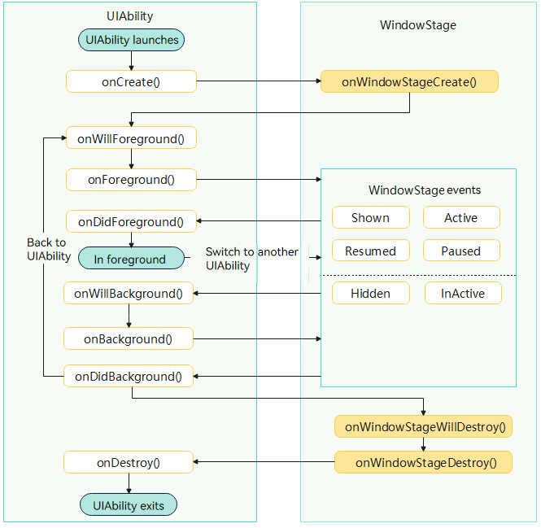

# UIAbility Lifecycle


## Overview

Whenever a user launches, pauses, resumes, or exits an application, the system fires a set of lifecycle callbacks. For a UIAbility—the component that provides UI—the key callbacks are [onCreate](../reference/apis-ability-kit/js-apis-app-ability-uiAbility.md#oncreate), [onForeground](../reference/apis-ability-kit/js-apis-app-ability-uiAbility.md#onforeground), [onBackground](../reference/apis-ability-kit/js-apis-app-ability-uiAbility.md#onbackground) and [onDestroy](../reference/apis-ability-kit/js-apis-app-ability-uiAbility.md#ondestroy). The UIAbility lifecycle is closely linked to the [WindowStage](../../application-dev/windowmanager/application-window-stage.md) lifecycle.

The following figure illustrates the UIAbility lifecycle.



The following uses the cold start of a UIAbility instance as an example.

1. When a user starts a UIAbility, the system triggers the **onCreate()** callback to notify the application that the UIAbility is starting. Then, the system triggers the **onForeground()** callback to switch the UIAbility to the foreground for user interaction.
 
2. When the user switches to another application, the system triggers the **onBackground()** callback to switch the UIAbility to the background.
 
3. When the user exits the UIAbility, the system triggers the **onDestroy()** callback to notify the application that the UIAbility is to be destroyed.


## Lifecycle Callbacks

> **NOTE**
>
> - Lifecycle callbacks are executed on the main thread of an application. To ensure application performance, you are advised to perform only necessary lightweight operations in lifecycle callbacks. For time-consuming tasks, you are advised to process them asynchronously or dispatch them to a child thread.
> - To detect lifecycle changes of a UIAbility, register a global listener via [ApplicationContext.onAbilityLifecycle()](../reference/apis-ability-kit/js-apis-inner-application-applicationContext.md#applicationcontextonabilitylifecycle). For details, see [Listening for UIAbility Lifecycle Changes](./application-context-stage.md#listening-for-uiability-lifecycle-changes).

### onCreate()

The system triggers the [onCreate()](../reference/apis-ability-kit/js-apis-app-ability-uiAbility.md#oncreate) callback when the UIAbility instance is created for the first time. Within this callback, you can execute the startup logic that only occurs once during the entire lifecycle of the UIAbility.

```ts
import { AbilityConstant, UIAbility, Want } from '@kit.AbilityKit';

export default class EntryAbility extends UIAbility {
  onCreate(want: Want, launchParam: AbilityConstant.LaunchParam): void {
    // Execute the service logic that occurs only once during the entire lifecycle of the UIAbility.
  }
  // ...
}
```

### onWindowStageCreate()

After the [UIAbility](../reference/apis-ability-kit/js-apis-app-ability-uiAbility.md) instance is created but before it becomes visible, the system creates a [WindowStage](../../application-dev/windowmanager/application-window-stage.md) instance and triggers the [onWindowStageCreate()](../reference/apis-ability-kit/js-apis-app-ability-uiAbility.md#onwindowstagecreate) callback. Within this callback, you can load UI content and subscribe to WindowStage events.

In the **onWindowStageCreate()** callback, use [loadContent()](../reference/apis-arkui/arkts-apis-window-Window.md#loadcontent9) to set the page to be loaded, and call [on('windowStageEvent')](../reference/apis-arkui/arkts-apis-window-WindowStage.md#onwindowstageevent9) to subscribe to [WindowStage events](../reference/apis-arkui/arkts-apis-window-e.md#windowstageeventtype9), for example, gaining or losing focus, switching to the foreground or background, or becoming interactive or non-interactive in the foreground.

> **NOTE**
> 
> - The timing of the [WindowStage events](../reference/apis-arkui/arkts-apis-window-e.md#windowstageeventtype9) may vary according to the development scenario. For details about how to use WindowStage, see [Window Development](../windowmanager/application-window-stage.md).
> - The UIAbility lifecycle varies with the product type when the main window of an application is switched from the foreground to the background. For details, see [Main Window Lifecycle in the Stage Model](../windowmanager/window-overview.md#main-window-lifecycle-in-the-stage-model).

```ts
import { UIAbility } from '@kit.AbilityKit';
import { window } from '@kit.ArkUI';
import { hilog } from '@kit.PerformanceAnalysisKit';

const DOMAIN_NUMBER: number = 0xFF00;

export default class EntryAbility extends UIAbility {
  // ...
  onWindowStageCreate(windowStage: window.WindowStage): void {
    // Subscribe to the WindowStage events (gaining or losing focus, switching to the foreground or background, or becoming interactive or non-interactive in the foreground).
    try {
      windowStage.on('windowStageEvent', (data) => {
        let stageEventType: window.WindowStageEventType = data;
        switch (stageEventType) {
          case window.WindowStageEventType.SHOWN: // Switch to the foreground.
            hilog.info(DOMAIN_NUMBER, 'testTag', `windowStage foreground.`);
            break;
          case window.WindowStageEventType.ACTIVE: // Gain focus.
            hilog.info(DOMAIN_NUMBER, 'testTag', `windowStage active.`);
            break;
          case window.WindowStageEventType.INACTIVE: // Lose focus.
            hilog.info(DOMAIN_NUMBER, 'testTag', `windowStage inactive.`);
            break;
          case window.WindowStageEventType.HIDDEN: // Switch to the background.
            hilog.info(DOMAIN_NUMBER, 'testTag', `windowStage background.`);
            break;
          case window.WindowStageEventType.RESUMED: // Interactive in the foreground.
            hilog.info(DOMAIN_NUMBER, 'testTag', `windowStage resumed.`);
            break;
          case window.WindowStageEventType.PAUSED: // Non-interactive in the foreground.
            hilog.info(DOMAIN_NUMBER, 'testTag', `windowStage paused.`);
            break;
          default:
            break;
        }
      });
    } catch (exception) {
      hilog.error(DOMAIN_NUMBER, 'testTag',
        `Failed to enable the listener for window stage event changes. Cause: ${JSON.stringify(exception)}`);
    }
    hilog.info(DOMAIN_NUMBER, 'testTag', `%{public}s`, `Ability onWindowStageCreate`);
    // Set the page to be loaded.
    windowStage.loadContent('pages/Index', (err, data) => {
      // ...
    });
  }
}
```

### onForeground()

The system triggers the [onForeground](../reference/apis-ability-kit/js-apis-app-ability-uiAbility.md#onforeground) callback when the [UIAbility](../reference/apis-ability-kit/js-apis-app-ability-uiAbility.md) instance is switching to the foreground and is about to become visible. Within this callback, you can apply for resources required by the system or re-apply for resources that have been released in the **onBackground()** callback. After this callback, the UIAbility instance is fully in the foreground and becomes interactive. The UIAbility instance remains in this state until it is interrupted by some actions (for example, the screen is turned off or the user switches to another UIAbility).

For example, there is an application that requires location access and has obtained the location permission from the user. Before the UI is displayed, you can enable the location service in the **onForeground()** callback to obtain the location information.

```ts
import { UIAbility } from '@kit.AbilityKit';

export default class EntryAbility extends UIAbility {
  // ...

  onForeground(): void {
    // Apply for the resources required by the system or re-apply for the resources released in onBackground().
  }
  // ...
}
```


### onBackground()

The system triggers the [onBackground](../reference/apis-ability-kit/js-apis-app-ability-uiAbility.md#onbackground) callback once the UI of the [UIAbility](../reference/apis-ability-kit/js-apis-app-ability-uiAbility.md) becomes completely invisible. After the callback, the UIAbility instance switches to the background state. Within this callback, you can release useless resources while the UI is invisible, for example, stopping the location service, to save system resources.

**onBackground()** is executed quickly. Therefore, do not perform time-consuming operations, such as saving user data or executing database transactions, within this callback.

```ts
import { UIAbility } from '@kit.AbilityKit';

export default class EntryAbility extends UIAbility {
  // ...

  onBackground(): void {
    // Release useless resources while the UI is invisible.
  }
  // ...
}
```


### onWindowStageWillDestroy()
The system triggers the [onWindowStageWillDestroy()](../reference/apis-ability-kit/js-apis-app-ability-uiAbility.md#onwindowstagewilldestroy12) callback when the [UIAbility](../reference/apis-ability-kit/js-apis-app-ability-uiAbility.md) instance is about to be destroyed, but still usable. Within this callback, you can release resources obtained through the WindowStage and unsubscribe from WindowStage events.

```ts
import { UIAbility } from '@kit.AbilityKit';
import { window } from '@kit.ArkUI';
import { BusinessError } from '@kit.BasicServicesKit';
import { hilog } from '@kit.PerformanceAnalysisKit';

const DOMAIN_NUMBER: number = 0xFF00;

export default class EntryAbility extends UIAbility {
  windowStage: window.WindowStage | undefined = undefined;
  // ...
  onWindowStageCreate(windowStage: window.WindowStage): void {
    this.windowStage = windowStage;
    // ...
  }

  onWindowStageWillDestroy(windowStage: window.WindowStage) {
    // Release the resources obtained through the windowStage object.
    // Unsubscribe from the WindowStage events (gaining or losing focus, switching to the foreground or background, or becoming interactive or non-interactive in the foreground) in the onWindowStageWillDestroy() callback.
    try {
      if (this.windowStage) {
        this.windowStage.off('windowStageEvent');
      }
    } catch (err) {
      let code = (err as BusinessError).code;
      let message = (err as BusinessError).message;
      hilog.error(DOMAIN_NUMBER, 'testTag', `Failed to disable the listener for windowStageEvent. Code is ${code}, message is ${message}`);
    }
  }
}
```

### onWindowStageDestroy()
The system triggers the [onWindowStageDestroy()](../reference/apis-ability-kit/js-apis-app-ability-uiAbility.md#onwindowstagedestroy) callback before the [UIAbility](../reference/apis-ability-kit/js-apis-app-ability-uiAbility.md) instance is destroyed, while the WindowStage instance is destroyed and can no longer be used. Within this callback, you can release UI resources.

```ts
import { UIAbility } from '@kit.AbilityKit';
import { window } from '@kit.ArkUI';

export default class EntryAbility extends UIAbility {
  // ...

  onWindowStageCreate(windowStage: window.WindowStage): void {
    // Load UI resources.
  }

  onWindowStageDestroy() {
    // Release UI resources.
  }
}
```

### onDestroy()

The system triggers the [onDestroy](../reference/apis-ability-kit/js-apis-app-ability-uiAbility.md#ondestroy) callback before the [UIAbility](../reference/apis-ability-kit/js-apis-app-ability-uiAbility.md) instance is destroyed. This callback is the last lifecycle callback received by the UIAbility. Within this callback, you can release system resources and save data.

The UIAbility instance is destroyed when [terminateSelf()](../reference/apis-ability-kit/js-apis-inner-application-uiAbilityContext.md#terminateself) is called and the **onDestroy()** callback is invoked.
<!--RP1-->The UIAbility instance is also destroyed when the user closes the instance in the recent task list and the **onDestroy()** callback is invoked.<!--RP1End-->

```ts
import { UIAbility } from '@kit.AbilityKit';

export default class EntryAbility extends UIAbility {
  // ...

  onDestroy() {
    // Release system resources and save data.
  }
}
```


### onNewWant()

The system triggers the [onNewWant()](../reference/apis-ability-kit/js-apis-app-ability-uiAbility.md#onnewwant) callback when an already running UIAbility is launched again. Within this callback, you can update the resources and data to be loaded, which will be used for UI display.

```ts
import { AbilityConstant, UIAbility, Want } from '@kit.AbilityKit';

export default class EntryAbility extends UIAbility {
  // ...

  onNewWant(want: Want, launchParam: AbilityConstant.LaunchParam) {
    // Update resources and data.
  }
}
```


