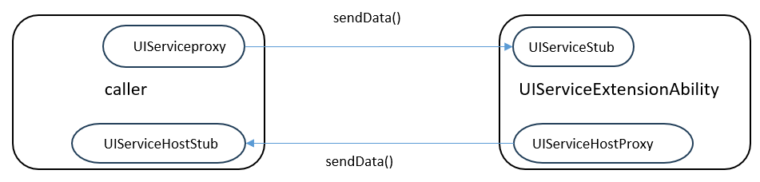

# UIServiceExtensionAbility (for System Applications Only)

## Overview

[UIServiceExtensionAbility](../reference/apis-ability-kit/js-apis-app-ability-uiServiceExtensionAbility-sys.md) is an [ExtensionAbility](../reference/apis-ability-kit/js-apis-app-ability-extensionAbility.md) component of the UIService type. It provides UI pages (such as preview pages) and background service capabilities. This component internally holds a [UIServiceExtensionContext](../reference/apis-ability-kit/js-apis-inner-application-uiserviceExtensionContext-sys.md), which provides a variety of APIs for external systems.

In this document, the component that starts or connects to a UIServiceExtensionAbility is called the client, and the UIServiceExtensionAbility is called the server.

An application can use a UIServiceExtensionAbility in two modes:
- Call [startUIServiceExtensionAbility()](../reference/apis-ability-kit/js-apis-inner-application-uiAbilityContext.md#startuiserviceextensionability14) in the [UIAbilityContext](../reference/apis-ability-kit/js-apis-inner-application-uiAbilityContext.md), [UIExtensionContext](../reference/apis-ability-kit/js-apis-inner-application-uiExtensionContext.md), or [ServiceExtensionContext](../reference/apis-ability-kit/js-apis-inner-application-serviceExtensionContext-sys.md) class to start a UIServiceExtensionAbility.
- Call [connectUIServiceExtensionAbility()](../reference/apis-ability-kit/js-apis-inner-application-uiAbilityContext.md#connectuiserviceextensionability14) in the [UIAbilityContext](../reference/apis-ability-kit/js-apis-inner-application-uiAbilityContext.md) or [UIExtensionContext](../reference/apis-ability-kit/js-apis-inner-application-uiExtensionContext.md) class to connect to a UIServiceExtensionAbility.

Note the following:

- Only one window is created during the start or connection of the UIServiceExtensionAbility.
- If the window fails to be created or is destroyed, the UIServiceExtensionAbility is automatically destroyed.
- The start, connection, and disconnection operations can be performed only in the main thread, but not in the Worker and TaskPool threads.
- Applications can start and connect to a UIServiceExtensionAbility provided by the system only when they gain focus in the foreground.

## Lifecycle

The UIServiceExtensionAbility provides the following lifecycle callbacks: [onCreate()](../reference/apis-ability-kit/js-apis-app-ability-uiServiceExtensionAbility-sys.md#oncreate), [onWindowWillCreate()](../reference/apis-ability-kit/js-apis-app-ability-uiServiceExtensionAbility-sys.md#onwindowwillcreate), [onWindowDidCreate()](../reference/apis-ability-kit/js-apis-app-ability-uiServiceExtensionAbility-sys.md#onwindowdidcreate), [onRequest()](../reference/apis-ability-kit/js-apis-app-ability-uiServiceExtensionAbility-sys.md#onrequest), [onConnect()](../reference/apis-ability-kit/js-apis-app-ability-uiServiceExtensionAbility-sys.md#onconnect), [onDisconnect()](../reference/apis-ability-kit/js-apis-app-ability-uiServiceExtensionAbility-sys.md#ondisconnect), [onData()](../reference/apis-ability-kit/js-apis-app-ability-uiServiceExtensionAbility-sys.md#ondata), and [onDestroy()](../reference/apis-ability-kit/js-apis-app-ability-uiServiceExtensionAbility-sys.md#ondestroy). Override them as required. The figure below shows the lifecycle transitions.

**Figure 1** UIServiceExtensionAbility lifecycle


- **onCreate**
  
  This callback is invoked when a UIServiceExtensionAbility is created for the first time. You can perform initialization operations, for example, registering a common event listener, in this callback.

  > **NOTE**
  >
  > If the UIServiceExtensionAbility has been created, starting it again does not trigger the **onCreate()** callback.

- **onRequest**
  
  This callback is invoked when another component calls [startUIServiceExtensionAbility()](../reference/apis-ability-kit/js-apis-inner-application-uiAbilityContext.md#startuiserviceextensionability14) to start a UIServiceExtensionAbility. After This callback is invoked, the UIServiceExtensionAbility is started and runs in the foreground. This callback is invoked each time [startUIServiceExtensionAbility()](../reference/apis-ability-kit/js-apis-inner-application-uiAbilityContext.md#startuiserviceextensionability14) is called.

- **onWindowWillCreate**

  This callback is invoked before a window is created. Through this callback, you can pass window parameters to the system. If **config.windowAttribute** is set to **window.ExtensionWindowAttribute.SUB_WINDOW**, a subwindow is created. If it is set to **window.ExtensionWindowAttribute.SYSTEM_WINDOW**, a system window is created.

  Currently, both the subwindow and system window can be created for the UIServiceExtensionAbility started by [UIAbilityContext](../reference/apis-ability-kit/js-apis-inner-application-uiAbilityContext.md) and [UIExtensionContext](../reference/apis-ability-kit/js-apis-inner-application-uiExtensionContext.md), but only the system window can be created for the UIServiceExtensionAbility started by [ServiceExtensionContext](../reference/apis-ability-kit/js-apis-inner-application-serviceExtensionContext-sys.md). In addition, only one window is created for a UIServiceExtensionAbility.

- **onWindowDidCreate**

  This callback is invoked when a window is created. You can operate the window through a [Window](../reference/apis-arkui/arkts-apis-window-Window.md) object. You can use [window.on('windowVisibilityChange')](../reference/apis-arkui/arkts-apis-window-Window.md#onwindowvisibilitychange11) to bind and process window events, such as window showing, hiding, and destruction.

- **onConnect**

  This callback is invoked when another component calls [connectUIServiceExtensionAbility()](../reference/apis-ability-kit/js-apis-inner-application-uiAbilityContext.md#connectuiserviceextensionability14) to connect to a UIServiceExtensionAbility. In this callback, a remote proxy object, namely, [UIServiceHostProxy](../reference/apis-ability-kit/js-apis-inner-application-uiservicehostproxy-sys.md), is returned, through which the server communicates with the client. For the same client, if the values of **DeviceId**, **BundleName**, **ModuleName**, and **AbilityName** in the want object and the callback object are the same, [onConnect()](../reference/apis-ability-kit/js-apis-app-ability-serviceExtensionAbility-sys.md#onconnect) is invoked only for the first connection. If any of them is different, [onConnect()](../reference/apis-ability-kit/js-apis-app-ability-serviceExtensionAbility-sys.md#onconnect) is invoked again.

- **onData**

  This callback is invoked to receive data sent by the caller through [UIServiceProxy](../reference/apis-ability-kit/js-apis-inner-application-uiserviceproxy.md).

- **onDisconnect**

  This callback is invoked when the connection is interrupted, which occurs when the client exits or [disconnectServiceExtensionAbility()](../reference/apis-ability-kit/js-apis-inner-application-uiAbilityContext.md#disconnectuiserviceextensionability14) is called.

- **onDestroy**
  
  This callback is invoked when a UIServiceExtensionAbility is no longer required and the instance is ready for destruction. You can clear resources, for example, deregistering the listener, in this callback.

## Implementing an Extension Base Class of the UIService Type

### Preparations

Only system applications can implement a UIServiceExtensionAbility. You must make the following preparations before development:

- **Switching to the full SDK**: All the APIs provided by the UIServiceExtensionAbility class are marked as system APIs and hidden by default. Therefore, you must manually obtain the full SDK from the mirror and switch to it in DevEco Studio. For details, see [Switching to Full SDK](../faqs/full-sdk-switch-guide.md).

- **Requesting the AllowAppUsePrivilegeExtension privilege**: Only applications with the **AllowAppUsePrivilegeExtension** privilege can implement a UIServiceExtensionAbility. For details about how to request the privilege, see [Application Privilege Configuration](../../device-dev/subsystems/subsys-app-privilege-config-guide.md).

### Creating a UIServiceExtensionAbility

To manually create a UIServiceExtensionAbility in a project in DevEco Studio, perform the following steps:

1. In the **ets** directory of the target module, right-click and choose **New > Directory** to create a directory named [UIServiceExtension](../reference/apis-ability-kit/js-apis-app-ability-uiServiceExtensionAbility-sys.md).

2. In the **UIServiceExt** directory, right-click and choose **New &gt; ArkTS File** to create a file named **UIServiceExt.ets**.

    ```
    ├── ets
    │ ├── UIServiceExt
    │ │   ├── UIServiceExt.ets
    ```
    
3. In the **UIServiceExt.ets** file, import the UIServiceExtensionAbility module. Customize a class that inherits from the UIServiceExtensionAbility and implement the lifecycle callbacks.

    ```ts
    import { common, UIServiceExtensionAbility, Want } from '@kit.AbilityKit';
    import { hilog } from '@kit.PerformanceAnalysisKit';
    import { window } from '@kit.ArkUI';

    export default class UIServiceExtAbility extends UIServiceExtensionAbility {
      // Create a UIServiceExtensionAbility.
      onCreate(want: Want) {
        hilog.info(0x0000, 'testTag', '%{public}s', 'Ability onCreate');
      }

      // Callback for request processing.
      onRequest(want: Want, startId: number) {
        hilog.info(0x0000, 'testTag', '%{public}s', 'Ability onRequest');
      }

      // Callback invoked when a connection is set up.
      onConnect(want: Want, proxy: common.UIServiceHostProxy) {
        hilog.info(0x0000, 'testTag', '%{public}s', 'Ability onConnect');
      }

      // Callback invoked when a connection is interrupted.
      onDisconnect(want: Want, proxy: common.UIServiceHostProxy) {
        hilog.info(0x0000, 'testTag', '%{public}s', 'Ability onDisconnect');
      }

      // Callback invoked when a window is about to create.
      onWindowWillCreate(config: window.ExtensionWindowConfig): void {
        hilog.info(0x0000, 'testTag', '%{public}s', 'Ability onWindowWillCreate');
        let rect: window.Rect = {
          left: 100,
          top: 100,
          width: 500,
          height: 500
        };
        config.windowRect = rect;
        // Create a subwindow.
        config.windowName = 'sub_window'
        config.windowAttribute = window.ExtensionWindowAttribute.SUB_WINDOW;
        config.windowRect = rect;
        config.subWindowOptions = {
          title: 'sub_window_title',
          decorEnabled: true,
          // Whether the window is a modal window.
          isModal: false
        };
        hilog.info(0x0000, 'testTag', '%{public}s', 'Ability onWindowWillCreate end');
      }

      // Callback invoked when a window is created.
      onWindowDidCreate(window: window.Window) {
        hilog.info(0x0000, 'testTag', '%{public}s', 'Ability onWindowDidCreate');
        window.setUIContent('uiservice/page/WindowPage');
        window.showWindow();
      }

      // Callback invoked to receive data.
      onData(proxy: common.UIServiceHostProxy, data: Record<string, Object>) {
        hilog.info(0x0000, 'testTag', '%{public}s', 'Ability onData');
      }

      // Callback invoked to destroy the instance.
      onDestroy() {
        hilog.info(0x0000, 'testTag', '%{public}s', 'Ability onDestroy');
      }
    }
    ```

4. Register the UIServiceExtensionAbility in the [module.json5 file](../quick-start/module-configuration-file.md) of the module in the project. Set **type** to **"uiService"** and **srcEntry** to the code path of the UIServiceExtensionAbility component.

    ```json
    {
      "module": {
        // ...
        "extensionAbilities": [
          {
            "name": "UIServiceExtAbility",
            "icon": "$media:icon",
            "description": "uiService",
            "type": "uiService",
            "exported": true,
            "srcEntry": "./ets/UIServiceExtAbility/UIServiceExtAbility.ets"
          }
        ]
      }
    }
    ```

### Starting a UIServiceExtensionAbility

An application calls [startUIServiceExtensionAbility()](../reference/apis-ability-kit/js-apis-inner-application-uiAbilityContext.md#startuiserviceextensionability14) to start a UIServiceExtensionAbility. The [onRequest()](../reference/apis-ability-kit/js-apis-app-ability-uiServiceExtensionAbility-sys.md#onrequest) callback is invoked, through which the background service receives the **Want** object passed by the caller. Once the UIServiceExtensionAbility is started, its lifecycle is independent of the client. In other words, even if the client is destroyed, the background service remains alive. However, the service is destroyed if the window fails to be created or is destroyed. Therefore, the background service must be stopped by calling [terminateSelf()](../reference/apis-ability-kit/js-apis-inner-application-uiserviceExtensionContext-sys.md#uiserviceextensioncontextterminateself) of [UIServiceExtensionContext](../reference/apis-ability-kit/js-apis-inner-application-uiserviceExtensionContext-sys.md) when its work is complete.

Start a new UIServiceExtensionAbility in a system application. For details about how to obtain the context, see [Obtaining the Context of UIAbility](uiability-usage.md#obtaining-the-context-of-uiability).


```ts
import { common, Want } from '@kit.AbilityKit';
import { BusinessError } from '@kit.BasicServicesKit';

@Entry
@Component
struct Index {
  build() {
    Column() {
      Row() {
        // Create a Start button.
        Button('start ability')
          .enabled(true)
          .onClick(() => {
            let context = this.getUIContext().getHostContext() as common.UIAbilityContext;
            let startWant: Want = {
              bundleName: 'com.acts.uiserviceextensionability',
              abilityName: 'UiServiceExtAbility',
            };
            try {
              // Start the UIServiceExtensionAbility.
              context.startUIServiceExtensionAbility(startWant).then(() => {
                console.info(`startUIServiceExtensionAbility success.`);
              }).catch((error: BusinessError) => {
                console.error(`startUIServiceExtensionAbility failed, err code: ${error.code}, err msg: ${error.message}.`);
              })
            } catch (err) {
              let code = (err as BusinessError).code;
              let msg = (err as BusinessError).message;
              console.error(`startUIServiceExtensionAbility failed, err code: ${code}, err msg: ${msg}.`);
            }
          })
      }
    }
  }
}
```

### Connecting to a UIServiceExtensionAbility

An application can use [connectUIServiceExtensionAbility()](../reference/apis-ability-kit/js-apis-inner-application-uiAbilityContext.md#connectuiserviceextensionability14) to connect to a service (specified in the [Want](../reference/apis-ability-kit/js-apis-app-ability-want.md) object). The [onConnect()](../reference/apis-ability-kit/js-apis-app-ability-serviceExtensionAbility-sys.md#onconnect) callback is invoked, through which the service receives the [Want](../reference/apis-ability-kit/js-apis-app-ability-want.md) object passed by the caller. In this way, a connection is established.

When the client calls [connectUIServiceExtensionAbility()](../reference/apis-ability-kit/js-apis-inner-application-uiAbilityContext.md#connectuiserviceextensionability14) to connect to the server, the client receives a [UIServiceProxy](../reference/apis-ability-kit/js-apis-inner-application-uiserviceproxy.md) object returned by the server and saves it. Through this proxy object, the client sends data to the server, and disconnects from the server by calling [disconnectServiceExtensionAbility()](../reference/apis-ability-kit/js-apis-inner-application-uiAbilityContext.md#disconnectuiserviceextensionability14).

- Call [connectUIServiceExtensionAbility()](../reference/apis-ability-kit/js-apis-inner-application-uiAbilityContext.md#connectuiserviceextensionability14) to connect to a UIServiceExtensionAbility. For details about how to obtain the context, see [Obtaining the Context of UIAbility](uiability-usage.md#obtaining-the-context-of-uiability).
    ```ts
    import { common, Want } from '@kit.AbilityKit';
    import { BusinessError } from '@kit.BasicServicesKit';

    @Entry
    @Component
    struct Page_UIServiceExtensionAbility {
      @State uiServiceProxy: common.UIServiceProxy | null = null;

      build() {
        Column() {
          //...
          Row() {
            //...
          }.onClick(() => {
            const context = this.getUIContext().getHostContext() as common.UIAbilityContext;
            const want: Want = {
              deviceId: '',
              bundleName: 'com.example.myapplication',
              abilityName: ''
            };
            // Define a callback.
            const callback: common.UIServiceExtensionConnectCallback = {
              onData: (data: Record<string, Object>): void => {
                console.info(`onData, data: ${JSON.stringify(data)}.`);
              },
              onDisconnect: (): void => {
                console.info(`onDisconnect.`);
              }
            };
            // Connect to the UIServiceExtensionAbility.
            context.connectUIServiceExtensionAbility(want, callback).then((uiServiceProxy: common.UIServiceProxy) => {
              this.uiServiceProxy = uiServiceProxy;
              console.info(`connectUIServiceExtensionAbility success.`);
            }).catch((error: BusinessError) => {
              console.error(`connectUIServiceExtensionAbility failed, err code:${error.code}, err msg: ${error.message}.`);
            });
          })
        }
      }
    }
    ```

- Call [disconnectUIServiceExtensionAbility()](../reference/apis-ability-kit/js-apis-inner-application-uiAbilityContext.md#disconnectuiserviceextensionability14) to disconnect from a UIServiceExtensionAbility.
    ```ts
    import { common } from '@kit.AbilityKit';
    import { BusinessError } from '@kit.BasicServicesKit';

    @Entry
    @Component
    struct Page_UIServiceExtensionAbility {
      @State uiServiceProxy: common.UIServiceProxy | null = null;

      build() {
        Column() {
          //...
          Row() {
            //...
          }.onClick(() => {
            const context = this.getUIContext().getHostContext() as common.UIAbilityContext;
            // this.uiServiceProxy is the proxy object saved during connection.
            context.disconnectUIServiceExtensionAbility(this.uiServiceProxy).then(() => {
              console.info(`disconnectUIServiceExtensionAbility success.`);
            }).catch((error: BusinessError) => {
              console.error(`disconnectUIServiceExtensionAbility failed, err code: ${error.code}, err msg: ${error.message}.`);
            });
          })
        }
      }
    }
    ```


## Bidirectional Communication Between the Client and Server

After a UIServiceExtensionAbility is started, the following operations are possible:

1. The client calls [connectUIServiceExtensionAbility()](../reference/apis-ability-kit/js-apis-inner-application-uiExtensionContext.md#connectuiserviceextensionability14) to obtain a [UIServiceProxy](../reference/apis-ability-kit/js-apis-inner-application-uiserviceproxy.md) object, through which it can send data to the server.
2. The server obtains a [UIServiceHostProxy](../reference/apis-ability-kit/js-apis-inner-application-uiservicehostproxy-sys.md) object through the [onConnect()](../reference/apis-ability-kit/js-apis-app-ability-uiServiceExtensionAbility-sys.md#onconnect) callback and sends data to the client through this proxy.




### Communication Between the Client and Server
- Data transmission on the client

  The client connects to the server through [connectUIServiceExtensionAbility()](../reference/apis-ability-kit/js-apis-inner-application-uiExtensionContext.md#connectuiserviceextensionability14) and obtains a [UIServiceProxy](../reference/apis-ability-kit/js-apis-inner-application-uiserviceproxy.md) object. The client calls [sendData()](../reference/apis-ability-kit/js-apis-inner-application-uiserviceproxy.md#uiserviceproxysenddata) of the proxy object to send data to the server. The server receives data through the [onData()](../reference/apis-ability-kit/js-apis-app-ability-uiServiceExtensionAbility-sys.md#ondata) callback.
    ```ts
    import { common, Want } from '@kit.AbilityKit';
    import { BusinessError } from '@kit.BasicServicesKit';

    @Entry
    @Component
    struct Index {
      comProxy: common.UIServiceProxy | null = null;
      connectCallback: common.UIServiceExtensionConnectCallback = {
        onData: (data: Record<string, Object>) => {
          console.info(`onData, data: ${JSON.stringify(data)}.`);
        },
        onDisconnect: () => {
          console.info(`onDisconnect.`);
        }
      }

      build() {
        Column() {
          Row() {
            // Create a Connect button.
            Button('connect ability')
              .enabled(true)
              .onClick(() => {
                let context = this.getUIContext().getHostContext() as common.UIAbilityContext;
                let startWant: Want = {
                  bundleName: 'com.acts.uiserviceextensionability',
                  abilityName: 'UiServiceExtAbility',
                };
                try {
                  // Connect to the UIServiceExtensionAbility.
                  context.connectUIServiceExtensionAbility(startWant, this.connectCallback)
                    .then((proxy: common.UIServiceProxy) => {
                      this.comProxy = proxy;
                      let formData: Record<string, string> = {
                        'test': 'test'
                      };
                      try {
                        this.comProxy.sendData(formData);
                      } catch (err) {
                        let code = (err as BusinessError).code;
                        let msg = (err as BusinessError).message;
                        console.error(`sendData failed, err code: ${code}, err msg: ${msg}.`);
                      }
                    })
                    .catch((err: BusinessError) => {
                      console.error(`connectUIServiceExtensionAbility failed, err code: ${err.code}, err msg: ${err.message}.`);
                    });
                } catch (err) {
                  let code = (err as BusinessError).code;
                  let msg = (err as BusinessError).message;
                  console.error(`connectUIServiceExtensionAbility failed, err code: ${code}, err msg: ${msg}.`);
                }
              })
          }
        }
      }
    }
    ```

- Data transmission on the server

  The server receives data transferred by the client through [onData()](../reference/apis-ability-kit/js-apis-app-ability-uiServiceExtensionAbility-sys.md#ondata). Through the [UIServiceHostProxy](../reference/apis-ability-kit/js-apis-inner-application-uiservicehostproxy-sys.md) object, which is saved during the connection, the server calls [sendData()](../reference/apis-ability-kit/js-apis-inner-application-uiservicehostproxy-sys.md#senddata) to send data to the client.
    ```ts
    import { common, Want, UIServiceExtensionAbility } from '@kit.AbilityKit';
    import { window } from '@kit.ArkUI';
    import { BusinessError } from '@kit.BasicServicesKit';

    export default class MyServiceExtAbility extends UIServiceExtensionAbility {
      comProxy: common.UIServiceHostProxy | null = null;

      // Callback invoked when a UIServiceExtensionAbility is created.
      onCreate(want: Want) {
        console.info('UIServiceExtensionAbility onCreate');
      }

      // Callback for request processing.
      onRequest(want: Want, startId: number) {
        console.info('UIServiceExtensionAbility onRequest');
      }

      // Callback invoked when a connection is set up.
      onConnect(want: Want, proxy: common.UIServiceHostProxy) {
        console.info('UIServiceExtensionAbility onConnect');
        this.comProxy = proxy;
      }

      // Callback invoked when a connection is interrupted.
      onDisconnect(want: Want, proxy: common.UIServiceHostProxy) {
        console.info('UIServiceExtensionAbility onDisconnect');
        this.comProxy = null;
      }

      // Callback invoked to receive data.
      onData(proxy: common.UIServiceHostProxy, data: Record<string, Object>) {
        console.info('UIServiceExtensionAbility onData');
        try {
          let formData: Record<string, string> = {
            'Data': 'reply message'
          };
          proxy.sendData(formData);
        } catch (err) {
          let code = (err as BusinessError).code;
          let msg = (err as BusinessError).message;
          console.error(`sendData failed, err code: ${code}, err msg: ${msg}.`);
        }
      }

      onWindowWillCreate(extensionWindowConfig: window.ExtensionWindowConfig) {
        console.info('UIServiceExtensionAbility onWindowWillCreate');
      }

      onWindowDidCreate(window: window.Window) {
        console.info('UIServiceExtensionAbility onWindowDidCreate');
      }

      onDestroy() {
        console.info('UIServiceExtensionAbility onDestroy');
      }
    }
    ```
