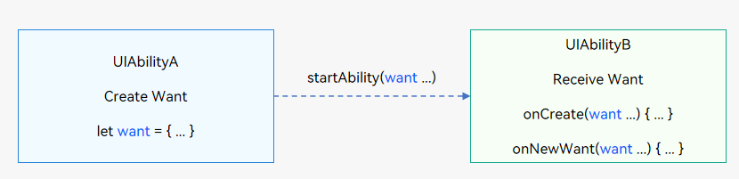

# Want Overview


## Definition and Usage of Want

[Want](../reference/apis-ability-kit/js-apis-app-ability-want.md) is an object that transfers information between application components. It is often used as a parameter of [startAbility()](../reference/apis-ability-kit/js-apis-inner-application-uiAbilityContext.md#uiabilitycontextstartability). For example, when UIAbilityA needs to start UIAbilityB and transfer some data to UIAbilityB, it can use the **want** parameter in **startAbility()** to transfer the data.

**Figure 1** Want usage

  


## Types of Want

- **Explicit Want**: If **abilityName** and **bundleName** are specified in the [want](../reference/apis-ability-kit/js-apis-app-ability-want.md) parameter when starting an application component, explicit Want is used.
  
    Explicit Want is usually used to start another application component in the same application. You can use the bundle name and ability name in the **Want** object to specify the target component. When there is an explicit object to process the request, explicit Want is a simple and effective way to start the target application component.
    > **NOTE**
    >
    > In API version 11 and earlier versions, you can use explicit Want to start the UIAbility of another application.
    > Since API version 12, the explicit Want launch mode is no longer supported for inter-application redirection. You must use **openLink** to start the UIAbility of another application.
  
  ```ts
  import { Want } from '@kit.AbilityKit';

  let wantInfo: Want = {
    deviceId: '', // An empty deviceId indicates the local device.
    bundleName: 'com.example.myapplication',
    abilityName: 'FuncAbility',
  }
  ```
  
- **Implicit Want**: If **abilityName** is not specified in the [want](../reference/apis-ability-kit/js-apis-app-ability-want.md) parameter when starting an application component, implicit Want is used.
  
  Implicit Want can be used when the object used to process the request is unclear and the current application wants to use a capability (defined by the [skills tag](../quick-start/module-configuration-file.md#skills)) provided by another application. The system matches all applications that declare to support the capability. For example, for a link open request, the system matches all applications that support the request and provides the available ones for users to select.
  
  
  ```ts
  import { Want } from '@kit.AbilityKit';

  let wantInfo: Want = {
    // Uncomment the line below if you want to implicitly query data only in the specific bundle.
    // bundleName: 'com.example.myapplication',
    action: 'ohos.want.action.search',
    // entities can be omitted.
    entities: [ 'entity.system.browsable' ],
    uri: 'https://www.test.com:8080/query/student',
    type: 'text/plain',
  };
  ```
  
  > **NOTE**
  > - Depending on the application component matching result, the following cases may be possible when you attempt to use implicit Want to start the application component.
  >   - No application component is matched. The startup fails.
  >   - An application component that meets the conditions is matched. That application component is started.
  >   - Multiple [UIAbility](../reference/apis-ability-kit/js-apis-app-ability-uiAbility.md) components that meet the conditions are matched. A dialog box is displayed for users to select one of them.
  > 
  > - In the scenario for starting the ServiceExtensionAbility component:
  >   - If the [want](../reference/apis-ability-kit/js-apis-app-ability-want.md) parameter passed in contains **abilityName**, the ServiceExtensionAbility component cannot be started through implicit Want.
  > 
  >   - If the **want** parameter passed in contains **bundleName**, the **startServiceExtensionAbility()** method can be used to implicitly start the ServiceExtensionAbility component. By default, the ServiceExtensionAbility component with the highest priority is returned. If all the matching ServiceExtensionAbility components have the same priority, the first ServiceExtensionAbility component is returned.
