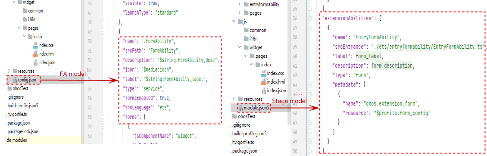
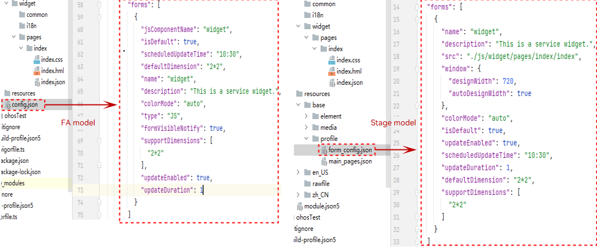
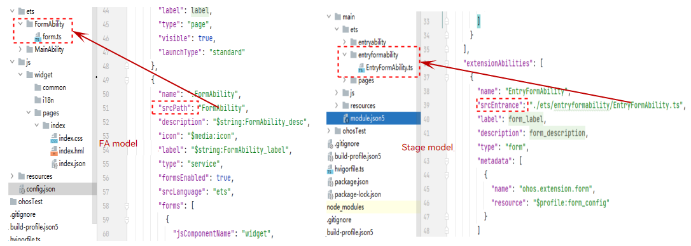
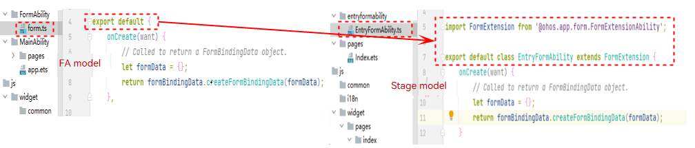

# Widget Switching

Widget switching involves the following parts:

- Widget UI layout: Both the FA model and stage model use the web-like paradigm to develop the widget UI layout. Therefore, the UI layout of a widget in the FA model can be directly reused in the stage mode.
- Widget configuration file: Widgets are configured in the **config.json** file in the FA model and in **module.json5** and **form_config.json** files in the stage model (as shown in Figure 1 and Figure 2).
- Widget service logic: The widget entry file and lifecycle of the FA model are slightly different from those of the stage model, as shown in Figure 3 and Figure 4.

| Configuration Item          | FA Model                                     | Stage Model                                                   |
| ---------------- | ------------------------------------------- | ------------------------------------------------------------ |
| Configuration item location      | **formAbility** and **forms** are in the **config.json** file.| **extensionAbilities** (configuration for **formExtensionAbility**) is in the **module.json5** file in the level-1 directory, and **forms** (configuration for **forms** contained in **formExtensionAbility**) is in the **form_config.json** file in the level-2 directory.|
| Widget code path    | Specified by **srcPath**, without the file name.                        | Specified by **srcEntry**, with the file name.                                          |
| Programming language            | **srcLanguage** can be set to **js** or **ets**.               | This configuration item is unavailable. Only ets is supported.                                       |
| Whether to enable widgets    | formsEnabled                                | This configuration item is unavailable. When **type** is set to **form**, widgets are enabled.                              |
| Ability type     | type: service                              | type: form                                                  |
| Level-2 directory configuration tag| This configuration item is unavailable.                                         | **metadata**, which consists of **name**, **value**, and **resource**, where **resource** points to the location of the **form_config.json** file in the level-2 directory.|

Figure 1 Entry configuration differences

Figure 2 Widget configuration differences

| Item| FA Model| Stage Model|
| -------- | -------- | -------- |
| Entry file| **form.ts** in the directory pointed to by **srcPath**| File pointed to by **srcEntry**|
| Lifecycle| export default| import FormExtension from '\@ohos.app.form.FormExtensionAbility'; export default class FormAbility extends FormExtension|

Figure 3 Entry file differences

Figure 4 Lifecycle differences (The lifecycle callbacks are the same and require no adjustment.)

