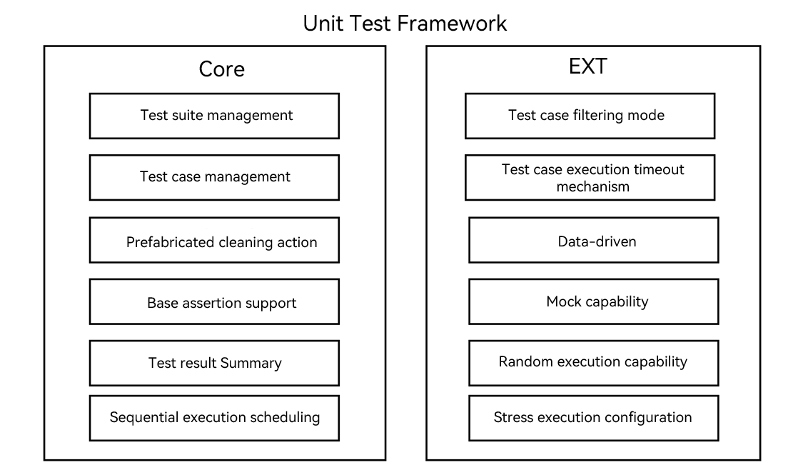
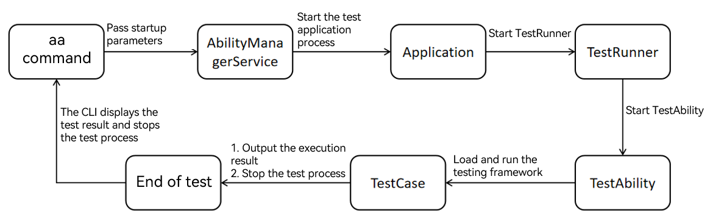
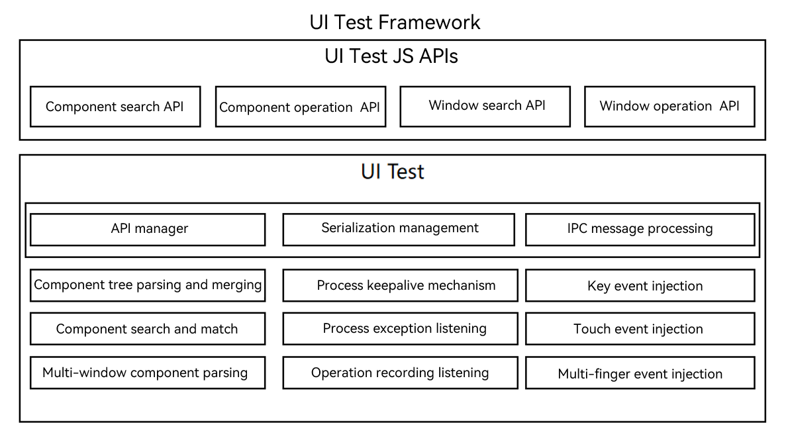
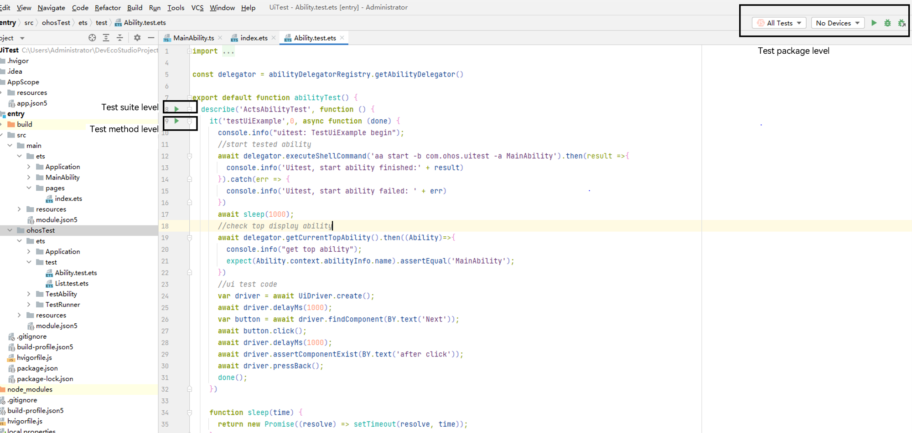

# arkXtest User Guide


## Overview

arkXtest is an automated test framework that consists of JsUnit and UiTest.<br>JsUnit is a unit test framework that provides basic APIs for compiling test cases and generating test reports for testing system and application APIs.<br>UiTest is a UI test framework that provides the UI component search and operation capabilities through simple and easy-to-use APIs, and allows you to develop automated test scripts based on GUI operations.<br>This document will help to familiarize you with arkXtest, describing its main functions, implementation principles, environment setup, and test script compilation and execution. In addition, the shell commands are provided for the following features: obtaining screenshots, component trees, recording user operations, and conveniently injecting UI simulation operations, which facilitates testing and verification.

## Implementation

arkXtest is divided into two parts: unit test framework and UI test framework.<br>As the backbone of arkXtest, the unit test framework offers such features as identifying, scheduling, and executing test scripts, as well as summarizing test script execution results.<br>The UI test framework provides UiTest APIs for you to call in different test scenarios. Its test scripts are executed on top of the unit test framework.

### Unit Test Framework

  Figure 1 Main functions of the unit test framework

  

  Figure 2 Basic script process

  

### UI Test Framework

  Figure 3 Main functions of the UI test framework

  

## Compile and Execute Tests Based on ArkTS

### Setting Up the Environment

[Download DevEco Studio](https://developer.huawei.com/consumer/en/download/) and set it up as instructed on the official website.

### Creating and Compiling a Test Script

#### Creating a Test Script

<!--RP2-->
1. Open DevEco Studio and create a project, in which the **ohos** directory is where the test script is located.

2. Open the .ets file of the module to be tested in the project directory. Move the cursor to any position in the code, and then right-click and choose **Show Context Actions** > **Create Ohos Test** or press **Alt+Enter** and choose **Create Ohos Test** to create a test class. For more details, see [DevEco Studio User Guide](https://developer.harmonyos.com/en/docs/documentation/doc-guides-V3/harmonyos_jnit_jsunit-0000001092459608-V3?catalogVersion=V3#section13366184061415).

<!--RP2End-->

#### Writing a Unit Test Script

This section describes how to use the unit test framework to write a unit test script. For details about the functionality of the unit test framework, see [arkXtest](https://gitee.com/openharmony/testfwk_arkxtest/blob/master/README_en.md).

The unit test script must contain the following basic elements:

1. Import of the dependencies so that the dependent test APIs can be used.

2. Test code, mainly about the related logic, such as API invoking.

3. Invoking of the assertion APIs and setting of checkpoints. If there is no checkpoint, the test script is considered as incomplete.

The following sample code is used to start the test page to check whether the page displayed on the device is the expected page.

```ts
import { describe, it, expect } from '@ohos/hypium';
import { abilityDelegatorRegistry } from '@kit.TestKit';
import { UIAbility, Want } from '@kit.AbilityKit';

const delegator = abilityDelegatorRegistry.getAbilityDelegator()
const bundleName = abilityDelegatorRegistry.getArguments().bundleName;
function sleep(time: number) {
  return new Promise<void>((resolve: Function) => setTimeout(resolve, time));
}
export default function abilityTest() {
  describe('ActsAbilityTest', () =>{
    it('testUiExample',0, async (done: Function) => {
      console.info("uitest: TestUiExample begin");
      //start tested ability
      const want: Want = {
        bundleName: bundleName,
        abilityName: 'EntryAbility'
      }
      await delegator.startAbility(want);
      await sleep(1000);
      // Check the top display ability.
      const ability: UIAbility = await delegator.getCurrentTopAbility();
      console.info("get top ability");
      expect(ability.context.abilityInfo.name).assertEqual('EntryAbility');
      done();
    })
  })
}
```

#### Writing a UI Test Script

 <br>To write a UI test script to complete the corresponding test activities, simply add the invoking of the UiTest API to a unit test script. <!--RP1-->For details about the available APIs, see [@ohos.UiTest](..reference/apis-test-kit/js-apis-uitest.md).<!--RP1End--><br>In this example, the UI test script is written based on the preceding unit test script. It implements the click operation on the started application page and checks whether the page changes as expected.

1. Write the demo code in the **index.ets**file.
    ```ts
    @Entry
    @Component
    struct Index {
      @State message: string = 'Hello World'

      build() {
        Row() {
          Column() {
            Text(this.message)
              .fontSize(50)
              .fontWeight(FontWeight.Bold)
            Text("Next")
              .fontSize(50)
              .margin({top:20})
              .fontWeight(FontWeight.Bold)
            Text("after click")
              .fontSize(50)
              .margin({top:20})
              .fontWeight(FontWeight.Bold)
          }
          .width('100%')
        }
        .height('100%')
      }
    }
    ```

2. Write test code in the .test.ets file under **ohosTest** > **ets** > **test**.
    ```ts
    import { describe, it, expect } from '@ohos/hypium';
    // Import the test dependencies.
    import { abilityDelegatorRegistry, Driver, ON } from '@kit.TestKit';
    import { UIAbility, Want } from '@kit.AbilityKit';

    const delegator: abilityDelegatorRegistry.AbilityDelegator = abilityDelegatorRegistry.getAbilityDelegator()
    const bundleName = abilityDelegatorRegistry.getArguments().bundleName;
    function sleep(time: number) {
      return new Promise<void>((resolve: Function) => setTimeout(resolve, time));
    }
    export default function abilityTest() {
      describe('ActsAbilityTest', () => {
        it('testUiExample',0, async (done: Function) => {
            console.info("uitest: TestUiExample begin");
            //start tested ability
            const want: Want = {
              bundleName: bundleName,
              abilityName: 'EntryAbility'
            }
            await delegator.startAbility(want);
            await sleep(1000);
            // Check the top display ability.
            const ability: UIAbility = await delegator.getCurrentTopAbility();
            console.info("get top ability");
            expect(ability.context.abilityInfo.name).assertEqual('EntryAbility');
            // UI test code
            // Initialize the driver.
            const driver = Driver.create();
            await driver.delayMs(1000);
            // Find the button on text 'Next'.
            const button = await driver.findComponent(ON.text('Next'));
            // Click the button.
            await button.click();
            await driver.delayMs(1000);
            // Check text.
            await driver.assertComponentExist(ON.text('after click'));
            await driver.pressBack();
            done();
        })
      })
    }
    ```

### Running the Test Script

#### In DevEco Studio

To execute the script, you need to connect to a hardware device. You can run a test script in DevEco Studio in any of the following modes:

1. Test package level: All test cases in the test package are executed.

2. Test suite level: All test cases defined in the **describe** method are executed.

3. Test method level: The specified **it** method, that is, a single test case, is executed.



**Viewing the Test Result**

After the test is complete, you can view the test result in DevEco Studio, as shown in the following figure.


**Viewing the Test Case Coverage**

After the test is complete, you can view the test coverage. For details, see the coverage statistics modes in [Code Test](https://developer.huawei.com/consumer/en/doc/harmonyos-guides/ide-code-test).

#### In the CMD

To run the script, you need to connect to a hardware device, install the application test package on the test device, and run the **aa** command in the cmd window.

> **NOTE**
>
> Before running commands in the CLI, make sure hdc-related environment variables have been configured.

The table below lists the keywords in **aa** test commands.

| Keyword | Abbreviation| Description                          | Example                      |
| ------------- | ------------ | -------------------------------------- | ---------------------------------- |
| --bundleName  | -b           | Application bundle name.                      | - b com.test.example               |
| --packageName | -p           | Application module name, which is applicable to applications developed in the FA model.          | - p com.test.example.entry         |
| --moduleName  | -m           | Application module name, which is applicable to applications developed in the stage model.       | -m entry                           |
| NA            | -s           | \<key, value> pair.| - s unittest /ets/testrunner/OpenHarmonyTestRunner |

The framework supports multiple test case execution modes, which are triggered by the key-value pair following the **-s** keyword. The table below lists the available keys and values.

| Name    | Description                                                | Value                                              | Example                             |
| ------------ | -----------------------------------------------------------------------------    | ------------------------------------------------------------ | ----------------------------------------- |
| unittest     | **OpenHarmonyTestRunner** object used for test case execution. | **OpenHarmonyTestRunner** or custom runner name.                 | - s unittest OpenHarmonyTestRunner        |
| class        | Test suite or test case to be executed.                                 | {describeName}#{itName}, {describeName}                     | -s class attributeTest#testAttributeIt    |
| notClass     | Test suite or test case that does not need to be executed.                              | {describeName}#{itName}, {describeName}                     | -s notClass attributeTest#testAttributeIt |
| itName       | Test case to be executed.                                        | {itName}                                                     | -s itName testAttributeIt                 |
| timeout      | Timeout interval for executing a test case.                                       | Positive integer (unit: ms). If no value is set, the default value **5000** is used.                       | -s timeout 15000                          |
| breakOnError | Whether to enable break-on-error mode. When this mode is enabled, the test execution process exits if a test assertion failure or error occurs.| **true**/**false** (default value)                                          | -s breakOnError true                      |
| random | Whether to execute test cases in random sequence.| **true**/**false** (default value)                                          | -s random true                      |
| testType     | Type of the test case to be executed.                                     | function, performance, power, reliability, security, global, compatibility, user, standard, safety, resilience| -s testType function                      |
| level        | Level of the test case to be executed.                                     | 0, 1, 2, 3, 4                                                   | -s level 0                                |
| size         | Size of the test case to be executed.                                   | small, medium, large                                        | -s size small        
| stress       | Number of times that the test case is executed.                                   |  Positive integer                                        | -s stress 1000                            |

**Running Commands**

> **NOTE**
>
>Parameter configuration and commands are based on the stage model.


Example 1: Execute all test cases.

```shell  
 hdc shell aa test -b xxx -m xxx -s unittest OpenHarmonyTestRunner
```

Example 2: Execute cases in the specified test suites, separated by commas (,).

```shell  
  hdc shell aa test -b xxx -m xxx -s unittest OpenHarmonyTestRunner -s class s1,s2
```

Example 3: Execute specified cases in the specified test suites, separated by commas (,).

```shell  
  hdc shell aa test -b xxx -m xxx -s unittest OpenHarmonyTestRunner -s class testStop#stop_1,testStop1#stop_0
```

Example 4: Execute all test cases except the specified ones, separated by commas (,).

```shell  
  hdc shell aa test -b xxx -m xxx -s unittest OpenHarmonyTestRunner -s notClass testStop
```

Example 5: Execute specified test cases, separated by commas (,).

```shell  
  hdc shell aa test -b xxx -m xxx -s unittest OpenHarmonyTestRunner -s itName stop_0
```

Example 6: Set the timeout interval for executing a test case.

```shell  
  hdc shell aa test -b xxx -m xxx -s unittest OpenHarmonyTestRunner -s timeout 15000
```

Example 7: Enable break-on-error mode.

```shell  
  hdc shell aa test -b xxx -m xxx -s unittest OpenHarmonyTestRunner -s breakOnError true
```

Example 8: Execute test cases of the specified type.

```shell  
  hdc shell aa test -b xxx -m xxx -s unittest OpenHarmonyTestRunner -s testType function
```

Example 9: Execute test cases at the specified level.

```shell  
  hdc shell aa test -b xxx -m xxx -s unittest OpenHarmonyTestRunner -s level 0
```

Example 10: Execute test cases with the specified size.

```shell  
  hdc shell aa test -b xxx -m xxx -s unittest OpenHarmonyTestRunner -s size small
```

Example 11: Execute test cases for a specified number of times.

```shell  
  hdc shell aa test -b xxx -m xxx -s unittest OpenHarmonyTestRunner -s stress 1000
```

**Viewing the Test Result**

- During test execution in the CLI, the log information similar to the following is displayed:

 ```
  OHOS_REPORT_STATUS: class=testStop
  OHOS_REPORT_STATUS: current=1
  OHOS_REPORT_STATUS: id=JS
  OHOS_REPORT_STATUS: numtests=447
  OHOS_REPORT_STATUS: stream=
  OHOS_REPORT_STATUS: test=stop_0
  OHOS_REPORT_STATUS_CODE: 1

  OHOS_REPORT_STATUS: class=testStop
  OHOS_REPORT_STATUS: current=1
  OHOS_REPORT_STATUS: id=JS
  OHOS_REPORT_STATUS: numtests=447
  OHOS_REPORT_STATUS: stream=
  OHOS_REPORT_STATUS: test=stop_0
  OHOS_REPORT_STATUS_CODE: 0
  OHOS_REPORT_STATUS: consuming=4
 ```

| Log Field              | Description      |
| -------           | -------------------------|
| OHOS_REPORT_SUM    | Total number of test cases in the current test suite.|
| OHOS_REPORT_STATUS: class | Name of the test suite that is being executed.|
| OHOS_REPORT_STATUS: id | Case execution language. The default value is JS. |
| OHOS_REPORT_STATUS: numtests | Total number of test cases in the test package.|
| OHOS_REPORT_STATUS: stream | Error information of the current test case.|
| OHOS_REPORT_STATUS: test| Name of the current test case.|
| OHOS_REPORT_STATUS_CODE | Execution result of the current test case. **0**: pass.<br>**1**: error.<br>**2**: fail.|
| OHOS_REPORT_STATUS: consuming | Time spent in executing the current test case, in milliseconds.|

- After the commands are executed, the following log information is displayed:

 ```
  OHOS_REPORT_RESULT: stream=Tests run: 447, Failure: 0, Error: 1, Pass: 201, Ignore: 245
  OHOS_REPORT_CODE: 0

  OHOS_REPORT_RESULT: breakOnError model, Stopping whole test suite if one specific test case failed or error
  OHOS_REPORT_STATUS: taskconsuming=16029

 ```

| Log Field              | Description          |
| ------------------| -------------------------|
| run    | Total number of test cases in the current test package.|
| Failure | Number of failed test cases.|
| Error | Number of test cases whose execution encounters errors. |
| Pass | Number of passed test cases.|
| Ignore | Number of test cases not yet executed.|
| taskconsuming| Total time spent in executing the current test case, in milliseconds.|

> **NOTE**
>
> When an error occurs in break-on-error mode, check the **Ignore** and interrupt information.

## Executing Tests Based on Shell Commands

During development, you can use shell commands to quickly perform operations such as screenshot capturing, screen recording, UI injection simulation, and component tree obtaining.

> **NOTE**
>
> Before running commands in the CLI, make sure hdc-related environment variables have been configured.

**Commands**
| Command           | Parameter  |Description                             |
|---------------|---------------------------------|---------------------------------|
| help          | help|  Displays the commands supported by the uitest tool.           |
| screenCap       |[-p] | Captures the current screen. This parameter is optional.<br>The file can be stored only in **/data/local/tmp/** by default.<br>The file name is in the format of **Timestamp + .png**.|
| dumpLayout      |[-p] \<-i \| -a>|Obtains the component tree when the daemon is running.<br> **-p**: specifies the path and name of the file, which can be stored only in **/data/local/tmp/** by default. The file name is in the format of **Timestamp + .json**.<br> **-i**: disables filtering of invisible components and window merging.<br> **-a**: stores the data of the **BackgroundColor**, **Content**, **FontColor**, **FontSize** and **extraAttrs** attributes.<br> The preceding attribute data is not saved by default.<br> The **-a** and **-i** parameters cannot be used at the same time.|
| uiRecord        | uiRecord \<record \| read>|Records UI operations.<br> **record**: starts recording the operations on the current page to **/data/local/tmp/record.csv**. To stop recording, press **Ctrl+C**.<br> **read**: Reads and prints recorded data.<br>For details about the parameters, see [Recording User Operations](#recording-user-operations).|
| uiInput       | \<help \| click \| doubleClick \| longClick \| fling \| swipe \| drag \| dircFling \| inputText \| keyEvent>| Injects simulated UI operations.<br>For details about the parameters, see [Injecting Simulated UI Operations](#injecting-simulated-ui-operations).                      |
| --version | --version|Obtains the version information about the current tool.                    |
| start-daemon|start-daemon| Starts the uitest process.|

### Example of Capturing Screenshots

```bash
# Specify the file name in the format of Timestamp + .png.
hdc shell uitest screenCap
# Save the file in /data/local/tmp/.
hdc shell uitest screenCap -p /data/local/tmp/1.png
```

### Example of Obtaining the Component Tree

```bash
hdc shell uitest dumpLayout -p /data/local/tmp/1.json
```

### Recording User Operations
>**NOTE**
>
> During the recording, you should perform the next operation after the recognition result of the current operation is displayed in the command line.

```bash
# Record the operations on the current page to **/data/local/tmp/record.csv**. To stop the recording, press **Ctrl+C**.
hdc shell uitest uiRecord record
# Read and print record data.
hdc shell uitest uiRecord read
```

The following describes the fields in the recording data:

 ```
 {
	 "ABILITY": "com.ohos.launcher.MainAbility", // Foreground application page.
	 "BUNDLE": "com.ohos.launcher", // Application.
	 "CENTER_X": "", // Reserved field.
	 "CENTER_Y": "", // Reserved field.
	 "EVENT_TYPE": "pointer", //  
	 "LENGTH": "0", // Total length.
	 "OP_TYPE": "click", // Event type. Currently, click, double-click, long-press, drag, pinch, swipe, and fling types are supported.
	 "VELO": "0.000000", // Hands-off velocity.
	 "direction.X": "0.000000",// Movement along the x-axis.
	 "direction.Y": "0.000000", // Movement along the y-axis.
	 "duration": 33885000.0, // Gesture duration.
	 "fingerList": [{
		 "LENGTH": "0", // Total length.
		 "MAX_VEL": "40000", // Maximum velocity.
		 "VELO": "0.000000", // Hands-off velocity.
		 "W1_BOUNDS": "{"bottom":361,"left":37,"right":118,"top":280}", // Starting component bounds.
		 "W1_HIER": "ROOT,3,0,0,0,0,0,0,0,0,5,0,0,0,0,0,0,0", // Starting component hierarchy.
		 "W1_ID": "", // ID of the starting component.
		 "W1_Text": "", // Text of the starting component.
		 "W1_Type": "Image", // Type of the starting component.
		 "W2_BOUNDS": "{"bottom":361,"left":37,"right":118,"top":280}", // Ending component bounds.
		 "W2_HIER": "ROOT,3,0,0,0,0,0,0,0,0,5,0,0,0,0,0,0,0", // Ending component hierarchy.
		 "W2_ID": "", // ID of the ending component.
		 "W2_Text": "", // Text of the ending component.
		 "W2_Type": "Image", // Type of the ending component.
		 "X2_POSI": "47", // X coordinate of the ending point.
		 "X_POSI": "47", // X coordinate of the starting point.
		 "Y2_POSI": "301", // Y coordinate of the ending point.
		 "Y_POSI": "301", // Y coordinate of the starting point.
		 "direction.X": "0.000000", // Movement along the x-axis.
		 "direction.Y": "0.000000" // Movement along the y-axis.
	 }],
	 "fingerNumber": "1" // Number of fingers.
 }
 ```

### Injecting Simulated UI Operations

| Command  | Mandatory| Description             |
|------|------|-----------------|
| help   | Yes   | Displays help information about the uiInput commands.|
| click   | Yes   | Simulates a click event.     |
| doubleClick   | Yes   | Simulates a double-click event.     |
| longClick   | Yes   | Simulates a long-click event.    |
| fling   | Yes   | Simulates a fling event.  |
| swipe   | Yes   | Simulates a swipe event.    |
| drag   | Yes   | Simulates a drag event.    |
| dircFling   | Yes   | Simulates a directional fling event.    |
| inputText   | Yes   | Simulates text input in a text box at specified coordinates.                  |
| text   | Yes   | Simulates text input in a text box at the focused position without specifying coordinates.                          |
| keyEvent   | Yes   | Simulates a physical key event (such as pressing a keyboard key, pressing the power key, returning to the previous page, or returning to the home screen) or a key combination.    |


#### Example of Running the click/doubleClick/longClick Commands

| Parameter   | Mandatory| Description           |
|---------|------|-----------------|
| point_x | Yes     | The x-coordinate point to click.|
| point_y | Yes      | The y-coordinate point to click.|

```shell
# Execute the click event.
hdc shell uitest uiInput click 100 100

# Execute the double-click event.
hdc shell uitest uiInput doubleClick 100 100

# Execute a long-click event.
hdc shell uitest uiInput longClick 100 100
```

#### Example of Running the uiInput fling Command

| Parameter | Mandatory            | Description              |
|------|------------------|-----------------|
| from_x   | Yes               | The x-coordinate of the start point.|
| from_y   | Yes               | The y-coordinate of the start point.|
| to_x   | Yes               | The x-coordinate of the stop point.|
| to_y   | Yes               | The y-coordinate of the stop point.|
| swipeVelocityPps_   | No     | Swipe speed, in px/s. The value ranges from 200 to 40000.<br> The default value is **600**.|
| stepLength_   | No| Step length. The default value is the swipe distance divided by 50.<br>  To achieve better simulation effect, you are advised to use the default value. |


```shell  
# Execute the fling event. The default value of stepLength_ is used.
hdc shell uitest uiInput fling 10 10 200 200 500 
```

#### Example of Running the uiInput swipe/drag Command

| Parameter | Mandatory            | Description              |
|------|------------------|-----------------|
| from_x   | Yes               | The x-coordinate of the start point.|
| from_y   | Yes               | The y-coordinate of the start point.|
| to_x   | Yes               | The x-coordinate of the stop point.|
| to_y   | Yes               | The y-coordinate of the stop point.|
| swipeVelocityPps_   | No     | Swipe speed, in px/s. Value range: 200 to 40000.<br> The default value is 600.|

```shell  
# Execute the swipe event.
hdc shell uitest uiInput swipe 10 10 200 200 500

# Execute the drag event.
hdc shell uitest uiInput drag 10 10 100 100 500 
```

#### Example of Running the uiInput dircFling Command

| Parameter            | Mandatory      | Description|
|-------------------|-------------|----------|
| direction         | No| Fling direction, which can be **0**, **1**, **2**, or **3**. The default value is **0**.<br> The value **0** indicates leftward fling, **1** indicates rightward fling, **2** indicates upward fling, and **3** indicates downward fling.   |
| swipeVelocityPps_ | No| Swipe speed, in px/s. Value range: 200 to 40000.<br> The default value is 600.   |
| stepLength        | No       | Step length.<br> The default value is the swipe distance divided by 50. To achieve better simulation effect, you are advised to use the default value.|

```shell  
# Execute the leftward fling event.
hdc shell uitest uiInput dircFling 0 500
# Execute the rightward fling event.
hdc shell uitest uiInput dircFling 1 600
# Execute the upward fling event.
hdc shell uitest uiInput dircFling 2 
# Execute the downward fling event.
hdc shell uitest uiInput dircFling 3
```

#### Example of Running the uiInput inputText Command

| Parameter            | Mandatory      | Description|
|------|------------------|----------|
| point_x   | Yes               | The x-coordinate of the input box.|
| point_y   | Yes               | The y-coordinate of the input box.|
| text   | Yes               | Text in the input box. |

```shell  
# Execute the input text event.
hdc shell uitest uiInput inputText 100 100 hello 
```

#### Example of Running the uiInput text Command

| Parameter            | Mandatory      | Description|
|------|------------------|----------|
| text   | Yes               | Text in the input box. |

```shell  
# Execute the text input in the text box at the focused position. If the current focused position does not support text input, no effect is displayed.
hdc shell uitest uiInput text hello
```

#### Example of Running the uiInput keyEvent Command

| Parameter            | Mandatory      | Description|
|------|------|----------|
| keyID1   | Yes   | ID of a physical key, which can be **KeyCode**, **Back**, **Home**, or **Power**.<br>When the value is set to **Back**, **Home**, or **Power**, the combination keys are not supported.|
| keyID2    | No   | ID of a physical key.|
| keyID3    | No   | ID of a physical key.|

>**NOTE**
>
> A maximum of three key values can be passed. <!--RP3-->For details about the key values, see [KeyCode](../reference/apis-input-kit/js-apis-keycode.md)<!--RP3End-->.

```shell  
# Back to home page.
hdc shell uitest uiInput keyEvent Home
# Back to the last page.
hdc shell uitest uiInput keyEvent Back
# Perform a key combination to copy and paste text.
hdc shell uitest uiInput keyEvent 2072 2038
```

### Obtaining the Version Information

```bash
hdc shell uitest --version
```
### Starting the Uitest Process

```shell  
hdc shell uitest start-daemon
```

>**NOTE**
>
> You need to enable the developer mode for the device.
>
> Only the test HAP started by the **aa test** ability can call the ability of the UiTest.
>
> The <!--RP4End-->[Ability Privilege Level (APL)](../security/AccessToken/app-permission-mgmt-overview.md#basic-concepts-in-the-permission-mechanism) of the <!--RP4End-->test HAP must be **system_basic** or **normal**.

<!--Del-->
## Examples

### Unit Test Scripts

#### Using Assertion APIs of the Unit Test
For details about how to use the available APIs, see [Example of Using Assertion APIs](https://gitee.com/openharmony/applications_app_samples/blob/master/code/Project/Test/jsunit/entry/src/ohosTest/ets/test/assertExampleTest/assertExample.test.ets).

#### Defining Unit Test Suites
For details about how to define and nest the unit test suite, see [Example of Defining Test Suites](https://gitee.com/openharmony/applications_app_samples/blob/master/code/Project/Test/jsunit/entry/src/ohosTest/ets/test/coverExampleTest/coverExample.test.ets).

#### Testing Custom Application Functions Using Unit Test 
For details about how to test the custom functions in an application, see [Example of Testing Custom Application Functions](https://gitee.com/openharmony/applications_app_samples/blob/master/code/Project/Test/jsunit/entry/src/ohosTest/ets/test/customExampleTest/customExample.test.ets).

#### Using Data-Driven Capability of the Unit Test
For details about how to use the data-driven capability and configure repeat script execution, see [Example of Using Data-Driven Capability](https://gitee.com/openharmony/applications_app_samples/blob/master/code/Project/Test/jsunit/entry/src/ohosTest/ets/test/paramExampleTest/paramExample.test.ets).

### UI Test Scripts for Components

#### Searching for Specified Components
For details about how to search for a component in an application UI by specifying the attributes of the component, see [Example of Searching for Specified Components](https://gitee.com/openharmony/applications_app_samples/blob/master/code/Project/Test/uitest/entry/src/ohosTest/ets/test/findCommentExampleTest/Component/findCommentExample.test.ets).

#### Simulating Click Events
For details about how to simulate a click event, a long-click event or a double-click event, see [Example of Simulating Click Events](https://gitee.com/openharmony/applications_app_samples/blob/master/code/Project/Test/uitest/entry/src/ohosTest/ets/test/operationExampleTest/ui/clickEvent.test.ets).

#### Simulating Mouse Events
For details about how to simulate a mouse left-click event, a mouse right-click event, or a mouse scroll wheel event, see [Example of Simulating Mouse Events](https://gitee.com/openharmony/applications_app_samples/blob/master/code/Project/Test/uitest/entry/src/ohosTest/ets/test/operationExampleTest/ui/MouseEvent.test.ets).

#### Simulating Input Events
For details about how to simulate the input of Chinese and English text, see [Example of Simulating Input Events](https://gitee.com/openharmony/applications_app_samples/blob/master/code/Project/Test/uitest/entry/src/ohosTest/ets/test/operationExampleTest/ui/InputEvent.test.ets).

#### Simulating Screenshot Events
For details about how to simulate capturing a screenshot (in a specified area), see [Example of Simulating Screenshot Events](https://gitee.com/openharmony/applications_app_samples/blob/master/code/Project/Test/uitest/entry/src/ohosTest/ets/test/operationExampleTest/ui/ScreenCapEvent.test.ets).

#### Simulating Fling Events
For details about how to simulate a fling event (the finger leaves the screen after sliding), see [Example of Simulating Fling Events](https://gitee.com/openharmony/applications_app_samples/blob/master/code/Project/Test/uitest/entry/src/ohosTest/ets/test/operationExampleTest/ui/FlingEvent.test.ets).

#### Simulating Swipe Events
For details about how to simulate a swipe event (the finger stays on the screen after sliding), see [Example of Simulating Swipe Events](https://gitee.com/openharmony/applications_app_samples/blob/master/code/Project/Test/uitest/entry/src/ohosTest/ets/test/operationExampleTest/ui/SwipeEvent.test.ets).

#### Simulating Pinch Events
For details about how to simulate a zoom-in and zoom-out operation on pictures, see [Example of Simulating Pinch Events](https://gitee.com/openharmony/applications_app_samples/blob/master/code/Project/Test/uitest/entry/src/ohosTest/ets/test/operationExampleTest/ui/PinchEvent.test.ets).

#### Simulating Scroll Events
For details about how to simulate components scrolling, see [Example of Simulating Scroll Events](https://gitee.com/openharmony/applications_app_samples/blob/master/code/Project/Test/uitest/entry/src/ohosTest/ets/test/operationExampleTest/ui/ScrollerEvent.test.ets).

### UI Test Scripts for Windows

#### Searching for Specified Windows
For details about how to search for an application window by using the bundle name of the application, see [Example of Searching for Specified Windows](https://gitee.com/openharmony/applications_app_samples/blob/master/code/Project/Test/uitest/entry/src/ohosTest/ets/test/findCommentExampleTest/window/findWindowExample.test.ets).

#### Simulating Window Move Events
For details about how to simulate moving a window to a specified position, see [Example of Simulating Window Move Events](https://gitee.com/openharmony/applications_app_samples/blob/master/code/Project/Test/uitest/entry/src/ohosTest/ets/test/operationExampleTest/window/MoveToEvent.test.ets).

#### Simulating Window Size Adjustments
For details about how to simulate a window size adjustment and direction specification, see [Example of Simulating Window Size Adjustments](https://gitee.com/openharmony/applications_app_samples/blob/master/code/Project/Test/uitest/entry/src/ohosTest/ets/test/operationExampleTest/window/ReSizeWindow.test.ets).

<!--DelEnd-->

## FAQs

### FAQs About Unit Test Cases

**1. What should I do if logs in the test case are printed after the test case result?**

**Problem**

The logs added to the test case are displayed after the test case execution, rather than during the test case execution.

**Possible Causes**

More than one asynchronous API is called in the test case.<br>In principle, logs in the test case are printed before the test case execution is complete.

**Solutions**

If more than one asynchronous API is called, you are advised to encapsulate the API invoking into the promise mode.

**2. What should I do if the message "error: fail to start ability" is reported during test case execution?**

**Problem**

When a test case is executed, the console returns the error message "fail to start ability".

**Possible Causes**

An error occurs during the packaging of the test package, and the test framework dependency file is not included in the test package.

**Solutions**

Check whether the test package contains the **OpenHarmonyTestRunner.abc** file. If the file does not exist, rebuild and pack the file and perform the test again.

**3. What should I do if a timeout error is reported during case execution?**

**Problem**

After the test case execution is complete, the console displays the error message "execute time XXms", indicating that the case execution times out.

**Possible Causes**

1. The test case is executed through an asynchronous API, but the **done** function is not executed during the execution. As a result, the test case execution does not end until it times out.

2. The time taken for API invocation is longer than the timeout interval set for test case execution.

3. Test assertion fails, and a failure exception is thrown. As a result, the test case execution does not end until it times out.

**Solutions**

1. Check the code logic of the test case to ensure that the **done** function is executed even if the assertion fails.

2. Modify the case execution timeout settings under **Run/Debug Configurations** in DevEco Studio.

3. Check the code logic and assertion result of the test case and make sure that the assertion is passed.
### FAQs About UI Test Cases

**1. What should I do if the failure log contains "Get windows failed/GetRootByWindow failed"?**

**Problem**

The UI test case fails to be executed. The HiLog file contains the error message "Get windows failed/GetRootByWindow failed."

**Possible Causes**

The ArkUI feature is disabled. As a result, the component tree information is not generated on the test page.

**Solutions**

Run the following command, restart the device, and execute the test case again:

```shell
hdc shell param set persist.ace.testmode.enabled 1
```

**2. What should I do if the failure log contains "uitest-api does not allow calling concurrently"?**

**Problem**

The UI test case fails to be executed. The HiLog file contains the error message "uitest-api does not allow calling concurrently."

**Possible Causes**

1. In the test case, the **await** operator is not added to the asynchronous API provided by the UI test framework.

2. The UI test case is executed in multiple processes. As a result, multiple UI test processes are started. The framework does not support multi-process invoking.

**Solutions**

1. Check the case implementation and add the **await** operator to the asynchronous API.

2. Do not execute UI test cases in multiple processes.

**3. What should I do if the failure log contains "does not exist on current UI! Check if the UI has changed after you got the widget object"?**

**Problem**

The UI test case fails to be executed. The HiLog file contains the error message "does not exist on current UI! Check if the UI has changed after you got the widget object."

**Possible Causes**

After the target component is found in the code of the test case, the device UI changes, resulting in loss of the found component and inability to perform emulation.

**Solutions**

Run the UI test case again.
