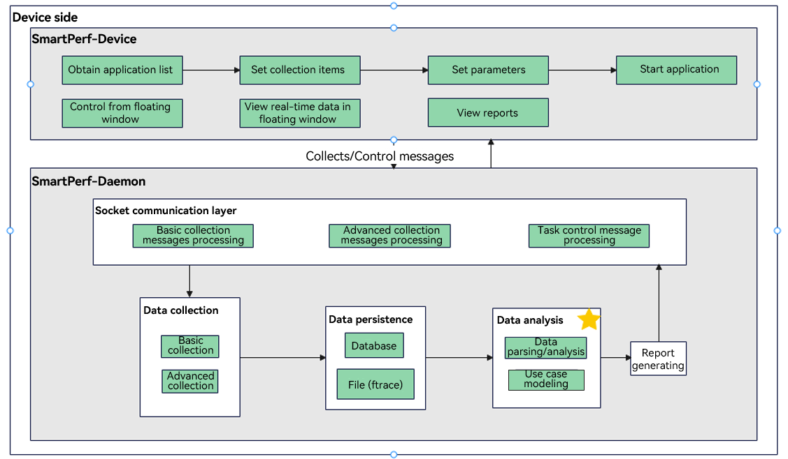
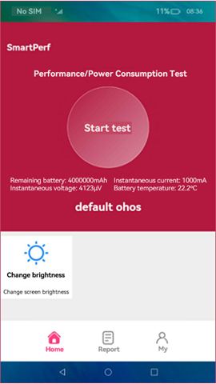
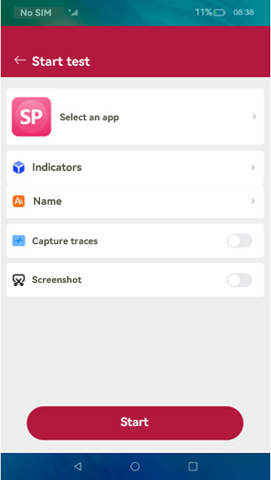
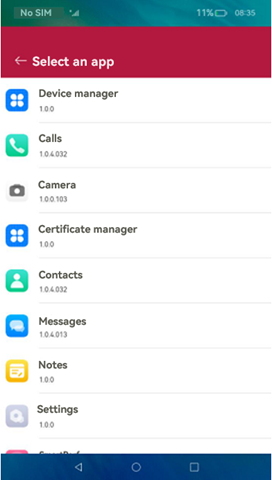
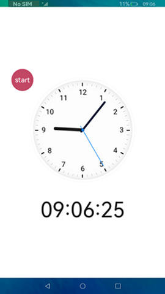
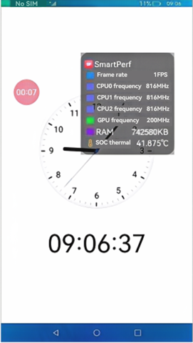
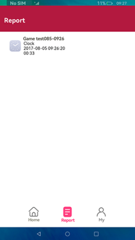
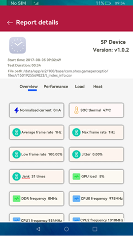

# SmartPerf Device User Guide

## Introduction

SmartPerf Device is a reliable, easy-to-use performance and power consumption test tool. In this tool, you can monitor the performance and power consumption of your application and device with quantitative indicators, such as FPS, CPU, GPU, RAM, and Temp.

Targeted at devices with or without screens, SmartPerf Device provides two modes: Device-hap and Device-daemon. Device-hap is applicable to devices with screens and provides a visualized, intuitive UI that simplifies your operations. You can start and pause a test with a floating window, view performance data in real time, and save the test results for further analysis. Device-daemon is applicable to devices with and without screens and works with shell commands.

### Indicators

- CPU: The tool reads the frequencies and usage of CPU cores on the test device on a per second basis to measure the CPU usage of the target application. Sustained high CPU may lead to overheating.
- GPU: The tool reads the GPU frequency and load information of the test device on a per second basis to measure the GPU usage of the target application. High GPU usage can lead to performance drops and application slowdowns.
- FPS: The tool reads the frame rate, in frames per second (FPS), of the target application to measure the smoothness of the application image. A higher FPS generally means smoother visuals.
- TEMP: The tool reads the temperature information of the test device on a per second basis, including the GPU temperature and system chip temperature.
- RAM: The tool reads the RAM usage of the target application on a per second basis.
- snapshot: The tool takes a screenshot of the application UI every 2 seconds.

## Principles

The figure below demonstrates the main functions of SmartPerf Device. Set data collection items and parameters on Device-hap, start the application, and then send data requests for KPIs (such as FPS, RAM, and Trace) from Device-hap to Device-daemon through messages. Device-daemon collects, persists, and analyzes data as requested, and then sends the data to Device-hap for display.



## Constraints

1. Device-daemon and <!--Del-->Device-hap <!--DelEnd-->are pre-installed since API version 9.<!--RP1--><!--RP1End-->

2. Device-daemon must be connected to a hardware device, and Device-hap can only be used on devices with a screen.

3. Before using Device-Daemon, configure the [hdc environment](../dfx/hdc.md).

<!--RP3-->
## SmartPerf Device-hap

The RK3568 development board is used as an example below.

### Obtaining the Application List

Start SmartPerf Device-hap. On the home screen, click **Select an app**.





### Setting Collection Parameters

After the target application is selected, return to the start page and set the test indicators. You can also change the test name (which includes the name of the target application and the test time and will be displayed in the report), and specify whether to capture traces and whether to enable the screenshot feature. When you are done, click the **Start** button at the bottom.

### Using the Floating Window to Manage Data Collection

To start collection, touch **Start** in the floating window. To pause, touch the timer in the floating window. To resume, touch the timer again. To view the collected data in real time, double-touch the timer. To stop, touch and hold the timer.<br>You can drag the floating window to anywhere you like.




### Viewing the Report

Click **Report** to access the report list. Touch a report to view its details.




## SmartPerf Device-daemon

### Collection Prerequisites

#### Switching to Shell

  ```
  C:\Users\issusser>hdc shell
  $
  ```

#### Starting and Viewing the daemon Process

  ```
  C:\Users\issusser>hdc shell
  // Start the daemon process.
  $ SP_daemon 
  // Check whether the daemon process is running.
  $ ps -ef | grep SP_daemon
  shell          1584     1 0 21:50:05 ?     00:00:00 SP_daemon
  shell          1595  1574 3 21:51:02 pts/0 00:00:00 grep SP_daemon
  $
  ```

#### Viewing the Help Information

  ```
  $ SP_daemon --help
  OpenHarmony performance testing tool SmartPerf command-line version
   Usage: SP_daemon [options] [arguments]
    
   options:
    -N              set the collection times(default value is 0) range[1,2147483647], for example: -N 10
    -PKG            set package name, must add, for example: -PKG ohos.samples.ecg
    -PID            set process pid, must add, for example: -PID 3568
    -threads        get threads, must add -PID or -PKG for example:
                    -threads -PID 3568 or -threads -PKG ohos.samples.ecg
    -fds            get file descriptor, must add -PID or -PKG for example:
                    -fds -PID 3568 or -fds -PKG ohos.samples.ecg
    -c              get device CPU frequency and CPU usage, process CPU usage and CPU load ..
    -ci             get cpu instructions and cycles
    -g              get device GPU frequency and GPU load
    -f              get app refresh fps(frames per second) and fps jitters and refreshrate
    -profilerfps    get refresh fps and timestamp
    -sections       set collection time period(using with profilerfps)
    -t              get remaining battery power and temperature..
    -p              get battery power consumption and voltage(Not supported by some devices)
    -print          start mode print log
    -r              get process memory and total memory
    -snapshot       get screen capture
    -net            get uplink and downlink traffic
    -start          collection start command
    -stop           collection stop command
    -VIEW           set layler, for example: -VIEW DisplayNode
    -OUT            set csv output path.
    -d              get device DDR information
    -screen         get screen resolution
    -deviceinfo     get device information
    -server         start a process to listen to the socket message of the start and stop commands
    -clear          clear the process ID
    -ohtestfps      used by the validator to obtain the fps, the collection times can be set
    -editorServer   start a process to listen to the socket message of the editor
    -recordcapacity get the battery level difference
    --version       get version
    --help          get help
    -editor         scenario-based collection identifier, parameter configuration items can be added later
    responseTime   get the page response delay after an application is operated
    completeTime   get the page completion delay after an application is operated
    fpsohtest      used by the validator to obtain the fps
    example1:
    SP_daemon -N 20 -c -g -t -p -r -net -snapshot -d
    SP_daemon -N 20 -PKG ohos.samples.ecg -c -g -t -p -f -r -net -snapshot -d
    SP_daemon -start -c
    SP_daemon -stop
    example2: These parameters need to be used separately
    SP_daemon -screen
    SP_daemon -deviceinfo
    SP_daemon -server
    SP_daemon -clear
    SP_daemon -ohtestfps 10
    SP_daemon -editorServer
    SP_daemon -recordcapacity
    example3: These parameters need to be used separately
    SP_daemon -editor responseTime ohos.samples.ecg app name
    SP_daemon -editor completeTime ohos.samples.ecg app name
    SP_daemon -editor fpsohtest
    
    
    
    command exec finished!
   $
  ```

### Basic Collection

#### Run the **-N** command to enable the collection

| Command  |Mandatory| Description                  |
| :-----| :-----| :--------------------- |
| -N    |Yes| Sets the number of collection times (once per second).   |
| -PKG  |No| Sets the bundle name.               |
| -PID  |No| Sets the process ID or thread ID.               |
| -threads  |No| Collects the number of child threads of an application.               |
| -fds  |No| Collects application file descriptors. This option is available only for the root user.               |
| -c    |No| Collects the CPU frequency and usage.<br>When the application bundle name is set, the system and application CPU information is collected.<br>Otherwise, only the system CPU information is collected.    |
| -ci    |No| Collects the number of CPU instructions.<br>When the application bundle name is set, the number of CPU instructions of the system and application is collected.<br>Otherwise, the number of CPU instructions of the system is collected.    |
| -g    |No| Collects the GPU frequency and load information.  |
| -f    |No| Collects the screen refresh rate and frame rate of the target application. The application bundle name must be specified.       |
| -t    |No| Collects the temperature of GPU and system chip.          |
| -r    |No| Collects the memory.<br>When the application bundle name is set, the system and application memory information is obtained.<br>Otherwise, only the system memory information is obtained.            |
| -snapshot |No| Takes a screenshot.            |
| -net |No| Collects the network speed.             |
| -VIEW |No| Sets the view layer. You must obtain the layer name first.               |
| -d    |No| Collects the DDR data.                |
| -sections|No| Sets segment-based collection.         |

##### Samples
- Collect the number of application threads once based on the bundle name.

  ```
    $ SP_daemon -N 1 -PKG ohos.samples.ecg -threads
 
    order:0 timestamp=1741415592481
    order:1 threadsNum=18847:113|
    order:2 tids=18847:43411 43409 43350 43236 25783 25622 25384 25381 19423 19170 19167 19166 19165 19163 19162 19159 19157 19156 19154 19153 19152 19151 19150 19149 19147 19146 19145 19142 19141 19140 19139 19136 19135 19134 19120 19112 19111 19088 19083 19081 19077 19076 19075 19074 19073 19072 19071 19070 19055 19044 19040 19039 19034 19033 19032 19031 19030 19029 19028 19027 19019 19017 19016 19015 19014 19013 19012 19011 19009 19007 19006 19005 19004 19003 19001 19000 18999 18998 18997 18996 18995 18994 18993 18992 18991 18990 18989 18988 18987 18986 18985 18984 18983 18982 18981 18980 18977 18974 18946 18942 18936 18934         18933 18931 18930 18929 18928 18927 18926 18925 18924 18923 18847|
 
    command exec finished!
    $
  ```

- Collect the frequency and usage of CPU cores twice.

  ```
    $ SP_daemon -N 2 -c

    order:0 timestamp=1501839064260
    order:1 TotalcpuUsage=0.502513
    order:2 TotalcpuidleUsage=99.497487
    order:3 TotalcpuioWaitUsage=0.000000
    order:4 TotalcpuirqUsage=0.000000
    order:5 TotalcpuniceUsage=0.000000
    order:6 TotalcpusoftIrqUsage=0.000000
    order:7 TotalcpusystemUsage=0.251256
    order:8 TotalcpuuserUsage=0.251256
    order:9 cpu0Frequency=1992000
    order:10 cpu0Usage=1.000000
    order:11 cpu0idleUsage=99.000000
    order:12 cpu0ioWaitUsage=0.000000
    order:13 cpu0irqUsage=0.000000
    order:14 cpu0niceUsage=0.000000
    order:15 cpu0softIrqUsage=0.000000
    order:16 cpu0systemUsage=0.000000
    order:17 cpu0userUsage=1.000000
    order:18 cpu1Frequency=1992000
    order:19 cpu1Usage=0.000000
    order:20 cpu1idleUsage=100.000000
    order:21 cpu1ioWaitUsage=0.000000
    order:22 cpu1irqUsage=0.000000
    order:23 cpu1niceUsage=0.000000
    order:24 cpu1softIrqUsage=0.000000
    order:25 cpu1systemUsage=0.000000
    order:26 cpu1userUsage=0.000000
    order:27 cpu2Frequency=1992000
    order:28 cpu2Usage=1.000000
    order:29 cpu2idleUsage=99.000000
    order:30 cpu2ioWaitUsage=0.000000
    order:31 cpu2irqUsage=0.000000
    order:32 cpu2niceUsage=0.000000
    order:33 cpu2softIrqUsage=0.000000
    order:34 cpu2systemUsage=1.000000
    order:35 cpu2userUsage=0.000000
    order:36 cpu3Frequency=1992000
    order:37 cpu3Usage=0.000000
    order:38 cpu3idleUsage=100.000000
    order:39 cpu3ioWaitUsage=0.000000
    order:40 cpu3irqUsage=0.000000
    order:41 cpu3niceUsage=0.000000
    order:42 cpu3softIrqUsage=0.000000
    order:43 cpu3systemUsage=0.000000
    order:44 cpu3userUsage=0.000000

    ...

    command exec finished!
    $
  ```

- Collect the frequency and usage of CPU cores and CPU usage and load of processes twice based on the bundle name.

  ```
    $ SP_daemon -N 2 -PKG ohos.samples.ecg -c


    order:0 timestamp=1741415021814
    order:1 ChildProcCpuLoad=NA
    order:2 ChildProcCpuUsage=NA
    order:3 ChildProcId=NA
    order:4 ChildProcSCpuUsage=NA
    order:5 ChildProcUCpuUsage=NA
    order:6 ProcAppName=ohos.samples.ecg
    order:7 ProcCpuLoad=2.742330
    order:8 ProcCpuUsage=7.825508
    order:9 ProcId=18847
    order:10 ProcSCpuUsage=2.014652
    order:11 ProcUCpuUsage=5.810856
    order:12 TotalcpuUsage=22.527016
    order:13 TotalcpuidleUsage=77.472984
    order:14 TotalcpuioWaitUsage=0.000000
    order:15 TotalcpuirqUsage=0.083126
    order:16 TotalcpuniceUsage=0.000000
    order:17 TotalcpusoftIrqUsage=0.000000
    order:18 TotalcpusystemUsage=7.148795
    order:19 TotalcpuuserUsage=15.295096
    order:20 cpu0Frequency=1430000
    order:21 cpu0Usage=52.475248
    order:22 cpu0idleUsage=47.524752
    order:23 cpu0ioWaitUsage=0.000000
    order:24 cpu0irqUsage=0.000000

    ...

    command exec finished!
    $
  ```

- Collect the frequency and usage of CPU cores and CPU usage and load of processes twice based on the process ID.

  ```
    $ SP_daemon -N 2 -PID 18847 -c
 
 
 
    order:0 timestamp=1741415133211
    order:1 ChildProcCpuLoad=NA
    order:2 ChildProcCpuUsage=NA
    order:3 ChildProcId=NA
    order:4 ChildProcSCpuUsage=NA
    order:5 ChildProcUCpuUsage=NA
    order:6 ProcAppName=ohos.samples.ecg
    order:7 ProcCpuLoad=2.510634
    order:8 ProcCpuUsage=7.005678
    order:9 ProcId=18847
    order:10 ProcSCpuUsage=2.697061
    order:11 ProcUCpuUsage=4.308617
    order:12 TotalcpuUsage=24.979114
    order:13 TotalcpuidleUsage=75.020886
    order:14 TotalcpuioWaitUsage=0.000000
    order:15 TotalcpuirqUsage=0.083542
    order:16 TotalcpuniceUsage=0.000000
    order:17 TotalcpusoftIrqUsage=0.000000
    order:18 TotalcpusystemUsage=8.270677
    order:19 TotalcpuuserUsage=16.624896
    order:20 cpu0Frequency=1430000
    order:21 cpu0Usage=50.000000
    order:22 cpu0idleUsage=50.000000
    order:23 cpu0ioWaitUsage=0.000000
    order:24 cpu0irqUsage=0.000000
    ...
    command exec finished!
    $
  ```
  >**NOTE**
  >
  >- Make sure you are on the application screen when running this command.

- Collect the GPU frequency and load of the system once.
 
  ```
    $ SP_daemon -N 1 -g
    
    
    
    order:0 timestamp=1503078740268
    order:1 gpuFrequency=200000000
    order:2 gpuLoad=38.000000
    
    command exec finished!
    $
  ```

- Collect the system temperature twice.

  ```
    $ SP_daemon -N 2 -t

    order:0 timestamp=1502720711191
    order:1 gpu-thermal=42500.000000
    order:2 soc-thermal=43.125000
    
    
    order:0 timestamp=1502720712191
    order:1 gpu-thermal=41875.000000
    order:2 soc-thermal=42.500000

    command exec finished!
    $
  ```

- Collect the memory information of the system twice.

  ```
    $ SP_daemon -N 2 -r
    order:0 timestamp=1705041562521
    order:1 memAvailable=7339224
    order:2 memFree=7164708
    order:3 memTotal=11641840

    order:0 timestamp=1705041563527
    order:1 memAvailable=7339136
    order:2 memFree=7164684
    order:3 memTotal=11641840

    command exec finished!
    $
  ```

- Collect the memory of the system and specified application process once based on the bundle name.

  ```
    $ SP_daemon -N 1 -PKG ohos.samples.ecg -r
 
 
 
    order:0 timestamp=1741415257059
    order:1 arktsHeapPss=44835
    order:2 childCarktsHeapPss=NA
    order:3 childGpuPss=NA
    order:4 childGraphicPss=NA
    order:5 childHeapAlloc=NA
    order:6 childHeapFree=NA
    order:7 childHeapSize=NA
    order:8 childNativeHeapPss=NA
    order:9 childPrivateClean=NA
    order:10 childPrivateDirty=NA
    order:11 childPss=NA
    order:12 childSharedClean=NA
    order:13 childSharedDirty=NA
    order:14 childStackPss=NA
    order:15 childSwap=NA
    order:16 childSwapPss=NA
    order:17 gpuPss=222377
    order:18 graphicPss=184276
    order:19 heapAlloc=154696
    order:20 heapFree=780
    order:21 heapSize=163208
    order:22 memAvailable=4612096
    order:23 memFree=1240924
    order:24 memTotal=11692696
    order:25 nativeHeapPss=85290
    order:26 privateClean=195816
    order:27 privateDirty=418973
    order:28 pss=693349
    order:29 sharedClean=146848
    order:30 sharedDirty=71056
    order:31 stackPss=2492
    order:32 swap=25360
    order:33 swapPss=25356

    command exec finished!
    $
  ```

- Collect the memory of the system and specified application process once based on the process ID.

  ```
    $ SP_daemon -N 1 -PID 18847 -r
 
 
 
    order:0 timestamp=1741415293198
    order:1 arktsHeapPss=45011
    order:2 childCarktsHeapPss=NA
    order:3 childGpuPss=NA
    order:4 childGraphicPss=NA
    order:5 childHeapAlloc=NA
    order:6 childHeapFree=NA
    order:7 childHeapSize=NA
    order:8 childNativeHeapPss=NA
    order:9 childPrivateClean=NA
    order:10 childPrivateDirty=NA
    order:11 childPss=NA
    order:12 childSharedClean=NA
    order:13 childSharedDirty=NA
    order:14 childStackPss=NA
    order:15 childSwap=NA
    order:16 childSwapPss=NA
    order:17 gpuPss=222381
    order:18 graphicPss=184276
    order:19 heapAlloc=154588
    order:20 heapFree=757
    order:21 heapSize=163184
    order:22 memAvailable=4612096
    order:23 memFree=1238420
    order:24 memTotal=11692696
    order:25 nativeHeapPss=85274
    order:26 privateClean=195996
    order:27 privateDirty=418977
    order:28 pss=693440
    order:29 sharedClean=146848
    order:30 sharedDirty=71056
    order:31 stackPss=2492
    order:32 swap=25360
    order:33 swapPss=25356

    command exec finished!
    $
  ```
  >**NOTE**
  >
  >- Make sure you are on the application screen when running this command.
  >- This command integrates the **-m** command of earlier version, which obtains data such as **arktsHeapPss**, **gpuPss**, **graphicPss**.

- Collect the number of CPU instructions of the system once.

  ```
    $ SP_daemon -N 1 -ci

    order:0 cycles per instruction=4.098151
    order:1 hw-cpu-cycles=190604622.000000
    order:2 hw-instructions=46509906.000000
    order:3 timestamp=1609502927840
    command exec finished!
    $
  ```

- Collect the number of CPU instructions of the system and specified application once based on the bundle name.

  ```
    $ SP_daemon -N 1 -PKG ohos.samples.ecg -ci

    order:0 cycles per instruction=4.121963
    order:1 hw-cpu-cycles=190092457.000000
    order:2 hw-instructions=46116973.000000
    order:3 timestamp=1609502995191
    command exec finished!
    $
  ```
  >**NOTE**
  >
  >- Make sure you are on the application screen when running this command.

- Take two screenshots.

  ```
    $ SP_daemon -N 2 -snapshot

    order:0 timestamp=1501837609657
    order:1 capture=data/local/tmp/capture/screenCap_1501837609657.png
    
    
    order:0 timestamp=1501837610657
    order:1 capture=NA

    command exec finished!
    $
  ```
  >**NOTE**
  >
  >- Screenshots are obtained every 2 seconds.
  >
  >- When the collection is complete, you can view the screenshots in **data/local/tmp/capture**.
  >
  >- To export the screenshots to drive D, open a new CLI and run the hdc file recv data/local/tmp/capture/screenCap_1700725192774.png D:\\ command.

- Collect the network speeds twice.

  ```
    $ SP_daemon -N 2 -net

    order:0 timestamp=1705041904832
    order:1 networkDown=0
    order:2 networkUp=0

    order:0 timestamp=1705041905870
    order:1 networkDown=22931
    order:2 networkUp=2004

    command exec finished!
    $
  ```

- Collect the frame rate of a specified application five times based on the bundle name.

  ```
    $ SP_daemon -N 5 -PKG ohos.samples.ecg -f

    order:0 timestamp=1705306472232
    order:1 fps=43
    order:2 fpsJitters=602261688;;8352083;;8267708;;8305209;;8298437;;8308854;;8313542;;8569271;;8061458;;8300521;;8308333;;8309896;;8429167;;8241667;;8258333;;8318229;;8312500;;8304167;;41760937;;16418750;;8298959;;8319270;;8308334;;8313541;;8302605;;8320312;;8298958;;8326042;;8321354;;8301042;;8310417;;8309895;;8308855;;8331250;;8286458;;8343229;;8278125;;8311458;;8306250;;8312500;;8320834;;8346875;;8283333
    order:3 refreshrate=69

    order:0 timestamp=1705306473234
    order:1 fps=40
    order:2 fpsJitters=674427313;;8191145;;8310417;;8319271;;8301562;;8318750;;8302084;;8314062;;8333334;;8283854;;8307812;;8311979;;8310417;;8307813;;8309375;;8323958;;8306250;;8308333;;8317709;;8296875;;8721875;;7895833;;8320833;;8340625;;8276563;;8409896;;8216145;;8310938;;8301042;;8362500;;8252604;;8317708;;8376042;;8256250;;8292187;;8303125;;8313542;;8310417;;8520312
    order:3 refreshrate=69
    ...

    command exec finished!
    $
  ```
 
- Collect the frame rate of the specified view layer for 10 times.

  ```
    $ SP_daemon -N 10 -VIEW DisplayNode -f
    order:0 timestamp=1705306822850
    order:1 fps=15
    order:2 fpsJitters=876291843;;8314062;;8308334;;8314583;;8310417;;8308333;;8326042;;8314583;;8292708;;8492709;;8143750;;8340104;;8294271;;8302604;;8297396
    order:3 refreshrate=69
     
    order:0 timestamp=1705306823852
    order:1 fps=12
    order:2 fpsJitters=906667363;;8279167;;8311458;;8315625;;8291146;;8313021;;8323438;;8293750;;8303125;;8313541;;8301563;;8317708
    order:3 refreshrate=69
    ...
    
    command exec finished!
    $
  ```
  >**NOTE**
  >
  >- **DisplayNode** indicates the name of the specified layer.
  >
  >- When using this command to collect data, you need to operate the page on the specified layer.
  >
  >- This command cannot be used together with the commands used to collect frame rate of a specified application, such as the **SP_daemon -N 20 -PKG ohos.samples.ecg -f** or **SP_daemon -N 20 -VIEW DisplayNode -f** commands.

- Collect DDR information once.

  ```
    $ SP_daemon -N 1 -d
    
    order:0 timestamp=1710916175201
    order:1 ddrFrequency=1531000000
    
    command exec finished!
    $
  ```

- Example 1: Collect the full information of the system, including the CPU, GPU, temperature, memory, DDR, network speed, and screenshot information.
 
  ```
    $ SP_daemon -N 10 -c -g -t -r -d -net -snapshot

    order:0 timestamp=1501837838664
    order:1 TotalcpuUsage=0.751880
    order:2 TotalcpuidleUsage=99.248120
    order:3 TotalcpuioWaitUsage=0.000000
    order:4 TotalcpuirqUsage=0.000000
    order:5 TotalcpuniceUsage=0.000000
    order:6 TotalcpusoftIrqUsage=0.000000
    order:7 TotalcpusystemUsage=0.501253
    order:8 TotalcpuuserUsage=0.250627
    order:9 cpu0Frequency=1992000
    order:10 cpu0Usage=0.000000
    order:11 cpu0idleUsage=100.000000
    order:12 cpu0ioWaitUsage=0.000000
    order:13 cpu0irqUsage=0.000000
    order:14 cpu0niceUsage=0.000000
    order:15 cpu0softIrqUsage=0.000000
    order:16 cpu0systemUsage=0.000000
    order:17 cpu0userUsage=0.000000
    order:18 cpu1Frequency=1992000
    order:19 cpu1Usage=0.000000
    order:20 cpu1idleUsage=100.000000
    order:21 cpu1ioWaitUsage=0.000000
    order:22 cpu1irqUsage=0.000000
    order:23 cpu1niceUsage=0.000000
    order:24 cpu1softIrqUsage=0.000000
    order:25 cpu1systemUsage=0.000000
    order:26 cpu1userUsage=0.000000
    order:27 cpu2Frequency=1992000
    order:28 cpu2Usage=1.000000
    order:29 cpu2idleUsage=99.000000
    order:30 cpu2ioWaitUsage=0.000000
    order:31 cpu2irqUsage=0.000000
    order:32 cpu2niceUsage=0.000000
    order:33 cpu2softIrqUsage=0.000000
    order:34 cpu2systemUsage=1.000000
    order:35 cpu2userUsage=0.000000
    order:36 cpu3Frequency=1992000
    order:37 cpu3Usage=0.000000
    order:38 cpu3idleUsage=100.000000
    order:39 cpu3ioWaitUsage=0.000000
    order:40 cpu3irqUsage=0.000000
    order:41 cpu3niceUsage=0.000000
    order:42 cpu3softIrqUsage=0.000000
    order:43 cpu3systemUsage=0.000000
    order:44 cpu3userUsage=0.000000
    order:45 gpuFrequency=200000000
    order:46 gpuLoad=0.000000
    order:47 gpu-thermal=40000.000000
    order:48 soc-thermal=40.625000
    order:49 memAvailable=1142820
    order:50 memFree=687988
    order:51 memTotal=1935948
    order:52 ddrFrequency=800000000
    order:53 networkDown=0
    order:54 networkUp=0
    order:55 capture=data/local/tmp/capture/screenCap_1501837838669.png

    ...

    command exec finished!
    $
  ```

- Example 2: Collect the full information of the specified application based on the bundle name, including the CPU, GPU, temperature, frame rate, memory, DDR, network speed, and screenshot information.
 
  ```
    $ SP_daemon -N 10 -PKG ohos.samples.ecg -c -g -t -f -r -d -net -snapshot -threads
    
    order:0 timestamp=1741415955626
    order:1 ChildProcCpuLoad=NA
    order:2 ChildProcCpuUsage=NA
    order:3 ChildProcId=NA
    order:4 ChildProcSCpuUsage=NA
    order:5 ChildProcUCpuUsage=NA
    order:6 ProcAppName=ohos.samples.ecg
    order:7 ProcCpuLoad=2.641511
    order:8 ProcCpuUsage=6.026481
    order:9 ProcId=18847
    order:10 ProcSCpuUsage=1.747202
    order:11 ProcUCpuUsage=4.279279
    order:12 TotalcpuUsage=26.021798
    order:13 TotalcpuidleUsage=73.978202
    order:14 TotalcpuioWaitUsage=0.000000
    order:15 TotalcpuirqUsage=0.068120
    order:16 TotalcpuniceUsage=0.000000
    order:17 TotalcpusoftIrqUsage=0.000000
    order:18 TotalcpusystemUsage=10.762943
    order:19 TotalcpuuserUsage=15.190736
    ...
    order:123 gpuFrequency=279000000
    order:124 gpuLoad=0.000000
    order:125 Battery=35.000000
    order:126 cluster0=51.000000
    order:127 gpu=47.000000
    order:128 npu_thermal=35.000000
    order:129 shell_back=36.627000
    order:130 shell_frame=35.627000
    order:131 shell_front=35.652000
    order:132 soc_thermal=59.259000
    order:133 system_h=37.000000
    order:134 fps=30
    order:135 fpsJitters=33501562;;50251042;;33522396;;16743750;;33482812;;33505730;;33507291;;33505209;;33502604;;50258854;;33518229;;33501563;;16753125;;50247916;;16751563;;33507812;;16740104;;16792188;;33464583;;33497917;;50261458;;33493750;;33511459;;33502083;;16744271;;16756250;;33505729;;50254687;;33507292;;50286979
    order:136 refreshrate=60
    order:137 arktsHeapPss=29564
    order:138 gpuPss=254647
    order:139 graphicPss=215796
    order:140 heapAlloc=174032
    order:141 heapFree=1232
    order:142 heapSize=187924
    order:143 memAvailable=3437568
    order:144 memFree=780152
    order:145 memTotal=11697880
    order:146 nativeHeapPss=91244
    order:147 privateClean=162560
    order:148 privateDirty=488739
    order:149 pss=761908
    order:150 sharedClean=225060
    order:151 sharedDirty=48740
    order:152 stackPss=2596
    order:153 swap=62024
    order:154 swapPss=62024
    order:155 ddrFrequency=1531000000
    order:156 networkDown=215
    order:157 networkUp=0
    ...
    order:180 capture=data/local/tmp/capture/screenCap_1741415955811.png
    order:181 threadsNum=18847:111|
    order:182 tids=18847:45862 45700 25783 25622 25384 25381 19423 19170 19167 19166 19165 19163 19162 19159 19157 19156 19154 19153 19152 19151 19150 19149 19147 19146 19145 19142 19141 19140 19139 19136 19135 19134 19120 19112 19111 19088 19083 19081 19077 19076 19075 19074 19073 19072 19071 19070 19055 19044 19040 19039 19034 19033 19032 19031 19030 19029 19028 19027 19019 19017 19016 19015 19014 19013 19012 19011 19009 19007 19006 19005 19004 19003 19001 19000 18999 18998 18997 18996 18995 18994 18993 18992 18991 18990 18989 18988 18987 18986 18985 18984 18983 18982 18981 18980 18977 18974 18946 18942 18936 18934 18933 18931 18930 18929 18928 18927 18926 18925 18924 18923 18847|
    ...
    
    command exec finished!
    $
  ```

- Example 3: Collect the full information of the specified application based on the process ID, including the CPU, GPU, temperature, frame rate, memory, DDR, network speed, and screenshot information.
 
  ```
    $ SP_daemon -N 10 -PID 18847 -c -g -t -f -r -d -net -snapshot -threads
    
    order:0 timestamp=1741416084766
    order:1 ChildProcCpuLoad=NA
    order:2 ChildProcCpuUsage=NA
    order:3 ChildProcId=NA
    order:4 ChildProcSCpuUsage=NA
    order:5 ChildProcUCpuUsage=NA
    order:6 ProcAppName=ohos.samples.ecg
    order:7 ProcCpuLoad=2.857003
    order:8 ProcCpuUsage=5.932203
    order:9 ProcId=18847
    order:10 ProcSCpuUsage=1.765537
    order:11 ProcUCpuUsage=4.166667
    order:12 TotalcpuUsage=28.442728
    order:13 TotalcpuidleUsage=71.557272
    order:14 TotalcpuioWaitUsage=0.000000
    order:15 TotalcpuirqUsage=0.000000
    order:16 TotalcpuniceUsage=0.000000
    order:17 TotalcpusoftIrqUsage=0.000000
    order:18 TotalcpusystemUsage=9.716860
    order:19 TotalcpuuserUsage=18.725869
    ...
    order:123 gpuFrequency=279000000
    order:124 gpuLoad=0.000000
    order:125 Battery=35.000000
    order:126 cluster0=51.000000
    order:127 gpu=47.000000
    order:128 npu_thermal=35.000000
    order:129 shell_back=36.627000
    order:130 shell_frame=35.627000
    order:131 shell_front=35.652000
    order:132 soc_thermal=59.259000
    order:133 system_h=37.000000
    order:134 fps=30
    order:135 fpsJitters=33501562;;50251042;;33522396;;16743750;;33482812;;33505730;;33507291;;33505209;;33502604;;50258854;;33518229;;33501563;;16753125;;50247916;;16751563;;33507812;;16740104;;16792188;;33464583;;33497917;;50261458;;33493750;;33511459;;33502083;;16744271;;16756250;;33505729;;50254687;;33507292;;50286979
    order:136 refreshrate=60
    order:137 arktsHeapPss=29564
    order:138 gpuPss=254647
    order:139 graphicPss=215796
    order:140 heapAlloc=174032
    order:141 heapFree=1232
    order:142 heapSize=187924
    order:143 memAvailable=3437568
    order:144 memFree=780152
    order:145 memTotal=11697880
    order:146 nativeHeapPss=91244
    order:147 privateClean=162560
    order:148 privateDirty=488739
    order:149 pss=761908
    order:150 sharedClean=225060
    order:151 sharedDirty=48740
    order:152 stackPss=2596
    order:153 swap=62024
    order:154 swapPss=62024
    order:155 ddrFrequency=1531000000
    order:156 networkDown=215
    order:157 networkUp=0
    ...
    order:180 capture=data/local/tmp/capture/screenCap_1741416084923.png
    order:181 threadsNum=18847:113|
    order:182 tids=18847:46736 46734 46731 46663 25783 25622 25384 25381 19423 19170 19167 19166 19165 19163 19162 19159 19157 19156 19154 19153 19152 19151 19150 19149 19147 19146 19145 19142 19141 19140 19139 19136 19135 19134 19120 19112 19111 19088 19083 19081 19077 19076 19075 19074 19073 19072 19071 19070 19055 19044 19040 19039 19034 19033 19032 19031 19030 19029 19028 19027 19019 19017 19016 19015 19014 19013 19012 19011 19009 19007 19006 19005 19004 19003 19001 19000 18999 18998 18997 18996 18995 18994 18993 18992 18991 18990 18989 18988 18987 18986 18985 18984 18983 18982 18981 18980 18977 18974 18946 18942 18936 18934 18933 18931 18930 18929 18928 18927 18926 18925 18924 18923 18847|
    ...
    
    command exec finished!
    $
  ```
  >**NOTE**
  >
  >- Make sure you are on the application screen when running this command.


#### Run the **-start** command to start the collection

Run the **start** command to start collection, operate the device or application, and then run the **stop** command to stop collection.

| Command  |Mandatory| Description                  |
| :-----|:-----| :--------------------- |
| -start |Yes| Starts collection. You can add a basic collection command after this command parameter. The collection is performed every second.           |
| -stop |Yes| Stops collection. A report is generated when collection is complete.             |
| -print |No| Prints collection information every second.             |

##### Samples
  
- Start and stop collecting the frequency and usage of CPU cores.

   ```
   # Start data collection
   $ SP_daemon -start -c
   SP_daemon Collection begins
    
    
   command exec finished!
   $
      
   # Stop data collection
   $ SP_daemon -stop
   SP_daemon Collection ended
   Output Path: data/local/tmp/smartperf/1/t_index_info.csv
    
    
   command exec finished!
   $
   ```

- Start and stop collecting the frequency and usage of CPU cores and print the information.

   ```
    # Start data collection
    # Start printing the collection information
    $ SP_daemon -start -c -print
    SP_daemon Collection begins
    
    order:0 TotalcpuUsage=20.860927
    order:1 TotalcpuidleUsage=79.139073
    order:2 TotalcpuioWaitUsage=0.000000
    order:3 TotalcpuirqUsage=0.082781
    order:4 TotalcpuniceUsage=0.000000
    order:5 TotalcpusoftIrqUsage=0.000000
    order:6 TotalcpusystemUsage=8.029801
    order:7 TotalcpuuserUsage=12.748344
    order:8 cpu0Frequency=1430000
    order:9 cpu0Usage=44.554455
    order:10 cpu0idleUsage=55.445545
    order:11 cpu0ioWaitUsage=0.000000
    order:12 cpu0irqUsage=0.000000
    order:13 cpu0niceUsage=0.000000
    order:14 cpu0softIrqUsage=0.000000
    order:15 cpu0systemUsage=17.821782
    order:16 cpu0userUsage=26.732673
    order:17 cpu10Frequency=1239000
    order:18 cpu10Usage=0.000000
    order:19 cpu10idleUsage=100.000000
    order:20 cpu10ioWaitUsage=0.000000
    order:21 cpu10irqUsage=0.000000
    order:22 cpu10niceUsage=0.000000
    order:23 cpu10softIrqUsage=0.000000
    order:24 cpu10systemUsage=0.000000
    order:25 cpu10userUsage=0.000000
    order:26 cpu11Frequency=1239000
    order:27 cpu11Usage=0.000000
    order:28 cpu11idleUsage=100.000000
    order:29 cpu11ioWaitUsage=0.000000
    order:30 cpu11irqUsage=0.000000
    order:31 cpu11niceUsage=0.000000
    order:32 cpu11softIrqUsage=0.000000
    order:33 cpu11systemUsage=0.000000
    order:34 cpu11userUsage=0.000000
    ...
    command exec finished!
    $
      
    # Stop data collection
    # To stop printing, you need to open the CLI and run the following command:
    $ SP_daemon -stop
    SP_daemon Collection ended
    Output Path: data/local/tmp/smartperf/1/t_index_info.csv
    
    command exec finished!
    $
   ```
   >**NOTE**
   >
   >- Example 1: Run the **SP_daemon -start -c -g -t -r -d -net -snapshot** command to collect the CPU, GPU, temperature, frame rate, memory, DDR, network rate, and screenshot information of the system.
   >
   >- Example 2: Run the **SP_daemon -start -PKG ohos.samples.ecg -c -g -t -f -r -d -net -snapshot -threads -fd** command to collect the CPU load, GPU, temperature, frame rate, memory, DDR, network rate, screenshot, number of threads, and file descriptor information of the system and processes.
   >
   >- Example 3: Run the **SP_daemon -start -PID 18847 -c -g -t -f -r -d -net -snapshot -threads -fd** command to collect the CPU load, GPU, temperature, frame rate, memory, DDR, network rate, screenshot, number of threads, and file descriptor information of the system and processes.
   >
   >- Example 4: Run the **SP_daemon -start -c -g -t -r -d -net -snapshot -threads -fd -print** command to collect and print the CPU, GPU, temperature, frame rate, memory, DDR, network rate, screenshot, number of threads, and file descriptor information of the system.
   >
   >- Example 5: Run the **SP_daemon -start -PID 18847 -c -g -t -f -r -d -net -snapshot -threads -fd -print** command to collect and print the CPU load, GPU, temperature, frame rate, memory, DDR, network rate, screenshot, number of threads, and file descriptor information of the system and processes.
   >
   >- The service start and stop file is stored in **data/local/tmp/smartperf/1/t_index_info.csv**. You can run the **hdc file recv** command to export the report. For details, see [Viewing Collection Result in the CSV File](#viewing-collection-result-in-the-csv-file).

#### Viewing Collection Result in the CSV File

If the collection result is saved in a CSV file, perform the following steps to export and view the result:

  - By default, the collection results are saved to **/data/local/tmp/data.csv**.

  - To check the path to the test result file:

    ```
    C:\Users\issusser>hdc shell
    $ cd data/local/tmp
    # ls
    data.csv
    $
    ```

  - To export the test result file:
    ```
    C:\Users\issusser>hdc file recv data/local/tmp/data.csv D:\
    [I][2023-11-08 16:16:41] HdcFile::TransferSummary success
    FileTransfer finish, Size:429, File count = 1, time:6ms rate:71.50kB/s

    C:\Users\issusser>
    ```

  - Open the **data.csv** file to view the collected data.

    The table below describes the data fields in the **data.csv** file.

    | Data Field   | Description            |Remarks|
    | :-----| :--------------------- |:-----|
    | threadsNum              | Total number of threads.             |-|
    | tids                    | Thread ID.               |-|
    | fdTotal                 | Total number of file descriptors.        |-|
    | fds                     | File descriptor.            |Unit: Hz|
    | cpuFrequency            | CPU core frequency.       |Unit: Hz|
    | cpuUasge                | CPU core usage.         |%|
    | cpuidleUsage            | CPU usage in idle state.       |%|
    | cpuioWaitUsage          | CPU usage of I/O wait.       |%|
    | cpuirqUsage             | CPU usage of hardware interrupts.        |%|
    | cpuniceUsage            | CPU usage of user level processes with lower scheduling priority.   |%|
    | cpusoftIrqUsage         | CPU usage of software interrupts.        |%|
    | cpusystemUsage          | CPU usage in kernel mode.     |%|
    | cpuuserUsage            | CPU usage in user mode.          |%|
    | ProcId                  | Process ID.               |-|
    | ChildProcId             | Child process ID.               |-|
    | ProcAppName             | Application bundle name.               |-|
    | ProcCpuLoad             | Process CPU load.       |%|
    | ChildProcCpuLoad        | CPU load of the child process.       |%|
    | ProcCpuUsage            | CPU usage of the process.         |%|
    | ChildProcCpuUsage       | CPU usage of the child process.         |%|
    | ProcUCpuUsage           | CPU usage of the process in user mode.    |%|
    | ChildProcCpuUsage       | CPU usage of the child process in user mode.         |%|
    | ProcSCpuUsage           | CPU usage of the process in kernel mode.    |%|
    | ChildProcSCpuUsage      | CPU usage of the child process in kernel mode.    |%|
    | gpuFrequency            | GPU frequency of the system.         |%|
    | gpuLoad                 | GPU load of the system.     |%|
    | hw-instructions         | Number of executed instructions.         |-|
    | cycles per instruction  | Average number of cycles per instruction.   |Unit: ns|
    | hw-cpu-cycles           | Number of CPU clock cycles.         |Unit: ns|
    | currentNow              | Current value.      |Unit: mA|
    | voltageNow              | Voltage value.      |Unit: μV|
    | fps                     | Number of frames per second.             |Unit: FPS|
    | fpsJitters              | Frame interval.       |Unit: ns|
    | refreshrate             | Screen refresh rate.           |Unit: Hz|
    | networkDown             | Downstream rate.             |Unit: byte/s|
    | networkUp               | Uplink rate.             |Unit: byte/s|
    | ddrFrequency            | DDR frequency.              |Unit: Hz|
    | gpu-thermal             | GPU temperature.             |Unit: °C|
    | soc-thermal             | SoC temperature.         |Unit: °C|
    | memAvailable            | Available memory of the system.        |Unit: KB|
    | memFree                 | Free memory of the system.        |Unit: KB|
    | memTotal                | Total memory of the system.          |Unit: KB|
    | pss                     | Proportional set size (PSS) of the process.     |Unit: KB|
    | Childpss                | Proportional set size (PSS) of the child process.     |Unit: KB|
    | sharedClean             | Shared unwritten pages of the process.     |Unit: KB|
    | ChildsharedClean        | Shared unwritten pages of the child process.     |Unit: KB|
    | sharedDirty             | Shared rewritten pages of the process.     |Unit: KB|
    | ChildsharedDirty        | Shared rewritten pages of the child process.     |Unit: KB|
    | priviateClean           | Private unwritten pages of the process.     |Unit: KB|
    | ChildpriviateClean      | Private unwritten pages of the child process.     |Unit: KB|
    | privateDirty            | Private rewritten pages of the process.     |Unit: KB|
    | ChildprivateDirty       | Private rewritten pages of the child process.     |Unit: KB|
    | swapTotal               | Total swap memory of the process.         |Unit: KB|
    | ChildswapTotal          | Total swap memory of the child process.         |Unit: KB|
    | swapPss                 | Swapped PSS of the process.       |Unit: KB|
    | ChildswapPss            | Swapped PSS of the child process.       |Unit: KB|
    | HeapSize                | Heap size of the process.          |Unit: KB|
    | ChildHeapSize           | Heap size of the child process.          |Unit: KB|
    | HeapAlloc               | Heap size that can be allocated of the process.   |Unit: KB|
    | ChildHeapAlloc          | Heap size that can be allocated of the child process.   |Unit: KB|
    | HeapFree                | Remaining heap size of the process.     |Unit: KB|
    | ChildHeapFree           | Remaining heap size of the child process.     |Unit: KB|
    | gpuPss                  | Used GPU size of the process.    |Unit: KB|
    | ChildgpuPss             | Used GPU size of the child process.    |Unit: KB|
    | graphicPss              | Used graphics memory size of the process.    |Unit: KB|
    | ChildgraphicPss         | Used graphics memory size of the child process.    |Unit: KB|
    | arktsHeapPss            | Used ArkTS memory size of the process.   |Unit: KB|
    | ChildarktsHeapPss       | Used ArkTS memory size of the child process.   |Unit: KB|
    | nativeHeapPss           | Used native memory size of the process.  |Unit: KB|
    | ChildnativeHeapPss      | Used native memory size of the child process.  |Unit: KB|
    | stackPss                | Used stack memory size of the process.      |Unit: KB|
    | ChildstackPss           | Used stack memory size of the child process.      |Unit: KB|
    | timeStamp               | Timestamp.           |Collection time.|

### Scenario Collection

In addition to basic collection, the response and completion delay can be collected. The scenario collection result is displayed in the CLI instead of being written into the **data.csv** file.

| Command  |Mandatory| Description                  |
| :-----|:-----| :--------------------- |
| -editor|Yes|    Identifies scenario collection. Parameter options can be added after.        |
| -responseTime|No|    Collects the response latency.        |
| -completeTime|No|    Collects the completion delay.        |
| -fpsohtest|No|    A validator used to collect the frame rate every second. The frame rate is collected 10 times by default.      |

#### Samples

- Collect the application response latency. (This command supports only the RK3568 device.)

  ```
   $ SP_daemon -editor responseTime ohos.samples.ecg ohtest
   time:544ms

   command exec finished!
  ```
  >**NOTE**
  >
  >- Open the application before collection, press **Enter** in the CLI, switch to the application page, and wait for the collection result to be printed.

- Collect the application completion latency. (This command supports only the RK3568 device.)

  ```
   $ SP_daemon -editor completeTime ohos.samples.ecg ohtest
   time:677ms

   command exec finished!
  ```
  >**NOTE**
  >
  >- Open the application before collection, press **Enter** in the CLI, switch to the application page, and wait for the collection result to be printed.

- Use the validator to obtain the application page frame rate.

  ```
   $ SP_daemon -editor fpsohtest
   set num:10 successfps:0|1726909713442fps:97|1726909714442fps:113|1726909715442fps:116|1726909716442fps:116|1726909717442fps:118|1726909718442fps:114|1726909719442fps:114|1726909720442fps:115|1726909721442fps:118|1726909722442SP_daemon exec finished!
  ```
  >**NOTE**
  >
  >- You need to swipe or switch the current page after running the command, and the collection result will be printed after 10s.

### Other Collection

The power collection result of the current device can be written into the **data.csv** file. Other data is collected separately and the collection result is displayed only in the command box.

| Command  |Mandatory| Description                  |
| :-----|:-----| :--------------------- |
| -screen |No| Collects the screen resolution and refresh rate.              |
| -deviceinfo|No| Obtains device information.             |
| -server|No|    Starts a daemon process by starting or stopping collection.          |
| -clear|No|    Clears all the SP_daemon processes.          |
| -ohtestfps|No|    Obtains the frame rate. You can set the number of collection times (collection is performed every second).         |
| -editorServer|No|    Starts a daemon process by using an editor.        |
| -recordcapacity|No|    Obtains the battery level of the current device.        |
| -profilerfps |No| Collects the frame rate of the current page.         |

#### Samples

- Obtain the screen resolution.

  ```
   $ SP_daemon -screen
   activeMode: 720x1280, refreshrate=69
    
    
   command exec finished!
   $
  ```
  >**NOTE**
  >
  >- **activeMode** indicates the current screen resolution, and **refreshrate** indicates the screen refresh rate.

- Obtain the device information.

  ```
   $ SP_daemon -deviceinfo
   abilist: default
   activeMode: 720x1280
   board: hw
   brand: default
   cpu_c1_cluster: 0 1 2 3
   cpu_c1_max: 1992000
   cpu_c1_min: 408000
   cpu_cluster_name: policy0
   daemonPerfVersion: 1.0.5
   deviceTypeName: rk3568
   fullname: OpenHarmony-5.1.0.46
   gpu_max_freq: 800000000
   gpu_min_freq: 200000000
   model: ohos
   name: OpenHarmony 3.2
   sn: 150100424a5444345209d941bec6b900
   version: OpenHarmony 5.1.0.46
    
   command exec finished!
   $
  ```

- Start a process to listen for the socket messages of the **start** and **stop** commands.

  ```
   $ SP_daemon -server
   $
   $ pidof SP_daemon
   7024
   $
  ```
  >**NOTE**
  >
  >- You can run the **pidof SP_daemon** command to view the process ID.

- Clear the SP_daemon process ID.

  ```
   $ pidof SP_daemon
   2725   
   $ SP_daemon -clear
    
    
   command exec finished!
   $
   $ pidof SP_daemon
   $
  ```
  >**NOTE**
  >
  >- You can run the **pidof SP_daemon** command to view the process ID.

- Obtain the frame rate of the current page using a validator.

  ```
   $ SP_daemon -ohtestfps 10
   set num:10 success
   fps:1|1501926684532
   fps:18|1501926685532
   fps:37|1501926686532
   fps:41|1501926687532
   fps:42|1501926688532
   fps:16|1501926689532
   fps:40|1501926690532
   fps:40|1501926691532
   fps:42|1501926692532
   fps:41|1501926693532
   SP_daemon exec finished!
   $
  ```
  >**NOTE**
  >
  >- In this command, **10** indicates the number of collection times (collection is performed every second). You can set it to a positive integer.


- Start a process to listen for the socket messages of the editor tool.

  ```
   $ SP_daemon -editorServer
    
    
   command exec finished!
  ```


- Obtain the battery level.

  ```
   $ SP_daemon -recordcapacity
   recordTime: 1726903063
   recordPower: 5502
  ```
  >**NOTE**
  >
  >- **recordTime** indicates the timestamp, and **recordPower** indicates the current battery level.
  >
  >- This command needs to be executed separately. The collection result is written into the **/data/local/tmp/powerLeftRecord.csv** file and can be exported to the local PC by running the **hdc file recv** command. For details, see [Viewing Collection Result in the CSV File](#viewing-collection-result-in-the-csv-file).

- Collect the frame rate of the current page.

  ```
    $ SP_daemon -profilerfps 10
    set num:10 success
    fps:0|1711692357278
    fps:0|1711692358278
    fps:1|1711692359278
    fps:0|1711692360278
    fps:0|1711692361278
    fps:0|1711692362278
    fps:0|1711692363278
    fps:0|1711692364278
    fps:26|1711692365278
    fps:53|1711692366278
    SP_daemon exec finished!
    $
  ```
  >**NOTE**
  >
  >- In this command, **100** indicates the number of collection times (collection is performed every second). You can set it to a positive integer.

- Collect the frame rate by time segment.

  ```
    $ SP_daemon -profilerfps 100 -sections 10
    set num:100 success
    fps:0|1711692393278
    fps:0|1711692394278
    fps:0|1711692395278
    fps:44|1711692396278
    sectionsFps:0|1711692396278
    sectionsFps:0|1711692396378
    sectionsFps:40|1711692396478
    sectionsFps:60|1711692396578
    sectionsFps:60|1711692396678
    sectionsFps:60|1711692396778
    sectionsFps:60|1711692396878
    sectionsFps:40|1711692396978
    sectionsFps:60|1711692397078
    sectionsFps:60|1711692397178
    fps:51|1711692397278

    ...

    SP_daemon exec finished!
    $
  ```
  >**NOTE**
  >
  >- In this command, **100** indicates the number of collection times (collection is performed every second) and can be set to a positive integer. **10** indicates collection by segment. Currently, the number of collection segments can be set to a positive integer ranging from 1 to 10.


<!--RP3End--> 
