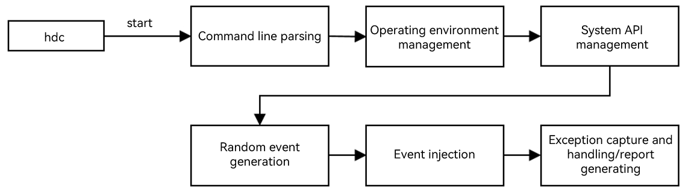

# wukong User Guide

## Introduction

wukong is a built-in command line tool that implements application stability test capabilities such as random event injection, component injection, exception capture, report generation, and data traversal of abilities. This tool allows you to conduct stability tests on the system or applications by simulating user behavior. wukong provides three types of testing: random testing, special testing, and focus testing.

In random testing, test inputs are generated randomly. Available features include shell startup, whole application startup, multiple injection modes, random seeds setting, run log printing, and report generation.

In special testing, specific application components are tested. Available features include shell startup, sequential traversal and screenshot, sleep and wakeup test, recording and playback, run log printing, and report generation.

In focus testing, specific components are injected. Available features include shell startup, device application startup, multiple injection modes, random seed setting, focus component type setting, component injection times setting, run log printing, and report generation.

## Principles

The following figure shows the wukong component architecture and the responsibilities of sub-modules. 


- Command line parsing: Obtain and parse parameters using commands.
- Operating environment management: Initialize the overall operating environment of wukong using commands.
- System API management: Check and obtain the specified mgr, and register the callback function of the Faultlogger for the controller and DFX.
- Random event generation: Use the **random** function to generate a sequence of random numbers with the specified seed value to generate an event.
- Event injection: Inject events of supported types to the system. This feature depends on the window, multi-mode, and security subsystems.
- Exception capture and processing and report generation: Obtain exception information with the DFX subsystem during application running, record log, and generate reports.

## Constraints

1. The wukong tool is built in the system since API version 9.

2. When the PC is connected to one or more target devices, you can run test commands.

3. Enter the shell mode before running any command.
<!--Del-->
4. In API versions earlier than 9, you need to build the tool and push it to the target device. The procedure is as follows:

   ```bash
   # Build code
   ./build.sh --product-name rk3568 --build-target wukong

   # Push code
   hdc shell mount -o rw,remount /
   hdc file send wukong /
   hdc shell chmod a+x /wukong
   hdc shell mv /wukong /bin/
   ```
<!--DelEnd-->
## Functions and Commands

| Command          | Description                                          |
| -------------- | ---------------------------------------------- |
| version | Obtains version information.                            |
| help    | Obtains help information.                            |
| appinfo | Queries the bundle name and the name of the corresponding mainAbility of the app that can be started.|
| special | Runs special testing.                                  |
| exec    | Runs random testing.                                  |
| focus   | Runs focus testing.                                  |

### Running Commands

- Open the shell.

  ```bash
  #If you are testing one device, run **hdc shell**.
  C:\Users>hdc shell
  $
  #If you are testing multiple devices, run **hdc list targets** to obtain the SNs, and then run **hdc -t** open the shell.
  C:\Users>hdc list targets
  15xxx424axxxx345209d94xxxx8fxx900
  C:\Users>hdc -t 15xxx424axxxx345209d94xxxx8fxx900 shell
  $
  ```

- Obtain the bundle name and ability name of the application.

  ```bash
  $ wukong appinfo
  BundleName:  com.ohos.adminprovisioning
  AbilityName:  com.ohos.adminprovisioning.MainAbility
  BundleName:  com.ohos.callui
  AbilityName:  com.ohos.callui.MainAbility
  ```
- View the help information.

  ```bash
  C:\Users>hdc shell
  $ wukong help        #wukong help menu.
  usage: wukong <command> [<arguments>]
  These are common wukong command list:
    help                       wukong help information
    -v/--version               wukong version
    exec                       run random test
    special                    run special test
    focus                      run focus test
    appinfo                    show all app information
  $ wukong exec -help   #Help menu for wukong random testing.
  usage: wukong exec [<arguments>]
  These are wukong exec arguments list:
    -h, --help                 random test help
    -a, --appswitch            appswitch event percent
    -b, --bundle               the bundle name of allowlist
    -p, --prohibit             the bundle name of blocklist
    -d, --page                 block page list
    -t, --touch                touch event percent
    -c, --count                test count
    -i, --interval             interval
    -s, --seed                 random seed
    -m, --mouse                mouse event percent
    -k, --keyboard             keyboard event percent
    -H, --hardkey              hardkey event percent
    -S, --swap                 swap event percent
    -T, --time                 test time
    -C, --component            component event percent
    -r, --rotate               rotate event percent
    -e, --allow ability        the ability name of allowlist
    -E, --block ability        the ability name of blocklist
    -Y, --blockCompId          the id list of block component
    -y, --blockCompType        the type list of block component
    -I, --screenshot           get screenshot(only in random input)
    -B, --checkBWScreen        black and white screen detection
    -U, --Uri                  set Uri pages
    -x, --Uri-type             set Uri-type
  $ wukong special -help    #Help menu for wukong special testing.
  usage: wukong special [<arguments>]
  These are wukong special arguments list:
    -h, --help                 special test help
    -t, --touch[x,y]           touch event
    -c, --count                total count of test
    -i, --interval             interval
    -S, --swap[option]         swap event
                                option is -s| -e| -b
                                -s, --start: the start point of swap
                                -e, --end: the end point of swap
                                -b, --bilateral: swap go and back
    -k, --spec_insomnia        power on/off event
    -T, --time                 total time of test
    -C, --component            component event
    -p, --screenshot           get screenshot(only in compoment input)
    -r, --record               record user operation
    -R, --replay               replay user operation
    -u, --uitest               uitest dumpLayout
  ```

## Random Testing

### Commands

| Command           | Description                                | Mandatory| Description                                    |
| --------------- | ------------------------------------ | ---- | ---------------------------------------- |
| -h,--help       | Obtains the help information about the test.              | No  |  -                        |
| -c,--count      | Sets the number of execution times. This command conflicts with the **-T** command. Set either of them.  | No  | The default value is 10, in times.                      |
| -i,--interval   | Sets the test interval.                        | No  | The default value is 1500, in millisecond.                      |
| -s,--seed       | Sets the random seed.                        | No  | If the same random seed is set, the same random event sequence is generated.|
| -b,--bundle[bundlename, ......, bundlename]    | Sets allowed bundles for the test. This command conflicts with the **-p** command.| No  | By default, all bundles on the device are allowed. Use commas (,) to separate bundle names.                |
| -p,--prohibit[bundlename, ......, bundlename]  | Sets blocked bundles for the test. This command conflicts with the **-b** command.| No  | By default, no bundle is blocked. Use commas (,) to separate bundle names.                      |
| -d,--page[page, ......, page]                  | Sets blocked pages for the test.| No | By default, the **pages/system** pages are blocked. Use commas (,) to separate page names.|
| -a,--appswitch  | Sets the proportion of the random application startup event test.            | No  | The default value is 10%.                                 |
| -t,--touch      | Sets the proportion of the random touch event test.           | No  | The default value is 10%.                                 |
| -S,--swap       | Sets the proportion of the random swipe event test.            | No  | The default value is 3%.                                  |
| -m,--mouse      | Sets the proportion of the random mouse event test.           | No  | The default value is 1%.                                  |
| -k,--keyboard   | Sets the proportion of the random keyboard event test.        | No  | The default value is 2%.                                  |
| -H,--hardkey    | Sets the proportion of the random hardkey test.             | No  | The default value is 2%.                                  |
| -r,--rotate     | Sets the proportion of the random rotate event test.              | No  | The default value is 2%.                                  |
| -C, --component | Sets the proportion of random component test.                | No  | The default value is 70%.                                 |
| -I, --screenshot | Takes a screenshot for the component test.                | No  | - |
| -T,--time       | Sets the total test time. This command conflicts with the **-c** command. Set either of them.| No  | The default value is 10, in minute.        |
| -e, --allow ability   |  Sets the ability that allows testing.| No| - |
| -E, --block ability   |  Sets the ability that blocks testing.| No| - |
| -Y, --blockCompId     |  Sets the blocked **CompId**.| No| - |
| -y, --blockCompType   |  Sets the blocked **CompType**.| No| - |
| -B, --checkBWScreen   |  Enables black and white screen check.| No| - |
| -U, -uri              |  Sets the URI of the application startup page.| No| - |
| -x, -uriType          |  Sets the URI type of the application startup page.| No| - |

### Samples

- Set 100 event injections.

  ```bash
  $ wukong exec -s 10 -i 1000 -a 0.28 -t 0.72 -c 100
  ```

  The parameters in the command are described as follows.
  | Command          | Value     |Description       |
  | -------------- | -------------- | -------------- |
  | wukong exec | -           | Works as the main command.               |
  | -s     | 10           | Sets the random seed. The seed value is **10**. |
  | -i  | 1000           | Sets the application startup interval to **1000** ms.|
  | -a  | 0.28          | Sets the proportion of the random application startup test to **28%**.   |
  | -t  | 0.72           | Sets the proportion of the random touch test to **72%**.   |
  | -c  | 100           | Sets the number of execution times to **100**.        |

- Specify a page to perform a pressure test.

  ```bash
  > Explicit start
  > hdc_std shell
  $ wukong exec -b bundlename -e abilityname -U uri

  > Implicit start
  > hdc_std shell
  $ wukong exec -b bundlename -U uri -x uriType
  ```

- Set the ability that allows and blocks testing.
  ```bash
  $ wukong exec -b com.ohos.settings -e com.ohos.settings.MainAbility -E com.ohos.settings.AppInfoAbility
  ```
  >  **NOTE**
  >
  > If **-e** and **-E** are set, you must set **-b** to specify an application.

## Special Testing

### Commands

| Command               | Description                  | Mandatory| Description               |
| :------------------ | ---------------------- | ---- | :------------------ |
| -h, --help          | Obtains the help information about the special testing.| No  |  -    |
| -k, --spec_insomnia | Powers on/off the special testing.      | No  | -                   |
| -c, --count         | Sets the number of test times.          | No  | The default value is 10, in times.         |
| -i, --interval      | Sets the test interval.          | No  | The default value is 1500, in millisecond. |
| -S, --swap          | Sets a swipe event for the test.              | No  | -                   |
| -s, --start[x,y]    | Sets the coordinates of the start point of the swipe event.  | No  | The values of coordinates are positive.          |
| -e, --end[x,y]      | Sets the coordinates of the end point of the swipe event.  | No  | The values of coordinates are positive.         |
| -b, --bilateral     | Sets a back and forth swipe event.          | No  | By default, the back and forth swipe event is disabled.     |
| -t, --touch[x,y]    | Sets a touch event for the test.              | No  | -                   |
| -T, --time          | Sets the total test time.        | No  | The default value is 10, in minute.|
| -C, --component     | Sets the sequential traversal test for components.      | No  | You need to set the name of the test application.|
| -r, --record     | Records user operation.      | No  | You need to specify the recording file.|
| -R, --replay    |  Replays user operation.     | No  | You need to specify the playback file.|
| -p, --screenshot    |  Takes a screenshot for the component test.     | No  | - |

### Samples

```bash
$ wukong special -C [bundlename] -p
```

## Focus Testing

### Commands

| Command           | Description                                | Mandatory| Description                                    |
| --------------- | ------------------------------------ | ---- | ---------------------------------------- |
| -n,--numberfocus       | Sets the number of injections for each component.              | No  | Unit: times                |
| -f, --focustypes       | Sets the types of component for the focus testing.              | No  | Use commas (,) to separate the types.                        |
| -h,--help       | Obtains the help information about the test.              | No  |  -                       |
| -c,--count      | Sets the number of test times. This command conflicts with the **-T** command. Set either of them.  | No  | The default value is 10, in times.                      |
| -i,--interval   | Sets the test interval.                        | No  | The default value is 1500, in millisecond.                      |
| -s,--seed       | Sets the random seed.                        | No  | If the same random seed is set, the same random event sequence is generated.|
| -b,--bundle[bundlename, ......, bundlename]    | Sets allowed bundles for the test. This command conflicts with the **-p** command.| No  | By default, all bundles on the device are allowed. Use commas (,) to separate bundle names.                |
| -p,--prohibit[bundlename, ......, bundlename]  | Sets blocked bundles for the test. This command conflicts with the **-b** command.| No  | By default, no bundle is blocked. Use commas (,) to separate bundle names.                      |
| -d,--page[page, ......, page]                  | Sets blocked pages for the test.| No | By default, the **pages/system** pages are blocked. Use commas (,) to separate page names.|
| -a,--appswitch  | Sets the proportion of the random application startup event test.            | No  | The default value is 10%.                                 |
| -t,--touch      | Sets the proportion of the random touch event test.           | No  | The default value is 10%.                                 |
| -S,--swap       | Sets the proportion of the random swipe event test.            | No  | The default value is 3%.                                  |
| -m,--mouse      | Sets the proportion of the random mouse event test.           | No  | The default value is 1%.                                  |
| -k,--keyboard   | Sets the proportion of the random keyboard event test.        | No  | The default value is 2%.                                  |
| -H,--hardkey    | Sets the proportion of the random hardkey test.             | No  | The default value is 2%.                                  |
| -r,--rotate     | Sets the proportion of the random rotate event test.              | No  | The default value is 2%.                                  |
| -C, --component | Sets the proportion of random component test.                | No  | The default value is 70%.                                 |
| -I, --screenshot | Takes a screenshot for the component test.                | No  | - |
| -T,--time       | Sets the total test time. This command conflicts with the **-c** command. Set either of them.| No  | The default value is 10, in minute.        |
| -e, --allow ability   |  Sets the ability that allows testing.| No| - |
| -E, --block ability   |  Sets the ability that blocks testing.| No| - |
| -Y, --blockCompId     |  Sets the blocked **CompId**.| No| - |
| -y, --blockCompType   |  Sets the blocked **CompType**.| No| - |
| -B, --checkBWScreen   |  Enables black and white screen check.| No| - |

### Samples

```bash
$ wukong focus -s 10 -i 1000 -a 0.28 -t 0.72 -c 100
```

The parameters in the command are described as follows.
| Command          | Value     |Description       |
| -------------- | -------------- | -------------- |
| wukong focus | -           | Works as the main command.               |
| -s     | 10           | Sets the random seed. The seed value is **10**. |
| -i  | 1000           | Sets the application startup interval to **1000** ms.|
| -a  | 0.28          | Sets the proportion of the random application startup test to **28%**.   |
| -t  | 0.72           | Sets the proportion of the random touch test to **72%**.   |
| -c  | 100           | Sets the number of execution times to **100**.        |


## Viewing the Test Result

### Test Result Output Path

After the test commands are executed, the test result is automatically generated. You can obtain the test result in the following directory:

- For DevEco Studio versions earlier than September 22, 2022: **/data/local/wukong/report/xxxxxxxx_xxxxxx/**
- For DevEco Studio versions later than September 22, 2022: **/data/local/tmp/wukong/report/xxxxxxxx_xxxxxx/**

### Test Report Directories

| Type                                | Description              |
| ------------------------------------ | ------------------ |
| exception/                           | Stores exception files generated during the test.|
| screenshot/                          | Stores the screenshots of the test traversal. |
| wukong_report.csv                    | Stores the test report summary.      |
| wukong.log                | Indicates the test operation history.      |

### View operation logs

You can run the hdc command to obtain logs to the local host and view the operation history.

```bash
# The path of the wukong.log file is as follows:
/data/local/tmp/wukong/report/xxxxxxxx_xxxxxx/wukong.log

# To view the directory of the wukong test report, run the following command:
$ cd /data/local/tmp/wukong/report/20170805_170053
$ ls
data.js  exception  wukong.log  wukong_report.csv

# Open the shell and run hdc file recv to obtain wukong logs.
C:\Users\xxx>hdc file recv /data/local/tmp/wukong/report/20170805_170053/wukong.log C:\Users\xxx\Desktop\log
[I][2024-01-03 20:08:02] HdcFile::TransferSummary success
FileTransfer finish, Size:76492, File count = 1, time:16ms rate:4780.75kB/s
```

## FAQs
### failed to connect to AAMS
 **Symptom**

failed to connect to AAMS.

 **Possible Cause**

AAMS is occupied by Hypium or the UIViewer of DevEco Testing. AAMS can be connected to only one program at a time.

 **Solution**

Stop the process that occupies AAMS or restart the device.
### Errorcode:(4005)
 **Symptom**

Errorcode:(4005).

 **Possible Cause**

The size of the screen display area changes. As a result, the page information fails to be obtained.

 **Solution**

This error does not affect the test process and does not need to be handled.
### Errorcode:(4007)
 **Symptom**

Errorcode:(4007).

 **Possible Cause**

The size of the screen display area changes. As a result, the page information fails to be obtained.

 **Solution**

This error does not affect the test process and does not need to be handled.
