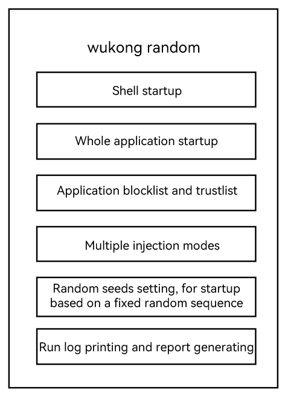
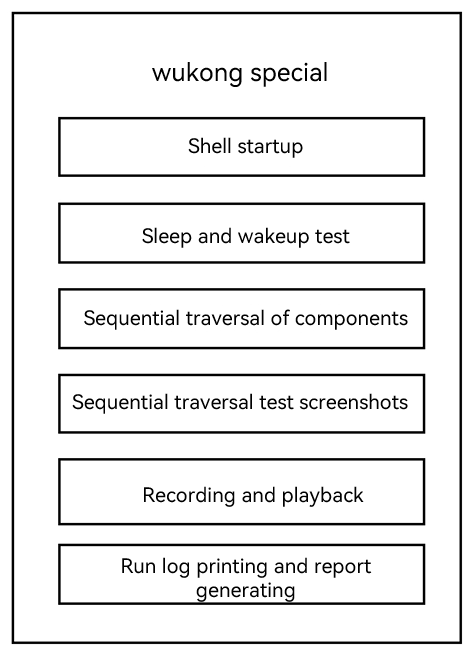

# wukong User Guide


## Overview

Stability testing is important in that it demonstrates how an application performs under stress. For this reason, wukong, a stability testing tool specially designed for OpenHarmony developers, is provided.

In this document you will learn about the key functions of wukong and how to use it to perform stability testing.

## Introduction

wukong is part of the OpenHarmony toolkit and implements basic application stability test capabilities such as random event injection, component injection, exception capture, report generation, and data traversal of abilities.

## Principles

wukong mainly provides two types of tests: random test and special test.

- Random test

  The random test is the staple service of wukong. It provides the basic startup, running, and result summary features, as shown below.

  

  The following figure shows the basic running process of the random test, which depends on the **hdc** command.

  

- Special test

  The special test provides a wide range of features: traversing the components of an application in sequence, recording and playback, and sleeping and waking up.

  The following figure shows the main features of the special test.

  

For details about the test commands, see [wukong](https://gitee.com/openharmony/ostest_wukong/blob/master/README.md).

## Constraints

1. wukong is pre-installed in version 3.2 and later versions.

2. In versions earlier than 3.2, you must build wukong separately and push it to the tested OpenHarmony device. The procedure is as follows:       
    How to build:
    ```
    ./build.sh --product-name rk3568 --build-target wukong
    ```
    How to push:
    ```
    hdc_std shell mount -o rw,remount /
    hdc_std file send wukong /
    hdc_std shell chmod a+x /wukong
    hdc_std shell mv /wukong /bin/
    ```

## Environment Preparations

To run commands, connect the PC to an OpenHarmony device, such as the RK3568 development board.

## Performing Stability Testing

**Using wukong exec for Random Test**

Access the shell and run the following random test command:
```
# wukong exec -s 10 -i 1000 -a 0.28 -t 0.72 -c 100
```
Random test commands
| Command          | Value          | Description                                          |
| -------------- | -------------- | ---------------------------------------------- |
| wukong exec | -           | Works as the main command.                            |
| -s     | 10           | Sets the random seed. The value 10 is the seed value.           |
| -i  | 1000           | Sets the application startup interval to 1000 ms.|
| -a  | 0.28          | Sets the proportion of the random application startup test to 28%.         |
| -t  | 0.72           | Sets the proportion of the random touch test to 72%.   |
| -c  | 100           | Sets the number of execution times to 100.               |

**Using wukong special for Special Test**

Access the shell and run the following commands to perform the sequential traversal test:
```bash
# wukong special -C [bundlename] -p
```
Special test commands
| Command          | Value          | Description                                          |
| -------------- |-------------- | ---------------------------------------------- |
| wukong special | -  | Works as the main command.                            |
| -C [bundlename]    |[bundlename] | Sets the bundle name of the application for the sequential traversal test.           |
| -p | -  | Indicates a screenshot.                            |

## Viewing the Test Result

After the test commands are executed, the test result is automatically generated.

You can obtain the test result in the following directory:
```
Before 2022/9/22: /data/local/wukong/report/xxxxxxxx_xxxxxx/
Since 2022/9/22: /data/local/tmp/wukong/report/xxxxxxxx_xxxxxx/
```
>**NOTE**
>
>The folder for test reports is automatically generated.

Content of the folder is described in the table below.
| Folder/File                   | Description              |
| ------------------------------------ | ------------------ |
| exception/                           | Stores exception files generated during the test.|
| screenshot/                          | Stores screenshots of the sequential traversal test. |
| wukong_report.csv                    | Stores the test report summary.      |

You can view the wukong execution log in the path below:
```
reports/xxxxxxxx_xxxxxx/wukong.log
```
