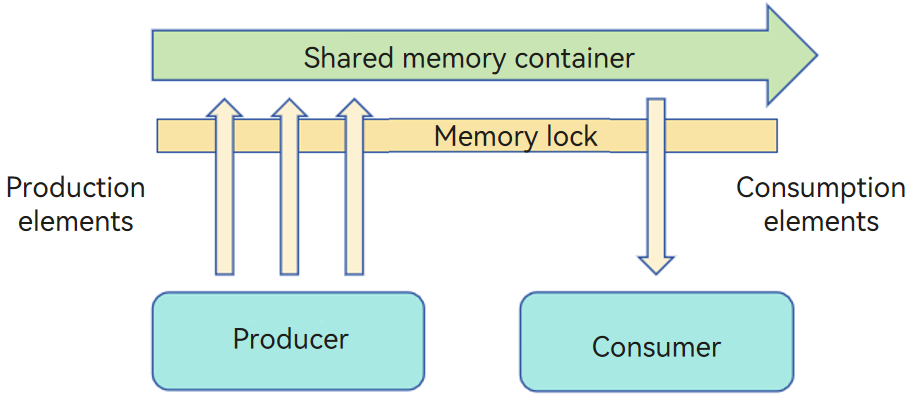
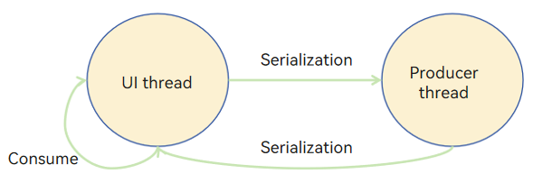

# Comparison Between the Actor and Memory Sharing Models

In the memory sharing model, multiple threads execute complex tasks simultaneously. These threads depend on the same memory and have the permission to access the memory. Before accessing the memory, a thread must preempt and lock the memory. In this case, other threads have to wait for the thread to release the memory.

In the actor model, each thread is an independent actor, which has its own memory. Actors trigger the behavior of each other through message transfer. Different actors cannot directly access the memory space of each other.

Different from the memory sharing model, the actor model provides independent memory space for each thread, preventing memory preemption. This frees developers from considering a series of function and performance problems caused by memory locking and thereby improves development efficiency.

Because threads in the actor model do not share memory with each other, concurrent tasks and task results must be transmitted through the inter-thread communication.

This topic describes the differences between the two models when solving the producer-consumer problem.

## Memory Sharing Model
The following figure shows how the producer-consumer problem is resolved in the memory sharing model.



To prevent dirty reads and writes caused by simultaneous access, only one producer or consumer can access a shared memory container at a time. That is, different producers and consumers compete for the lock of the container. After a role obtains the lock, other roles have to wait.

```
BufferQueue {
    Queue queue
    Mutex mutex
    add(value) {
        // Attempt to acquire the lock.
        if (mutex.lock()) {
            queue.push(value)
            mutex.unlock()
        }
    }

    take() {
        // Attempt to acquire the lock.
        if (mutex.lock()) {
            if (queue.empty()) {
                return null
            }
            let res = queue.pop(value)
            mutex.unlock()
            return res
        }
    }
}

// Construct a globally shared memory segment.
let g_bufferQueue = new BufferQueue()

Producer {
    run() {
        let value = random()
        // Initiate a cross-thread access to the bufferQueue object.
        g_bufferQueue.add(value)
    }
}

Consumer {
    run() {
        // Initiate a cross-thread access to the bufferQueue object.
        let res = g_bufferQueue.take()
        if (res != null) {
            // Add consumption logic.
        }
    }
}

Main() {
    let consumer = new Consumer()
    let producer = new Producer()
    // Execute the production task in multiple threads.
    for 0 in 10 :
        let thread = new Thread()
        thread.run(producer.run())
        consumer.run()
}
```

## Actor Model
The following figure shows how the producer-consumer problem is resolved by using **TaskPool** in the actor model.



In the actor model, different roles do not share memory. Both the producer thread and UI thread have their own exclusive memory. After producing the result, the producer sends the result to the UI thread through serialization. After consuming the result, the UI thread sends a new production task to the producer thread.

```ts
import taskpool from '@ohos.taskpool';
// Cross-thread concurrent tasks
@Concurrent
async function produce() {
  // Add production logic.
  console.log("producing...")
  return Math.random()
}

class Consumer {
    public consume(value : number) {
        // Add consumption logic.
        console.log("consuming value: " + value)
    }
}

@Entry
@Component
struct Index {
  @State message: string = 'Hello World'

  build() {
    Row() {
      Column() {
        Text(this.message)
          .fontSize(50)
          .fontWeight(FontWeight.Bold)
        Button() {
          Text("start")
        }.onClick(() => {
            let produceTask = new taskpool.Task(produce)
            let consumer = new Consumer()
            for (let index = 0; index < 10; index++) {
                // Execute the asynchronous concurrent production task.
                taskpool.execute(produceTask).then((res : number) => {
                    consumer.consume(res)
                }).catch((e : Error) => {
                    console.error(e.message)
                })
            }
        })
        .width('20%')
        .height('20%')
      }
      .width('100%')
    }
    .height('100%')
  }
}
```
