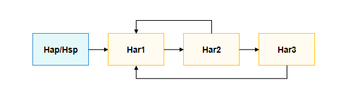
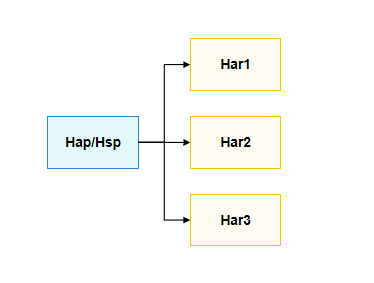

# Dynamic Import

Dynamic import is a powerful feature that allows for conditional loading and partial reflection, which improves the page load time. You can use it to dynamically load HSP modules, HAR, ohpm packages, and native libraries. Better yet, HAR modules can be decoupled when only variables are dynamically imported between the modules.

## When to Use
Unlike [static import]](../quick-start/introduction-to-arkts.md#static-import), dynamic import allows you to load a module conditionally or on demand. The following are some cases where you might want to use dynamic import:

* The statically imported module significantly slows the loading of your code, and there is a low likelihood that you will need the module, or you will not need it until a later time.
* The statically imported modules occupy a large amount of system memory and are unlikely to be used.
* The module being imported does not exist at load time.
* The import specifier string needs to be constructed dynamically. (Static import only supports static specifiers.)
* The module being imported has side effects (which can be understood as code that runs directly in the module), and you do not want those side effects unless some condition is true.

## Bonus
As aforementioned, in addition to conditional loading, dynamic import can also implement partial reflection. In the following example, the HAP dynamically imports **harlibrary** and calls the static member function **staticAdd()**, member function **instanceAdd()**, and global method **addHarlibrary()**.
```typescript
// harlibrary's src/main/ets/utils/Calc.ets
export class Calc {
  public static staticAdd(a:number, b:number):number {
    let c = a + b;
    console.info('DynamicImport I am harlibrary in staticAdd, %d + %d = %d', a, b, c);
    return c;
  }

  public instanceAdd(a:number, b:number):number {
    let c = a + b;
    console.info('DynamicImport I am harlibrary in instanceAdd, %d + %d = %d', a, b, c);
    return c;
  }
}

export function addHarlibrary(a:number, b:number):number {
  let c = a + b;
  console.info('DynamicImport I am harlibrary in addHarlibrary, %d + %d = %d', a, b, c);
  return c;
}
```

```typescript
// harlibrary's Index.ets
export { Calc, addHarlibrary } from './src/main/ets/utils/Calc'
```

```json5
// HAP's oh-package.json5
"dependencies": {
  "harlibrary": "file:../harlibrary"
}
```

```typescript
// HAP's src/main/ets/pages/Index.ets
import('harlibrary').then((ns:ESObject) => {
  ns.Calc.staticAdd(8, 9);  // Call the static member function staticAdd().
  let calc:ESObject = new ns.Calc();  // Instantiate the class Calc.
  calc.instanceAdd(10, 11);  // Call the member function instanceAdd().
  ns.addHarlibrary(6, 7);  // Call the global method addHarlibrary().

  // Call classes, member functions, and methods by name using reflection.
  let className = 'Calc';
  let methodName = 'instanceAdd';
  let staticMethod = 'staticAdd';
  let functionName = 'addHarlibrary';
  ns[className][staticMethod](12, 13);  // Call the static member function staticAdd().
  let calc1:ESObject = new ns[className]();  // Instantiate the class Calc.
  calc1[methodName](14, 15);  // Call the member function instanceAdd().
  ns[functionName](16, 17);  // Call the global method addHarlibrary().
});
```

## Implementation
A dynamic import expression accepts a constant or variable as its argument.
The following table lists the specifications of dynamic import.

| Scenario| Module Specifier            | Description                                                    |
| :------------- | :----------------------------- | :------------------------------------------------------- |
| Local module  | File path      | The path must start with **./** or **../**.                                   |
| Local module  | HSP module name          | -                                                        |
| Local module  | HSP module file path    | Currently, dynamic import expressions with constants are supported, but not ones with variables.|
| Local module  | HAR module name          | -                                                        |
| Local module  | HAR module file path    | Currently, dynamic import expressions with constants are supported, but not ones with variables.|
| Remote module        | HAR module name       | -                                                        |
| Remote module        | ohpm package name           | -                                                        |
| API            | @system.*          | -                                                        |
| API            | @ohos.*            | -                                                        |
| API            | @arkui-x.*         | -                                                        |
| Native library module  | libNativeLibrary.so| -                                                        |

Notes:

1. The module names used in imports are the aliases under **dependencies** in the **oh-package.json5** file.
2. It is recommended that the alias under **dependencies** be the same as the values of **moduleName** and **packageName**, both of which indicate the name of the module to import. **moduleName** is set in the **module.json5** file of the module, and **packageName** is set in the **oh-package.json5** file.
3. Importing a module by name is importing the module's entry point file, generally **index.ets/ts**.

## Implementation Key Points

### Dynamic Import Constant Expression

A dynamic import constant expression is a dynamic import expression that takes in a constant as its argument. The following examples show how to use this type of dynamic import expression to import a module or API into a HAP module.

Note: In the examples, the paths, such as the path to **Index.ets**, are set based on the current DevEco Studio module configuration and are subject to change.

- **Dynamically importing a HAR module based on the HAR module name**

  ```typescript
  // HAR's Index.ets
  export function add(a:number, b:number):number {
    let c = a + b;
    console.info('DynamicImport I am a HAR, %d + %d = %d', a, b, c);
    return c;
  }
  ```

  ```typescript
  // HAP's src/main/ets/pages/Index.ets
  import('myHar').then((ns:ESObject) => {
    console.info(ns.add(3, 5));
  });
  ```

  ```json5
  // HAP's oh-package.json5
  "dependencies": {
    "myHar": "file:../myHar"
  }
  ```

- **Dynamically importing a HAR module based on the HAR module file path**

  ```typescript
  // HAR's Index.ets
  export function add(a:number, b:number):number {
    let c = a + b;
    console.info('DynamicImport I am a HAR, %d + %d = %d', a, b, c);
    return c;
  }
  ```

  ```typescript
  // HAP's src/main/ets/pages/Index.ets
  import('myHar/Index').then((ns:ESObject) => {
    console.info(ns.add(3, 5));
  });
  ```

  ```json5
  // HAP's oh-package.json5
  "dependencies": {
    "myHar": "file:../myHar"
  }
  ```

- **Dynamically importing an HSP module based on the HSP module name**

  ```typescript
  // HSP's Index.ets
  export function add(a:number, b:number):number {
    let c = a + b;
    console.info('DynamicImport I am a HSP, %d + %d = %d', a, b, c);
    return c;
  }
  ```

  ```typescript
  // HAP's src/main/ets/pages/Index.ets
  import('myHsp').then((ns:ESObject) => {
    console.info(ns.add(3, 5));
  });
  ```

  ```json5
  // HAP's oh-package.json5
  "dependencies": {
    "myHsp": "file:../myHsp"
  }
  ```

- **Dynamically importing an HSP module based on the HSP module file path**

  ```typescript
  // HSP's Index.ets
  export function add(a:number, b:number):number {
    let c = a + b;
    console.info('DynamicImport I am a HSP, %d + %d = %d', a, b, c);
    return c;
  }
  ```

  ```typescript
  // HAP's src/main/ets/pages/Index.ets
  import('myHsp/Index').then((ns:ESObject) => {
    console.info(ns.add(3, 5));
  });
  ```

  ```json5
  // HAP's oh-package.json5
  "dependencies": {
    "myHsp": "file:../myHsp"
  }
  ```

- **Dynamically importing a remote HAR module based on the HAR module name**

  ```typescript
  // HAP's src/main/ets/pages/Index.ets
  import('@ohos/crypto-js').then((ns:ESObject) => {
    console.info('DynamicImport @ohos/crypto-js: ' + ns.CryptoJS.MD5(123456));
  });
  ```

  ```json5
  // HAP's oh-package.json5
  "dependencies": {
    "@ohos/crypto-js": "2.0.3-rc.0"
  }
  ```

- **Dynamically importing an ohpm package**

  ```typescript
  // HAP's src/main/ets/pages/Index.ets
  import('json5').then((ns:ESObject) => {
    console.info('DynamicImport json5');
  });
  ```

  ```json5
  // HAP's oh-package.json5
  "dependencies": {
    "json5": "1.0.2"
  }
  ```

- **Dynamically importing a file of the HAP module itself**

  ```typescript
  // HAP's src/main/ets/Calc.ets
  export function add(a:number, b:number):number {
    let c = a + b;
    console.info('DynamicImport I am a HAP, %d + %d = %d', a, b, c);
    return c;
  }
  ```

  ```typescript
  // HAP's src/main/ets/pages/Index.ets
  import('../Calc').then((ns:ESObject) => {
    console.info(ns.add(3, 5));
  });
  ```

- **Dynamically importing a native library of the HAP module itself**

  ```typescript
  // libnativeapi.so's index.d.ts
  export const add: (a:number, b:number) => number;
  ```

  ```typescript
  // HAP's src/main/ets/pages/Index.ets
  import('libnativeapi.so').then((ns:ESObject) => {
    console.info('DynamicImport libnativeapi.so: ' + ns.default.add(2, 3));
  });
  ```

  ```json5
  // HAP's oh-package.json5
  "dependencies": {
    "libnativeapi.so": "file:./src/main/cpp/types/libnativeapi"
  }
  ```

- **Dynamically importing APIs**

  ```typescript
  // HAP's src/main/ets/pages/Index.ets
  import('@system.app').then((ns:ESObject) => { ns.default.terminate(); });
  import('@system.router').then((ns:ESObject) => { ns.default.clear(); });
  import('@ohos.curves').then((ns:ESObject) => { ns.default.springMotion(0.555, 0.75, 0.001); });
  import('@ohos.matrix4').then((ns:ESObject) => { ns.default.identity(); });
  import('@ohos.hilog').then((ns:ESObject) => { ns.default.info(0x0000, 'testTag', '%{public}s', 'DynamicImport @ohos.hilog.'); });
  ```

### Dynamic Import Variable Expression

In DevEco Studio, the dependencies between modules are configured through **dependencies** in the **oh-package.json5** file. By default, all modules listed under **dependencies** are installed (local modules) or downloaded (remote modules), but are not built. During a HAP/HSP build, the dependency relationship is searched from the entry point file (generally **Index.ets/ts**), and only the dependencies found are added to the build.
At compile time, static imports and dynamic import constant expressions can be identified and parsed by the packaging tool rollup and its plug-ins. This means that the related dependencies can be added to the dependency tree, participate in the build process, and finally generate Ark bytecode. As for dynamic import variable expressions, since the variable value may need to be calculated or obtained from an external source, it cannot be determined at compile time; as a result, the related dependencies cannot participate in the build process. To add these dependencies to the build process, add **runtimeOnly** under **buildOption** and set it to the actual module name or file path pertaining to the variable.

**1. Schema configuration format of the runtimeOnly field**

If you are using a dynamic import variable expression to import modules or files, but not APIs, you need to add the **runtimeOnly** field under **buildOption** in the **build-profile.json5** file of the HAP/HSP/HAR module.
The following are some examples.

```typescript
// Dynamically import a module based on the module name myHar.
let harName = 'myHar';
import(harName).then(......);

// Dynamically import a file of the module itself based on the file path src/main/ets/index.ets.
let filePath = './Calc';
import(filePath).then(......);
```

The corresponding **runtimeOnly** configuration is as follows:

```typescript
"buildOption": {
  "arkOptions": {
    "runtimeOnly": {
      "packages": [ "myHar" ]  // Set the name of the module to dynamically import. It must be the same as the one specified under dependencies.
      "sources": ["./src/main/ets/utils/Calc.ets"] // Set the path of the file to dynamically import. The path is relative to the build-profile.json5 file of the module.
    }
  }
}
```

**packages** of **runtimeOnly**: name of the module to dynamically import. It must be the same as the one specified under **dependencies**.
**sources** of **runtimeOnly**: path of the file to dynamically import. The path is relative to the **build-profile.json5** file of the module.

**2. Examples**

- **Dynamically importing a HAR module based on the HAR module name**

  ```typescript
  // HAR's Index.ets
  export function add(a:number, b:number):number {
    let c = a + b;
    console.info('DynamicImport I am a HAR, %d + %d = %d', a, b, c);
    return c;
  }
  ```
  ```typescript
  // HAP's src/main/ets/pages/Index.ets
  let packageName = 'myHar';
  import(packageName).then((ns:ESObject) => {
    console.info(ns.add(3, 5));
  });
  ```
  ```json5
  // HAP's oh-package.json5
  "dependencies": {
    "myHar": "file:../myHar"
  }
  ```
  ```json5
  // HAP's build-profile.json5
  "buildOption": {
    "arkOptions": {
      "runtimeOnly": {
        "packages": [
          "myHar" // Applicable only when a variable is used to dynamically import a module or file.
        ]
      }
    }
  }
  ```

- **Dynamically importing an HSP module based on the HSP module name**

  ```typescript
  // HSP's Index.ets
  export function add(a:number, b:number):number {
    let c = a + b;
    console.info('DynamicImport I am a HSP, %d + %d = %d', a, b, c);
    return c;
  }
  ```
  ```typescript
  // HAP's src/main/ets/pages/Index.ets
  let packageName = 'myHsp';
  import(packageName).then((ns:ESObject) => {
    console.info(ns.add(3, 5));
  });
  ```
  ```json5
  // HAP's oh-package.json5
  "dependencies": {
    "myHsp": "file:../myHsp"
  }
  ```
  ```json5
  // HAP's build-profile.json5
  "buildOption": {
    "arkOptions": {
      "runtimeOnly": {
        "packages": [
          "myHsp"  // Applicable only when a variable is used to dynamically import a module.
        ]
      }
    }
  }
  ```

- **Dynamically importing a remote HAR module based on the HAR module name**

  ```typescript
  // HAP's src/main/ets/pages/Index.ets
  let packageName = '@ohos/crypto-js';
  import(packageName).then((ns:ESObject) => {
    console.info('DynamicImport @ohos/crypto-js: ' + ns.CryptoJS.MD5(123456));
  });
  ```
  ```json5
  // HAP's oh-package.json5
  "dependencies": {
    "@ohos/crypto-js": "2.0.3-rc.0"
  }
  ```
  ```json5
  // HAP's build-profile.json5
  "buildOption": {
    "arkOptions": {
      "runtimeOnly": {
        "packages": [
          "@ohos/crypto-js"  // Applicable only when a variable is used to dynamically import a module.
        ]
      }
    }
  }
  ```

- **Dynamically importing an ohpm package**

  ```typescript
  // HAP's src/main/ets/pages/Index.ets
  let packageName = 'json5';
  import(packageName).then((ns:ESObject) => {
    console.info('DynamicImport json5');
  });
  ```
  ```json5
  // HAP's oh-package.json5
  "dependencies": {
    "json5": "1.0.2"
  }
  ```
  ```json5
  // HAP's build-profile.json5
  "buildOption": {
    "arkOptions": {
      "runtimeOnly": {
        "packages": [
          "json5"  // Applicable only when a variable is used to dynamically import a module.
        ]
      }
    }
  }
  ```

- **Dynamically importing a file of the HAP module itself**

  ```typescript
  // HAP's src/main/ets/Calc.ets
  export function add(a:number, b:number):number {
    let c = a + b;
    console.info('DynamicImport I am a HAP, %d + %d = %d', a, b, c);
    return c;
  }
  ```
  ```typescript
  // HAP's src/main/ets/pages/Index.ets
  let filePath = '../Calc';
  import(filePath).then((ns:ESObject) => {
    console.info(ns.add(3, 5));
  });
  ```
  ```json5
  // HAP's build-profile.json5
  "buildOption": {
    "arkOptions": {
      "runtimeOnly": {
        "sources": [
          "./src/main/ets/Calc.ets"  // Applicable only when a variable is used to dynamically import a file of the module itself.
        ]
      }
    }
  }
  ```

- **Dynamically importing a native library of the HAP module itself**

  ```typescript
  // libnativeapi.so's index.d.ts
  export const add: (a:number, b:number) => number;
  ```
  ```typescript
  // HAP's src/main/ets/pages/Index.ets
  let soName = 'libnativeapi.so';
  import(soName).then((ns:ESObject) => {
    console.info('DynamicImport libnativeapi.so: ' + ns.default.add(2, 3));
  });
  ```
  ```json5
  // HAP's oh-package.json5
  "dependencies": {
    "libnativeapi.so": "file:./src/main/cpp/types/libnativeapi"
  }
  ```
  ```json5
  // HAP's build-profile.json5
  "buildOption": {
    "arkOptions": {
      "runtimeOnly": {
        "packages": [
          "libnativeapi.so"  // Applicable only when a variable is used to dynamically import a module.
        ]
      }
    }
  }
  ```

- **Dynamically importing APIs**

  ```typescript
  // HAP's src/main/ets/pages/Index.ets
  let packageName = '@system.app';
  import(packageName).then((ns:ESObject) => { ns.default.terminate(); });
  packageName = '@system.router';
  import(packageName).then((ns:ESObject) => { ns.default.clear(); });
  packageName = '@ohos.curves';
  import(packageName).then((ns:ESObject) => { ns.default.springMotion(0.555, 0.75, 0.001); });
  packageName = '@ohos.matrix4';
  import(packageName).then((ns:ESObject) => { ns.default.identity(); });
  packageName = '@ohos.hilog';
  import(packageName).then((ns:ESObject) => { ns.default.info(0x0000, 'testTag', '%{public}s', 'DynamicImport @ohos.hilog.'); });
  ```
You do not need to set **runtimeOnly** when dynamically importing APIs with variables.

### Decoupling Between HAR modules with Dynamic Import
When an application contains multiple HAR modules, and the dependency between the modules are complex, configuring their dependencies in DevEco Studio can be challenging and, if not handled carefully, can lead to cyclic dependencies. To simplify dependency management, if only variables are dynamically imported between HAR modules, you can convert dependency between HAR modules into dependency between HAR modules and HAP/HSP modules. In this way, the HAR modules are decoupled. The figure shows the dependency graph before dependency conversion.



The figure shows the dependency graph after dependency conversion.




**1. Constraints**
- Dependency conversion is applicable only when cyclic dependency is formed between local HAR modules.
- In HAR modules for which you want to convert dependency, only dynamic import variable expressions are allowed, but not static import or dynamic import constant expressions.
- When converting dependencies, you must transfer both **dependencies** and **runtimeOnly**.
- Dependency conversion does not work for HSP modules. For example, in the case of HAP -> HSP1 -> HSP2 -> HSP3, dependency between HSP2 and HSP3 cannot be converted into dependency with the HAP.
- Only HAR modules are allowed throughout the dependency conversion chain. In other words, no HSP module is allowed between HAR modules. An incorrect use is as follows: HAP -> HAR1 -> HAR2 -> HSP -> HAR3 -> HAR4.

  The dependency of HAR 1 on HAR 2 can be transferred to a HAP, and the dependency of HAR 3 on HAR 4 can be transferred to an HSP. However, HAR3 or HAR4 cannot be transferred to the HAP.


**2. Examples**

In the following example, the HAP dynamically imports HAR module har1 based on the module name variable, and har1 dynamically imports another HAR module har2 based on the module name variable.

```json5
// HAP's oh-package.json5
"dependencies": {
  "har1": "file:../har1"
}
```
```json5
// HAP's build-profile.json5
"buildOption": {
  "arkOptions": {
    "runtimeOnly": {
      "packages": [
        "har1"  // Applicable only when a variable is used to dynamically import a module.
      ]
    }
  }
}
```
```typescript
// HAP's src/main/ets/pages/Index.ets
let harName = 'har1';
import(harName).then((ns:ESObject) => {
  console.info('DynamicImport addHar1 4 + 5 = ' + ns.addHar1(4, 5));
});
```
```json5
// har1's oh-package.json5
"dependencies": {
  "har2": "file:../har2"
}
```
```json5
// har1's build-profile.json5
"buildOption": {
  "arkOptions": {
    "runtimeOnly": {
      "packages": [
        "har2"  // Applicable only when a variable is used to dynamically import a module.
      ]
    }
  }
}
```
```typescript
// har1's Index.ets
export { addHar1 } from './src/main/ets/utils/Calc'
```
```typescript
// har1's src/main/ets/utils/Calc.ets
export function addHar1(a:number, b:number):number {
  let c = a + b;
  console.info('DynamicImport I am har1, %d + %d = %d', a, b, c);

  let harName = 'har2';
  import(harName).then((ns:ESObject) => {
    console.info('DynamicImport addHar2 4 + 5 = ' + ns.addHar2(4, 5));
  });
  return c;
}
```
```typescript
// har2's Index.ets
export { addHar2 } from './src/main/ets/utils/Calc'
```
```typescript
// har2's src/main/ets/utils/Calc.ets
export function addHar2(a:number, b:number):number {
  let c = a + b;
  console.info('DynamicImport I am har2, %d + %d = %d', a, b, c);
  return c;
}
```

The **dependencies** and **runtimeOnly** configurations of har1 on har2 are transferred to the HAP. In this way, the **dependencies** and **runtimeOnly** configuration of har2 do not need to be configured for har1.

```json5
// HAP's oh-package.json5
"dependencies": {
  "har1": "file:../har1",
  "har2": "file:../har2"
}
```
```json5
// HAP's build-profile.json5
"buildOption": {
  "arkOptions": {
    "runtimeOnly": {
      "packages": [
        "har1",
        "har2"
      ]
    }
  }
}
```
```typescript
// HAP's src/main/ets/pages/Index.ets
let harName = 'har1';
import(harName).then((ns:ESObject) => {
  console.info('DynamicImport addHar1 4 + 5 = ' + ns.addHar1(4, 5));
});
```
```typescript
// har1's Index.ets
export { addHar1 } from './src/main/ets/utils/Calc'
```
```typescript
// har1's src/main/ets/utils/Calc.ets
export function addHar1(a:number, b:number):number {
  let c = a + b;
  console.info('DynamicImport I am har1, %d + %d = %d', a, b, c);

  let harName = 'har2';
  import(harName).then((ns:ESObject) => {
    console.info('DynamicImport addHar2 4 + 5 = ' + ns.addHar2(4, 5));
  });
  return c;
}
```
```typescript
// har2's Index.ets
export { addHar2 } from './src/main/ets/utils/Calc'
```
```typescript
// har2's src/main/ets/utils/Calc.ets
export function addHar2(a:number, b:number):number {
  let c = a + b;
  console.info('DynamicImport I am har2, %d + %d = %d', a, b, c);
  return c;
}
```
