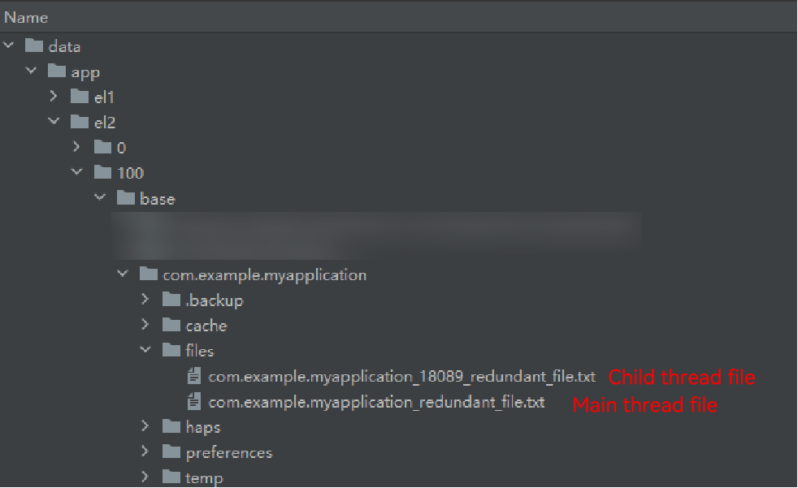
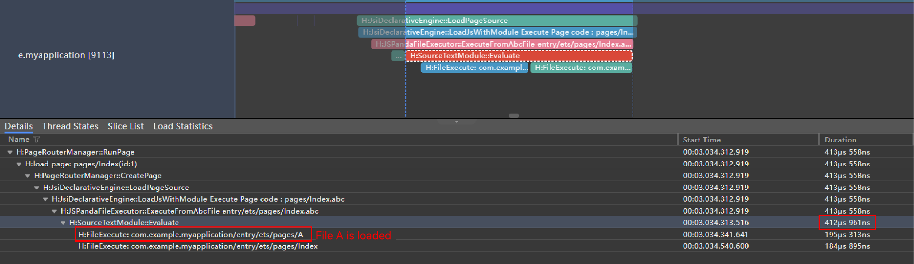
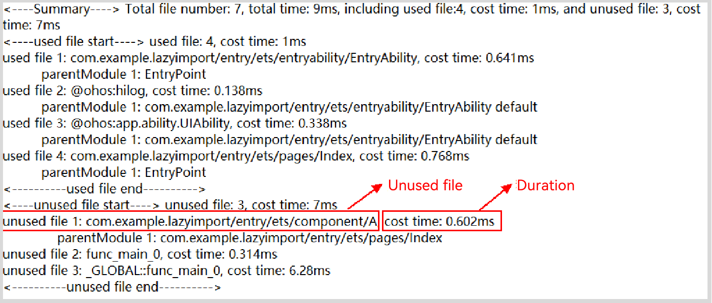
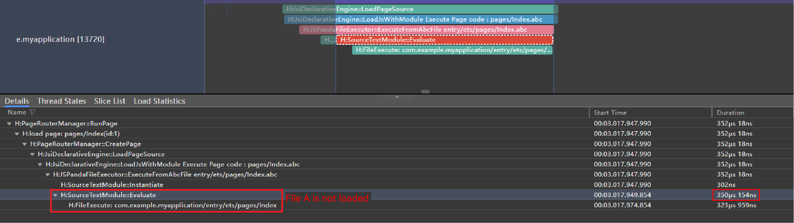

# Lazy Import
<!--Kit: ArkTS-->
<!--Subsystem: ArkCompiler-->
<!--Owner: @DaiHuina1997-->
<!--Designer: @yao_dashuai-->
<!--Tester: @kirl75; @zsw_zhushiwei-->
<!--Adviser: @foryourself-->

As applications evolve with more features, the time required for cold start increases significantly. The main reason is that numerous modules that are not actually executed are loaded during the initial startup. This not only prolongs application initialization but also leads to invalid resource utilization. To address this, it is crucial to streamline the loading process by eliminating non-essential file executions to optimize cold start performance and ensure a smooth user experience.

> **NOTE**
>
> - The lazy import feature is supported since API version 12.
>
> - To use the lazy import syntax on API version 12, you must configure **"compatibleSdkVersionStage": "beta3"** in the project. Otherwise, the compilation fails. For details, see [Project-level build-profile.json5 File](https://developer.huawei.com/consumer/en/doc/harmonyos-guides-V5/ide-hvigor-build-profile-V5#section511142752919).
> - For projects with API versions later than 12, you can directly use the **lazy import** syntax without any other configuration.

## Features

The lazy import feature prevents files from being loaded during the cold start phase. Instead, they are loaded on demand as the program runs, which helps to reduce cold start time.

## Usage

You can [view file loading status during cold start with DevEco Profiler](https://developer.huawei.com/consumer/en/doc/harmonyos-guides/ide-insight-session-launch), [detect files eligible for lazy import](#detecting-files-eligible-for-lazy-import), and use <!--Del-->[<!--DelEnd-->Trace<!--Del-->](../performance/common-trace-using-instructions.md)<!--DelEnd-->, tools, or logs to identify files that are not actually called during cold start. <!--RP1-->For details, see [Detecting Files Eligible for Lazy Import](#detecting-files-eligible-for-lazy-import).<!--RP1End--> By analyzing the data, you can accurately identify the list of files that do not need to be preloaded during startup and add **lazy** tags at the call points of these files. However, it is important to note that subsequent loading is synchronous and may block task execution. (For example, if a click task triggers a lazy import, the runtime will execute the files not loaded during the cold start, thereby increasing latency.) Therefore, you need to evaluate whether to use the **lazy** flag.

> **NOTE**
>
> You are not advised to blindly add **lazy** flags, as this can also increase the overhead of identification during compilation and runtime.

## Scenario Behavior Analysis

- Use lazy-import for deferred loading.

```typescript
// main.ets   
import lazy { a } from "./mod1";    // "mod1" is not executed.
import { c } from "./mod2";         // "mod2" is executed.
        
// ...
        
console.info("main executed");
while (false) {
    let xx = a;
    let yy = c;
}
        
// mod1.ets
export let a = "mod1 executed"
console.info(a);
        
// mod2.ets
export let c = "mod2 executed"
console.info(c);

```

The execution result is as follows:

```typescript
mod2 executed
main executed
```

- Use both lazy-import and import for the same module.

```typescript
// main.ets   
import lazy { a } from "./mod1";    // "mod1" is not executed.
import { c } from "./mod2";         // "mod2" is executed.
import { b } from "./mod1";         // "mod1" is executed.
        
// ...
        
console.info("main executed");
while (false) {
    let xx = a;
    let yy = c;
    let zz = b;
}
        
// mod1.ets
export let a = "mod1 a executed"
console.info(a);
        
export let b = "mod1 b executed"
console.info(b);
        
// mod2.ets
export let c = "mod2 c executed"
console.info(c);

```

The execution result is as follows:

```typescript  
mod2 c executed
mod1 a executed
mod1 b executed
main executed
```

If the keyword **lazy** is deleted from the **main.ets** file, the execution sequence is as follows:

```typescript  
mod1 a executed
mod1 b executed
mod2 c executed
main executed
```

## Differences Between Lazy Import And Dynamic Loading

Both lazy import and [dynamic loading](./arkts-dynamic-import.md) can delay the execution of specific files to balance performance consumption and relieve performance pressure in specific periods.

| Difference      | Dynamic Loading                                        | Lazy Import                                                |
|-----------|----------------------------------------------|-------------------------------------------------------------|
| Syntax example     | let A = await import("./A");                 | import lazy { A } from "./A";                               |
| Performance overhead     | 1. Creates asynchronous task overhead.<br>2. Triggers the module parsing and source code execution of the dependent module when dynamic import is executed.| 1. Module parsing of lazy import still triggers traversal during cold start.<br>2. Executes the source code of the module when the imported variable A is used.|
| Usage position     | Used within code blocks/runtime logic                                 | Written at the beginning of the source code.                                                   |
| Runtime concatenation| Supported                                           | Not supported                                                          |
| Loading sequence     | Asynchronous                                          | Synchronous                                                         |

Advantages of lazy import over dynamic loading:

1. When using dynamic imports, you need to rewrite the static loading code (synchronous import) into the dynamic import syntax (asynchronous import), which may require extensive code modifications.
2. When aiming to optimize cold startup through dynamic loading, you need to explicitly ensure that dynamically loaded files will not execute during cold startup. Otherwise, it will increase cold startup overhead (such as being added to asynchronous queues).
3. Compared with dynamic import, lazy import can be implemented only by adding **lazy** keywords to the import syntax.

## Syntax Specifications and Supported Versions

- The lazy import feature supports the following syntax:

| Syntax                                           | ModuleRequest  | ImportName | LocalName   | Supported API Version|
|:----------------------------------------------|:---------------|:-----------|:------------|:-----------|
| import lazy { x } from "mod";                 | "mod"          | "x"        | "x"         | API 12      |
| import lazy { x as v } from "mod";            | "mod"          | "x"        | "v"         | API 12      |
| import lazy x from "mod";                     | "mod"          | "default"  | "x"         | API 18      |
| import lazy { KitClass } from "@kit.SomeKit"; | "@kit.SomeKit" | "KitClass" | "KitClass"  | API 18      |

- Lazy importing of shared modules or modules within a dependency path that includes shared modules
    Lazy import remains effective for shared modules. For details about the constraints, see [Shared Module](../arkts-utils/arkts-sendable-module.md).

### Incorrect Example

The following syntax will cause compilation errors:

```typescript
export lazy var v;                    // The compiler reports an application compilation error.
export lazy default function f(){};   // The compiler reports an application compilation error.
export lazy default function(){};     // The compiler reports an application compilation error.
export lazy default 42;               // The compiler reports an application compilation error.
export lazy { x };                    // The compiler reports an application compilation error.
export lazy { x as v };               // The compiler reports an application compilation error.
export lazy { x } from "mod";         // The compiler reports an application compilation error.
export lazy { x as v } from "mod";    // The compiler reports an application compilation error.
export lazy * from "mod";             // The compiler reports an application compilation error.

import lazy * as ns from "mod";            // The compiler reports an application compilation error.
import lazy KitClass from "@kit.SomeKit"   // The compiler reports an application compilation error.
import lazy * as MyKit from "@kit.SomeKit" // The compiler reports an application compilation error.
```

If the **type** keyword is added to the syntax, a compilation error is reported.

```typescript
import lazy type { obj } from "./mod";    // Not supported. The compiler reports an application compilation error.
import type lazy { obj } from "./mod";    // Not supported. The compiler reports an application compilation error.
```

### Syntax Not Recommended

- In the same .ets file, the expected lazy-imported dependency modules are not fully marked.

Incomplete marking will cause lazy import to fail and increase the overhead of identifying lazy-imported modules.

```typescript
// main.ets   
import lazy { a } from "./mod1";    // Obtain the object a from "mod1" and add the lazy flag.
import { c } from "./mod2";
import { b } from "./mod1";         // Obtain the attributes in "mod1". This syntax is not added with the lazy flag, so "mod1" is executed by default.
        
// ...
```

- In the same.ets file, re-exporting unused lazy-imported variables is not supported. To identify and resolve such issues, you can enable the **reExportCheckMode** switch in the project-level **build-profile.json5** file to perform a scan and check.

```typescript
// build-profile.json5
"arkOptions":{
    "reExportCheckMode":"compatible"
}
```

> **NOTE**
>
> - For the following scenario, whether to intercept and report errors during compilation: Variables imported using lazy import are re-exported within the same file.
> - **noCheck** (default value): No check is performed, and no error is reported.
> - **compatible**: A warning is reported.
> - **strict**: An error is reported.
> - This field is supported since DevEco Studio 5.0.13.200.

The variable **c** is not used in **B.ets**, so **B.ets** does not trigger execution. When **c** is used in **A.ets**, it is not initialized, resulting in a JavaScript exception.

```typescript
// A.ets
import { c } from "./B";
console.info(c);

// B.ets
import lazy { c } from "./C";    // Obtain the object c from "C" and add the lazy flag.
export { c }

// C.ets
let c = "c";
export { c }
```

Result:

```typescript
ReferenceError: c is not initialized
    at func_main_0 (A.ets:2:13)
```

```typescript
// A_ns.ets
import * as ns from "./B";
console.info(ns.c);

// B.ets
import lazy { c } from "./C";    // Obtain the object c from "C" and add the lazy flag.
export { c }

// C.ets
let c = "c";
export { c }
```

Result:

```typescript
ReferenceError: module environment is undefined
    at func_main_0 (A_ns.js:2:13)
```

### Precautions

- Side effects that are independent of the module's execution (such as initializing global variables and mounting **globalThis**). For details, see [Side Effects and Optimization of Module Loading](./arkts-module-side-effects.md).
- Negative impact on the functionality of features due to the delay caused by triggering lazy imports when using exported objects. The subsequent loading of lazy import is synchronous, which may block task execution in some scenarios. For example, if lazy loading is triggered when a service is clicked, the cold start is executed to load the file, which increases the execution time and may cause frame loss. Therefore, you need to evaluate whether to use lazy loading.
- Using the lazy import feature may cause the module not to be executed, thereby triggering bugs.
- When lazy import is used for files that have been dynamically loaded, the lazy flag is executed for these files and the files are synchronously loaded in the **then** logic of dynamic import.

## Detecting Files Eligible for Lazy Import

This tool is used for local detection of file loading during application cold start. It can print the names of files that are used and unused within a fixed time period after the application starts, helping you identify files eligible for lazy import.

> **NOTE**
>
> This feature is supported starting from API version 20.

### Detection Procedure

1. Obtain the [hdc tool](../dfx/hdc.md#environment-setup), connect to the device, and run the following command on the terminal:

    ```shell
    hdc shell param set persist.ark.properties 0x200105c
    ```

2. (Optional) Set the time for capturing the application startup phase, in milliseconds. The value ranges from 100 to 30000. The default value is 2s. Timing accuracy cannot be ensured for values outside this range.

    ```shell
    hdc shell param set persist.ark.importDuration 1000
    ```

3. After the background process of the application is cleared, restart the application process. After the capture time ends, the main/child thread file is generated in the application sandbox (data/app/el2/100/base/${bundlename}/files/). 

    > **NOTE**
    >
    > 1. This tool supports only applications installed locally.
    > 2. File generation requires the current process to remain active.
    > 3. No files will be generated if the process exits during capture.

4. Close the tool. 
Leaving the tool running continuously consumes system resources. Close it promptly after use. 

    ```shell
    hdc shell param set persist.ark.properties 0x000105c
    ```

### Generated Files

The tool records the file loading status of the main thread and child thread within the specified capture time. Each thread is timed independently. 
For example, if the capture time is set to 1 second, the tool will record the file execution status of the main thread and each child thread within 1 second of their respective starts. 

Generated file path: `data/app/el2/100/base/${bundleName}/files`
Main thread file name: `${bundleName}_redundant_file.txt`
Child thread file name: `${bundleName}_${tId}_redundant_file.txt`

> **NOTE**
>
> 1. The main thread file name does not contain the thread ID. Therefore, file overwriting may occur.
> 2. The child thread file name contains the thread ID (**tId**), and each **tId** is unique. Ensure that each child thread corresponds to an independent file. To find the corresponding thread file, you can match the thread ID in the log or use the trace tool to view the thread ID.

**Example**
The **bundleName** of the test application is **com.example.myapplication**, and the application creates a child thread with a random thread ID of 18089. 
Generated file path: **data/app/el2/100/base/com.example.myapplication/files** 
Main thread file name: **data/app/el2/100/base/com.example.myapplication/files/com.example.myapplication_redundant_file.txt** 
Child thread file name: **data/app/el2/100/base/com.example.myapplication/files/com.example.myapplication_18089_redundant_file.txt** 


### Detection Principles

As shown in the following example, if both file A and file B are dependencies of the **Index** file, they will be loaded and executed directly when the **Index** file is loaded.
During execution, file A completes variable definition, assignment, and export. This accounts for the time it takes to process file A. File B defines and exports a function, which corresponds to its processing time.
When the **Index** file runs, the exported function **func** from file B executes at the top level. As a result, file B's exports cannot be optimized and will be marked as **used** in the tool. However, the exported variable **a** from file A is only used when the **myFunc** function in the **Index** file is called. If no other files call **myFunc** during cold start, file A will be marked as **unused** in the tool, meaning it is eligible for lazy import.

 ```ts
// Index.ets
import { a } from './A';
import { func } from './B';
func(); // Use the variable in file B.
export function myFunc() {
    return a; // The variable a is not used.
} 
// A.ets
export let a = 10;

// B.ets
export function func() {
    return 20;
}
```

### Loading Summary

The following summarizes all files loaded and their loading durations, including both used and unused files and their respective durations.
Example:

```text
<----Summary----> Total file number: 13, total time: 2ms, including used file:12, cost time: 1ms, and unused file: 1, cost time: 1ms
```

The above information indicates that during the cold start capture period, the application's current thread loaded 13 files with a total execution time of 2 ms. Of these, 12 files had their exports used by other files, accounting for 1 ms of execution time, while 1 file completed execution but its exports remained unused by other files during cold start, taking 1 ms.

### Used Files

During cold start, files whose exports are used by other files are called used files. 

- Scenario 1: For files loaded via static import, the parent file (**parentModule**) represents the importer of the file.

    ```text
    used file 1: &entry/src/main/ets/pages/1&, cost time: 0.248ms
        parentModule 1: &entry/src/main/ets/pages/outter& a
    ```  

    Example:

    ```ts
    // entry/src/main/ets/pages/outter.ets
    import { a } from './1' // The outter file loads the variable a from file 1.
    console.info("example ", a); // The variable a is used when the outter file is executed.
    ```  

- Scenario 2: Files loaded via static import have multiple parent files. 

    ```text
    // Note: The display sequence does not indicate the loading sequence of the parent file.
    used file 1: &entry/src/main/ets/pages/1&, cost time: 0.248ms
       parentModule 1: &entry/src/main/ets/pages/outter& a
       parentModule 2: &entry/src/main/ets/pages/innerinner& a
    ```

    Example:

    ```ts
    // entry/src/main/ets/pages/outter.ets
    import { a } from './1' // The outter file loads the variable a from file 1.
    console.info("example ", a); // The variable a is used when the outter file is executed.

    // entry/src/main/ets/pages/innerinner.ets
    import { a } from './1' // The innerinner file loads the variable a from file 1.
    console.info("example ", a); // The variable a is used when the innerinner file is executed.
    ```  

- Scenario 3: Files loaded via static import have multiple exports, but only some of them are displayed.

    ```text
    used file 1: &entry/src/main/ets/pages/1&, cost time: 0.248ms
       parentModule 1: &entry/src/main/ets/pages/outter& a
    ```

    Example:

    ```ts
    // entry/src/main/ets/pages/outter.ets
    import { a , b } from './1' // Load multiple variables from file 1.
    console.info("example ", a); // a is used.
    export function myFunc() {
     return b; // b is not used.
    }
    // entry/src/main/ets/pages/1.ets
    export let a = 10;
    export let b = 100;
    ```  

- Scenario 4: For files loaded via dynamic imports or NAPIs, parent file printing is not currently supported, so no parent modules will be displayed.

    ```text
    unused file 1: &entry/src/main/ets/pages/1&, cost time: 0.07ms
    ```

    Example:

    ```ts
    import("./1").then((ns:ESObject) => {
        console.info('import file 1 success');
    });
    ```

- Scenario 5: For files loaded via APIs such as **loadContent** and **pushUrl**, the parent file (**parentModule**) is displayed as **EntryPoint**.

    ```text
    used file 1: &entry/src/main/ets/pages/Index&, cost time: 0.545ms
    parentModule 1: EntryPoint
    ```

### Unused Files

During cold start, files whose exports are not used by other files are considered unused files and are eligible for lazy import.
The scenario is the same as that of used files, but unused files contain no information about variable usage.

- Scenario: When a file is referenced by parent files but its variables remain unused, you can load the unused file using lazy import in the parent file.

    ```text
    unused file 1: &entry/src/main/ets/pages/under1&, cost time: 0.001ms
        parentModule 1: &entry/src/main/ets/pages/1&
    ```

    Example:

    ```ts
    // entry/src/main/ets/pages/1.ets
    import { a } from './under1' // Load the variable of the under1 file.
    export function myFunc() {
     return a; // a is not used.
    }
    ```  

    Use lazy import:

    ```ts
    // entry/src/main/ets/pages/1.ets
    import lazy { a } from './under1' // The under1 file is not loaded here.
    export function myFunc() {
     return a; // The under1 file is loaded here.
    }
    ```

### Usage Examples

**Scenario**

In the following example, file A is referenced but is not actually executed from application launch until the button is clicked. Loading file A during cold start is therefore unnecessary.

```javascript
// A is any .ets file that can be imported.
import { A } from "./A";

@Entry
@Component
struct Index {
  build() {
    RelativeContainer() {
      Button('Click to execute file A')
        .onClick(() => {
          // Click to execute file A.
          console.log("Execute file A", A);
        })
    }
    // ...
  }
}
```



By capturing the trace and viewing the call stack, you can find that the application loads file A during cold start.

**Analysis**

1. Connect to the device and run the following command:

    ```shell
    hdc shell param set persist.ark.properties 0x200105c
    ```

2. Start the application and close it after the startup is complete.
3. Download the file to the local host. `${bundleName}` indicates the application name.

    ```shell
    hdc file recv data/app/el2/100/base/${bundleName}/files/${bundleName}_redundant_file.txt D:\
    ```

4. Analyze the file obtained.

   

**Modification**

After redundant files are filtered out, you can add the `lazy` keyword to mark the files for lazy import.

```javascript
// Add the lazy keyword to mark the files for lazy import.
import lazy { A } from "./A";

@Entry
@Component
struct Index {
  build() {
    RelativeContainer() {
      Button('Click to execute file A')
        .onClick(() => {
          // Click to execute file A.
          console.log("Execute file A", A);
        })
    }
    // ...
  }
}
```



By capturing the trace and viewing the call stack, you can find that the application does not load file A during cold start.

**Optimization Effect**

|     | File Loading Duration (μs)|
|-----|--------------|
| Before optimization| 412 μs       |
| After optimization| 350 μs       |

From the comparison, with lazy import in place, file A no longer loads during the application's cold start. This reduces the time spent loading redundant files in the resource loading phase by around 15%, boosting cold start performance. (This example is purely for demonstration, and the optimization data should be treated as reference only. In real-world scenarios, as referenced files increase in both complexity and number, the optimization effect will improve accordingly.)
