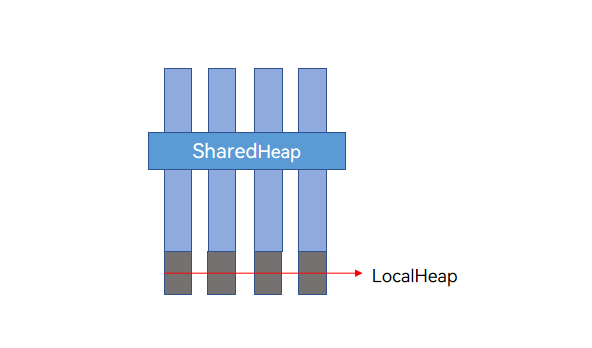

# Overview of Sendable Objects

In traditional JS engines, there is only one way to optimize the overhead of concurrent object communication: moving the implementation to the native side and reducing costs through the transfer or sharing of [Transferable objects](transferabled-object.md). However, this solution falls short of addressing the extensive demand for concurrent object communication. The issue remains unresolved in current JS engine implementations.

ArkTS introduces the concept of Sendable objects, which support pass-by-reference during concurrent communication.

Sendable objects are designed to be shareable across threads, maintaining a consistent reference to the same JS object before and after crossing thread boundaries. If a Sendable object contains JS or native content, it can be directly shared. However, if the underlying implementation is native, thread safety must be carefully considered. The following figure shows the communication process.



Unlike other ArkTS objects, Sendable objects must have a fixed type at runtime.

When multiple concurrent instances attempt to update Sendable data at the same time, data races occurs, such as multithreaded operations on [ArkTS shared container](arkts-collections-introduction.md). To address data race issues between concurrent instances and manage the timing of multithreaded data processing, ArkTS introduces the mechanisms of [asynchronous lock](arkts-async-lock-introduction.md) and [asynchronous waiting](arkts-condition-variable-introduction.md). Additionally, objects can be frozen using the [object freezing interface](sendable-freeze.md), making them read-only and thereby eliminating the risk of data races.

Sendable objects offer efficient communication between concurrent instances by means of pass by reference. They are generally suitable for scenarios where large custom objects need to be transferred between threads, such as when a child thread reads data from a database and returns it to the main thread.

## Basic Concepts

### Sendable Protocol

The Sendable protocol defines the Sendable object system and its specifications in ArkTS. Data that complies with the Sendable protocol (referred to as Sendable objects) can be passed between concurrent instances in ArkTS.

By default, Sendable data is passed by reference between concurrent instances (including the UI main thread, TaskPool thread, and Worker thread). Pass-by-copy is also supported.

### ISendable

The interface **ISendable** is introduced to the ArkTS common library [@arkts.lang](../reference/apis-arkts/js-apis-arkts-lang.md). It has no required methods or properties. ISendable is the parent type of all Sendable types except for null and undefined. ISendable is mainly used when you want to customize Sendable data structures. The class decorator [@Sendable decorator](#sendable-decorator) is the syntax sugar for implementing ISendable.

### Sendable Class

> **NOTE**
>
> Since API version 11, the \@Sendable decorator can be used to verify Sendable classes.

A Sendable class must meet the following requirements:

1. It must be decorated by [@Sendable](#sendable-decorator).

2. It must meet the Sendable constraints. For details, see [Usage Rules and Constraints for Sendable](sendable-constraints.md).

### Sendable Function

> **NOTE**
>
> - Since API version 12, the \@Sendable decorator can be used to verify Sendable functions.
>
> - To use a Sendable function in API version 12, you must configure "compatibleSdkVersionStage": "beta3" in the project. Otherwise, the function does not take effect. For details, see [build-profile.json5](https://developer.huawei.com/consumer/en/doc/harmonyos-guides-V5/ide-hvigor-build-profile-V5).

A Sendable function must meet the following requirements:

1. It must be decorated by [@Sendable](#sendable-decorator).

2. It must meet the Sendable constraints. For details, see [Usage Rules and Constraints for Sendable](sendable-constraints.md).

### Sendable Interface

A Sendable interface must meet the following requirements:

1. It must be [ISendable](#isendable) or inherit from [ISendable](#isendable).

2. It must meet the Sendable constraints. For details, see [Usage Rules and Constraints for Sendable](sendable-constraints.md).

### Sendable Data Types

- All ArkTS basic data types: boolean, number, string, bigint, null, and undefined.

- [Container types](arkts-collections-introduction.md) defined in ArkTS ([@arkts.collections](../reference/apis-arkts/js-apis-arkts-collections.md) must be explicitly introduced).

- [Asynchronous lock objects](arkts-async-lock-introduction.md) defined in ArkTS ([@arkts.utils](../reference/apis-arkts/js-apis-arkts-utils.md) must be explicitly introduced).

- [Asynchronous waiting objects](arkts-condition-variable-introduction.md) defined in ArkTS ([@arkts.utils](../reference/apis-arkts/js-apis-arkts-utils.md) must be explicitly introduced).

- Interfaces that inherit from [ISendable](#isendable).

- Classes decorated by [@Sendable](#sendable-decorator).

- Functions decorated by [@Sendable](#sendable-decorator).

- System objects that integrate Sendable, which are as follows:
  - [Sendable User Preferences](../reference/apis-arkdata/js-apis-data-sendablePreferences.md)
  - [Sendable Color Space Management](../reference/apis-arkgraphics2d/js-apis-sendableColorSpaceManager.md)
  - [Sendable Object-based Image Processing](../reference/apis-image-kit/js-apis-sendableImage.md)
  - [Resource Management](../reference/apis-localization-kit/js-apis-sendable-resource-manager.md)
  - [SendableContext Object Management](../reference/apis-ability-kit/js-apis-app-ability-sendableContextManager.md)

- Elements whose union type data is of the Sendable type.

> **NOTE**
>
> - Built-in JS objects are passed between concurrent instances following the structured clone algorithm, and their cross-thread behavior is pass-by-copy. Therefore, instances of JS built-in objects are not of the Sendable type.
>
> - Object literals and array literals are also passed between concurrent instances following the structured cloning algorithm, and their cross-thread behavior is pass-by-copy. Therefore, object literals and array literals are not of the Sendable type.


## Implementation Principle of Sendable

To implement pass-by-reference of [Sendable data](#sendable-data-types) between different concurrent instances, Sendable objects are allocated in a shared heap to achieve memory sharing across concurrent instances.


The shared heap is a process-level heap space. Unlike the local heap of a virtual machine, which can only be accessed by a single concurrent instance, the shared heap can be accessed by all threads. The cross-thread behavior of a Sendable object is pass-by-reference. Therefore, a Sendable object may be referenced by multiple concurrent instances, and its liveness depends on whether any concurrent instance holds a reference to it.

Relationship between the shared heap and local heap


The local heap of each concurrent instance is isolated, whereas the shared heap is a process-level heap that can be referenced by all concurrent instances. However, the shared heap cannot reference objects in the local heap.


## \@Sendable Decorator

The \@Sendable decorator declares and verifies Sendable classes and functions.

| \@Sendable Decorator| Description|
| -------- | -------- |
| Parameters| None.|
| Usage restrictions| It can be used only in projects of the stage model and only in .ets files.|
| Supported function types| Only regular functions and async functions can be decorated by @Sendable.|
| Class inheritance restrictions| Sendable classes can only inherit from other Sendable classes. Regular classes cannot inherit from Sendable classes.|
| Property type restrictions| 1. The following types are supported: string, number, boolean, bigint, null, undefined, Sendable class, collections.Array, collections.Map, collections.Set, and ArkTSUtils.locks.AsyncLock.<br>2. Closure variables are not allowed.<br>3. Private properties defined with \# are not supported; use **private** instead.<br>4. Computed properties are not supported.|
| Other property restrictions| Member properties must be initialized explicitly. They cannot be followed by exclamation marks (!).|
| Parameter restrictions for decorated functions or class methods| Local variables, parameters, and variables imported through **import** are allowed. Closure variables are not allowed, except for top-level Sendable classes and functions. Since API version 16, functions or class objects decorated by @Sendable can also access variables exported from the same file.|
| Restrictions for Sendable classes and functions| Adding or deleting properties is not allowed. Modifying properties is allowed, but the type must remain consistent before and after modification. Modifying methods is not supported.|
| Use scenario| 1. Scenarios where class methods or Sendable functions are used in TaskPool or Worker.<br>2. Scenarios involving large amounts of object data transmission. The time required for serialization increases with the data volume. After transforming data with Sendable, the efficiency of transmitting 100 KB of data is approximately 20 times higher, and for 1 MB of data, it is about 100 times higher.|

The following is an example of using the decorator on a class:

```ts
@Sendable
class SendableTestClass {
  desc: string = "sendable: this is SendableTestClass ";
  num: number = 5;
  printName() {
    console.info("sendable: SendableTestClass desc is: " + this.desc);
  }
  get getNum(): number {
    return this.num;
  }
}
```

The following is an example of using the decorator on a function:

```ts
@Sendable
type SendableFuncType = () => void;

@Sendable
class TopLevelSendableClass {
  num: number = 1;
  PrintNum() {
    console.info("Top level sendable class");
  }
}

@Sendable
function TopLevelSendableFunction() {
  console.info("Top level sendable function");
}

@Sendable
function SendableTestFunction() {
  const topClass = new TopLevelSendableClass(); // Top-level Sendable class.
  topClass.PrintNum();
  TopLevelSendableFunction(); // Top-level Sendable function.
  console.info("Sendable test function");
}

@Sendable
class SendableTestClass {
  constructor(func: SendableFuncType) {
    this.callback = func;
  }
  callback: SendableFuncType; // Top-level Sendable function.

  CallSendableFunc() {
    SendableTestFunction(); // Top-level Sendable function.
  }
}

let sendableClass = new SendableTestClass(SendableTestFunction);
sendableClass.callback();
sendableClass.CallSendableFunc();
```
