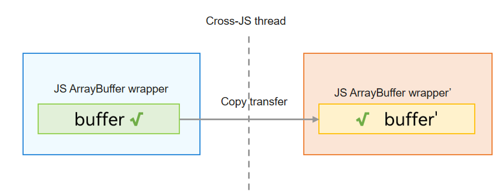
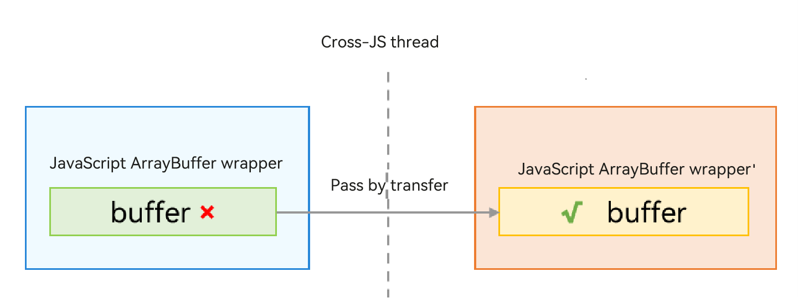

# ArrayBuffer Object

An ArrayBuffer object contains a block of native memory, and its JS object wrapper is allocated in the local heap of the virtual machine. Similar to a regular object, an ArrayBuffer object requires serialization and deserialization. However, the native memory can be passed in two ways: pass-by-copy and pass-by-transfer.

When pass-by-copy is used, a deep copy (recursive traversal) is required, and both threads can independently access the ArrayBuffer object after the transmission. The following figure shows the communication process.



If pass-by-transfer is used, the original thread can no longer use the ArrayBuffer object. During inter-thread communication, only the JS shell needs to be reconstructed, and the native memory does not need to be copied, resulting in higher efficiency. The following figure shows the communication process.



ArrayBuffer objects can be used to represent resources such as images. In application development, scenarios requiring image processing (such as adjusting an image's brightness, saturation, or size) are common. To avoid blocking the UI main thread, images can be passed to child threads to perform these operations. Pass-by-transfer is more performant, but the original thread can no longer access the ArrayBuffer object. If both threads need access, pass-by-copy should be used; otherwise, pass-by-transfer is recommended to enhance performance.

The following describes how to pass an image to a child thread using both methods.

## Pass-by-Copy

In ArkTS, TaskPool defaults to passing ArrayBuffer data by transfer. By calling the **setTransferList()** interface, you can specify which parts of the data should be passed by transfer, while the rest can be switched to pass-by-copy.

First, implement an interface for processing the ArrayBuffer that will be executed in the Task.

Then, pass the ArrayBuffer data to the Task by copy and process it within the Task.

Finally, the UI main thread receives the ArrayBuffer data returned after the Task execution and concatenates the data for display.

```ts
// Index.ets
import { taskpool } from '@kit.ArkTS';
import { BusinessError } from '@kit.BasicServicesKit';

@Concurrent
function adjustImageValue(arrayBuffer: ArrayBuffer): ArrayBuffer {
  // Perform operations on the ArrayBuffer.
  return arrayBuffer;  // The return value is passed by transfer by default.
}

function createImageTask(arrayBuffer: ArrayBuffer, isParamsByTransfer: boolean): taskpool.Task {
  let task: taskpool.Task = new taskpool.Task(adjustImageValue, arrayBuffer);
  if (!isParamsByTransfer) { // Whether to use pass-by-transfer.
    // Pass an empty array [] to indicate that all ArrayBuffer parameters should be passed by copy.
    task.setTransferList([]);
  }
  return task;
}

@Entry
@Component
struct Index {
  @State message: string = 'Hello World';

  build() {
    RelativeContainer() {
      Text(this.message)
        .id('HelloWorld')
        .fontSize(50)
        .fontWeight(FontWeight.Bold)
        .alignRules({
          center: { anchor: '__container__', align: VerticalAlign.Center },
          middle: { anchor: '__container__', align: HorizontalAlign.Center }
        })
        .onClick(() => {
          let taskNum = 4;
          let arrayBuffer = new ArrayBuffer(1024 * 1024);
          let taskPoolGroup = new taskpool.TaskGroup();
          // Create taskNum tasks.
          for (let i: number = 0; i < taskNum; i++) {
            let arrayBufferSlice: ArrayBuffer = arrayBuffer.slice(arrayBuffer.byteLength / taskNum * i, arrayBuffer.byteLength / taskNum * (i + 1));
            // To pass the ArrayBuffer object by copy, set isParamsByTransfer to false.
            taskPoolGroup.addTask(createImageTask(arrayBufferSlice, false));
          }
          // Execute the tasks.
          taskpool.execute(taskPoolGroup).then((data) => {
            // Concatenate the results to obtain the final result.
          }).catch((e: BusinessError) => {
            console.error(e.message);
          })
        })
    }
    .height('100%')
    .width('100%')
  }
}
```

## Pass-by-Transfer

TaskPool defaults to passing ArrayBuffer data by transfer, and the original thread can no longer use the ArrayBuffer passed to the child thread. To achieve this, simply remove the **task.setTransferList** interface call in the preceding code, meaning the second parameter of **createImageTask** should be **true**.
