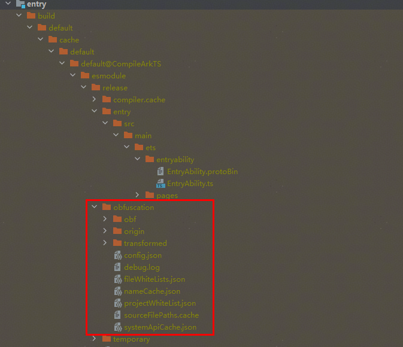
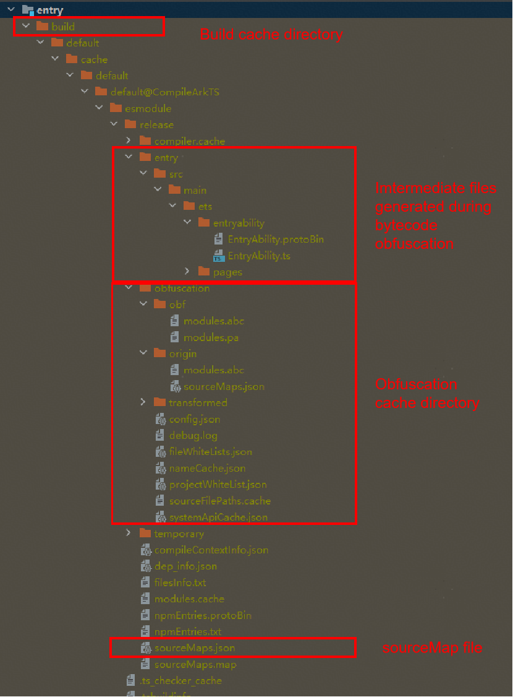

# Using ArkGuard for Bytecode Obfuscation

> **NOTE**
>
> When releasing a version, to prevent subsequent code modifications from affecting production issue analysis and troubleshooting, you are advised to back up all files in the **build/default/cache/default/default@XXXCompileArkTS/esmodule/release/obfuscation** directory locally. If possible, you can directly back up the entire **release** directory.

## Enabling Bytecode Obfuscation

### How to Use

Bytecode obfuscation has been integrated into the system and can be enabled for use in DevEco Studio.

* Enabling the obfuscation switch

    To enable obfuscation, set the **enable** field to **true** under **arkOptions.obfuscation.ruleOptions** in the **build-profile.json5** file of your module.

    ```txt
    "arkOptions": {
        "obfuscation": {
            "ruleOptions": {
                "enable": true,
                "files": ["./obfuscation-rules.txt"],
            }
        }
    }
    ```

    To configure obfuscation options, manually edit the **obfuscation-rules.txt** file specified in the **files** field. Enable the following obfuscation options:

    ```txt
    -enable-bytecode-obfuscation # Activates bytecode obfuscation when enabled.
    -enable-bytecode-obfuscation-debugging  # Controls debug output. If this option is enabled, obfuscation logs are generated. By default, this option is disabled.
    ```

    > **NOTE**
    >
    > Bytecode HAR files will not be re-obfuscated during integration.

* Configuring obfuscation rules

    Enabling the bytecode obfuscation switch activates the default settings, which include obfuscation of functions and classes that are not in the top-level scope. To enable additional obfuscation features, customize the **obfuscation-rules.txt** file specified in the **files** field. Note that the default values in this file may vary across different versions of DevEco Studio.

    For example, in DevEco Studio of version 5.0.3.600 and later, the obfuscation configuration file is as follows, which indicates that property name obfuscation, top-level scope name obfuscation, file name obfuscation, and imported/exported name obfuscation are enabled.

    ```txt
    -enable-property-obfuscation
    -enable-toplevel-obfuscation
    -enable-filename-obfuscation
    -enable-export-obfuscation
    ```

    You can also add comments to the obfuscation rule file by prefixing lines with the # symbol. For example:

    ```txt
    # options:
    -enable-property-obfuscation
    -enable-toplevel-obfuscation
    -enable-filename-obfuscation
    # -enable-export-obfuscation
    -keep-property-name # white list for dynamic property names
    ```

    For details about how to configure obfuscation options, see [Obfuscation Configuration Guidelines](#obfuscation-configuration-guidelines). For details about all configuration files involved in obfuscation, see [Obfuscation Configuration Files](#obfuscation-configuration-files).

    > **NOTE**
    >
    > By default, obfuscation is disabled for new projects. If you want to enable obfuscation, set the **ruleOptions.enable** field in the **build-profile.json5** file of the module to **true**. If required, enable the **-enable-bytecode-obfuscation** and **-enable-bytecode-obfuscation-debugging** options in the **obfuscation-rules.txt** file. By default, the following four recommended obfuscation options are enabled in the **obfuscation-rules.txt** file:** -enable-property-obfuscation**, **-enable-toplevel-obfuscation**, **-enable-filename-obfuscation**, and **-enable-export-obfuscation**. You can customize the obfuscation settings as needed.

* Specifying release compilation

    Currently, bytecode obfuscation is supported only for release builds, not for debug builds. This means that obfuscation will only be applied when a module is compiled in release mode, not in debug mode. You can view and modify the build mode by referring to [Specifying a Build Mode](https://developer.huawei.com/consumer/en/doc/harmonyos-guides/ide-hvigor-compilation-options-customizing-guide#section192461528194916).

    > **NOTE**
    >
    > The differences between release and debug builds extend beyond obfuscation. To determine whether application behavior differences are due to obfuscation, you should enable or disable the obfuscation switch rather than simply switching between release and debug builds.

### Obfuscation Configuration Files

* `obfuscation-rules.txt`

    For HAP, HAR, and HSP modules, the **arkOptions.obfuscation.ruleOptions.files** field in the **build-profile.json5** file specifies obfuscation rules applied during module compilation. A default **obfuscation-rules.txt** file is created when a new project is set up.

* `consumer-rules.txt`

    For HAR and HSP modules, an additional **arkOptions.obfuscation.consumerFiles** field is available in the **build-profile.json5** file. This field specifies obfuscation rules that should be applied when this package is depended upon in other modules. A default **consumer-rules.txt** file is created when a new HAR or HSP module is set up. The key difference between **consumer-rules.txt** and **obfuscation-rules.txt** is as follows: **obfuscation-rules.txt** applies to the compilation of the current module, whereas **consumer-rules.txt** applies to the compilation of other modules that depend on the current module.

    ```txt
    "arkOptions": {
        "obfuscation": {
            "ruleOptions": {
                "enable": true,
                "files": ["./obfuscation-rules.txt"],
        }
        "consumerFiles": ["./consumer-rules.txt"]
        }
    }
    ```

* `obfuscation.txt`

    Unlike the above two files, **obfuscation.txt** is automatically generated based on **consumer-rules.txt** and the obfuscation rules of dependent modules during HAR or HSP compilation. It exists as a compilation product within the released HAR or HSP package and used to apply obfuscation rules when other applications use this package. For details about the generation and logic of **obfuscation.txt**, see [Obfuscation Rule Merging Strategies](bytecode-obfuscation.md#obfuscation-rule-merging-strategies).

    > **NOTE**
    >
    > For third-party libraries, the **obfuscation.txt** file only takes effect when the module's **oh-package.json5** file depends on the library. If the dependency is specified in the project's **oh-package.json5** file, the **obfuscation.txt** file in the third-party library will not take effect.

The following table summarizes the differences between these configuration files.

| Configuration File| Configuration Type|  Modifiable |  Affects Obfuscation of This Module |  Affects Obfuscation of Other Modules |
| --- | --- | --- | --- | --- |
| obfuscation-rules.txt | Customizable | Yes| Yes| No|
| consumer-rules.txt    | Customizable | Yes| No| Yes|
| obfuscation.txt       | Compilation product| Not applicable (automatically generated during HAR or HSP compilation)| Not applicable| Yes|

### Obfuscation Configuration Guidelines

1. When **-enable-toplevel-obfuscation** is configured, access to global variables using **globalThis** fails. To rectify the fault, use **-keep-global-name** to retain the global variable name.
2. After the preceding option is enabled, configure **-enable-property-obfuscation**,
    1. If the code statically defines properties but dynamically accesses them (or vice versa), use **-keep-property-name** to retain the property names. Example:

        ```ts
        // Static definition, dynamic access: The property name is static during object definition, but is accessed by dynamically constructing the property name (usually using string concatenation).
        const obj = {
        staticName: value  // Static definition
        };
        const fieldName = 'static' + 'Name';  // Dynamic construction of the property name
        console.log(obj[fieldName]);  // Use square bracket notation to dynamically access the property.
        ```

        ```ts
        // Dynamic definition, static access: The property name is determined during object definition through a dynamic expression, but is statically accessed using dot notation (assuming that you know the result of the property name).
        const obj = {
        [dynamicExpression]: value  // Dynamic definition
        };
        console.log(obj.dynamicPropertyName);  // Use dot notation to statically access the property.
        ```

    2. If the code uses dot notation to access fields not defined in ArkTS/TS/JS code (for example, native so libraries, fixed JSON files, or database fields):
        1. For API calls to so libraries (for example, **import testNapi from 'library.so'; testNapi.foo();**), use **-keep-property-name** to retain the property name **foo**.
        2. For fields in JSON files, use **-keep-property-name** to retain the JSON field names.
        3. For database-related fields, use **-keep-property-name** to retain the database field names.
    3. When building a HAR module for use by other modules, use **-keep-property-name** in the **consumer-rules.txt** file of the HAR module to retain properties that should not be re-obfuscated. The **consumer-rules.txt** file generates the **obfuscation.txt** file during HAR compilation. When the HAR module is depended upon by other modules, DevEco Studio parses the **obfuscation.txt** file to read the trustlist.
    4. Verify application functionality and identify any missed scenarios. If the application functionality is abnormal, find the code of the error line in the corresponding [intermediate products](#viewing-obfuscation-effects) based on the obfuscated error stack, identify the necessary trustlist configurations, and use **-keep-property-name** to retain them.

3. After the preceding adaptations are successful, configure **-enable-export-obfuscation**, and perform adaptation in the following scenarios:
    1. For HSP modules that provide interfaces and properties to other modules, use **-keep-global-name** to retain the interface names and **-keep-property-name** to retain the property names in exposed classes/interfaces.
    2. When building HAR modules for use by other modules, use **-keep-global-name** to retain interface names and **-keep-property-name** to retain the property names in exposed classes/interfaces in the **obfuscation-rules.txt** file.
    3. For API calls to so libraries (for example, **import { napiA } from 'library.so'**), use **-keep-global-name** to retain the so interface name **napiA**.
    4. Verify application functionality and interface call functionality when the module is depended upon, and identify any missed scenarios. If the application functionality is abnormal, find the code of the error line in the corresponding [intermediate products](#viewing-obfuscation-effects) based on the obfuscated error stack, identify the necessary trustlist configurations, and retain them.
4. After the preceding adaptations are successful, configure **-enable-filename-obfuscation**, and perform adaptation in the following scenarios:
    1. If the code contains dynamic import statements (for example, `const path = './filePath';  import (path)`), use **-keep-file-name filePath** to retain the file path.
    2. If the application has a [routerMap configuration](https://developer.huawei.com/consumer/en/doc/harmonyos-guides/module-configuration-file#routermap) that describes routing information, use **-keep-file-name** to retain the page's source file path, which is specified by **pageSourceFile** field in the routing information.
    3. If the code uses **ohmUrl** for page navigation (for example, `router.pushUrl({url: '@bundle:com.example.routerPage/Library/Index'})`), use **-keep-file-name** to retain the path.
    4. Verify application functionality and identify any missed scenarios. If the application function is abnormal and the error stack contains obfuscated paths, you can query the original path in the **build/default/[...]/release/obfuscation/nameCache.json** file within the module and then locate the source code file. You can also use the [hstack plugin](https://developer.huawei.com/consumer/en/doc/harmonyos-guides/ide-command-line-hstack) to trigger automatic deobfuscation of error stacks. After locating the paths to retain, use **-keep-file-name** to retain them.

## Remarks

Currently, custom obfuscation plugins are not supported in the hvigor build process.

## Viewing Obfuscation Effects

After obfuscation is complete, intermediate products are generated. You can find the obfuscated intermediate products in the **build** directory of the compilation output, as well as the name mapping file and system API trustlist files.

* Directory of the name mapping file and system API trustlist file: build/default/[...]/release/obfuscation
* The name mapping file, named **nameCache.json**, records the mappings between bytecode names and names after obfuscation.
* The system API trustlist file, named **systemApiCache.json**, records the APIs and property names that will not be obfuscated.
* **obf** directory: contains the obfuscated **modules.abc** and **modules.pa** files. (The **modules.pa** file is generated when -**enable-bytecode-obfuscation-debugging** is enabled.)
* **origin** directory: contains the original **modules.abc** file before obfuscation.
* Configuration file: **config.json**, which records the obfuscation configuration items and trustlist.



## Deobfuscating Error Stacks

In applications that have undergone obfuscation, code names are changed, making the error stacks printed during crashes harder to understand because they do not match the source code exactly. You can use the [hstack plugin](https://developer.huawei.com/consumer/en/doc/harmonyos-guides/ide-command-line-hstack) in Command Line Tools of DevEco Studio to deobfuscate the source code stack and analyze issues.
The deobfuscation tool requires the **sourceMaps.json** file and the obfuscation name mapping file **nameCache.json** generated during compilation. Be sure to back them up locally. Back up the **release** directory if possible to facilitate fault locating and analysis.


