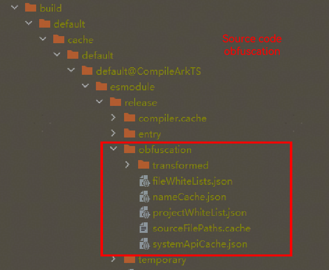
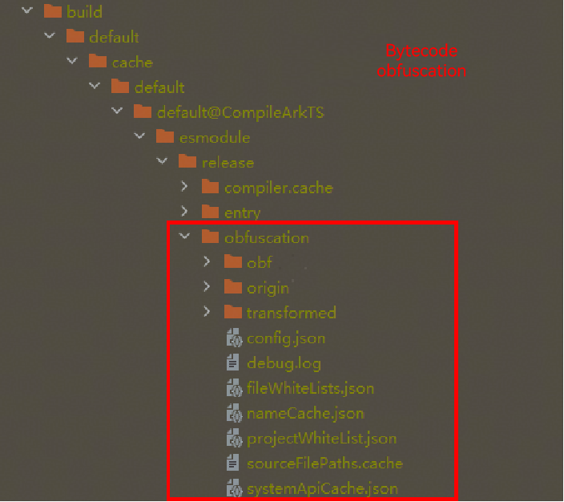

# Common Issues with ArkGuard Bytecode Obfuscation
<!--Kit: ArkTS-->
<!--Subsystem: ArkCompiler-->
<!--Owner: @oatuwwutao-->
<!--Designer: @hufeng20-->
<!--Tester: @kirl75; @zsw_zhushiwei-->
<!--Adviser: @foryourself-->

## Differences Between Bytecode Obfuscation and Source Code Obfuscation

### Differences in Obfuscation Scope

**JSON Files**
When the **-enable-filename-obfuscation** option is enabled in bytecode obfuscation, JSON file names are obfuscated.

### Differences in Obfuscation Options

1. Bytecode obfuscation is disabled by default. After [enabling obfuscation](bytecode-obfuscation-guide.md#how-to-use), you need to additionally configure **-enable-bytecode-obfuscation** and **-enable-bytecode-obfuscation-debugging** in the **obfuscation-rules.txt** file in the module directory.
2. Bytecode obfuscation does not support the **-remove-comments** option.

### Differences in File Structure After Obfuscation

 **Directory Differences**

 

After bytecode obfuscation, the **obf** and **origin** folders and the **config.json** file are added to the **obfuscation** directory. For details, see [Viewing Obfuscation Effects](bytecode-obfuscation-guide.md#viewing-obfuscation-effects).

**File Content Differences**

nameCache.json file:

After source code obfuscation:

```txt
{
  "entry/src/main/ets/entryability/EntryAbility.ets": {
    "IdentifierCache": {
      "#UIAbility": "UIAbility",
       ......
      "#testObject": "i",
      "#EntryAbility": "j"
    },
    "MemberMethodCache": {
        ....
    },
    "obfName": "entry/src/main/ets/entryability/EntryAbility.ets"
  },
     ......
  },
  "compileSdkVersion": "5.0.0.70",
  "entryPackageInfo": "entry|1.0.0",
  "PropertyCache": {
      ......
  },
  "FileNameCache": {
      ......
  }
}
```

After bytecode obfuscation:

```json
{
  "entry/src/main/ets/entryability/EntryAbility.ets": {
    "IdentifierCache": {
      "#EntryAbility": "a",
      "#testObject": "c"
    },
    "MemberMethodCache": {
      "EntryAbility:0:0": "a",
     ......
    },
    "obfName": "entry/src/main/ets/entryability/EntryAbility.ets",
    "OriSourceFile": "entry|entry|1.0.0|src/main/ets/entryability/EntryAbility.ts",
    "ObfSourceFile": "entry|entry|1.0.0|src/main/ets/entryability/EntryAbility.ts"
  },
 ......
  "entryPackageInfo": "entry|1.0.0",
  "compileSdkVersion": "5.0.0.70",
  "PropertyCache": {
   ......
  },
  "FileNameCache": {
   ......
  }
}
```

1. Difference in bytecode obfuscation in **IdentifierCache**:
    1. Function parameter names are not obfuscated.
    2. There are no obfuscation name mappings for anonymous functions.
2. When the -enable-filename-obfuscation option is enabled, the **OriSourceFile** (source file path before obfuscation) and **ObfSourceFile** (source file path after obfuscation) fields are generated for bytecode obfuscation, but not for source code obfuscation.

### Precautions for Switching

**Differences in UI Obfuscation**

Bytecode obfuscation does not provide UI obfuscation.
Since UI components in bytecode have many string bindings for properties, methods, classes, and variables, bytecode obfuscation uses a system trustlist scanning mechanism to ensure normal functionality.

**Binding Properties with Strings as Function Parameters**

Source code:

```ts
@Component
export struct MainPage {
	@State messageStr: string = 'Hello World';
    
    build() {
    }
}
```

Intermediate file:

```abc
this.__messageStr = new ObservedPropertySimplePU('Hello World', this, "messageStr");
```

During the intermediate file conversion process, **message** is bound as a literal; however, if **messageStr** is obfuscated but the string parameter of this method is not, it can cause UI failure.

**Solution**: Collect all members in the struct and add them to the trustlist to prevent obfuscation. Currently, since bytecode obfuscation does not provide UI obfuscation, the system automatically identifies and adds them to the trustlist, eliminating the need for your configuration.

**Binding Properties in Bytecode with Strings**

Source code:

```ts
// Sample.ets
import { Type } from '@kit.ArkUI';

// Data center
@ObservedV2
class SampleChild {
	@Trace p123: number = 0;
    p2: number = 10;
}

@ObservedV2
export class Sample {
    // For complex objects, use the @Type decorator to ensure successful serialization.
    @Type(SampleChild)
    @Trace f123: SampleChild = new SampleChild();
}

@ObservedV2
class Info {
	@Trace sample: Sample = new Sample();
}
```

Bytecode file:

```abc
tryldglobalbyname 0x136, Trace
sta v2
lda v0
ldobjbyname 0x137, prototype
sta v3
lda.str sample
sta v4
lda v2
callargs2 0x2c, v3, v4
lda v0
ldobjbyname 0x139, prototype
sta v2
lda.str sample
sta v3
lda v1
callargs2 0x2e, v2, v3
```

The bytecode contains a global **Trace** object that links properties using the string **sample**.

**Solution**: During bytecode obfuscation, the system scans for decorators and automatically add any parameters decorated with @Trace to the trustlist. Therefore, you do not need to set this up manually.

## Troubleshooting Functional Issues

**Procedure**

1. Configure the **-disable-obfuscation** option in the **obfuscation-rules.txt** file to disable obfuscation, and check whether the issue is caused by obfuscation.
2. If the issue is related to obfuscation, review the documentation to understand the capabilities of [obfuscation rules](bytecode-obfuscation.md#obfuscation-options) and understand when to [configure trustlists](bytecode-obfuscation.md#summary-of-existing-retention-options) to avoid issues.
3. If your issue matches any cases listed below, apply the suggested solutions.
4. If the issue is not covered, use a positive approach to identify the problem (remove specific configuration items if the corresponding functionality is not needed).
5. Analyze runtime crashes as follows:
    a. Open the application runtime logs or the **Crash** dialog box in DevEco Studio to find the crash stack.
    b. The line number in the crash stack is the line number of the build product, and the method name may also be the obfuscated name. Therefore, you are advised to check the build product based on the crash stack, analyze the names that cannot be obfuscated, and add them to the trustlist.
6. Analyze functional exceptions (for example, white screens) as follows:
    a. Opening the application runtime logs: Select HiLog and search for logs directly related to the exceptions.
    b. Locating the problematic code segment: Identify the specific code block causing the exceptions through log analysis.
    c. Enhancing log output: Add log records for data fields in the suspected code segment.
    d. Analyzing and identifying critical fields: Determine if the data exception is caused by obfuscation through the enhanced log output.
    e. Configuring a trustlist for critical fields: Add fields that directly affect application functionality after obfuscation to the trustlist.

## Handling Common Configuration Issues

### No .pa File Generated When enable-bytecode-obfuscation-debugging Is Configured

Ensure that **Build Mode** is set to **release**. Check that **"compatibleSdkVersionStage": "beta3"** is configured in the **build-profile.json5** file in the root directory. Then enable bytecode obfuscation in the **obfuscation-rules.txt** file of each module.

### Viewing Obfuscation Effects

After obfuscation is complete, intermediate products are generated. You can find the obfuscated intermediate products in the **build** directory of the compilation output, as well as the name mapping file and system API trustlist files.
-  Obfuscated file directory: build/default/[...]/release/obfuscation/obf
-  Directory of the name mapping file and system API trustlist file: build/default/[...]/release/obfuscation


- The name mapping file, named **nameCache.json**, records the mappings between source code names and names after obfuscation.
- The system API trustlist file, named **systemApiCache.json**, records the APIs and property names that will be kept.


## Handling Compilation Errors

**Case 1: The error message "ERROR: [Class]get different name for method." is displayed.**

**Symptom**: @CustomDialog is used to customize a dialog box, and another dialog box is displayed inside. After bytecode obfuscation is enabled, the build fails, and the following error information is displayed:
Error message: ArkTSCompilerError: ArkTS:ERROR Failed to execute ByteCode Obfuscate.
Error message: [Class]get different name for method:&entry/src/main/ets/pages/XXXX&.#~@0>#setController^1.

```ts
// Code 1
@CustomDialog
export default struct TmsDialog {
	controller?: CustomDialogController
    dialogController:CustomDialogController
    
    build() {
    }
}

// Code 2
@CustomDialog
struct Index{
	controller?: CustomDialogController
    dialogController?:CustomDialogController
    
    build() {
    }
}
```

**Possible Causes**

In this example, when a custom dialog box pops up another dialog box, or when two **CustomDialogController** objects are defined in a UI, the ETS code is converted to TS, resulting in two identical **setController** functions, causing the bytecode obfuscation to fail.

**Solution**

```ts
@CustomDialog
export default struct TmsDialog {
    controller?: CustomDialogController
    dialogController:CustomDialogController|null = null;  // Modify the definition declaration mode.

    build() {
    }
}
```

In code 1, the dialogController cannot be properly displayed up at runtime. You only need to change the code to the code in the solution. The dialogController will be displayed normally, and the bytecode obfuscation feature will work as expected.

In code 2, since only CustomDialogController is used, the @CustomDialog is not needed and can be directly removed. After removal, the function works normally, and the bytecode obfuscation feature works as expected.

From API version 18 onwards, the preceding sample code cannot be compiled properly. In the new version, one @CustomDialog component can have only one uninitialized CustomDialogController.

## Handling Runtime Exceptions

### Errors That May Occur When -enable-property-obfuscation Is Configured

**Case 1: The error message "Cannot read property 'xxx' of undefined" is reported.**

```ts
// Example JSON file structure (test.json):
/*
{
  "jsonObj": {
    "jsonProperty": "value"
  }
}
*/

// Before obfuscation:
import jsonData from "./test.json";

let jsonProp = jsonData.jsonObj.jsonProperty;

// After obfuscation:
import jsonData from "./test.json";

let jsonProp = jsonData.i.j;
```

After property name obfuscation is enabled, **jsonProperty** is obfuscated as a random character **j**. However, the original name is used in the JSON file, causing the error.
**Solution**: Use the **-keep-property-name** option to add the fields used in JSON files to the trustlist.

**Case 2: An error message is reported when database-related fields are used and property obfuscation is enabled.**

The error message is "table Account has no column named a23 in 'INSERT INTO Account(a23)'."
The SQL statement uses database field names that are obfuscated, whereas the database expects the original names.
**Solution**: Use the **-keep-property-name** option to add the database fields to the trustlist.

**Case 3: Properties are obfuscated when Record<string, Object> is used as an object type.**

**Symptom**
When **Record<string, Object>** is used as an object type, properties like **linkSource** are obfuscated, causing the error. Example:

```ts
// Before obfuscation:
import { Want } from '@kit.AbilityKit';

let petalMapWant: Want = {
	bundleName: 'com.example.myapplication',
    uri: 'maps://',
    parameters: {
    	linkSource: 'com.other.app'
    }
}
```
```ts
// After obfuscation:
import type Want from "@ohos:app.ability.Want";

let petalMapWant: Want = {
	bundleName: 'com.example.myapplication',
    uri: 'maps://',
    parameters: {
        i: 'com.other.app'
    }
};
```

**Possible Causes**

In this example, the object's properties need to be passed to the system to load a specific page, so the property names should not be obfuscated. The type **Record<string, Object>** is a generic definition for an object with string keys and does not describe the internal structure or property types in detail. Therefore, the obfuscation tool cannot identify which properties should not be obfuscated, leading to the obfuscation of internal property names like **linkSource**.

**Solution**

Add the problematic property names to the property trustlist. The following is an example:

```txt
-keep-property-name
linkSource
```

**Case 4: Properties of decorators marked with @Type and @Trace do not work properly after obfuscation.**

**Symptom**

The properties of decorators marked with @Type and @Trace can be obfuscated properly, but the functionality becomes abnormal.

```ts
// Sample.ets
import { Type } from '@kit.ArkUI';

@ObservedV2
class SampleChild {
	@Trace p123: number = 0;
    p2: number = 10;
}

@ObservedV2
export class Sample {
	// For complex objects, use the @Type decorator to ensure successful serialization.
    @Type(SampleChild)
    @Trace f123: SampleChild = new SampleChild();
}

// Call the API.
// a.ets
import { PersistenceV2 } from '@kit.ArkUI';
import { Sample } from './Sample';

@Entry
@ComponentV2
struct Page {
	prop: Sample = PersistenceV2.connect(Sample, () => new Sample())!;
    
    build() {
    	Column() {
        	Text(`Page1 add 1 to prop.p1: ${this.prop.f123.p123}`)
        }
    }
}
```

After obfuscation, **p123** and **f123** are correctly replaced, but when processing the **Trace** and **Type** decorator properties, **p123** and **f123** are identified as strings and not obfuscated, leading to failed calls.

**Possible Causes**

Decorator-marked property names should be retained, and properties decorated with the combination of @Type and @Trace decorators should also be retained.

**Solution**

Use the **-keep-property-name** option to add properties within types that are not directly exported to the trustlist. Example:

```txt
-keep-property-name
f123
p123
```

**Case 5: Problems that may occur when both -enable-property-obfuscation and -keep are enabled.**

**Symptom**
The following obfuscation configuration is used:

```txt
-enable-property-obfuscation
-keep
./file1.ts
```

**file2.ts** imports an interface from **file1.ts**, and the interface contains object-type properties. As a result, these properties are retained in **file1.ts** but obfuscated in **file2.ts**, leading to function exceptions. Example:

```ts
// Before obfuscation:
// file1.ts
export interface MyInfo {
	age: number;
    address: {
    	city1: string;
    }
}
// file2.ts
import { MyInfo } from './file1';

const person: MyInfo = {
	age: 20,
    address: {
    	city1: "shanghai"
    }
}

// After obfuscation, the code of file1.ts is retained.
// file2.ts
import { MyInfo } from './file1';

const person: MyInfo = {
	age: 20,
    address: {
    	i: "shanghai"
    }
}
```

**Possible Causes**

-The **-keep** option retains the code in the **file1.ts** file, but properties within exported types (for example, **address**) are not automatically added to the property trustlist. Therefore, these properties are obfuscated when being used in other files.

**Solution**

Solution 1: Define the property type using **interface** and export it. This will automatically add the property to the trustlist. Example:

```ts
// file1.ts
export interface AddressType {
	city1: string
}
export interface MyInfo {
	age: number;
    address: AddressType;
}
```

Solution 2: Use the **-keep-property-name** option to add properties within types that are not directly exported to the trustlist. Example:

```ts
-keep-property-name
city1
```

### Errors That May Occur When -enable-export-obfuscation and -enable-toplevel-obfuscation Are Configured

When the two options are configured, method name confusion in the following scenarios is involved when the main module calls the methods of other modules:
|Main Module|Dependent Module|Imported/Exported Name Obfuscation|
|-------|--------|---------|
|HAP/HSP|	HSP	|The HSP and main module are built independently, and different names are generated after obfuscation. Therefore, a trustlist must be configured for both the HSP and main module.|
|HAP/HSP|	Local HAR|The local HAR is built together with the main module. After obfuscation, the names are the same.|
|HAP/HSP|	Third-party library|	The names and properties exported from a third-party library are collected to the trustlist. They are not confused during import and export.|

For the HSP, you must add the methods used by other modules to the trustlist. You must add the same trustlist for the main module. Therefore, you are advised to add the obfuscation file configured with the trustlist (for example, **hsp-white-list.txt**) to the obfuscation configuration item of the module that depends on the obfuscation file, that is, the **files** field shown in the following figure.


**Case 1: When a class is dynamically imported, the class definition is confused, but the class name is not, causing an error.**

```ts
// Before obfuscation:
// utils.ts
export function add(a: number, b: number): number {
	return a + b;
}

// main.ts
async function loadAndUseAdd() {
	try {
    	const mathUtils = await import('./utils');
    	const result = mathUtils.add(2, 3);
    } catch (error) {
    	console.error('Failure reason:', error);
    }
}

loadAndUseAdd();
```
```ts

// After obfuscation:
// utils.ts
export function c1(d1: number, e1: number): number {
    return d1 + e1;
}

// main.ts
async function i() {
    try {
        const a1 = await import("@normalized:N&&&entry/src/main/ets/pages/utils&");
        const b1 = a1.add(2, 3);
    }
    catch (z) {
        console.error('Failure reason:', z);
    }
}
i();
```

The **add** function is in the top-level scope when it is defined, but is considered as a property when it is accessed through **.add**. Because the **-enable-property-obfuscation** option is not configured, the property name is not obfuscated during the call.

**Solution**

Solution 1: Configure the **-enable-property-obfuscation** option.

Solution 2: Use **-keep-global-name** to configure **add** to the trustlist.


**Case 2: For a method in a namespace, the method definition is confused, but the statement that uses the method is not, causing an error.**

```ts
// Before obfuscation:
// export.ts
export namespace NS {
	export function foo() {}
}

// import.ts
import { NS } from './export';

NS.foo();
```
```ts
// After obfuscation:
// export.ts
export namespace i {
	export function j() {}
}

// import.ts
import { i } from './export';

i.foo();
```

**foo** in the namespace is an export element and is considered as a property when being called by **NS.foo**. Because the **-enable-property-obfuscation** option is not configured, the property name is not obfuscated during the call.

**Solution**

1. Configure the **-enable-property-obfuscation** option.
2. Use the **-keep-global-name** option to add the methods exported from the namespace to the trustlist.

**Case 3: When declare global is used, a syntax error is reported after obfuscation.**

```ts
// file.ts
// Before obfuscation:
declare global {
	var myAge : string
}

// After obfuscation:
declare a2 {
	var b2 : string
}
```

The error message "SyntaxError: Unexpected token" is reported.

**Solution**

Use **-keep-global-name** to add **global** to the trustlist.

Since API version 18, **global** has been added to the system trustlist. You do not need to configure **-keep-global-name**.

**Case 4: When Reflect.defineMetadata() is used, a message is displayed indicating that the function cannot be found after obfuscation.**

**Symptom**

When **-enable-toplevel-obfuscation** is configured, bytecode obfuscation works normally, but a runtime error is reported. The error log is as follows:

```txt
Error message:is not callable
Stacktrace: Cannot get SourceMap info, dump raw stack: at anonymous (ads_service|@hw-ads/ohos-ads-model|1.0.1|src/main/ets/annotations/FieldType.ts:6:1.
```

```js
// oh-package.json5
"dependencies": {
  "reflect-metadata": "0.2.1"
}
  
// test.ts
import 'reflect-metadata';

// Call the code.
export const FIELD_TYPE_KEY = Symbol('fieldType');
export function FieldType(...types: Function[]): PropertyDecorator {
    return (target, key) => {
    	Reflect.defineMetadata(FIELD_TYPE_KEY, types, target, key);
    };
}
```

**Possible cause**

When **-enable-toplevel-obfuscation** is configured, the function name in the Reflect file is obfuscated, but the string "defineMetadata" in the exporter function is not obfuscated. As a result, when the **Reflect.defineMetadata** is used externally, the corresponding function cannot be found.

**Solution**

Use **-keep-global-name** to add **defineMetadata** to the trustlist. Since the Reflect file uses exporter multiple times, you are advised to use the **-keep** option directly.

```txt
-keep
../xxx/xxx/xxx/Reflect.ts  // Use the relative path of the file.
```

### The **-enable-string-property-obfuscation** option is not configured, but the string literal property name is obfuscated. As a result, the value of the string literal property name is undefined.

```ts
// file.ts
// Before obfuscation:
const person = {
    myAge: 18
}
person["myAge"] = 20;
```
```ts
// file.ts
// After obfuscation:
const person = {
    myAge: 18
}
person["m"] = 20;
```

**Solution**

1. Check whether **-enable-string-property-obfuscation** is configured for the dependent HAR. If it is configured, the main project will be affected, and you should disable it.
2. If it must be configured, add the property name to the trustlist.
3. If it is not configured and the SDK version is earlier than 4.1.5.3, update the SDK.

### Errors That May Occur When -enable-filename-obfuscation Is Configured

**Case 1: The error message "Error Failed to get a resolved OhmUrl for 'D:code/MyApplication/f12/library1/pages/d.ets' imported by 'undefined'" is reported.**

As shown below, the outer layer of the **library1** module contains a directory named **directory**. When file name obfuscation is enabled, **directory** is obfuscated as **f12**, causing the error indicating that the path is not found.


**Solution**

1. If the project directory structure and error message are similar, update the SDK to 5.0.0.26 or later.
2. Use the **-keep-file-name** option to add the directory name **directory** of the module to the trustlist.

**Case 2: The error message "Cannot find module 'ets/appability/AppAbility' which is application Entry Point" is reported.**

The system loads the ability file when the application is running. Therefore, you must manually configure the trustlist to prevent the specified file from being obfuscated.
**Solution**: Use the **-keep-file-name** option to add the path corresponding to the **srcEntry** field in the **src/main/module.json5** file to the trustlist.

```txt
-keep-file-name
appability
AppAbility
```

The HAP and HSP depend on the same local source code HAR module.

* If file name obfuscation is enabled, the following issue may occur:
    Singleton function exceptions: The reason is that the HAP and HSP modules execute independent build and obfuscation processes. The same file names in the shared local source code HAR may be obfuscated differently in the HAP and HSP packages.
    Interface call failures: The reason is that the HAP and HSP modules execute independent build and obfuscation processes. Different file names in the shared local source code HAR may be obfuscated to the same name in the HAP and HSP packages.
* If **-enable-export-obfuscation** and **-enable-toplevel-obfuscation** are configured, the interface loading failures may occur at runtime.
    The HAP and HSP modules execute independent build and obfuscation processes, resulting in different obfuscated names for the interfaces exposed by the shared local source code HAR.

**Solution**

1. Convert the local source code HAR that both the HAP and HSP depend on into a bytecode HAR. In this way, this HAR will not be obfuscated again when it is depended on.
2. Build and package the local source code HAR that is depended on by both the HAP and HSP in release mode. In this way, when this HAR is depended on, its filenames and exposed interfaces will not be obfuscated.
