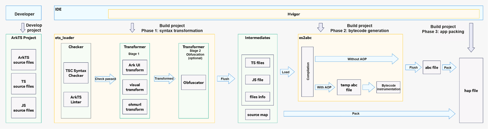

# Overview of the ArkTS Compilation Toolchain
<!--Kit: ArkTS-->
<!--Subsystem: ArkCompiler-->
<!--Owner: @chenmudan; @hufeng20; @ctw-ian-->
<!--Designer: @hufeng20; @ctw-ian-->
<!--Tester: @kirl75; @zsw_zhushiwei-->
<!--Adviser: @foryourself-->

The ArkTS SDK provides a comprehensive toolchain for compiling ArkTS applications. Integrated with the [Hvigor](https://developer.huawei.com/consumer/cn/doc/harmonyos-guides/ide-hvigor) task orchestration tool, this toolchain compiles ArkTS/TS/JS source code into Ark bytecode files (*.abc).

During compilation, the toolchain first performs syntax transformation, including syntax checking and UI transformation. To ensure source code security, it uses [ArkGuard](source-obfuscation.md) for source code obfuscation. Before the bytecode is written to disk, the toolchain checks whether [custom bytecode modifications](customize-bytecode-during-compilation.md) are required. If modifications are required, custom modification code is loaded and executed. After generating the bytecode file, the [Disassembler](tool-disassembler.md) tool is used to inspect the file content. For details about the bytecode, see [Ark Bytecode File Format](arkts-bytecode-file-format.md).

The ArkTS compiler toolchain currently provides the following features:

1. Syntax check: checks whether the ArkTS/TS syntax is correct.

2. UI transformation: converts UI declarative paradigm syntax to standard TS syntax.

3. Source code obfuscation: uses the ArkGuard tool to obfuscate the source code. You can enable this feature based on service requirements.

4. Bytecode compilation: The Ark compiler generates Ark bytecode files (\*.abc).

5. Custom bytecode modification: provides an entry for you to modify bytecode before it is written to disk.

6. Disassembly: uses the Disassembler tool to convert bytecode into human-readable assembly instructions.

The following figure shows how the ArkTS compilation toolchain builds a HAP.

