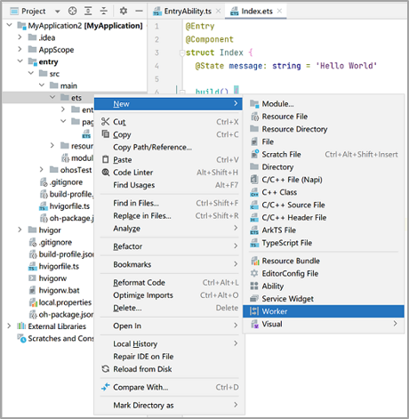

# CPU Intensive Task Development (TaskPool and Worker)


CPU intensive tasks are tasks that occupy a significant amount of system computing resources and that may block other tasks in the same thread. Example CPU intensive tasks are image processing, video encoding, and data analysis.


To improve CPU utilization and application response speeds, use multithread concurrency in processing CPU intensive tasks.


If a task can be completed in a background thread within 3 minutes, you are advised to use TaskPool. Otherwise, use Worker.

The following uses histogram processing and a time-consuming model prediction task in the background as examples.


## Using TaskPool to Process Histograms

1. Implement the logic of image processing.

2. Segment the data, and initiate associated task scheduling through task groups.
   Create a [task group](../reference/apis-arkts/js-apis-taskpool.md#taskgroup10), call [addTask()](../reference/apis-arkts/js-apis-taskpool.md#addtask10) to add tasks, and call [execute()](../reference/apis-arkts/js-apis-taskpool.md#taskpoolexecute10) to execute the tasks in the task group at a [a high priority](../reference/apis-arkts/js-apis-taskpool.md#priority). After all the tasks in the task group are complete, the histogram processing result is returned simultaneously.

3. Summarize and process the result arrays.

```ts
import { taskpool } from '@kit.ArkTS';

@Concurrent
function imageProcessing(dataSlice: ArrayBuffer): ArrayBuffer {
  // Step 1: Perform specific image processing operations and other time-consuming operations.
  return dataSlice;
}

function histogramStatistic(pixelBuffer: ArrayBuffer): void {
  // Step 2: Perform concurrent scheduling for data in three segments.
  let number: number = pixelBuffer.byteLength / 3;
  let buffer1: ArrayBuffer = pixelBuffer.slice(0, number);
  let buffer2: ArrayBuffer = pixelBuffer.slice(number, number * 2);
  let buffer3: ArrayBuffer = pixelBuffer.slice(number * 2);

  let group: taskpool.TaskGroup = new taskpool.TaskGroup();
  group.addTask(imageProcessing, buffer1);
  group.addTask(imageProcessing, buffer2);
  group.addTask(imageProcessing, buffer3);

  taskpool.execute(group, taskpool.Priority.HIGH).then((ret: Object) => {
    // Step 3: Summarize and process the result arrays.
  })
}

@Entry
@Component
struct Index {
  @State message: string = 'Hello World'

  build() {
    Row() {
      Column() {
        Text(this.message)
          .fontSize(50)
          .fontWeight(FontWeight.Bold)
          .onClick(() => {
            let buffer: ArrayBuffer = new ArrayBuffer(24);
            histogramStatistic(buffer);
          })
      }
      .width('100%')
    }
    .height('100%')
  }
}
```


## Using Worker for Time-Consuming Model Prediction

The following uses the training of a region-specific house price prediction model as an example. This model can be used to predict house prices in the region based on the house area and number of rooms. The model needs to run for a long time, and each prediction needs to use the previous running result. Due to these considerations, Worker is used for the development.

1. In DevEco Studio, add a worker named **MyWorker** to your project.

   

2. In the main thread, call [constructor()](../reference/apis-arkts/js-apis-worker.md#constructor9) of **ThreadWorker** to create a **Worker** object. The calling thread is the host thread.

    ```ts
    // Index.ets
    import { worker } from '@kit.ArkTS';

    const workerInstance: worker.ThreadWorker = new worker.ThreadWorker('entry/ets/workers/MyWorker.ts');
    ```

3. In the host thread, call [onmessage()](../reference/apis-arkts/js-apis-worker.md#onmessage9) to receive messages from the worker thread, and call [postMessage()](../reference/apis-arkts/js-apis-worker.md#postmessage9) to send messages to the worker thread.
   For example, the host thread sends training and prediction messages to the worker thread, and receives messages sent back by the worker thread.

    ```ts
    // Index.ets
    let done = false;

    // Receive the result from the worker thread.
    workerInstance.onmessage = (() => {
      console.info('MyWorker.ts onmessage');
      if (!done) {
        workerInstance.postMessage({ 'type': 1, 'value': 0 });
        done = true;
      }
    })

    workerInstance.onerror = (() => {
      // Receive error information from the worker thread.
    })

    // Send a training message to the worker thread.
    workerInstance.postMessage({ 'type': 0 });
    ```

4. Bind the **Worker** object in the **MyWorker.ts** file. The calling thread is the worker thread.

   ```ts
   // MyWorker.ts
   import { worker, ThreadWorkerGlobalScope, MessageEvents, ErrorEvent } from '@kit.ArkTS';

   let workerPort: ThreadWorkerGlobalScope = worker.workerPort;
   ```

5. In the worker thread, call [onmessage()](../reference/apis-arkts/js-apis-worker.md#onmessage9-1) to receive messages sent by the host thread, and call [postMessage()](../reference/apis-arkts/js-apis-worker.md#postmessage9-2) to send messages to the host thread.
    For example, the prediction model and its training process are defined in the worker thread, and messages are exchanged with the main thread.

    ```ts
    // MyWorker.ts
    // Define the training model and result.
    let result: Array<number>;
    // Define the prediction function.
    function predict(x: number): number {
     return result[x];
    }
    // Define the optimizer training process.
    function optimize(): void {
     result = [0];
    }
    // onmessage logic of the worker thread.
    workerPort.onmessage = (e: MessageEvents): void => {
     // Perform operations based on the type of data to transmit.
     switch (e.data.type as number) {
      case 0:
      // Perform training.
       optimize();
      // Send a training success message to the main thread after training is complete.
       workerPort.postMessage({ type: 'message', value: 'train success.' });
       break;
      case 1:
      // Execute the prediction.
       const output: number = predict(e.data.value as number);
      // Send the prediction result to the main thread.
       workerPort.postMessage({ type: 'predict', value: output });
       break;
      default:
       workerPort.postMessage({ type: 'message', value: 'send message is invalid' });
       break;
     }
    }
    ```

6. After the task is completed in the worker thread, destroy the worker thread. The worker thread can be destroyed by itself or the host thread.

    Then, call [onexit()](../reference/apis-arkts/js-apis-worker.md#onexit9) in the host thread to define the processing logic after the worker thread is destroyed.

    ```ts
    // After the worker thread is destroyed, execute the onexit() callback.
    workerInstance.onexit = (): void => {
     console.info("main thread terminate");
    }
    ```

    Method 1: In the host thread, call [terminate()](../reference/apis-arkts/js-apis-worker.md#terminate9) to destroy the worker thread and stop the worker thread from receiving messages.

    ```ts
    // Destroy the worker thread.
    workerInstance.terminate();
    ```

    Method 2: In the worker thread, call [close()](../reference/apis-arkts/js-apis-worker.md#close9) to destroy the worker thread and stop the worker thread from receiving messages.

    ```ts
    // Destroy the worker thread.
    workerPort.close();
    ```
