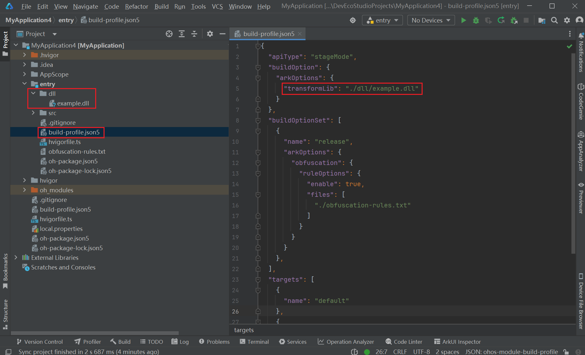

# Customizing Ark Bytecode During Compilation

You can modify Ark bytecode files using the customization capabilities provided by the ArkTS compilation toolchain.

## Configuration

Develop a dynamic library file to manipulate ARK bytecode files. In the **build-profile.json5** file of the project, add the [transformLib option](arkoptions-guide.md) and set its value to the path of the dynamic library. The compiler loads the dynamic library at the specified time and executes the **Transform** method in the library.

## Execution

If **transformLib** is not configured in the **build-profile.json5** file, the compiler generates the ARK bytecode file to the default location. If **transformLib** is configured and the dynamic library file is successfully loaded, the compiler generates an ARK bytecode file to the default location, and calls the **Transform** method in the dynamic library, passing the path of the ARK bytecode file as a parameter. The **Transform** method contains your custom logic to modify and regenerate the bytecode.

Below is an example template of the dynamic library. You should implement the specific logic of the **Transform** method based on your service requirements.

## How to Develop

1. Create the source code for the dynamic library.

   ```
   /**
    * @brief Entry method for modifying the ARK bytecode file.
    * @param abc_path Path for storing the ARK bytecode file to be processed.
    */
   extern "C" int Transform(const char *abc_path)
   {
       // You can read the ARK bytecode file corresponding to ${abc_path}, modify related data based on the ARK bytecode format, and generate a new ARK bytecode file.
       return 0;
   }
   ```

2. Use a C language compiler (g++) to compile the link library file.

   Windows:

   ```
   g++ --share -o example.dll example.cpp
   ```

   Linux:

   ```
   g++ --share -o example.so example.cpp
   ```

   macOS:

   ```
   g++ --shared -o example.so example.cpp
   ```

3. In DevEco Studio, configure the **transformLib** option in the **build-profile.json5** file. (The following uses the Windows environment as an example.)

   Set the option to the path of the link library file generated in step 2. In this example, the path is in the **dll** directory.

   

4. Recompile the project to customize the Ark bytecode.
