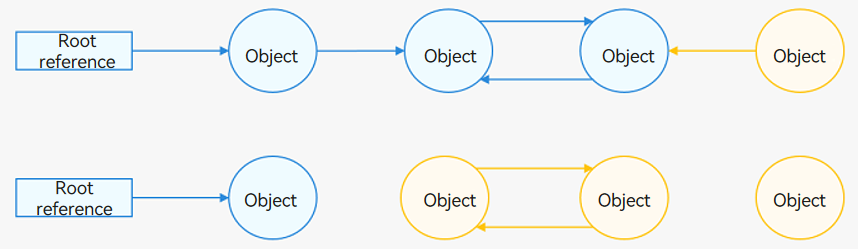
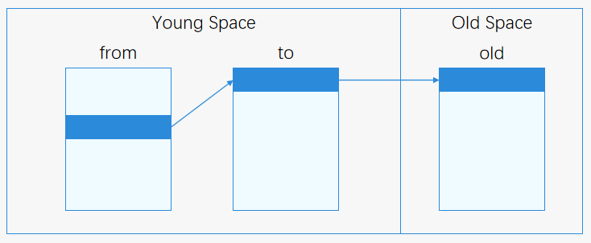
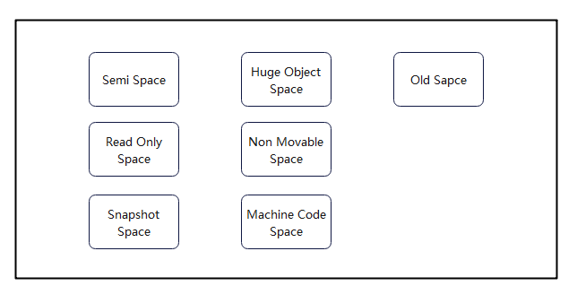
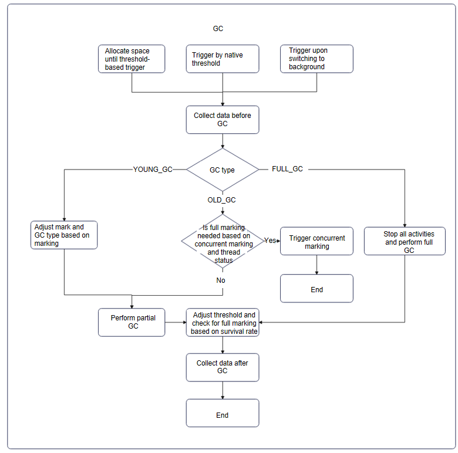
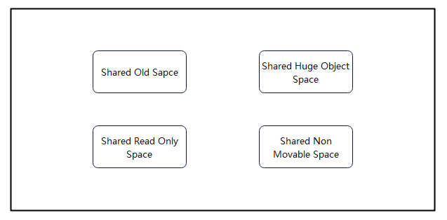
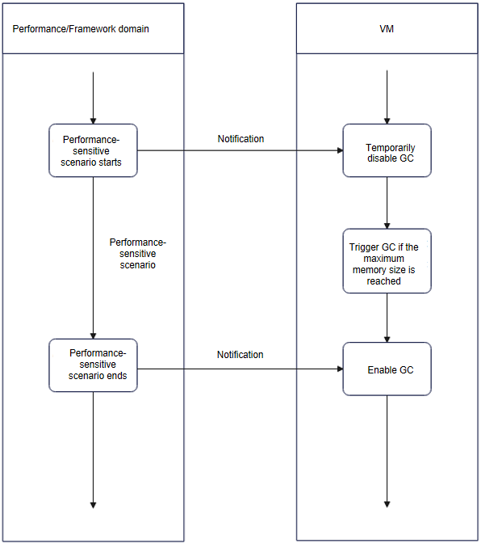

# GC

Garbage Collection (GC) is a process that identifies and reclaims memory no longer in use by a program. It aims to free up unused memory space. Modern programming languages implement two primary types of GC algorithms: reference counting and tracing GC.

## GC Algorithm Overview

### Types of GC

#### Reference Counting

When object A is referenced by object B, A's reference count increases by 1. Conversely, when the reference is removed, A's reference count decreases by 1. When A's reference count reaches 0, object A is reclaimed.

- Pros: Reference counting is simple to implement and allows for immediate memory reclamation, avoiding a dedicated Stop The World (STW) phase where the application is paused.
- Cons: The extra counting step during object manipulation increases the overhead of memory allocation and assignment, affecting performance. More seriously, there is a risk of memory leaks caused by circular references.
```
class Parent {
  constructor() {
    this.child = null;
  }
  child: Child | null = null;
}

class Child {
  constructor() {
    this.parent = null;
  }
  parent: Parent | null = null;
}

function main() {
  let parent: Parent = new Parent();
  let child: Child = new Child();
  parent.child = child;
  child.parent = parent;
}
```
In the code above, the **parent** object holds a reference to the **child** object, incrementing the reference count of **parent**. Simultaneously, the **child** object is also held by the **parent** object, incrementing the reference count of **child**. This creates a circular reference, preventing both **parent** and **child** from being released until the **main** function ends, thereby causing a memory leak.
#### Tracking GC



Root objects include stack objects and global objects that are guaranteed to be alive at a given moment during program execution. Objects referenced by root objects are also considered alive. By traversing these references, all live objects can be identified. As illustrated in the diagram, starting from the root objects, objects and their fields are traversed. Objects that are reachable are marked in blue, indicating they are live; the remaining unreachable objects are marked in yellow, indicating they are garbage.
- Pros: Tracing GC solves the circular reference problem and does not incur additional overhead during memory allocation and assignment.
- Cons: Tracing GC is more complex than reference counting and introduces a brief STW phase. Additionally, GC can be delayed, leading to floating garbage.

Both reference counting and object tracing algorithms have their pros and cons. Given the memory leak issues associated with reference counting, ArkTS Runtime opts for a GC design based on object tracing (tracing GC).

### Types of Tracing GC

Tracing GC algorithms identify garbage by traversing the object graph. Based on the collection method, tracing GC can be categorized into three basic types: mark-sweep, mark-copy, and mark-compact. In the diagrams below, blue indicates live objects, whereas yellow indicates garbage.

#### Mark-Sweep Collection


After traversing the object graph, the algorithm erases the contents of unreachable objects and places them in a free queue for future allocations. 

This approach is highly efficient as it does not move objects. However, since the memory addresses of the reclaimed objects are not contiguous, it can lead to memory fragmentation, which in turn reduces allocation efficiency. In extreme cases, even with a large amount of free memory, it may not be possible to allocate space for larger objects. 

#### Mark-Copy Collection


During the traversal of the object graph, reachable objects are copied to a new memory space. Once the traversal is complete, the old memory space is reclaimed in one go. 

This approach eliminates memory fragmentation and completes the GC process in a single traversal, making it efficient. However, it requires reserving half of the memory space to ensure all live objects can be copied, resulting in lower space utilization.

#### Mark-Compact Collection


After the traversal, live objects (blue) are copied to the beginning of the current space (or a designated area), and the copied objects are reclaimed and placed in the free list.

This approach addresses memory fragmentation without wasting half of the memory space, though it incurs higher performance overhead when compared with mark-copy collection.

### HPP GC

High Performance Partial Garbage Collection (HPP GC) is designed for high performance in partial GC, leveraging generational models, hybrid algorithms, and optimized GC processes. In terms of algorithms, HPP GC uses different collection approaches based on different object regions.

#### Generational Model

ArkTS Runtime uses a traditional generational model, categorizing objects based on their lifetimes. Given that most newly allocated objects are short-lived and collected during the first GC cycle, whereas objects surviving multiple GC cycles are likely to remain alive, ArkTS Runtime divides objects into young and old generations, allocating them to separate spaces.



Newly allocated objects are placed in the **from** space of Young Space. After surviving one GC cycle, they are moved to the **to** space. Objects that survive another GC cycle are then moved to Old Space.

#### Hybrid Algorithm

HPP GC employs a hybrid algorithm combining mark-copy, mark-compact, and mark-sweep, tailored to the characteristics of young and old generation objects.

- Mark-copy for young generation
Given the short lifetimes, small size, and frequent collection of young generation objects, ArkTS Runtime uses the mark-copy algorithm to efficiently reclaim memory for these objects.
- Mark-compact + mark-sweep for old generation
Based on the characteristics of old generation objects, a heuristic collection set (CSet) algorithm is used. The fundamental idea behind this algorithm is to collect the sizes of live objects in each region during the marking phase. During the collection phase, ArkTS Runtime uses mark-compact for regions with fewer live objects and lower collection costs, but mark-sweep for the remaining regions.

The collection policies are as follows:

- Identifies regions with live object sizes below a threshold, places them in the initial CSet, and sorts them by liveness (survival rate = live object size/region size).

- Selects a final CSet based on a predefined number of regions for compaction.

- Sweeps the remaining regions.

This heuristic approach combines the benefits of mark-compact and mark-sweep algorithms, addressing memory fragmentation while maintaining performance.

#### Process Optimization

HPP GC introduces extensive concurrency and parallelism optimizations to minimize the impact on application performance. The GC process includes concurrent and parallel marking, sweeping, evacuation, updating, and clearing tasks.

## Heap Structure and Parameters

### Heap Structure



- Semi Space: space for storing young generation, that is, newly created objects with low survival rates. The copying algorithm is used to reclaim memory.
- Old Space: space for storing old generation, that is, objects that survive multiple GC cycles. Multiple algorithms are used for memory reclamation.
- Huge Object Space: dedicated regions for storing large objects.
- Read Only Space: space for storing read-only data at runtime.
- Non-Movable Space: space for storing non-movable objects.
- Snapshot Space: space for storing heap snapshots.
- Machine Code Space: space for storing machine codes.

Each space is managed in regions, which are the units requested from the memory allocator.

### Parameters

> **NOTE**
> 
> Parameters not marked as configurable are system-defined and cannot be adjusted by developers.

Based on the total heap size ranges (64 MB to 128 MB, 128 MB to 256 MB, or greater than 256 MB), the system sets different sizes for the following parameters. If a parameter has a single value in the range, it remains constant regardless of the total heap size. The default total heap size for mobile phones is greater than 256 MB.

You can use related APIs to query memory information by referring to [HiDebug API Reference](../reference/apis-performance-analysis-kit/js-apis-hidebug.md).

#### Heap Size Parameters

| Name| Value or Value Range| Description|
| --- | --- | --- |
| HeapSize | 448 MB| Default total heap size for the main thread. The value is adjusted for low-memory devices based on the actual memory pool size.|
| SemiSpaceSize | 2–4 MB/2–8 MB/2–16 MB| Size of Semi Space.|
| NonmovableSpaceSize | 2 MB/6 MB/64 MB | Size of Non-Movable Space.|
| SnapshotSpaceSize | 512 KB| Size of Snapshot Space.|
| MachineCodeSpaceSize | 2 MB| Size of Machine Code Space.|

#### Worker Thread Heap Limit

| Name| Value| Description|
| --- | --- | --- |
| HeapSize  | 768 MB | Heap size for worker threads.|

#### Parameters of Semi Space
The heap contains two Semi Spaces for copying.
| Name| Value or Value Range| Description|
| --- | --- | --- |
| semiSpaceSize | 2–4 MB/2–8 MB/2–16 MB| Size of Semi Space. The value varies according to the total heap size.|
| semiSpaceTriggerConcurrentMark | 1 M/1.5 M/1.5 M| Threshold for independently triggering concurrent marking in Semi Space for the first time.|
| semiSpaceStepOvershootSize| 2 MB | Maximum overshoot size of Semi Space.|

#### Parameters of Old Space and Huge Object Space
Both spaces are initialized to the remaining unallocated heap size. By default, the upper limit of OldSpaceSize of the main thread on mobile phones approaches 350 MB.

| Name| Value or Value Range| Description|
| --- | --- | --- |
| oldSpaceOvershootSize | 4 MB/8 MB/8 MB | Maximum overshoot size of Old Space.|

#### Parameters of Other Spaces

| Name| Value or Value Range| Description|
| --- | --- | --- |
| defaultReadOnlySpaceSize | 256 KB | Default size of Read Only Space.|
| defaultNonMovableSpaceSize | 2 MB/6 MB/64 MB | Default size of Non-Movable Space.|
| defaultSnapshotSpaceSize | 512 KB/512 KB/ 4 MB | Default size of Snapshot Space.|
| defaultMachineCodeSpaceSize | 2 MB/2 MB/8 MB | Default size of Machine Code Space.|

#### Interpreter Stack Size

| Name| Value or Value Range| Description|
| --- | --- | --- |
| maxStackSize | 128 KB| Maximum size of the interpreter stack.|

#### Concurrency Parameters

| Name| Value| Description|
| --- | --- | --- |
| gcThreadNum | 7 | Number of GC threads. The default value is 7. You can set this parameter using **gc-thread-num**.|
| MIN_TASKPOOL_THREAD_NUM | 3 | Minimum number of threads in the thread pool.|
| MAX_TASKPOOL_THREAD_NUM | 7 | Maximum number of threads in the thread pool.|

Note: The thread pool is used to execute concurrent tasks in the GC process. During thread pool initialization, all the three parameters need to be considered. If **gcThreadNum** is negative, the number of threads in the initialized thread pool is half of the number of CPU cores.

#### Other Parameters

| Name| Value| Description|
| --- | --- | --- |
| minAllocLimitGrowingStep | 2 M/4 M/8 M| Minimum growth step of **oldSpace**, **heapObject**, and **globalNative** when the heap size is recalculated.|
| minGrowingStep | 4 M/8 M/16 M| Minimum growth step of **oldSpace**.|
| longPauseTime | 40 ms| Threshold for identifying long GC pauses, which trigger detailed GC log printing for analysis. It can be set using **gc-long-paused-time**.|

## GC Process



### Types of HPP GC

#### Young GC

- **When to trigger**: The young GC threshold ranges from 2 MB to 16 MB, and it can be adjusted dynamically based on the allocation speed and survival rate.
- **Description**: primarily collects newly allocated objects in Semi Space.
- **Scenario**: foreground
- **Log keywords**: [ HPP YoungGC ]

#### Old GC

- **When to trigger**: The old GC threshold ranges from 20 MB to 300 MB. Typically, the threshold of the first old GC is about 20 MB, and the threshold for subsequent old GC operations is adjusted based on the survival rate and memory usage.
- **Description**: compacts and compresses the young generation space and parts of the old generation space while sweeping other spaces. It occurs less frequently than young GC, with a longer duration (approximately 5 ms to 10 ms) due to full marking.
- **Scenario**: foreground
- **Log keywords**: [ HPP OldGC ]

#### Full GC

- **When to trigger**: Full GC is not triggered based on the memory threshold. After the application transitions to the background, full GC is triggered if the predicted reclaimable object size exceeds 2 MB. You can also trigger full GC using the DumpHeapSnapshot and AllocationTracker tools or calling native interfaces and ArkTS interfaces.
- **Description**: fully compacts both young and old generations, maximizing memory reclamation in performance-insensitive scenarios.
- **Scenario**: background
- **Log keywords**: [ CompressGC ]

Subsequent Smart GC or IDLE GC selections are made from the above three types of GC.

### Trigger Strategies

#### Space Threshold Triggering

- Functions: **AllocateYoungOrHugeObject**, **AllocateHugeObject**, and other allocation-related functions
- Restriction parameters: corresponding space thresholds
- Description: GC is triggered when object allocation reaches the space threshold.
- Log keywords: **GCReason::ALLOCATION_LIMIT**

#### Native Binding Size Triggering

- Functions: **GlobalNativeSizeLargerThanLimit**
- Restriction parameters: **globalSpaceNativeLimit**
- Description: It affects the decision for performing full marking and concurrent marking.

#### Background Switch Triggering

- Functions: **ChangeGCParams**
- Description: Full GC is triggered after the application switches to the background.
- Log keywords: **app is inBackground**, **app is not inBackground**, and
  **GCReason::SWITCH_BACKGROUND**

### Execution Strategies

#### Concurrent Marking

- Function: **TryTriggerConcurrentMarking**
- Description: attempts to trigger concurrent marking and delegate the task of marking objects to the thread pool to reduce the suspension time of the UI main thread.
- Log keywords: **fullMarkRequested**, **trigger full mark**, **Trigger the first full mark**, **Trigger full mark**, **Trigger the first semi mark**, and **Trigger semi mark**

#### Adjusting Thresholds Before and After New Space GC

- Function: **AdjustCapacity**
- Description: adjusts the Semi Space trigger threshold after GC to optimize space structure.
- Log keywords: There is no direct log. The GC statistics logs show dynamic adjustments to young space thresholds before and after GC.

#### Adjusting Threshold After First Old GC

- Function: **AdjustOldSpaceLimit**
- Description: adjusts the Old Space threshold based on the minimum growth step and average survival rate.
- Log keyword: **AdjustOldSpaceLimit**

#### Adjusting Old Space/Global Space Thresholds and Growth Factors After Subsequent Old GCs

- Function: **RecomputeLimits**
- Description: recalculates and adjusts **newOldSpaceLimit**, **newGlobalSpaceLimit**, **globalSpaceNativeLimit**, and growth factors based on current GC statistics.
- Log keyword: **RecomputeLimits**

#### CSet Selection Strategies for Partial GC

- Function: **OldSpace::SelectCSet()**
- Description: selects regions with fewer live objects and lower collection costs for partial GC.
- Typical Logs
    - Select CSet failure: number is too few
    - `Max evacuation size is 6_MB. The CSet Region number`
    - Select CSet success: number is

## SharedHeap

### Shared Heap Structure



- Shared Old Space: shared space for storing general shared objects. The young generation and old generation are not distinguished in the shared heap.
- Shared Huge Object Space: shared space for storing large objects. A separate region is used for each large object.
- Shared Read Only Space: shared space for storing read-only data at runtime.
- Shared Non-Movable Space: shared space for storing non-movable objects.

Note: The shared heap is designed for objects shared across threads to improve efficiency and save memory. It does not belong to any single thread and stores objects with shared value. It typically has higher survival rates and does not involve Semi Space.

## Features

### Smart GC

#### Description

In performance-sensitive scenarios, the GC trigger threshold of the thread is temporarily adjusted to the maximum heap size (448 MB for the main thread by default), minimizing GC-triggered frame drops. (Smart GC does not take effect for the Worker thread and TaskPool thread.) However, if a performance-sensitive scenario persists too long and object allocation reaches the maximum heap size, GC is triggered, potentially resulting in longer GC times due to accumulated objects.

#### Performance-Sensitive Scenarios

- Application cold start
- Application scrolling
- Page transitions via clicks
- Jumbo frame

Currently, this feature is managed by the system, and third-party applications do not have APIs to directly call this feature.

Log keyword: **SmartGC**

#### Interaction Process



Mark performance-sensitive scenarios by tagging the heap upon entry and exit to avoid unnecessary GCs and maintain high performance.

## Log Interpretation

### Enabling Full Logs

By default, detailed GC logs are printed only when GC duration exceeds 40 ms. To enable logs for all GC executions, run commands on the device.

**Example**

```shell
# Enable full GC logs with parameter 0x905d. Disable full GC logs and revert to the default value (0x105c).
hdc shell param set persist.ark.properties 0x905d
# Reboot to apply changes.
hdc shell reboot
```

### Typical Logs

The following logs represent a complete GC execution, with variations based on the type of GC. You can search for the keyword [gc] in the exported log file to view GC-related logs. You can also check for the keyword ArkCompiler to view more comprehensive VM-related logs.

```
// Pre-GC object size (region size) -> Post-GC object size (region size), total duration (+concurrentMark duration), GC trigger reason.
C03F00/ArkCompiler: [gc]  [ CompressGC ] 26.1164 (35) -> 7.10049 (10.5) MB, 160.626(+0)ms, Switch to background
// Various states during GC execution and application name.
C03F00/ArkCompiler: [gc] IsInBackground: 1; SensitiveStatus: 0; OnStartupEvent: 0; BundleName: com.example.demo;
// Duration statistics for each GC phase.
C03F00/ArkCompiler: [gc] /***************** GC Duration statistic: ****************/
C03F00/ArkCompiler: [gc] TotalGC:                 160.626 ms
C03F00/ArkCompiler: Initialize:              0.179   ms
C03F00/ArkCompiler: Mark:                    159.204 ms
C03F00/ArkCompiler: MarkRoots:               6.925   ms
C03F00/ArkCompiler: ProcessMarkStack:        158.99  ms
C03F00/ArkCompiler: Sweep:                   0.957   ms
C03F00/ArkCompiler: Finish:                  0.277   ms
// Memory usage statistics after GC.
C03F00/ArkCompiler: [gc] /****************** GC Memory statistic: *****************/
C03F00/ArkCompiler: [gc] AllSpaces        used:  7270.9KB     committed:   10752KB
C03F00/ArkCompiler: ActiveSemiSpace  used:       0KB     committed:     256KB
C03F00/ArkCompiler: OldSpace         used:  4966.9KB     committed:    5888KB
C03F00/ArkCompiler: HugeObjectSpace  used:    2304KB     committed:    2304KB
C03F00/ArkCompiler: NonMovableSpace  used:       0KB     committed:    2304KB
C03F00/ArkCompiler: MachineCodeSpace used:       0KB     committed:       0KB
C03F00/ArkCompiler: HugeMachineCodeSpace used:       0KB     committed:       0KB
C03F00/ArkCompiler: SnapshotSpace    used:       0KB     committed:       0KB
C03F00/ArkCompiler: AppSpawnSpace    used: 4736.34KB     committed:    4864KB
C03F00/ArkCompiler: [gc] Anno memory usage size:  45      MB
C03F00/ArkCompiler: Native memory usage size:2.99652 MB
C03F00/ArkCompiler: NativeBindingSize:       0.577148KB
C03F00/ArkCompiler: ArrayBufferNativeSize:   0.0117188KB
C03F00/ArkCompiler: RegExpByteCodeNativeSize:0.280273KB
C03F00/ArkCompiler: ChunkNativeSize:         19096   KB
C03F00/ArkCompiler: [gc] Heap alive rate:         0.202871
// Summary statistics for this type of GC in the VM.
C03F00/ArkCompiler: [gc] /***************** GC summary statistic: *****************/
C03F00/ArkCompiler: [gc] CompressGC occurs count  6
C03F00/ArkCompiler: CompressGC max pause:    2672.33 ms
C03F00/ArkCompiler: CompressGC min pause:    160.626 ms
C03F00/ArkCompiler: CompressGC average pause:1076.06 ms
C03F00/ArkCompiler: Heap average alive rate: 0.635325
```

- GC type, which can be [HPP YoungGC], [HPP OldGC], [CompressGC], and [SharedGC].
- **TotalGC**: total duration. The following lists the duration for each phase, including Initialize, Mark, MarkRoots, ProcessMarkStack, Sweep, and Finish. The actual phases may vary depending on the GC process.
- **IsInBackground**: specifies whether the application is in the background (**1**) or foreground (**0**).
- **SensitiveStatus**: specifies whether the application is in a sensitive scenario (**1**) or not (**0**).
- **OnStartupEvent**: specifies whether the application is in a cold start scenario (**1**) or not (**0**).
- **used**: actual memory usage of allocated objects.
- **committed**: actual memory allocated to the heap. Since memory spaces are allocated in regions that are not always fully utilized by objects, **committed** is greater than or equal to **used**. For Huge Space, these values are equal because each object occupies a separate region.
- **Anno memory usage size**: total memory usage of all heaps in the process, including heap and shared heap.
- **Native memory usage size**: total native memory usage of the process.
- **NativeBindingSize**: native memory usage of objects bound to the heap.
- **ArrayBufferNativeSize**: native memory usage of array buffers requested by the process.
- **RegExpByteCodeNativeSize**: native memory usage of regular expression bytecode requested by the process.
- **ChunkNativeSize**: native memory usage of chunks requested by the process.
- **Heap alive rate**: survival rate of objects in the heap.

## GC Developer Debugging Interfaces

> **NOTE**
> 
> The following interfaces are for debugging purposes only and are not official SDK interfaces. They should not be used in production applications.

### ArkTools.hintGC()

- Invocation: **ArkTools.hintGC()**
- Type: ArkTS interface
- Description: triggers the VM to assess whether a full GC should be executed. Full GC is initiated if the expected memory survival rate is below a threshold. It will not trigger in sensitive scenarios.
- Use case: developers prompting the system to perform GC.
- Log keywords: There is no direct log. Only external trigger (**GCReason::TRIGGER_BY_JS**) can be found.


Usage example:

```ts
// Declare the interface first.
declare class ArkTools {
     static hintGC(): void;
}

@Entry
@Component
struct Index {
  @State message: string = 'Hello World';
  build() {
  Row() {
    Column() {
      Text(this.message)
        .fontSize(50)
        .fontWeight(FontWeight.Bold)
      Button("Trigger Hint GC").onClick((event: ClickEvent) => {
          ArkTools.hintGC(); // Call the method directly.
      })
    }
    .width('100%')
  }
  .height('100%')
}
}
```

## GC FAQs

### GC Stability Issues

Most GC stability issues are caused by two types of exceptions: invalid multithreading operations leading to object exceptions, and memory corruption issues leading to pointer exceptions. These issues typically manifest as address access exceptions in the GC task stack.

To identify GC tasks, look for thread names and methods within the stack. The OS_GC_Thread thread primarily handles GC tasks and PGO-related tasks (collection tasks); keywords like GCTask in the stack can be used to identify GC tasks. When GC tasks report crashes with address exceptions, you should first investigate invalid multithreading and memory corruption issues.

- For details about how to check for invalid multithreading operations, see [ArkCompiler Runtime Detection](https://developer.huawei.com/consumer/en/doc/harmonyos-guides/ide-multi-thread-check).
- For details about how to detect memory corruption, see [HWASan: Detecting Memory Errors](https://developer.huawei.com/consumer/en/doc/harmonyos-guides/ide-hwasan).

The following examples list only some scenarios. The actual reported address exceptions can vary widely and are not detailed here.

Typical stack information about object exceptions:

0xffff000000000048 is an object exception offset error.

``` text
Reason:Signal:SIGSEGV(SEGV_MAPERR)@0xffff000000000048 
Fault thread info:
Tid:6490, Name:OS_GC_Thread
#00 pc 0000000000507310 /system/lib64/platformsdk/libark_jsruntime.so(panda::ecmascript::JSHClass::SizeFromJSHClass(panda::ecmascript::TaggedObject*)+0)(a3d1ba664de66d31faed07d711ee1299)
#01 pc 0000000000521f94 /system/lib64/platformsdk/libark_jsruntime.so(panda::ecmascript::CompressGCMarker::EvacuateObject(unsigned int, panda::ecmascript::TaggedObject*, panda::ecmascript::MarkWord const&, panda::ecmascript::ObjectSlot)+80)(a3d1ba664de66d31faed07d711ee1299)
#02 pc 0000000000521ee4 /system/lib64/platformsdk/libark_jsruntime.so(panda::ecmascript::CompressGCMarker::MarkObject(unsigned int, panda::ecmascript::TaggedObject*, panda::ecmascript::ObjectSlot)+372)(a3d1ba664de66d31faed07d711ee1299)
#03 pc 0000000000523e40 /system/lib64/platformsdk/libark_jsruntime.so(a3d1ba664de66d31faed07d711ee1299)
#04 pc 0000000000516d74 /system/lib64/platformsdk/libark_jsruntime.so(a3d1ba664de66d31faed07d711ee1299)
#05 pc 00000000005206d4 /system/lib64/platformsdk/libark_jsruntime.so(panda::ecmascript::CompressGCMarker::ProcessMarkStack(unsigned int)+160)(a3d1ba664de66d31faed07d711ee1299)
#06 pc 000000000050460c /system/lib64/platformsdk/libark_jsruntime.so(panda::ecmascript::Heap::ParallelGCTask::Run(unsigned int)+228)(a3d1ba664de66d31faed07d711ee1299)
#07 pc 000000000064f648 /system/lib64/platformsdk/libark_jsruntime.so(panda::ecmascript::Runner::Run(unsigned int)+188)(a3d1ba664de66d31faed07d711ee1299)
#08 pc 000000000064f718 /system/lib64/platformsdk/libark_jsruntime.so(a3d1ba664de66d31faed07d711ee1299)
#09 pc 00000000001ba6b8 /system/lib/ld-musl-aarch64.so.1(start+236)(8102fa8a64ba5e1e9f2257469d3fb251)
```
Typical stack information about pointer exceptions:

0x000056c2fffc0008 indicates that the pointer is abnormal and the pointer mapping is incorrect.

``` text
Reason:Signal:SIGSEGV(SEGV_MAPERR)@0x000056c2fffc0008 
Fault thread info:
Tid:2936, Name:OS_GC_Thread
#00 pc 00000000004d2ec0 /system/lib64/platformsdk/libark_jsruntime.so(733f61d2f51e825872484cc344970fe5)
#01 pc 00000000004c6cac /system/lib64/platformsdk/libark_jsruntime.so(733f61d2f51e825872484cc344970fe5)
#02 pc 00000000004cd180 /system/lib64/platformsdk/libark_jsruntime.so(panda::ecmascript::NonMovableMarker::ProcessMarkStack(unsigned int)+256)(733f61d2f51e825872484cc344970fe5)
#03 pc 000000000049d108 /system/lib64/platformsdk/libark_jsruntime.so(panda::ecmascript::ConcurrentMarker::ProcessConcurrentMarkTask(unsigned int)+52)(733f61d2f51e825872484cc344970fe5)
#04 pc 00000000004b6620 /system/lib64/platformsdk/libark_jsruntime.so(panda::ecmascript::Heap::ParallelGCTask::Run(unsigned int)+236)(733f61d2f51e825872484cc344970fe5)
#05 pc 00000000005d6e60 /system/lib64/platformsdk/libark_jsruntime.so(panda::ecmascript::Runner::Run(unsigned int)+168)(733f61d2f51e825872484cc344970fe5)
#06 pc 00000000005d6f30 /system/lib64/platformsdk/libark_jsruntime.so(733f61d2f51e825872484cc344970fe5)
#07 pc 00000000001bdb84 /system/lib/ld-musl-aarch64.so.1(start+236)(e65f5c83306cf9c7dd4643794946ab9f)
```
