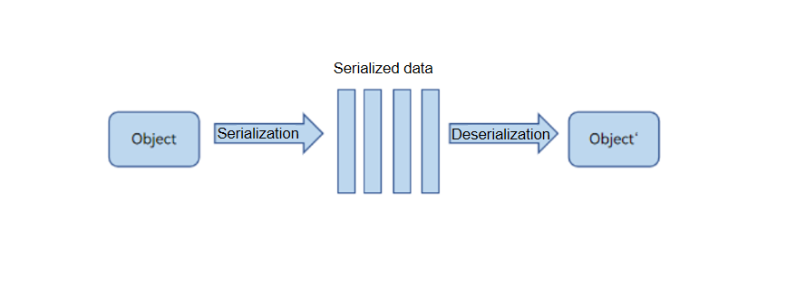

# ArkTS Inter-Thread Communication Overview

Inter-thread communication refers to data exchange between concurrent threads. ArkTS is compatible with TS and JS. Similar to all other JS engines, ArkTS provides concurrency capabilities based on the Actor memory isolation concurrency model.

For different data objects, the communication behavior between ArkTS threads is different, such as common JS objects, ArrayBuffer objects, and SharedArrayBuffer objects. The cross-thread behavior is different, including serialization and deserialization copy, data transfer, and data sharing.

Take a JS object as an example. The standard Structure Clone algorithm (serialization and deserialization) is used for communication between concurrent tasks. The JS object is converted into data (such as character strings or memory blocks) irrelevant to the engine through serialization, and then deserialized in another concurrent instance, to restore a JS object to a new object that is the same as the original JS object, deep copy is required, which is inefficient. In addition to the serialization and deserialization capabilities of the JS standard, the native JS object transmission and [Sendable object](arkts-sendable.md) sharing capabilities are also supported.

Currently, ArkTS provides two concurrency capabilities to support inter-thread communication: TaskPool and Worker.

- Worker is a standard cross-thread communication API of the Actor concurrency model. It is used in the same way as Web Worker or Node.js Worker.

- TaskPool provides a task pool API with more powerful functions and easier concurrent programming. The object transfer behavior of TaskPool across concurrent instances is the same as that of Worker. TaskPool uses the standard Structured Clone algorithm. The larger the objects in concurrent communication, the longer the time required.

Based on the TaskPool and Worker concurrency APIs provided by ArkTS, multiple inter-thread communication capabilities are supported to meet the requirements of different [inter-thread communication scenarios](independent-time-consuming-task.md). for example, an independent time-consuming task scenario, a scenario of a plurality of time-consuming tasks, a scenario of communication between a TaskPool thread and a host thread, a scenario of asynchronous communication between a worker thread and a host thread, and a scenario in which a worker synchronously calls an interface of a host thread. In addition, based on the mechanism provided by [Node-API](../napi/napi-introduction.md), C++ threads can call ArkTS APIs across threads.

Figure 1 Serialization and deserialization principles

