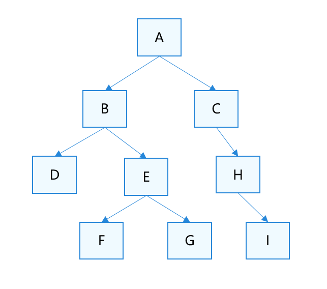

# Overview of Modular Operation

To address challenges of large and complex application development—such as increased package size due to multiple copies of code during compilation, file dependencies, difficulties in sharing code and resources, and pollution of singletons and global variables—ArkTS supports modular compilation, packaging, and running. This approach not only streamlines the development process but also facilitates easier code writing and feature maintenance.

Modularization refers to the process of splitting ArkTS/TS/JS into multiple modules (files or fragments) and then [loading](#loading-process-of-modular-operation), parsing, combining, and executing these modules using compilation tools or runtime mechanisms.

ArkTS supports various module types, including ETS/TS/JS files, JSON files, and native modules. It adheres to both [ECMAScript module specifications](#ecmascript-module) and [CommonJS module specifications](#commonjs-module). In addition, ArkTS extends loading modes to include [dynamic import](arkts-dynamic-import.md), [lazy import](arkts-lazy-import.md), [synchronous dynamic loading of native modules](js-apis-load-native-module.md), and [loading files using Node-API](load-module-base-nodeapi.md).

## Loading Process of Modular Operation

ArkTS modular operation is implemented according to the ECMA specification and executes modules using a post-order traversal method: starting from the leftmost subtree of the module graph, it executes the modules, then their peers, and finally their parents. This algorithm runs recursively until it reaches the root of the module graph.

For example, in the figure below, each parent node loads its corresponding child nodes and executes peers in the order specified by the **import** statements in the code. The execution order for the module graph files is as follows: D-&gt;F-&gt;G-&gt;E-&gt;B-&gt;I-&gt;H-&gt;C-&gt;A.



Here, file A is referred to as the entry file, which is the starting point for execution. Certain built-in interfaces for loading content, such as [windowStage.loadContent](../reference/apis-arkui/js-apis-window.md#loadcontent9) and [Navigation](../ui/arkts-navigation-navigation.md), will also be executed as entry files, especially when these files are not loaded using the **import** syntax.

Starting from file A, a complete set of files will be loaded, including file A, files on which file A depends, and subsequently dependent files, until the leaf nodes of each branch is reached.

## Modular Specifications Supported by ArkTS

### ECMAScript Module

ECMAScript modules (ES modules) are a module feature implemented in JavaScript starting from ECMAScript 6.0, standardized in the ECMAScript® 2025 Language Specification (tc39.es). The module functionality is composed of two commands: **export** and **import**.

For details about how to use **export** and **import** in ArkTS, see [ArkTS Introduction](../quick-start/introduction-to-arkts.md#modules).

### CommonJS Module

CommonJS modules were proposed as a standard by the JavaScript community in 2009 and first partially adopted and implemented in Node.js. CommonJS treats each file as a module, with the **module** variable representing the current module. **module.exports** is the variable exported by the module, and each module also has an **exports** variable (exports === module.exports).

The following table lists the import and export syntax.

| Loading Type| Module Import| Module Export (Do Not Mix module.exports with exports)|
| -------- | -------- | -------- |
| Variable| const ohos = require('ohos') | exports.add = add<br>module.exports.name = name |
| Variable| const ohos = require('ohos') | module.exports = add |
| Function| const ohos = require('ohos')<br>ohos.fun(); | exports.fun = function foo () {}<br>module.exports.fun = function foo () {} |

> **NOTE**
>
> CommonJS modules can be used only to export third-party packages. They cannot be created or used in projects.


### Compatibility Between CommonJS and ES Modules

The following table lists the compatibility between CommonJS and ES modules, with the import and export syntax following their respective specifications:
| Inter-Module Reference| ES Module Export| CommonJS Export|
| -------- | -------- | -------- |
| ES Module Import| Supported| Supported|
| CommonJS Import| Not supported| Supported|

## Module Types Supported by ArkTS

### ETS/TS/JS

Loading of the ETS, TS, and JS modules complies with the [ECMAScript module specifications](#ecmascript-module) and [CommonJS module specifications](#commonjs-module).

### JSON File

JavaScript Object Notation (JSON) is a lightweight data interchange format that uses a text-based format independent of any programming language to store and represent data.

JSON files can only be imported using the **default** method, as shown below:

```
import data from './example.json'
```

### Native Module

The syntax specifications for importing and exporting the native module (.so) are the same as those for loading the ETS, TS, and JS files. Native modules (.so files) follow the same import/export and loading syntax as ETS/TS/JS modules. For details, see [Statically Loading Native Modules](./arkts-import-native-module.md).

> **NOTE**
>
> Native modules cannot be imported to CommonJS modules.

Example:

```
// index.d.ts corresponding to libentry.so
export const add: (a: number, b: number) => number;
```

```
// test.ets
import { add } from 'libentry.so'
add(2, 3)
```

Currently, ArkTS does not support namespaces for native module exports or imports.

Anti-example:

```
// test1.ets
export * from 'libentry.so'  // Use the namespace to export data.
```

```
// test2.ets
import('./test1').then((ns:ESObject) => {
  // The ns object cannot be obtained during dynamic import.
  // To use this method to load native modules, change the export in test1.ets to named or default export.
})
```

> **NOTE**
>
> You are not advised to import data using import \* as xxx from 'xxx'. This import mode will cause runtime exceptions. Default imports are recommended.
