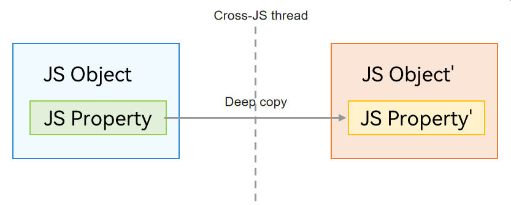

# Regular Object
<!--Kit: ArkTS-->
<!--Subsystem: CommonLibrary-->
<!--Owner: @wang_zhaoyong-->
<!--Designer: @weng-changcheng-->
<!--Tester: @kirl75; @zsw_zhushiwei-->
<!--Adviser: @ge-yafang-->

Regular objects are passed by copy (serialization) between threads. The objects in the two threads have the same content but point to isolated memory areas in their respective threads, allocated in the local heap of each thread's virtual machine. The following object types are supported: basic types except Symbol, Date, String, RegExp, Array, Map, Set, Object (simple objects only, for example, objects created using **{}** or **new Object**), ArrayBuffer, and TypedArray. (Note that only properties can be transferred for regular objects. Prototypes and methods cannot be transferred.) The following figure shows the communication process.



> **NOTE**
>
> Regular class instances are passed by copy across threads, which means only data is passed, and any class methods are lost. To enable class instances to retain their methods when being passed across threads, you can use the [@Sendable decorator](arkts-sendable.md#sendable-decorator) to mark the class as Sendable.

## Usage Example

The following is an example of passing a regular object.

```ts
// Test.ets
// Custom class TestA.
export class TestA {
  constructor(name: string) {
    this.name = name;
  }
  name: string = 'ClassA';
}
```
<!-- @[define_test_class](https://gitcode.com/openharmony/applications_app_samples/blob/master/code/DocsSample/ArkTS/ArkTsConcurrent/ConcurrentThreadCommunication/InterThreadCommunicationObjects/CommunicationObjects/entry/src/main/ets/managers/Test.ets) -->

```ts
// Index.ets
import { taskpool } from '@kit.ArkTS';
import { BusinessError } from '@kit.BasicServicesKit';
import { TestA } from './Test';

@Concurrent
async function test1(arg: TestA) {
  console.info("TestA name is: " + arg.name);
}

@Entry
@Component
struct Index {
  @State message: string = 'Hello World';

  build() {
    RelativeContainer() {
      Text(this.message)
        .id('HelloWorld')
        .fontSize(50)
        .fontWeight(FontWeight.Bold)
        .alignRules({
          center: { anchor: '__container__', align: VerticalAlign.Center },
          middle: { anchor: '__container__', align: HorizontalAlign.Center }
        })
        .onClick(() => {
          // 1. Create a test instance objA.
          let objA = new TestA("TestA");
          // 2. Create a task and transfer objA to the task. objA is not a Sendable object and is transferred to the child thread through serialization.
          let task = new taskpool.Task(test1, objA);
          // 3. Execute the task.
          taskpool.execute(task).then(() => {
            console.info("taskpool: execute task success!");
          }).catch((e:BusinessError) => {
            console.error(`taskpool: execute task: Code: ${e.code}, message: ${e.message}`);
          })
        })
    }
    .height('100%')
    .width('100%')
  }
}
```
<!-- @[example_normal_obj](https://gitcode.com/openharmony/applications_app_samples/blob/master/code/DocsSample/ArkTS/ArkTsConcurrent/ConcurrentThreadCommunication/InterThreadCommunicationObjects/CommunicationObjects/entry/src/main/ets/managers/NormalObject.ets) -->
